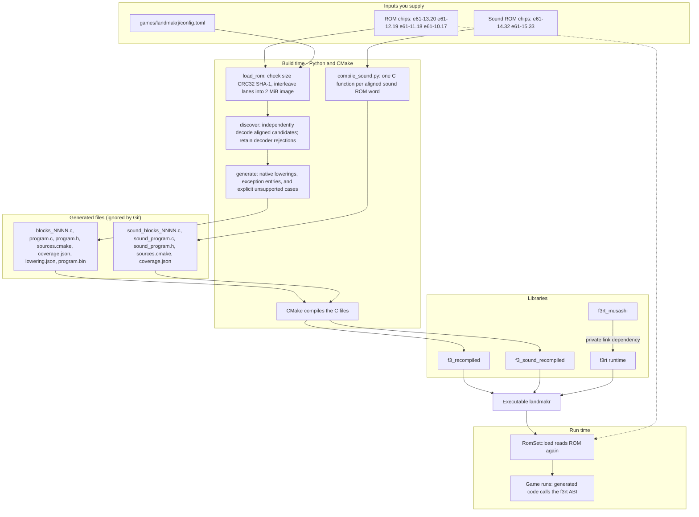
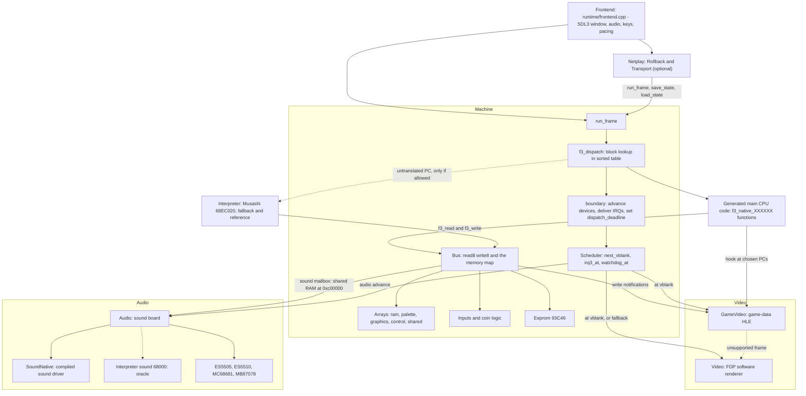
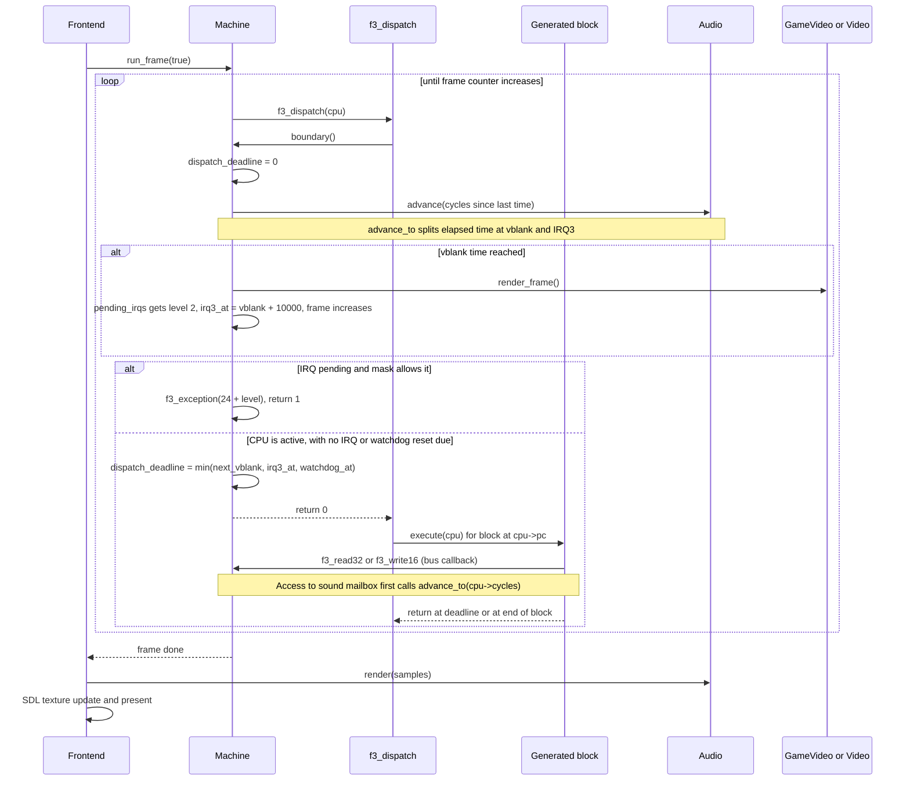
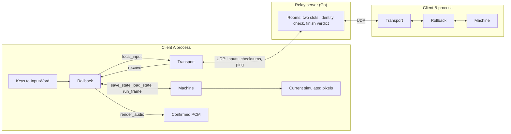
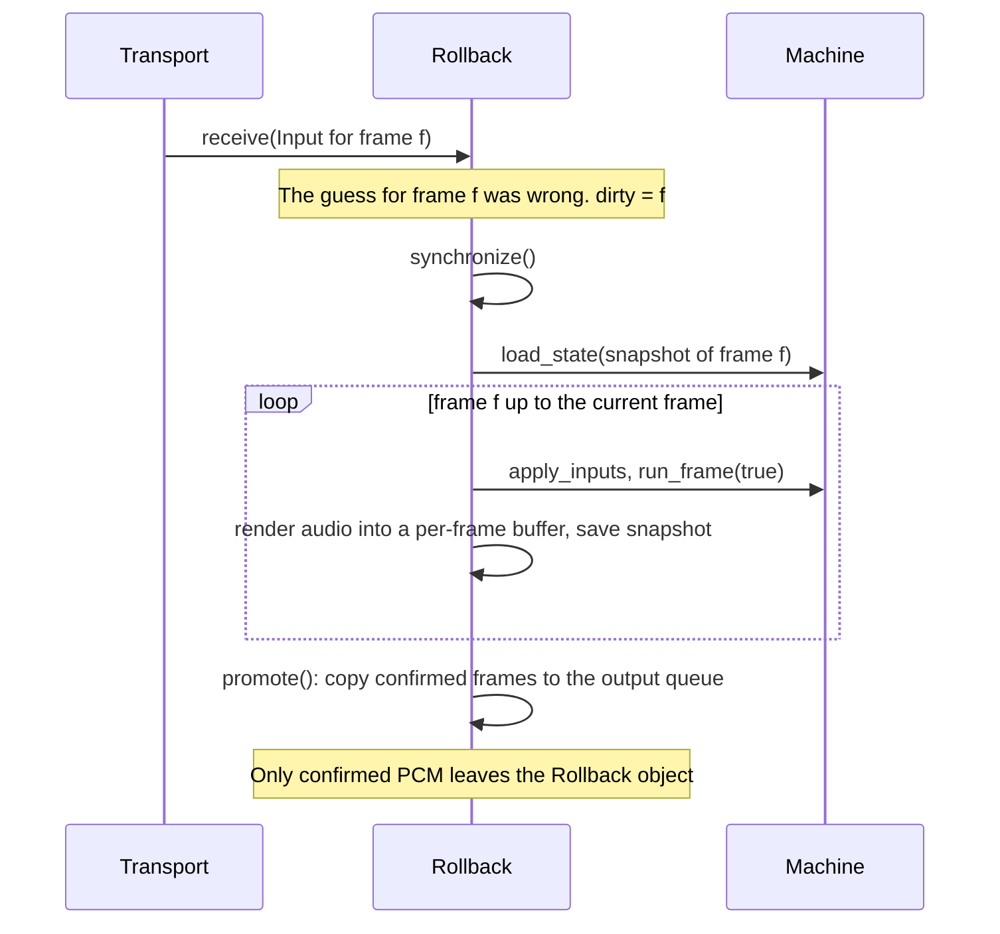

# Architecture

**What you will learn:** how the parts of f3-recomp fit together.
This page separates build time from run time.
It covers frame execution, reference comparisons, and netplay's machine wrapper.

Read this page first. The other Developer pages go deeper into each part. The [Developer overview](/developer/) lists them all.

## The idea

The Taito F3 is an arcade board. Its main CPU is a Motorola 68EC020.
The loaded main ROM region has 2 MiB of instructions and data.

An interpreter decodes instructions while the game runs. f3-recomp generates C before execution.
A C compiler turns that C into native code for the host computer. This method is **static recompilation**.

The exercised configuration is Land Maker Japan 2.01J. Its fixed ROM layout and
game-data hooks should not be read as universal F3 support. Video and sound devices
follow MAME-derived reference models; CPU-path and output comparisons establish
recorded software compatibility, not measured physical-chip correctness.
Native sound translates CPU instructions and is distinct from HLE.

The project copies the design of two N64 projects:

| N64 project | Role there | Role here |
| --- | --- | --- |
| [N64Recomp](https://github.com/N64Recomp/N64Recomp) | Reads a ROM and writes C. It uses a TOML file for each game. | The `recomp/` Python package. Each game has `games/<id>/config.toml`. |
| [N64ModernRuntime](https://github.com/N64Recomp/N64ModernRuntime) | Implements the console hardware. The generated C calls it. | The `runtime/` library `f3rt`. It implements memory, interrupts, video, audio, input and EEPROM. |

The F3 program uses one flat ROM region, without relocatable overlays.
The Japanese config sets `coverage = "all_aligned"`.
Discovery independently decodes every nonexcluded even offset as a possible entry point.
These decodes can overlap. Data and instruction extension words can also decode successfully.
Successful decoding does not prove reachability or native lowering support.
The [Discovery](/developer/recompiler/discovery) page explains this distinction.

::: info The source of truth
The generated C never contains the ROM bytes. It contains code only. At run time the program reads data (tables, graphics descriptors, text) from the ROM that `RomSet::load` loaded. In `Machine::read8`, every address below `0x200000` returns `roms.main[a]`.
:::

## Build time and run time

At build time, a Python tool reads the ROM and writes C files. CMake compiles those files into a library. At run time, the executable links that library with the runtime library `f3rt`.

Two compilers run. The main compiler (`python3 -m recomp emit`) translates the 68EC020 program. The sound compiler (`tools/compile_sound.py`) translates the 68000 sound program. CMake runs both at configure time when you set `F3_ROM_DIR`.



The top-level `CMakeLists.txt` links the `landmakr` target against `f3rt`, `f3_recompiled` and SDL3. It also links `f3_sound_recompiled` when the sound code exists. The [Build pipeline](/developer/build-pipeline) page lists every target.

## Runtime components

The central runtime object is `f3rt::Machine` (`include/f3rt/machine.hpp`).
It owns CPU state, memory arrays, ROM regions, and device objects.

Generated main CPU code reads and writes CPU registers directly.
For bus access and runtime services, it calls the C ABI in `include/f3rt/cpu_abi.h`.
`runtime/cpu_abi.cpp` reaches the `Machine` through `cpu->runtime`.



The table gives one line for each component.

| Component | Class or file | Job |
| --- | --- | --- |
| Frontend | `runtime/frontend.cpp` | Parses options. Opens the SDL3 window and audio stream. Calls `Machine::run_frame` once for each frame. Sleeps to keep the native frame rate. |
| Machine | `runtime/machine.cpp` | Owns memory and devices. Maps bus addresses. Runs the scheduler. Saves and loads snapshots. |
| Generated CPU code | `build/generated/landmakrj/blocks_*.c` | The translated game. One C function for each block. |
| `f3_dispatch` | `runtime/cpu_abi.cpp` | Runs the boundary check, then selects a registered block. Missing entries and trace mode request interpreter fallback. |
| Scheduler | `Machine::advance_to`, `Machine::boundary` | Moves device time forward. Raises vblank. Delivers interrupts. Sets the dispatch deadline. |
| Bus | `Machine::read8`, `Machine::write8` | Maps addresses to ROM, RAM, palette, graphics RAM, control registers, inputs, EEPROM, sound mailbox. |
| FDP renderer | `Video` | Draws a frame from the emulated FDP RAM. It is the video oracle. |
| Game-data renderer | `GameVideo` | Builds supported scenes from game data. Unsupported frames use the FDP renderer, which reads FDP RAM. |
| Audio | `Audio` | Runs the sound CPU, the DUART, the ES5505 and ES5510 chips, and the volume chip. Makes PCM samples. |
| Sound CPU | `SoundNative` or `Interpreter` | Runs the sound program. `SoundNative` is compiled C. `Interpreter` is Musashi. |
| Input | `Machine::inputs`, `system_inputs`, `coin_word` | Holds active-low port values and coin counters. |
| EEPROM | `Eeprom` (`runtime/eeprom.hpp`) | 93C46 settings memory. It has a busy interval after each write. |
| Netplay | `Rollback`, `Transport` | Optional. Runs the machine in a rollback loop. |

### Memory map

The bus function `Machine::read8` uses the 24-bit address (`a & 0xffffff`). An unmapped read returns `0xff`.

| Address range | Contents |
| --- | --- |
| `0x000000` to `0x1fffff` | Program ROM (2 MiB). Read only. |
| `0x400000` to `0x43ffff` | Main RAM. The array `ram` has 128 KiB, so the range mirrors twice (`a & 0x1ffff`). |
| `0x440000` to `0x447fff` | Palette RAM (32 KiB). |
| `0x4a0000` to `0x4a001f` | Input ports (`input_word`). Writes at `0x4a0000` to `0x4a0003` restart the watchdog. |
| `0x4a0004`, `0x4a0005`, `0x4a0014`, `0x4a0015` | Coin counter and lockout bytes. |
| `0x4a0013` | EEPROM pin write (`eeprom->pins`). Reads follow the input-port mapping. |
| `0x4c0000`, `0x4c0001` | Timer-control writes. The machine stores the value and does not raise IRQ5. Reads are unmapped. |
| `0x600000` to `0x63ffff` | Graphics RAM (256 KiB): sprites, playfields, text, character RAM, line RAM, pivot. |
| `0x660000` to `0x66001f` | Video control writes. Reads are unmapped. |
| `0xc00000` to `0xc007ff` | Shared dual-port RAM (2 KiB). This is the mailbox to the sound CPU. |
| `0xc80000` to `0xc80003`, `0xc80100` to `0xc80103` | Sound reset release and assertion writes. Reads are unmapped. |

The [Machine page](/developer/runtime/machine) explains each region.

## One frame

`Machine::run_frame` has a frame loop. It runs CPU blocks or reference instructions until the frame counter increases.
The cycle counter controls device time. Vblank advances the frame counter.

The numbers come from `machine.hpp`. The main clock is 16 MHz. The pixel clock is 6,671,500 Hz. A frame is 432 by 262 pixels. One frame is about 271,445 main-clock cycles. The frame rate is about 58.94 Hz.

The **dispatch deadline** is `f3_cpu::dispatch_deadline`.
It normally holds the next vblank, delayed IRQ3, or watchdog time.
Zero requests another boundary check.
A block yields at the first instruction boundary that reaches the deadline.
An instruction can cross an event time. `advance_to` then processes vblank and IRQ3 at their scheduled times.
The watchdog reset remains a `boundary` action.



These steps happen in order:

1. `Machine::run_frame(true)` calls `f3_dispatch` until the frame counter increases.
2. `f3_dispatch` calls `f3_boundary`, which calls `Machine::boundary`.
3. `boundary` sets the deadline to zero. It calls `advance_to(cpu.cycles)`.
4. `advance_to` divides elapsed time at vblank and delayed IRQ3 events. Each interval calls `audio->advance` for the same elapsed main-clock cycles.
5. When time reaches `next_vblank`, `advance_to` renders the frame. It uses `game_video->render_frame()` if a `GameVideo` exists. Otherwise it uses `video->render_frame`. It raises IRQ2, schedules IRQ3 for 10,000 cycles later, and increases `frame`.
6. `boundary` checks interrupt levels 7 down to the SR mask. If one is pending, it calls `f3_exception` with vector `24 + level`. It returns 1, and `f3_dispatch` ends without running a block.
7. If the watchdog time passed, `boundary` resets the devices and the main CPU.
8. If the CPU is stopped (`STOP` instruction), `boundary` moves `cpu.cycles` to the next event.
9. Otherwise `boundary` publishes the new deadline and returns 0. `f3_dispatch` looks up the block at `cpu->pc` with `std::lower_bound` and runs it.

::: tip Why the sound mailbox is special
A generated block can run many instructions before it returns. During that time the sound CPU must not see a command "from the future". The function `bus()` in `runtime/cpu_abi.cpp` calls `advance_to(cpu->cycles)` before any access to the sound mailbox or the sound reset lines. It does not charge extra cycles and does not deliver IRQs inside the instruction.
:::

### What a generated block looks like

`recomp/generate.py` writes one C function for each emitted block.
Each function selects an instruction label from `cpu->pc`.
In `all_aligned` mode, a block groups independent decodes by an address page.
The generated code follows `pc + insn.size`, not the next even candidate.
Before a continuation, it checks the PC, stopped state, halted state, and deadline.
Block exits flush lazy flags.

This is the output of `recomp.emitter.lower` for the bytes `20 38 04 00`, `52 80` and `4e 75` (`move.l $400.w,d0`, `addq.l #1,d0`, `rts`). It is shortened only by removing blank lines.

```c
/* move.l $400.w, d0 */
uint32_t val_src = f3_read32(cpu, 0x00000400u);
uint32_t move_value = val_src;
cpu->d[0] = (move_value);
cpu->cc_op = F3_CC_OP_LOGIC; cpu->cc_result = move_value; cpu->cc_width = 4;
cpu->pc = 0x00001004u;
cpu->cycles += 6u;

/* addq.l #$1, d0 */
uint32_t add_src = 0x1u;
uint32_t add_dst = cpu->d[0];
uint32_t add_res = (add_dst + add_src) & 0xffffffffu;
cpu->d[0] = (add_res);
cpu->sr = (cpu->sr & ~0x10u) | (((add_res & 0xffffffffu) < (add_src & 0xffffffffu)) ? 0x10u : 0u);
cpu->cc_op = F3_CC_OP_ADD; cpu->cc_src = add_src; cpu->cc_dst = add_dst; cpu->cc_result = add_res; cpu->cc_width = 4;
cpu->pc = 0x00001006u;
cpu->cycles += 2u;

/* rts */
cpu->pc = f3_read32(cpu, cpu->a[7]);
cpu->a[7] += 4u;
cpu->cycles += 10u;
f3_cc_flush(cpu);
return;
```

The CPU state stays in `cpu`.
68020 calls use the emulated stack, not the host C stack.
`rts` reads that stack and changes `cpu->pc`.
The N, Z, V, and C flags are **lazy**.
Generated code records an operation and its operands.
`f3_cc_flush` calculates the pending flags when needed.
The X flag is stored immediately.

The [Code emission](/developer/recompiler/emission) and [Flags and timing](/developer/recompiler/flags-and-timing) pages explain these rules in full.

## Oracles: native code against reference code

An **oracle** is a reference implementation used for comparison.
A disagreement identifies a behavior difference. It does not establish the cause by itself.
Either implementation or the comparison setup can contain an error.

The project uses these reference paths:

| Component | Native (fast) version | Oracle (reference) version | How you select the oracle |
| --- | --- | --- | --- |
| Main CPU | Generated C blocks (`f3_dispatch`) | Musashi 68EC020, run one instruction at a time (`Interpreter::run_main`) | Run `f3rt-run` without `--translated`. `Machine::run_frame(false)` is the reference loop. |
| Sound CPU | Compiled sound driver (`SoundNative`) | Musashi 68000 (`Interpreter::run_audio`) | `--sound-driver oracle` |
| Video | `GameVideo` (game-data HLE) | `Video` (FDP software renderer) | `--video fdp`. `--video compare` checks supported scenes against FDP output. Unsupported frames use FDP output. |
| Whole machine | `f3rt` | MAME (external emulator) | Capture with `tools/mame/`, then compare. |
| Netplay | Two clients with rollback | One machine that uses the same input schedule (`f3rt-netplay-oracle --mode reference`) | `tools/run_netplay_oracle.py` |

The oracles are not just test code. The `Interpreter` is part of the runtime and also acts as the fallback for an instruction with no native translation. The `Video` renderer is still the video output for frames that `GameVideo` cannot yet draw.

`docs/developer/DECISIONS.md` gives the project's evidence order:
game ROM behavior and observed MAME output, primary hardware sources, work-in-progress notes, then MAME source code.
MAME output is the comparison target. It is not proof of physical hardware behavior.

The [Testing strategy](/developer/testing/) page explains the test tools.

## Strict-native mode and fallback mode

"Native" means generated C executes the guest instruction.
"Fallback" means Musashi executes a main CPU instruction.
Fallback can follow a missing dispatch entry, trace mode, or a decoded instruction without a supported lowering.
The generation report separates these cases from native instructions and exception entries.

| Executable | Main CPU | On an untranslated instruction | Default video | Default sound |
| --- | --- | --- | --- | --- |
| `landmakr` | Generated code (`translated = true`) | `Machine::fallback` throws "Untranslated main CPU instruction at PC". | `game` | `native` |
| `landmakr` with `--allow-fallback` | Generated code | Interpreter runs one instruction. Diagnostic only. | `fdp` | `native` |
| `f3rt-run` | Interpreter (reference) unless `--translated` | Not applicable in the reference loop. | `fdp` | `native` if the build made the sound code, else `oracle` |

The two fallback ideas are different. **CPU fallback** is the interpreter. **Video fallback** is `GameVideo` drawing a frame with `Video` when a producer is not yet supported. Video fallback never enables CPU fallback. Netplay allows video fallback and does not allow CPU fallback.

A run counts as native only if the fallback instruction counter (`Machine::fallback_instructions`) stays at zero. The frontend prints this counter at the end of every run.

## Determinism

Three features need the machine to be **deterministic**: rollback netplay, snapshot tests, and comparison with the oracles. Given the same ROM, the same build and the same input for each frame, the machine must produce the same state and the same audio.

The project uses these rules:

- **Integer time.** All simulation time is a count of 16 MHz cycles. The code in the machine, the renderers and the audio does not read the wall clock or a random source.
- **Fixed scheduling.** Sound execution stops at the next sample time or the next sound-CPU instruction time. The result does not depend on how the main CPU splits its blocks. `Audio::advance` does this.
- **Pointer-free state.** `Machine::save_state` writes packed `Canonical*` records (`runtime/state_io.hpp`). They have no host pointers and no padding.
- **Host time stays outside.** The frontend uses the wall clock only to pace frames. The transport uses it for timeouts and ping.
- **Build identity.** Players must have matching source, generated code, compiler, and platform identity. The handshake rejects unequal hashes.

See [Snapshots and determinism](/developer/netplay/snapshots) for the full list.

## How netplay wraps the machine

Netplay does not change the machine. It wraps it. `Rollback` (in `runtime/netplay.cpp`) owns the loop that calls `Machine::run_frame(true)`. It keeps a snapshot of the machine at the start of each frame in the window. If a late remote input differs from the guess, it loads the old snapshot and runs the frames again.

`Transport` (in `runtime/netplay_transport.cpp`) sends the local input to the relay server by UDP. The Go relay server (`netplay/server/`) forwards packets between exactly two players. It does not run the game.



A rollback happens in this order:



Four facts to remember:

- **Delay frames.** A local key press at frame `f` applies at frame `f + delay`. The default delay is 2.
- **Prediction.** For a missing remote input, `Rollback` repeats the last input that it used.
- **Window.** The default window is 16 frames. `advance()` returns false when the simulated frame is 16 or more frames ahead of the confirmed frame.
- **Confirmed-only audio.** Speculative audio is replaced during a correction. Only audio from confirmed frames goes to the speaker. This adds latency but avoids doubled sound.

The [Netplay overview](/developer/netplay/) and its sub-pages give the details.

## Who owns the ABI

The ABI is the set of C declarations in `include/f3rt/cpu_abi.h`, plus the struct `f3_cpu`. The generated code and the runtime both depend on it.

The **runtime owns the ABI**. The recompiler consumes it.
The README requires a note in `docs/developer/ABI-CHANGES.md` for an ABI change.
The current `F3RT_ABI_VERSION` is 3.
The main recompiler adds this guard to generated C and `program.h`:

```c
#if F3RT_ABI_VERSION != 3
#error "Generated program and f3rt ABI versions differ"
#endif
```

The number 3 appears in two places that you must change together: `include/f3rt/cpu_abi.h` and `_RUNTIME_ABI_VERSION` in `recomp/generate.py`. Version 2 added `dispatch_deadline`; version 3 adds immutable exclusion metadata without changing CPU layout. The [CPU ABI](/developer/runtime/cpu-abi) page lists every field and function, and the [Contributing](/developer/contributing) page gives the change rule.

The sound generator includes `cpu_abi.h` and emits the same version guard.
Regenerate both CPU programs when an ABI change affects their shared state.

## Source anchors

The explanations above use these implementation files:

- [CMakeLists.txt](https://github.com/ansxor/f3-recomp/blob/main/CMakeLists.txt): generation, libraries, executables, and build identity.
- [recomp/generate.py](https://github.com/ansxor/f3-recomp/blob/main/recomp/generate.py): independent decode packing, fallback calls, and exception entries.
- [runtime/cpu_abi.cpp](https://github.com/ansxor/f3-recomp/blob/main/runtime/cpu_abi.cpp): dispatch, exceptions, and synchronized sound bus access.
- [runtime/machine.cpp](https://github.com/ansxor/f3-recomp/blob/main/runtime/machine.cpp): memory, scheduling, frame execution, and snapshots.
- [runtime/frontend.cpp](https://github.com/ansxor/f3-recomp/blob/main/runtime/frontend.cpp): mode defaults, netplay constraints, and presentation.
- [runtime/netplay.cpp](https://github.com/ansxor/f3-recomp/blob/main/runtime/netplay.cpp): prediction, correction, and confirmed audio.

## Where to go next

| You want to know | Read |
| --- | --- |
| How the recompiler turns a ROM into C | [Recompiler overview](/developer/recompiler/) |
| How the runtime schedules time | [Machine, memory and scheduling](/developer/runtime/machine) |
| How video works | [Video overview](/developer/runtime/video/) |
| How sound works | [Audio overview](/developer/runtime/audio/) |
| How two players stay in sync | [Netplay overview](/developer/netplay/) |
| How the project proves correctness | [Testing strategy](/developer/testing/) |
| What a word means | [Glossary](/developer/glossary) |
