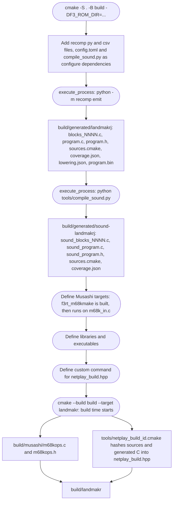
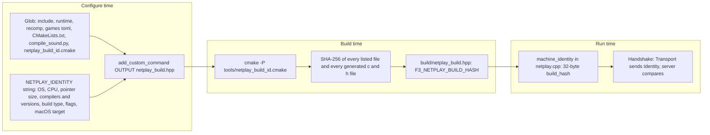

# Build pipeline

**What you will learn:** how CMake configures and builds the project.
This page lists generated outputs, target dependencies, and compile definitions.
It also explains the netplay build ID and the separate documentation build.

The top-level `CMakeLists.txt` drives everything. The ROM-to-C step runs at **configure time**, not at build time. This means that `cmake -S . -B build -DF3_ROM_DIR=...` already runs the Python recompilers.

## Requirements

| Tool | Why | Source |
| --- | --- | --- |
| CMake 3.24 or newer | `cmake_minimum_required(VERSION 3.24)` | `CMakeLists.txt` |
| A C11 and C++20 compiler | `CMAKE_C_STANDARD 11`, `CMAKE_CXX_STANDARD 20` | `CMakeLists.txt` |
| SDL3 with CMake config files | The frontend. Skip it with `-DF3RT_SDL=OFF`. | `find_package(SDL3 CONFIG REQUIRED)` |
| Python 3.11 or newer | The recompiler uses `tomllib`. CMake needs the `Interpreter` component. | `README.md`, `recomp/discovery.py` |
| Capstone 5.0.9 (Python package) | The disassembler. Install it into `build/python`. | `recomp/requirements.txt` |
| Ninja (recommended) | The README commands use `-G Ninja`. | `README.md` |
| Go 1.22 or newer | Only for the relay server. CMake does not build it. | `netplay/server/go.mod` |

Install Capstone with this command:

```sh
python3 -m pip install --target build/python -r recomp/requirements.txt
```

CMake adds `build/python` to `PYTHONPATH` when it runs the recompilers. You can also install Capstone in your own Python environment.

## The CMake options

The [Build options](/reference/build-options) reference page lists every option. These are the main generation controls:

| Option | Default | Effect |
| --- | --- | --- |
| `F3RT_SDL` | `ON` | Builds the SDL3 frontends (`f3rt-run`, `landmakr`). |
| `F3_ROM_DIR` | empty | A directory with the Land Maker Japan ROM files. A value turns on automatic generation of both the main and the sound C code. |
| `F3_GENERATED_DIR` | empty (set to `build/generated/landmakrj` when `F3_ROM_DIR` is set) | A directory with already generated main CPU C code. |
| `F3_SOUND_GENERATED_DIR` | empty (set to `build/generated/sound-landmakrj` when `F3_ROM_DIR` is set) | A directory with already generated sound driver C code. |
| `F3_PROFILE_DEFAULT_TIERS` | `ON` | ROM generation uses the frozen full-coverage profile unless a tiers/slim override is selected. `OFF` retains exclusions with ordinary optimization. |
| `F3_PROFILE_TIERS` | empty cache; frozen profile selected automatically | Explicit CRC-keyed profile override: hot units `-O2`, cold units `-Oz`/`-Os`. |
| `F3_PROFILE_SLIM` | empty | Explicit removal of unprofiled code, never enabled automatically. |

For pre-generated code, leave `F3_ROM_DIR` empty and set the generated directory paths.
CMake then uses those files without running Python.
If `F3_ROM_DIR` is set, CMake runs both generators even when output paths are supplied.

## Pipeline

The flowchart shows the steps in order. Rounded boxes are CMake steps. Plain boxes are files.



### Step 1: generate the main CPU code

If `F3_ROM_DIR` is set, CMake runs this command with `COMMAND_ERROR_IS_FATAL ANY`:

```sh
python3 -m recomp emit \
  --config games/landmakrj/config.toml \
  --rom-dir "$F3_ROM_DIR" \
  --output build/generated/landmakrj
```

The working directory is the repository root. `PYTHONPATH` starts with `build/python`. If the command fails, the configure step fails.

`CMakeLists.txt` also registers `recomp/*.py`, `recomp/*.csv` (with `CONFIGURE_DEPENDS`) and `games/landmakrj/config.toml` as configure dependencies. When one of them changes, the next `cmake --build` runs the configure step again. The configure step runs the recompiler again.

The selected `--profile-tiers` or explicit `--profile-slim` argument is passed
to both generators. Exclusion-filtered entries are the partition input:
336,775 main and 61,997 sound registrations in full tiers. An excluded profile
hit/miss is a configuration error, not evidence for silently undoing an exclusion.
The selected profile is a configure dependency. Hot/cold page subsets and
shared exception units have separate source lists and compiler options.


The command writes these files (see `recomp/generate.py`):

| File | Content |
| --- | --- |
| `blocks_hot_0000.c`, `blocks_cold_0000.c`, ... | Tiered translated code; up to 128 packed functions per unit. Ordinary builds use `blocks_0000.c`, ... |
| `program.c` | Sorted `translated_blocks[]`, immutable exclusions and `f3_generated_register`. Tier builds put shared exception bodies in `exceptions_hot.c` / `exceptions_cold.c`; ordinary builds keep them here. |
| `program.h` | Declares `f3_generated_register`. Rejects a wrong ABI version with `#error`. |
| `sources.cmake` | Sets `F3_GENERATED_SOURCES` to the list of C files. |
| `coverage.json` | What discovery found, including decoder rejections and unresolved transfers. |
| `lowering.json` | How many instructions lowered natively, and which did not. |
| `program.bin` | The 2 MiB interleaved ROM image. |

The [Generated files](/reference/generated-files) page describes these files in detail.

### Step 2: generate the sound driver code

CMake runs `tools/compile_sound.py --config games/landmakrj/config.toml` after main CPU generation.
The sound compiler verifies the interleaved region CRC32 (`5a7e9117`).
It independently decodes each nonexcluded even offset in the 512 KiB sound region.
Native lowerings, exception entries, and explicit unsupported stubs share the dispatch table.
Aligned coverage does not mean that all bytes contain reachable instructions.
The shards hold up to 1024 generated functions.
Full-coverage hot/cold shards keep that exact exclusion complement; only explicit
slim uses a sparse hot subset. Shared exception bodies are tiered by retained
executed aliases, not duplicated for each address. Both programs require ABI 3.
`sound_program.c` supplies `f3_sound_blocks[]` and `f3_sound_block_count`.
See [Sound-CPU compiler](/developer/recompiler/sound-compiler).

### Step 3: build the Musashi reference core

Musashi generates its opcode handlers with a small program. CMake builds `f3rt_m68kmake` from `runtime/third_party/musashi/m68kmake.c`. A custom command runs it on `m68k_in.c`. The output is `build/musashi/m68kops.c` and `m68kops.h`. The library `f3rt_musashi` compiles these files together with `m68kcpu.c`, `softfloat/softfloat.c` and `runtime/core_state.c`.

The compile definitions of `f3rt_musashi` are: `M68K_EMULATE_030=0`, `M68K_EMULATE_040=0`, `M68K_EMULATE_INT_ACK=1`, `M68K_EMULATE_TRACE=1`, `M68K_EMULATE_RESET=1` and `M68K_EMULATE_ADDRESS_ERROR=1`.

The file `m68kcpu.c` includes the generated header. For this reason the target `f3rt_musashi_generated` depends on `m68kops.h` and `f3rt_musashi` depends on that target.

### Step 4: define the libraries and executables

The next table lists all targets. A target exists only when its condition is true.

| Target | Kind | Condition | Main sources | Links to |
| --- | --- | --- | --- | --- |
| `f3rt_m68kmake` | executable | always | `m68kmake.c` | none |
| `f3rt_musashi` | static library | always | Musashi, `m68kops.c`, `core_state.c` | none |
| `f3rt` | static library | always | Explicit runtime library sources and `third_party/audio/*.cpp` | `f3rt_musashi` (private). Public include path `include`. |
| `f3_sound_recompiled` | static library | `F3_SOUND_GENERATED_DIR` set | `F3_SOUND_GENERATED_SOURCES` from the sound directory | `f3rt` (public) |
| `f3_recompiled` | static library (C) | `F3_GENERATED_DIR` set | `F3_GENERATED_SOURCES` of the main directory | none. Compiled with `-Wall -Wextra -Werror` on Clang and GCC. |
| `f3rt-sound-extract` | executable | always | `tools/sound_extract.cpp` | `f3rt` |
| `f3rt-gameplay-regression` | executable | `F3_GENERATED_DIR` set | `tools/gameplay_regression.cpp` | `f3rt`, `f3_recompiled` |
| `f3rt-netplay-oracle` | executable | `F3_GENERATED_DIR` set | `tools/netplay_oracle.cpp` | `f3rt`, `f3_recompiled` |
| `f3rt-run` | executable | `F3RT_SDL` | `runtime/frontend.cpp` | `f3rt`, `SDL3::SDL3`, and `f3_recompiled` if generated code exists |
| `landmakr` | executable | `F3RT_SDL` and `F3_GENERATED_DIR` set | `runtime/frontend.cpp` | `f3rt`, `f3_recompiled`, `SDL3::SDL3` |
| `f3rt-replay` | executable | always | `runtime/replay.cpp` | `f3rt` |
| `f3rt-check` | executable | `BUILD_TESTING` (CTest) | `runtime/check.cpp` | `f3rt` |
| `f3rt_musashi_generated` | custom target | always | Depends on the generated `m68kops.h` | Orders Musashi header generation. |

The library `f3rt` compiles with `-Wall -Wextra -Wpedantic`. It contains `rom.cpp`, `cpu_abi.cpp`, `machine.cpp`, `interpreter.cpp`, `video.cpp`, the `game_*.cpp` files, `audio.cpp`, `sound_trace.cpp`, `sound_native.cpp`, `netplay.cpp`, `netplay_transport.cpp` and the ES5505, ES5510, MC68681 and MB87078 chip files.

The `landmakr` target and `f3rt-run` use the same source file. The compile definitions make the difference:

| Definition | Set on | Effect in `frontend.cpp` |
| --- | --- | --- |
| `F3RT_GENERATED=1` | `f3rt-run` (with generated code), `landmakr`, `f3rt-gameplay-regression`, `f3rt-netplay-oracle` | Includes `program.h` and allows `f3_generated_register`. |
| `F3RT_LANDMAKR=1` | `landmakr` | Sets the ROM directory default and `translated = true`. Turns off CPU fallback. Makes `game` the default video mode. Requires `--set landmakrj`. |
| `F3RT_DEFAULT_ROM_DIR="..."` | `landmakr`, tools, regression targets | The default for `--rom-dir`. It is the value of `F3_ROM_DIR`. |
| `F3RT_SOUND_GENERATED=1` | All executables that link `f3_sound_recompiled` | Includes `sound_program.h`. Makes `native` the default sound driver. |

The `f3_recompiled` target is defined in `recomp/CMakeLists.txt`. That file fails with a clear message if `F3_GENERATED_DIR/sources.cmake` does not exist. It adds three include paths: `include/`, the repository root (for `recomp/cpu_ops.h`), and the generated directory (for `program.h`).

### Step 5: the netplay build ID

Two netplay players need matching build identities.
The next section explains how the project detects a mismatch.

## The netplay build ID

Different source, generated C, compiler settings, or platforms can change simulation results.
The build ID hashes these inputs with SHA-256.
The handshake rejects unequal build hashes.
A matching hash is an admission check, not proof of correct or deterministic execution.
The [Netplay oracle](/developer/testing/netplay-oracle) supplies execution evidence.



The details:

1. At configure time `CMakeLists.txt` globs these files: `include/*.h`, `include/*.hpp`, `runtime/*.c`, `runtime/*.h`, `runtime/*.cpp`, `runtime/*.hpp`, `recomp/*.py`, `recomp/*.h`, `recomp/*.csv`, `games/*.toml`. It adds `CMakeLists.txt`, `tools/compile_sound.py` and `tools/netplay_build_id.cmake`. It sorts the list. The glob is recursive, so it also covers `runtime/third_party`.
2. `NETPLAY_IDENTITY` records the system, CPU, pointer size, compiler IDs and versions, build type, and compiler flags.
   It also records macOS architecture, deployment target, and sysroot settings.
3. A custom command creates `build/netplay_build.hpp`. It depends on every listed file and on every `*.c` and `*.h` file in the two generated directories. It runs `cmake -P tools/netplay_build_id.cmake`.
4. The script hashes each file with `file(SHA256 ...)`, appends all hashes to the identity string, and hashes the whole string. It writes `#define F3_NETPLAY_BUILD_HASH "<64 hex digits>"`. It does not touch the file when the content is the same, so the compile of `netplay.cpp` does not repeat.
5. `target_sources(f3rt PRIVATE netplay_build.hpp)` attaches the header to the library.
6. `machine_identity` in `runtime/netplay.cpp` converts the 64 hex digits to 32 bytes. These bytes are the `build_hash` field of `Identity`.

The script runs at build time, not at configure time. A change in a runtime file therefore refreshes the hash without a new discovery run.

`Identity` also contains seven ROM region CRC32 values, a settings word, an EEPROM CRC, and an initial state CRC.
`machine_identity` stores video mode, sound mode, and delay in the settings word.
The handshake also checks the protocol version.
See [Wire protocol](/developer/netplay/protocol).

## Common build recipes

The first recipe builds the game from ROMs. It is the one in the README.

```sh
python3 -m pip install --target build/python -r recomp/requirements.txt
cmake -S . -B build -G Ninja -DCMAKE_BUILD_TYPE=Release -DF3_ROM_DIR=../roms/landmakr
cmake --build build --target landmakr -j 4
./build/landmakr
```

The second recipe builds the test tools, including the checks:

```sh
cmake --build build --target f3rt-check f3rt-gameplay-regression f3rt-netplay-oracle
ctest --test-dir build
```

The `ctest` command runs one test: `runtime-devices`, which runs `f3rt-check`.

The third recipe builds the relay server. CMake does not manage it:

```sh
(cd netplay/server && go build -o ../../build/netplay-server .)
```

The fourth recipe builds the generated code alone, without the runtime. It is useful when you only study the recompiler output:

```sh
python3 -m recomp emit --config games/landmakrj/config.toml \
  --rom-dir /path/to/roms/landmakr --output games/landmakrj/generated
cmake -S recomp -B build/native -G Ninja -DF3_GENERATED_DIR="$PWD/games/landmakrj/generated"
cmake --build build/native
```

::: warning ROMs and generated code
The generated C comes from your ROM. Never commit it. The `.gitignore` file already hides `build/` and `games/*/generated/`.
:::

## Documentation build

The VitePress site has a separate Node build.
It does not invoke CMake, either ROM compiler, or the Go relay.
It needs no ROM files.

```sh
cd docs/site
npm ci
npm run build
npm run preview
```

`npm run dev` starts the local development server.
The [Contributing page](/developer/contributing#work-on-this-documentation-site) explains GitHub Pages deployment.

## Source anchors

- [CMakeLists.txt](https://github.com/ansxor/f3-recomp/blob/main/CMakeLists.txt): target conditions, configure dependencies, and compile definitions.
- [recomp/CMakeLists.txt](https://github.com/ansxor/f3-recomp/blob/main/recomp/CMakeLists.txt): standalone generated library.
- [tools/netplay_build_id.cmake](https://github.com/ansxor/f3-recomp/blob/main/tools/netplay_build_id.cmake): sorted content hashes and header updates.
- [docs/site/package.json](https://github.com/ansxor/f3-recomp/blob/main/docs/site/package.json): documentation commands.
- [.github/workflows/docs.yml](https://github.com/ansxor/f3-recomp/blob/main/.github/workflows/docs.yml): documentation build and deployment.

## Where to read next

- [Recompiler overview](/developer/recompiler/) for what `recomp emit` does inside.
- [Build options](/reference/build-options) for the full option list.
- [Contributing](/developer/contributing) for the change rules.
