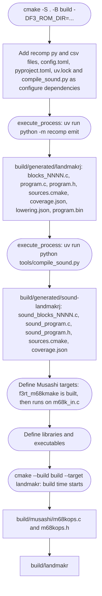

# Build pipeline

**What you will learn:** how CMake configures and builds the project.
This page lists generated outputs, target dependencies, and compile definitions.
It also explains the separate documentation build.

The top-level `CMakeLists.txt` drives everything. The ROM-to-C step runs at **configure time**, not at build time. This means that `cmake -S . -B build -DF3_ROM_DIR=...` already runs the Python recompilers.

## Requirements

| Tool | Why | Source |
| --- | --- | --- |
| CMake 3.24 or newer | `cmake_minimum_required(VERSION 3.24)` | `CMakeLists.txt` |
| A C11 and C++20 compiler | `CMAKE_C_STANDARD 11`, `CMAKE_CXX_STANDARD 20` | `CMakeLists.txt` |
| SDL3 with CMake config files | The frontend. Skip it with `-DF3RT_SDL=OFF`. | `find_package(SDL3 CONFIG REQUIRED)` |
| Google Highway 1.0 or newer | Runtime-dispatched SIMD for HLE voice kernel. Without an installed package, CMake fetches tag 1.4.0. | `find_package(hwy CONFIG)`, `FetchContent` fallback |
| uv (recent version) | Manages Python 3.11+ and dependencies (`capstone==5.0.9`, NumPy, SciPy). CMake runs generators via `uv run`. | `pyproject.toml`, `uv.lock` |
| Ninja (recommended) | The README commands use `-G Ninja`. | `README.md` |

Dependencies are locked in `pyproject.toml` and `uv.lock`. CMake invokes `uv run --project ... --locked` during configure, managing dependencies inside `.venv`. You can pre-sync dependencies with:

```sh
uv sync
```

## The CMake options

The [Build options](/reference/build-options) reference page lists every option. These are the main generation controls:

| Option | Default | Effect |
| --- | --- | --- |
| `F3RT_SDL` | `ON` | Builds the SDL3 frontends (`f3rt-run`, `landmakr`). |
| `F3_ROM_DIR` | empty | A directory with the selected title's ROM files (`F3_GAME`, default `landmakrj`). A value turns on automatic generation of both the main and the sound C code. |
| `F3_GENERATED_DIR` | empty (set to `BUILD_DIR/generated/SET` when `F3_ROM_DIR` is set) | A directory with already generated main CPU C code. |
| `F3_SOUND_GENERATED_DIR` | empty (set to `BUILD_DIR/generated/sound-SET` when `F3_ROM_DIR` is set) | A directory with already generated sound driver C code. |
| `F3_PROFILE_DEFAULT_TIERS` | `ON` | Japan ROM generation uses the frozen full-coverage profile (local, gitignored `profiles/landmakrj.profile`; configure fails if it is missing) unless a tiers/slim override is selected. `OFF` retains exclusions with ordinary optimization. |
| `F3_PROFILE_TIERS` | empty cache; frozen profile selected automatically | Explicit CRC-keyed profile override: hot units `-O2`, cold units `-Oz`/`-Os`. |
| `F3_PROFILE_SLIM` | empty | Explicit removal of unprofiled code, never enabled automatically. |

For pre-generated code, leave `F3_ROM_DIR` empty and set the generated directory paths.
CMake uses those CPU files without recompilation; Python 3.11 still generates ROM manifest metadata. Capstone is needed only for recompilation.
If `F3_ROM_DIR` is set, CMake runs both generators even when output paths are supplied.

## Pipeline

The examples and counts below illustrate the Japan default. For another title,
select `-DF3_GAME=SET`; automatic commands use `games/SET/config.toml` and
`BUILD_DIR/generated/SET`, `BUILD_DIR/generated/sound-SET`. The title target is
`landmakr` for both LM selections, otherwise the set name. Japan's frozen tiers,
per-game scene decoders and gameplay/GPU campaigns are not generic title support.
Every configure also generates `rom_manifest.hpp` with `tools/compile_roms.py`
and `recomp/roms.py`; those tools and all game configs are tracked dependencies.
See [build options](/reference/build-options) for per-title reproducible commands.

The flowchart shows the steps in order. Rounded boxes are CMake steps. Plain boxes are files.



### Step 1: generate the main CPU code

If `F3_ROM_DIR` is set, CMake runs this command with `COMMAND_ERROR_IS_FATAL ANY`:

```sh
uv run python -m recomp emit \
  --config games/landmakrj/config.toml \
  --rom-dir "$F3_ROM_DIR" \
  --output build/generated/landmakrj
```

The working directory is the repository root. If the command fails, the configure step fails.

`CMakeLists.txt` also registers `recomp/*.py`, `recomp/*.csv` (with `CONFIGURE_DEPENDS`), `pyproject.toml`, `uv.lock`, and the selected `games/SET/config.toml` as configure dependencies. When one of them changes, the next `cmake --build` runs the configure step again.

CMake caches the generation step using an input content stamp file (`recomp_emit.stamp` in the generated directory). The stamp hashes the recompiler sources (`recomp/*.py`, `recomp/*.csv`), game `config.toml`, `pyproject.toml`, `uv.lock`, profile files and arguments, ROM directory identity (file names, sizes, mtimes), and generator CLI flags. If the stamp matches and generated outputs exist, CMake skips `execute_process` entirely during configuration.
To force regeneration manually, delete the stamp file (e.g. `rm build/generated/<game>/recomp_emit.stamp`) or delete the generated directory.

All emitted files use write-if-changed semantics: files are rewritten only if their contents differ from what is on disk, keeping mtimes stable so unchanged compilation units avoid downstream recompilation by Ninja. Stale files from prior runs that are no longer emitted are automatically unlinked.

The selected `--profile-tiers` or explicit `--profile-slim` argument is passed
to both generators. Exclusion-filtered entries are the partition input:
336,775 main and 61,997 sound registrations in full tiers. An excluded profile
hit/miss is a configuration error, not evidence for silently undoing an exclusion.
The selected profile is a configure dependency. Hot/cold page subsets and
shared exception units have separate source lists and compiler options.


The command writes these files (see `recomp/generate.py`):

| File | Content |
| --- | --- |
| `blocks_hot_0000.c`, `blocks_cold_0000.c`, ... | Tiered translated code; up to 128 packed functions per unit. Ordinary builds use `blocks_0000.c`, ... |
| `program.c` | Sorted `translated_blocks[]`, immutable exclusions and `f3_generated_register`. Tier builds put shared exception bodies in `exceptions_hot.c` / `exceptions_cold.c`; ordinary builds keep them here. |
| `program.h` | Declares `f3_generated_register`. Rejects a wrong ABI version with `#error`. |
| `sources.cmake` | Sets `F3_GENERATED_SOURCES` to the list of C files. |
| `coverage.json` | What discovery found, including decoder rejections and unresolved transfers. |
| `lowering.json` | How many instructions lowered natively, and which did not. |
| `program.bin` | The selected interleaved ROM image (may be 1 MiB or 2 MiB). |

The [Generated files](/reference/generated-files) page describes these files in detail.

### Step 2: generate the sound driver code

CMake runs `tools/compile_sound.py --config games/SET/config.toml` after main CPU generation, using `F3_GAME`.
Shared manifest loading validates chips and generates the selected mapped image CRC; runtime sound binds to that CRC.
It independently decodes each nonexcluded even offset in the 512 KiB sound region.
Native lowerings, exception entries, and explicit unsupported stubs share the dispatch table.
Aligned coverage does not mean that all bytes contain reachable instructions.
The shards hold up to 1024 generated functions.
Full-coverage hot/cold shards keep that exact exclusion complement; only explicit
slim uses a sparse hot subset. Shared exception bodies are tiered by retained
executed aliases, not duplicated for each address. Both programs require ABI 3.
`sound_program.c` supplies `f3_sound_blocks[]` and `f3_sound_block_count`.
Like the main recompiler, sound generation is cached with an input content stamp (`compile_sound.stamp` in the sound generated directory) covering `tools/compile_sound.py`, `recomp/*.py`, `recomp/*.csv`, game `config.toml`, profile files and arguments, ROM directory identity, and generator CLI flags. Unchanged outputs retain their modification times via write-if-changed, and deleting `compile_sound.stamp` forces sound regeneration.
See [Sound-CPU compiler](/developer/recompiler/sound-compiler).

### Step 3: build the Musashi reference core

Musashi generates its opcode handlers with a small program. CMake builds `f3rt_m68kmake` from `runtime/third_party/musashi/m68kmake.c`. A custom command runs it on `m68k_in.c`. The output is `build/musashi/m68kops.c` and `m68kops.h`. The library `f3rt_musashi` compiles these files together with `m68kcpu.c`, `softfloat/softfloat.c` and `runtime/core_state.c`.

The compile definitions of `f3rt_musashi` are: `M68K_EMULATE_030=0`, `M68K_EMULATE_040=0`, `M68K_EMULATE_INT_ACK=1`, `M68K_EMULATE_TRACE=1`, `M68K_EMULATE_RESET=1` and `M68K_EMULATE_ADDRESS_ERROR=1`.

The file `m68kcpu.c` includes the generated header. For this reason the target `f3rt_musashi_generated` depends on `m68kops.h` and `f3rt_musashi` depends on that target.

### Step 4: define the libraries and executables

The next table lists all targets. A target exists only when its condition is true.

| Target | Kind | Condition | Main sources | Links to |
| --- | --- | --- | --- | --- |
| `f3rt_m68kmake` | executable | always | `m68kmake.c` | none |
| `f3rt_musashi` | static library | always | Musashi, `m68kops.c`, `core_state.c` | none |
| `f3rt` | static library | always | Explicit runtime library sources and `third_party/audio/*.cpp` | `f3rt_musashi`, `hwy::hwy` (private). Public include path `include`. |
| `f3_sound_recompiled` | static library | `F3_SOUND_GENERATED_DIR` set | `F3_SOUND_GENERATED_SOURCES` from the sound directory | `f3rt` (public) |
| `f3_recompiled` | static library (C) | `F3_GENERATED_DIR` set | `F3_GENERATED_SOURCES` of the main directory | none. Compiled with `-Wall -Wextra -Werror` on Clang and GCC. |
| `f3rt-runner` | static library | always | `tools/runner/runner.cpp`, `tools/runner/inputs.cpp` | `f3rt` |
| `f3rt-tool` | executable | always | `tools/tool.cpp`, `tools/commands/*.cpp` | `f3rt`, `f3rt-runner`, `f3_recompiled` (if generated) |
| `f3rt-run` | executable | `F3RT_SDL` | `runtime/frontend/frontend.cpp` | `f3rt`, `SDL3::SDL3`, and `f3_recompiled` if generated code exists |
| `landmakr` | executable | `F3RT_SDL` and `F3_GENERATED_DIR` set | `runtime/frontend/frontend.cpp` | `f3rt`, `f3_recompiled`, `SDL3::SDL3` |
| `f3rt-replay` | executable | always | `runtime/replay.cpp` | `f3rt` |
| `f3rt-test-support` | static library | `BUILD_TESTING` | `runtime/tests/support.cpp` | `f3rt` |
| `f3rt-test-<area>` | executable (one per area) | `BUILD_TESTING` (CTest) | `runtime/tests/<area>.cpp` | `f3rt-test-support` |
| `f3rt_musashi_generated` | custom target | always | Depends on the generated `m68kops.h` | Orders Musashi header generation. |

The library `f3rt` compiles with `-Wall -Wextra -Wpedantic`. It contains `rom.cpp`, `cpu_abi.cpp`, `machine.cpp`, `interpreter.cpp`, `renderer/fdp/video.cpp`, the `renderer/game/*.cpp` files, `audio.cpp`, `sound_trace.cpp`, `sound_native.cpp` and the ES5505, ES5510, MC68681 and MB87078 chip files.

The `landmakr` target and `f3rt-run` use the same source file. The compile definitions make the difference:

| Definition | Set on | Effect in `frontend.cpp` |
| --- | --- | --- |
| `F3RT_GENERATED=1` | `f3rt-run` (with generated code), `landmakr`, `f3rt-tool` | Includes `program.h` and allows `f3_generated_register`. |
| `F3RT_GAME=1` | Selected title target | Defaults strict native execution, configured ROM directory and selected `F3RT_DEFAULT_SET`. Japan defaults to game-data video; other titles use FDP. Set must match the selected game. |
| `F3RT_DEFAULT_ROM_DIR="..."` | `landmakr`, tools, regression targets | The default for `--rom-dir`. It is the value of `F3_ROM_DIR`. |
| `F3RT_SOUND_GENERATED=1` | All executables that link `f3_sound_recompiled` | Includes `sound_program.h`. Makes `native` the default sound driver. |

The `f3_recompiled` target is defined in `recomp/CMakeLists.txt`. That file fails with a clear message if `F3_GENERATED_DIR/sources.cmake` does not exist. It adds three include paths: `include/`, the repository root (for `recomp/cpu_ops.h`), and the generated directory (for `program.h`).

## Common build recipes

The first recipe builds the game from ROMs. It is the one in the README.

```sh
cmake -S . -B build -G Ninja -DCMAKE_BUILD_TYPE=Release -DF3_ROM_DIR=../roms/landmakr
cmake --build build --target landmakr -j 4
./build/landmakr
```

The second recipe builds the test tools, including the checks:

```sh
cmake --build build --target f3rt-tool
ctest --test-dir build -R runtime-
```

The CTest command runs the per-area runtime tests (`runtime-video`, `runtime-input`, `runtime-eeprom`, `runtime-cpu`, `runtime-sprites` and `runtime-audio`).

The third recipe builds the generated code alone, without the runtime. It is useful when you only study the recompiler output:

```sh
uv run python -m recomp emit --config games/landmakrj/config.toml \
  --rom-dir /path/to/roms/landmakr --output games/landmakrj/generated
cmake -S recomp -B build/native -G Ninja -DF3_GENERATED_DIR="$PWD/games/landmakrj/generated"
cmake --build build/native
```

::: warning ROMs and generated code
The generated C comes from your ROM. Never commit it. The `.gitignore` file already hides `build/` and `games/*/generated/`.
:::

## Documentation build

The VitePress site has a separate Node build.
It does not invoke CMake or either ROM compiler.
It needs no ROM files.

```sh
cd docs/site
npm ci
npm run build
npm run preview
```

`npm run dev` starts the local development server.
The [Contributing page](/developer/contributing#work-on-this-documentation-site) explains GitHub Pages deployment.

## Source anchors

- [CMakeLists.txt](https://github.com/ansxor/f3-recomp/blob/main/CMakeLists.txt): target conditions, configure dependencies, and compile definitions.
- [recomp/CMakeLists.txt](https://github.com/ansxor/f3-recomp/blob/main/recomp/CMakeLists.txt): standalone generated library.
- [docs/site/package.json](https://github.com/ansxor/f3-recomp/blob/main/docs/site/package.json): documentation commands.
- [.github/workflows/docs.yml](https://github.com/ansxor/f3-recomp/blob/main/.github/workflows/docs.yml): documentation build and deployment.

## Where to read next

- [Recompiler overview](/developer/recompiler/) for what `recomp emit` does inside.
- [Build options](/reference/build-options) for the full option list.
- [Contributing](/developer/contributing) for the change rules.
