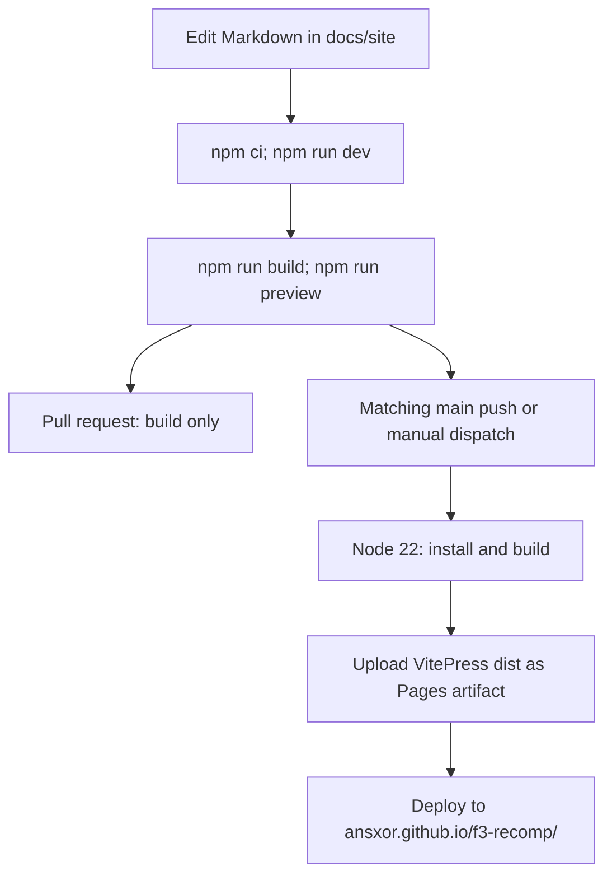

# Contributing

**What you will learn:** set up a work environment and select checks for your change.
This page covers ABI changes, scene decoders, games, command-line flags, and code conventions.
It also explains local documentation work and GitHub Pages publishing.

## Principles

The project is built on evidence. Read these rules before you change behavior.

1. **Record evidence.** Describe the ROM set, build, scenario, reference, and limits of a behavior or timing change. Keep durable rationale in `docs/developer/DECISIONS.md` and measurements in the relevant evidence document; do not add project-progress logs to overview pages.
2. **Separate models from hardware evidence.** ROM observations and captured MAME output support specific compatibility claims. MAME source explains the reference model; neither it nor agreement between software paths establishes physical-chip correctness. Identify primary hardware evidence separately.
3. **Do not hide gaps.** The code reports unsupported cases and does not guess. Examples: unresolved transfers stay in `coverage.json`, unknown display writers make `GameVideo` fall back to the FDP renderer, and an untranslated instruction stops the strict-native build.
4. **Do not fit the output.** The project adds no delay, offset or waveform correction to match a reference. If a result differs, find the cause.
5. **Stay deterministic.** No wall clock, random source or host pointer may change the machine state.
6. **Keep user data out of Git.** Never commit ROMs, generated C, captures, traces or WAV files. They are derived from ROMs. Keep them in `build/`.

## Set up the work environment

Follow these steps once.

1. Install CMake 3.24 or newer, Ninja, a C11 and C++20 compiler, SDL3 development files, and Python 3.11 or newer.
2. Install Capstone into the build folder:

   ```sh
   python3 -m pip install --target build/python -r recomp/requirements.txt
   ```

3. Configure and build:

   ```sh
   cmake -S . -B build -G Ninja -DCMAKE_BUILD_TYPE=Release -DF3_ROM_DIR=../roms/landmakr
   cmake --build build --target landmakr -j 4
   ```

4. Build the test tools:

   ```sh
   cmake --build build --target f3rt-check f3rt-gameplay-regression f3rt-netplay-oracle f3rt-replay f3rt-sound-extract
   ```

5. Install Go 1.22 or newer if you work on the relay server.

The [Build pipeline](/developer/build-pipeline) page explains what each command does.

## Which test do I run?

Run the test that matches your change. Several changes need more than one test.

| You changed | Run | What it proves |
| --- | --- | --- |
| `recomp/emitter.py`, `recomp/cpu_ops.h`, `recomp/bitfield.h`, cycle tables | `PYTHONPATH=build/python python3 tools/differential/run.py --musashi runtime/third_party/musashi --output build/differential --cases 5000` | Compares generated cases against Musashi: registers, flags, writes, and cycles. It does not cover every instruction form. |
| `recomp/discovery.py` | `PYTHONPATH=build/python python3 -m unittest discover -s tools -p 'test_*.py'` | Discovery rules on small synthetic ROMs. |
| `recomp/generate.py`, dispatch deadline logic | The same `unittest` command (`tools/test_generate.py`) | Blocks return at the deadline, keep flags correct and resume inside a block. |
| Devices, audio timing, EEPROM, game-video descriptors | `ctest --test-dir build` | Runs `f3rt-check` as test `runtime-devices`. |
| Anything that affects the main CPU path | `python3 tools/run_gameplay_regression.py --rom-dir ../roms/landmakr --frames 40000 --seeds 1 2 3 4 5 6 7 8` | Eight seeded runs end with no fallback, no halt and no error. See [Gameplay regression](/developer/testing/gameplay-regression). |
| Video code | The same gameplay command with `--video-diff` | Compares supported game-data scenes with the FDP oracle. Unsupported scenes remain explicit fallback frames. |
| Sound code or `tools/compile_sound.py` | Run `f3rt-gameplay-regression` with each sound driver and `--sound-trace`. Then run `python3 tools/compare_sound.py`. | Detects bus trace differences for the selected input schedule. |
| MAME parity | `tools/mame/` scripts and `f3rt-replay` | Measures picture or audio differences against captured MAME output. |
| `netplay/server/` | `(cd netplay/server && go test -race ./...)` | Relay tests. |
| Netplay C++ code, snapshots | `python3 tools/run_netplay_oracle.py --suite snapshot` (and `baseline`, `impaired`, `cases`) | Snapshots are exact. Two clients equal the single-machine reference. See [Testing strategy](/developer/testing/). |

Always run the real program after a change. A build that compiles is not proof that the game works. Use `--frames N --headless` for a finite run and read the final line. It shows `native_blocks`, `fallback_instructions`, `frame_crc` and the audio counters.

::: tip Evidence in the output
The last line of `landmakr` and `f3rt-run` looks like `set=landmakrj frames=... pc=0x... frame_crc=0x... native_blocks=... fallback_instructions=0 audio_peak=...`. Compare `frame_crc` and `fallback_instructions` before and after your change.
:::

## Change the ABI

The ABI is `include/f3rt/cpu_abi.h`. Generated code consumes it; the runtime implements and owns it. Record ABI changes in `docs/developer/ABI-CHANGES.md` and notify other contributors.

Use these steps:

1. Decide if the change needs a new version. Add or remove a field of `f3_cpu`, add or remove a function, or change the meaning of an existing field: this needs a new version.
2. Edit `include/f3rt/cpu_abi.h` and increase `F3RT_ABI_VERSION`.
3. Edit `_RUNTIME_ABI_VERSION` in `recomp/generate.py` to the same number. The generated files then contain a matching `#if F3RT_ABI_VERSION != N` guard.
4. Change the implementation in `runtime/cpu_abi.cpp` and `runtime/machine.cpp`. Change `tools/compile_sound.py` and `runtime/sound_native.cpp` if the sound code uses the changed part.
5. Update CPU state export/import (`runtime/core_state.c`), packed records (`runtime/state_io.hpp`), full local save/load and canonical sync save/load/CRC. Add safe-field validation; preserve local presentation and omit expanded buffers only from sync state.
6. Update the differential harness (`tools/differential/harness_abi.c`) if it uses the changed part.
7. Add a section to `docs/developer/ABI-CHANGES.md`, stating the change, reason and unchanged contracts.
8. Rebuild everything. Run the tests from the table.

Some changes need a note but no ABI version bump, such as timing fixes or C++-only snapshot APIs. The history in `docs/developer/ABI-CHANGES.md` distinguishes these from layout/version changes.

Rules that must stay true:

- Only ordinary memory reads and writes may see pending lazy flags. All other callbacks need canonical SR.
- `f3_exception` owns the full cycle charge of an exception. Generated code must not add the normal instruction cost on that path.
- Never add host pointers to the state that `save_state` writes.

## Add a scene decoder or a store-PC entry

`GameVideo` decodes the scene from FDP video RAM at VBSTART; there are no code
hooks. Adding support usually means one of two things.

**A store of already-decoded video RAM.** In a `F3RT_VIDEO_WRITE_LOG` build, add
the instruction address (or a tight range) to the component's known list in
`games/<game>/video/<component>.cpp`. Until then the store is logged once to
stderr by `log_unknown_video_write`, but it still decodes correctly next frame.

**A feature not decoded yet.** Extend a per-game decoder's `decode(vram)`, or the
shared primitive in `runtime/renderer/decode.cpp`, then add the store PCs. Follow
[Extending the renderer](/developer/runtime/video/extending).

Do not add `[[hooks]]` entries: hook support was removed from the recompiler. The
old hook PCs are ordinary `[discovery] entry_points` in the game configuration
when they are needed as proven seeds.

An unknown display-memory writer is only logged, and only under
`F3RT_VIDEO_WRITE_LOG`; it never invalidates a component. Genuine unsupported
features (`flipped-screen`, `sprite-trails`, `bitmap-pivot`) use the FDP renderer
for that frame and log once through `log_unsupported_video`.
See `is_covered_write` in the `renderer/game/*.cpp` files.

## Add a game

The toolchain has Land Maker-specific contracts. Review each part below before adding a new game.

1. **Config.** Copy `games/landmakrj/config.toml`. Set `[game]`, `[rom]` (`size`, `interleave`), one `[[rom.lanes]]` for each chip (`file`, `offset`, `size`, `crc`, `sha1`) and `[discovery]`. See [Per-game config](/reference/game-config).
2. **Discovery first.** Run `python3 -m recomp discover --config games/<id>/config.toml --rom-dir <dir> --output build/<id>`. It writes only `coverage.json`. Read the unresolved transfers.
3. **Emit.** Use `emit` instead of `discover`. Inspect `lowering.json` separately from the coverage report.
   Independent aligned decodes include data and overlapping candidates.
   Unsupported candidates can remain, but strict-native execution must never reach an unsupported lowering.
4. **Runtime manifest.** Add all region chip sizes/hashes/placement to the selected TOML; `tools/compile_roms.py` and `recomp/roms.py` generate shared runtime metadata. Empty upper planes are not fake files.
5. **Sound.** Compile the selected `[sound]` region with validated padding/mirroring, retaining generated image CRC binding. Review its memory map and native/oracle timing/audio evidence independently.
6. **Top-level CMake.** Select the title through `F3_GAME`; generated directories use `generated/SET` and `generated/sound-SET`. Extend the accepted selection list for a genuinely new title.
7. **Frontend.** `F3RT_GAME` marks strict-native title targets; default set and generated main/sound CRC guards must agree. Enhanced/game-data/HLE/netplay eligibility remains Japan-only.
8. **Game-specific video.** `GameVideo` and its `games/<game>/video/` decoders are specific to Land Maker. A new game can use the FDP renderer (`--video fdp`) and needs no game-data scene.

::: info World set
`games/landmakr/config.toml` describes the World main ROM lanes.
`RomSet::load` also recognizes this set. The recorded execution target remains Japan.
The World set has no recorded validation here.
:::

## Add a command-line flag

For the SDL program:

1. Add the parse branch in the argument loop in `runtime/frontend.cpp`. Use the `value()` helper for a flag with an argument. Validate the range and throw `std::runtime_error` with a clear message.
2. Add the cross-checks after the loop. Many flags are only valid in some modes. The loop shows examples (video options need `game` or `compare`, netplay needs strict-native).
3. Add the flag to the `--help` text.
4. Add it to the [Command-line reference](/reference/cli) and to the user guide page that fits.
5. If the flag changes machine behavior, check the netplay settings word in `machine_identity` (`runtime/netplay.cpp`). Netplay must reject any setting that the handshake does not cover.

The other programs have their own argument loops: `tools/gameplay_regression.cpp`, `tools/netplay_oracle.cpp`, `tools/sound_extract.cpp` and `runtime/replay.cpp`. The recompiler uses `argparse` in `recomp/__main__.py`. A new CMake option uses `option()` or a `CACHE` variable in `CMakeLists.txt`. Document it in [Build options](/reference/build-options).

## Code conventions

These conventions come from the existing code. Follow them.

**C++ runtime**

- The standard is C++20. Runtime components use `namespace f3rt`; C ABI entry points use `extern "C"`.
- A big component hides its data behind `struct Impl` and a `std::unique_ptr` (`Video`, `Audio`, `GameVideo`, `Transport`, `Rollback`). Such classes are not copyable.
- Errors are exceptions: `throw std::runtime_error("clear message")`. The frontend prints `f3rt: message` and exits with code 1. Do not add silent fallbacks.
- Valid save/load must not allocate. Use fixed storage, bounded `StateWriter`/`StateReader` and packed records. Update both full/local and canonical/sync size/save/load paths and validators. Keep rendering/trails and hardware state in sync; omit only expanded presentation. Document representation changes in `docs/developer/ABI-CHANGES.md`.
- Exclude diagnostic counters from the snapshot (`native_blocks`, `fallback_instructions` and similar).
- Write addresses as lower-case hex with `0x`. Comments name the evidence: a ROM address, a MAME file and line, or a test.
- Files derived from MAME keep their license header. They are listed in `runtime/LICENSES.txt`.

**Generated C**

- Main block functions use `f3_native_XXXXXX`. Sound block functions use `f3_sound_block_XXXXXX`.
  Sound ROM addresses start at `0xc00000`, so their names use eight hex digits.
- Generated files compile with `-Wall -Wextra -Werror` (main code) and must not contain ROM data. Do not commit them.

**Python**

- Use `from __future__ import annotations`, type hints and `pathlib.Path`.
- Raise `ValueError` or `FileNotFoundError` with a message that names the file and the expected value. `recomp/__main__.py` prints these as `f3-recomp: message` and exits with 1.
- Tests use `unittest` in `tools/test_*.py`. They build small synthetic ROMs. They contain no game data.

**Go**

- The relay server uses only the standard library (`go 1.22`). Tests run with `go test -race ./...`.

## Work on this documentation site

The VitePress project lives in `docs/site/`.
It publishes at [https://ansxor.github.io/f3-recomp/](https://ansxor.github.io/f3-recomp/).
Documentation work needs no ROMs, generated game code, SDL3, CMake, or Go.
Use Node 22 to match the workflow.

Install the locked dependencies and start the development server:

```sh
cd docs/site
npm ci
npm run dev
```

Open the address printed by VitePress.
The development server reloads changed pages.
Stop it before checking the production build:

```sh
npm run build
npm run preview
```

`build` writes `docs/site/.vitepress/dist`.
Its dead-link check rejects missing site pages.
`preview` serves that output; it does not rebuild changed Markdown.
Open its printed address and check links, code blocks, tables, and Mermaid diagrams.

### Publish with GitHub Pages

The workflow is [.github/workflows/docs.yml](https://github.com/ansxor/f3-recomp/blob/main/.github/workflows/docs.yml).
It runs `npm ci` and `npm run build` on Node 22.

1. Open the repository's **Settings > Pages**.
2. Set **Source** to **GitHub Actions**.
3. Push documentation changes to `main`, or run **Docs** with **Run workflow**.
4. Check the workflow's build and deploy jobs.
5. Open [the published site](https://ansxor.github.io/f3-recomp/).

Push builds run on `main` when `docs/site/**` or the workflow file changes.
Matching pull requests run the build, but they do not upload or deploy a Pages artifact.
Manual dispatch can also publish. The workflow excludes deployment only for pull request events.

The site config sets `base: '/f3-recomp/'` for this project URL.
The deploy job uses the `github-pages` environment and needs Pages and identity-token write permissions.



### Page conventions

- Start each page with one `# Title`. Follow it with a short "What you will learn" paragraph. Use `##` and `###` headings for the rest.
- Write short sentences in active voice. Use one word for one concept, and use it in the same way on every page. Explain a technical term the first time you use it. Add new terms to the [Glossary](/developer/glossary).
- Put code names, file names, flags and addresses in backticks.
- Give source files as absolute GitHub links, for example `https://github.com/ansxor/f3-recomp/blob/main/runtime/machine.cpp`.
- Link between site pages with absolute paths and no extension, for example `/developer/runtime/cpu-abi`. Never use a relative link that leaves `docs/site`. The dead-link check fails the build.
- Put command placeholders such as `<rom-dir>` inside backticks or code fences.
- Do not use two consecutive opening braces in prose or inline code. Vue interprets them as an interpolation expression.
- Put literal template expressions in a fenced code block.
- Mark each code block with a language (`sh`, `cpp`, `c`, `python`, `toml`, `text`, `go`).
- Use `::: tip`, `::: warning` and `::: info` containers only when they help.
- Copy measurements only with a developer evidence source and observed setup; do not turn historical measurements into current guarantees.
- Check each claim against the code. The long Markdown files in the repository can be out of date.

### Diagrams

Use Mermaid fenced blocks. The site renders them in the browser.
Large diagrams keep their original text size. Scroll inside a diagram to view its other parts.
The theme stylesheet matches Mermaid's label spacing. Do not apply the document paragraph spacing to diagram labels.

- Use `flowchart`, `sequenceDiagram`, `stateDiagram-v2` or `classDiagram`.
- Wrap each node label that has punctuation or parentheses in double quotes: `node["Machine::boundary (deadline)"]`.
- Avoid angle brackets in labels. Quote labels with punctuation, and use short text.
- A diagram must match the code. Name real functions and files.

## Evidence and technical background

| Topic | Read |
| --- | --- |
| Why a recompiler decision was made | `docs/developer/DECISIONS.md` (dated entries) |
| Recorded validation scenarios and limits | `docs/developer/VALIDATION.md` |
| Overlay, handoff and observed verification | `docs/developer/IMGUI-NETPLAY.md` |
| ABI and snapshot contract | `docs/developer/ABI-CHANGES.md` |
| Netplay protocol and limits | `docs/NETPLAY.md` |
| Video addresses and layouts | `docs/developer/VIDEO-HLE.md` |
| Sound driver and trace format | `docs/SOUND-DRIVER.md` |
| MAME capture protocol | `tools/mame/README.md` |
