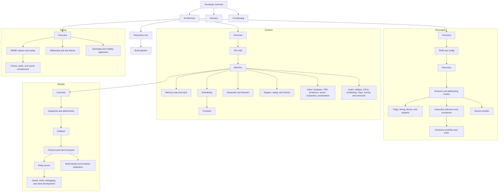

# Developer overview

**What you will learn:** what f3-recomp is made of, in which order to read the Developer pages for your goal, and where each page is.

f3-recomp runs the Taito F3 arcade game *Land Maker* on a modern computer.
It translates main CPU instructions to C before execution.
This method is **static recompilation**.
The strict-native game target rejects main CPU interpreter fallback.
Reference and diagnostic paths still use an interpreter.
The design follows N64Recomp and N64ModernRuntime.

The project has three layers:

| Layer | Folder | What it does |
| --- | --- | --- |
| Recompiler | `recomp/`, `tools/compile_sound.py` | Reads the ROM and writes C code for the main CPU (68EC020) and the sound CPU (68000). |
| ABI | `include/f3rt/` | The C interface between the generated code and the runtime. |
| Runtime | `runtime/` | Implements the board: memory map, interrupts, video, audio, input, EEPROM. Also the SDL3 frontend and netplay. |

Around these layers are the netplay relay server (`netplay/server/`, Go) and the test tools (`tools/`).

## Current status

These facts come from `README.md`, `STATUS.md` and `NOTES.md`. The repository documents say so; this site does not measure them again.

- The execution target is *Land Maker* Japan 2.01J (`landmakrj`).
  The World set (`landmakr`) has a main ROM config and runtime loader support, but no recorded validation here.
- The `landmakr` executable runs the main CPU only from generated code. `STATUS.md` records a 3,600-frame run with 51,507,335 native blocks and no interpreter fallback. In the same record, 25 of 25 sampled frames match MAME exactly (frames 600 to 3480, step 120).
- The native sound driver and the interpreted sound driver write the same bus trace and the same WAV file in the seed-5 test (`README.md`).
- One-versus-one rollback netplay is finished and tested (`STATUS.md`).
- Audio does not yet equal MAME audio. `NOTES.md` records a correlation of about 0.9957 for seconds 20 to 54 and says this is not waveform parity.

## Choose your path

Pick the goal that fits you. Read the pages in the order shown.

### I am new and want the big picture

1. [Architecture](/developer/architecture) shows how the parts fit together.
2. [Repository tour](/developer/repository) lists every file.
3. [Build pipeline](/developer/build-pipeline) explains what CMake does.
4. [Glossary](/developer/glossary) explains the terms.

### I want to add a game

1. [Contributing: Add a game](/developer/contributing) lists the steps and the Land Maker-specific places.
2. [ROM loading and config](/developer/recompiler/rom-and-config) explains the config file and lane interleave.
3. [Per-game config reference](/reference/game-config) lists every TOML key.
4. [Discovery](/developer/recompiler/discovery) explains how the recompiler finds code.
5. [Code emission](/developer/recompiler/emission) explains how C is written.
6. [Gameplay regression](/developer/testing/gameplay-regression) proves that the new build runs without fallback.

### I want to fix a rendering bug

1. [Video overview](/developer/runtime/video/) explains the two renderers.
2. [FDP renderer](/developer/runtime/video/fdp) is the oracle.
3. [Game-data HLE](/developer/runtime/video/game-hle) is the fast renderer that rebuilds the scene from game data.
4. [Presentation](/developer/runtime/video/presentation) covers scale, border and filter.
5. [MAME oracle and captures](/developer/testing/mame) shows how to get a reference picture.
6. [Gameplay regression](/developer/testing/gameplay-regression) has the `--video-diff` check.

### I want to fix a sound bug

1. [Audio overview](/developer/runtime/audio/) explains the sound board model.
2. [Sound-CPU compiler](/developer/recompiler/sound-compiler) explains the native sound driver.
3. [Interpreter](/developer/runtime/interpreter) explains the oracle sound CPU.
4. [Sound tracing](/developer/runtime/audio/tracing) explains observable bus events.
5. [Sound tools](/developer/testing/sound-tools) covers extraction, sequence reports, and native-versus-oracle checks.
6. [Audio comparison](/developer/testing/audio-compare) explains waveform metrics and their limits.

### I want to understand netplay

1. [Netplay overview](/developer/netplay/) gives the model.
2. [Snapshots and determinism](/developer/netplay/snapshots) explains why the machine can be saved and restored exactly.
3. [Rollback engine](/developer/netplay/rollback) explains `Rollback`.
4. [Wire protocol](/developer/netplay/protocol) lists the UDP packets.
5. [Client transport](/developer/netplay/transport) explains delivery, retransmission, and timeout handling.
6. [Relay server](/developer/netplay/server) explains the Go server.
7. [Netplay for players](/guide/netplay) shows the commands.

### I think an instruction or a timing is wrong

1. [Code emission](/developer/recompiler/emission) shows how an instruction is lowered.
2. [Flags, timing and deadlines](/developer/recompiler/flags-and-timing) explains lazy flags, cycle costs and the deadline.
3. [CPU ABI](/developer/runtime/cpu-abi) lists the fields and functions.
4. [Machine, memory and scheduling](/developer/runtime/machine) explains how time advances.
5. [Differential testing](/developer/testing/differential) tests one instruction against Musashi.

### I want to change the frontend or add a flag

1. [Frontend (SDL3)](/developer/runtime/frontend) explains the main loop.
2. [Command-line reference](/reference/cli) lists every option.
3. [Contributing: Add a command-line flag](/developer/contributing) gives the steps.

### I want to run or write tests

1. [Testing strategy](/developer/testing/) is the map of all checks.
2. [Differential testing](/developer/testing/differential), [Gameplay regression](/developer/testing/gameplay-regression) and [MAME oracle and captures](/developer/testing/mame) cover the three main tools.
3. [Tools and scripts](/reference/tools) lists every program in `tools/`.

## Map of the Developer section

The diagram shows suggested reading paths.
An arrow identifies a useful prerequisite, not a required execution dependency.

## Every Developer page

### Start here

| Page | Content |
| --- | --- |
| [Architecture](/developer/architecture) | Build time and run time, components, one frame, oracles, netplay, ABI owner. |
| [Repository tour](/developer/repository) | Source file responsibilities and subsystem entry points. |
| [Build pipeline](/developer/build-pipeline) | CMake steps, generated outputs, targets, netplay build ID. |
| [Glossary](/developer/glossary) | Alphabetical list of terms. |
| [Contributing](/developer/contributing) | Workflow, ABI rule, hooks, games, flags, conventions, docs. |

### Recompiler

| Page | Content |
| --- | --- |
| [Pipeline overview](/developer/recompiler/) | `python3 -m recomp` from ROM to C. |
| [ROM loading and config](/developer/recompiler/rom-and-config) | Lane files, checks, interleave, TOML keys. |
| [Discovery](/developer/recompiler/discovery) | How instructions are found. |
| [Code emission](/developer/recompiler/emission) | Lowering, blocks, shards, tables. |
| [Flags, timing and deadlines](/developer/recompiler/flags-and-timing) | Lazy flags, cycle table, deadline yields. |
| [Sound-CPU compiler](/developer/recompiler/sound-compiler) | `tools/compile_sound.py`. |
| [Addressing modes](/developer/recompiler/addressing-modes) | Register, memory, indexed, and full-format effective addresses. |
| [Blocks and dispatch](/developer/recompiler/blocks-and-dispatch) | Independent entry points, address-page grouping, and dispatch tables. |
| [Instruction reference](/developer/recompiler/instruction-reference) | Native lowering families and their helper functions. |
| [Exceptions and hooks](/developer/recompiler/exceptions-and-hooks) | Guest exception paths, hook validation, and callback boundaries. |
| [Extending the emitter](/developer/recompiler/extending-the-emitter) | Add a lowering with timing, flags, and differential evidence. |
| [Limits and known issues](/developer/recompiler/limits-and-known-issues) | Decoder rejection, unsupported lowering, and game-specific constraints. |

### Runtime

| Page | Content |
| --- | --- |
| [Runtime overview](/developer/runtime/) | The `f3rt` library and its public interfaces. |
| [CPU ABI](/developer/runtime/cpu-abi) | CPU state, callbacks, block registration, and dispatch. |
| [Machine](/developer/runtime/machine) | Ownership, reset, execution modes, and frame loops. |
| [Memory map](/developer/runtime/memory-map) | Main bus regions, mirrors, byte order, and device access. |
| [Scheduling](/developer/runtime/scheduling) | Integer time, vblank, interrupts, watchdog, and deadlines. |
| [Input and EEPROM](/developer/runtime/input-and-eeprom) | Active-low ports, coins, settings, serial pins, and busy timing. |
| [Frontend](/developer/runtime/frontend) | Argument parsing, SDL3 input, pacing, output, and netplay. |
| [Interpreter](/developer/runtime/interpreter) | Musashi contexts, main fallback, reference execution, and sound CPU. |
| [Musashi](/developer/runtime/musashi) | Vendored core, opcode generation, patches, and context bridge. |
| [Support code](/developer/runtime/support) | ROM loading, capture helpers, canonical records, and licenses. |
| [Replay and check](/developer/runtime/replay-and-check) | Capture replay, sound replay, and ROM-free device checks. |

### Video

| Page | Content |
| --- | --- |
| [Video overview](/developer/runtime/video/) | FDP and game-data renderers, output, and fallback policy. |
| [Hardware and memory](/developer/runtime/video/hardware) | Video RAM regions, ROM graphics, registers, and geometry. |
| [FDP renderer](/developer/runtime/video/fdp) | Hardware-oriented tile, text, pivot, and scanline rendering. |
| [FDP sprites](/developer/runtime/video/fdp-sprites) | Sprite lists, buffering, zoom, and rasterization. |
| [FDP mixing](/developer/runtime/video/fdp-mixing) | Priorities, clipping, blending, and final pixel composition. |
| [Game-data HLE](/developer/runtime/video/game-hle) | Scene reconstruction, hooks, and unsupported-frame fallback. |
| [Producers](/developer/runtime/video/producers) | Display writer classification and observation contracts. |
| [Tiles](/developer/runtime/video/tiles) | Game playfield descriptors and tile-block routines. |
| [Text](/developer/runtime/video/text) | String, rectangle, glyph, and character producers. |
| [Sprites](/developer/runtime/video/sprites) | Game sprite producers and scene sprite data. |
| [Lines](/developer/runtime/video/lines) | Per-row scroll, zoom, clipping, and mixing profiles. |
| [Scene](/developer/runtime/video/scene) | Renderer-independent records and allowed producer memory sources. |
| [Compositor](/developer/runtime/video/compositor) | Scene sampling, layer ordering, palette, and enlarged output. |
| [Presentation](/developer/runtime/video/presentation) | Scale, border, filtering, SDL texture, and screenshots. |
| [Compare mode](/developer/runtime/video/compare-mode) | Supported scene checks and mismatch reporting. |
| [Parity](/developer/runtime/video/parity) | Recorded evidence and remaining hardware comparison limits. |
| [Extending video](/developer/runtime/video/extending) | Add a producer without hiding unsupported display writes. |

### Audio

| Page | Content |
| --- | --- |
| [Audio overview](/developer/runtime/audio/) | Sound board, execution paths, chips, and PCM output. |
| [Timing](/developer/runtime/audio/timing) | CPU clocks, instruction debt, sample boundaries, and output queue. |
| [ES5505](/developer/runtime/audio/es5505) | Voices, sample banks, filters, looping, and register interface. |
| [ES5510](/developer/runtime/audio/es5510) | DSP instructions, delay memory, host access, and halt control. |
| [DUART and gain](/developer/runtime/audio/duart-and-gain) | MC68681 timers and IRQs, output pins, and MB87078 gain. |
| [Sound CPU](/developer/runtime/audio/sound-cpu) | Sound bus, reset, vectors, and interpreted execution. |
| [Mailbox](/developer/runtime/audio/mailbox) | Main-to-sound commands, shared RAM lanes, and bus synchronization. |
| [Native driver](/developer/runtime/audio/native-driver) | `SoundNative` dispatch, guest state, and unsupported PC errors. |
| [Tracing](/developer/runtime/audio/tracing) | F3SND2 records, timestamps, and diagnostic trace limits. |
| [Extraction](/developer/runtime/audio/extraction) | Sound commands, deterministic playback, WAV, and trace output. |
| [Sequences](/developer/runtime/audio/sequences) | Driver stream interpretation and decoded sequence reports. |

### Netplay

| Page | Content |
| --- | --- |
| [Netplay overview](/developer/netplay/) | Two-player model, responsibilities, and strict-native requirements. |
| [Snapshots](/developer/netplay/snapshots) | Canonical state inventory and exact restore. |
| [Determinism](/developer/netplay/determinism) | Simulation invariants and external timing boundaries. |
| [Rollback](/developer/netplay/rollback) | Prediction, correction, confirmation, snapshots, and audio. |
| [Protocol](/developer/netplay/protocol) | UDP packets, validation, identity, and finish verdict. |
| [Client transport](/developer/netplay/transport) | Handshake, reliability, queues, ping, and timeouts. |
| [Relay server](/developer/netplay/server) | Rooms, pairing, rate limits, expiry, and impairment. |
| [Build identity](/developer/netplay/build-identity) | Source hashes, ROM CRCs, settings, EEPROM, and initial state. |
| [Frontend integration](/developer/netplay/frontend-integration) | Local input, stall handling, presentation, and confirmed audio. |
| [Oracle](/developer/netplay/oracle) | Compare two clients with a single-machine input schedule. |
| [Limits](/developer/netplay/limits) | Bounds, unsupported modes, security scope, and protocol constraints. |
| [Debugging](/developer/netplay/debugging) | Diagnose handshake failures, stalls, and state differences. |
| [Writing a client](/developer/netplay/writing-a-client) | Protocol and simulation contracts for client integration. |

### Testing

| Page | Content |
| --- | --- |
| [Testing strategy](/developer/testing/) | Verification map and the limits of each check. |
| [MAME captures](/developer/testing/mame) | Reference staging, frame capture, audio capture, and replay. |
| [Differential testing](/developer/testing/differential) | Synthetic guest instructions compared against Musashi. |
| [Gameplay regression](/developer/testing/gameplay-regression) | Seeded headless runs and strict-native assertions. |
| [Frame comparison](/developer/testing/frame-compare) | Capture alignment, pixel differences, and image reports. |
| [Audio comparison](/developer/testing/audio-compare) | WAV alignment, correlation, error metrics, and evidence limits. |
| [Sound tools](/developer/testing/sound-tools) | Sound extraction, decoded events, and exact bus trace comparison. |
| [Unit checks](/developer/testing/unit-checks) | Python synthetic cases, C++ device checks, and Go relay tests. |
| [Netplay oracle](/developer/testing/netplay-oracle) | Snapshot, baseline, impaired-network, and rejection scenarios. |

## User and reference pages

Developers also use these pages.

| Page | Content |
| --- | --- |
| [User guide](/guide/) | What the program is and how to run it. |
| [Command-line reference](/reference/cli) | Every option of every program. |
| [Build options](/reference/build-options) | CMake options. |
| [Per-game config](/reference/game-config) | TOML keys. |
| [Generated files](/reference/generated-files) | Files that the compilers write. |
| [Tools and scripts](/reference/tools) | Programs in `tools/`. |

## Evidence documents in the repository

The site explains the code. The repository documents hold the long evidence. Open them when you need a measurement or an address.

| File | Content |
| --- | --- |
| [README.md](https://github.com/ansxor/f3-recomp/blob/main/README.md) | Commands and contracts. |
| [STATUS.md](https://github.com/ansxor/f3-recomp/blob/main/STATUS.md) | Result of the last finished phase. |
| [NOTES.md](https://github.com/ansxor/f3-recomp/blob/main/NOTES.md) | Dated decision log. |
| [docs/ABI-CHANGES.md](https://github.com/ansxor/f3-recomp/blob/main/docs/ABI-CHANGES.md) | ABI history and snapshot contract. |
| [docs/NETPLAY.md](https://github.com/ansxor/f3-recomp/blob/main/docs/NETPLAY.md) | Netplay usage, protocol, measurements. |
| [docs/VIDEO-HLE.md](https://github.com/ansxor/f3-recomp/blob/main/docs/VIDEO-HLE.md) | Video addresses and layouts. |
| [docs/SOUND-DRIVER.md](https://github.com/ansxor/f3-recomp/blob/main/docs/SOUND-DRIVER.md) | Sound driver and trace format. |
| [tools/mame/README.md](https://github.com/ansxor/f3-recomp/blob/main/tools/mame/README.md) | MAME capture protocol. |

::: warning The long documents can be out of date
The documents in the repository were written while the code changed. When a document and the code disagree, the code is right. Report the difference.
:::
