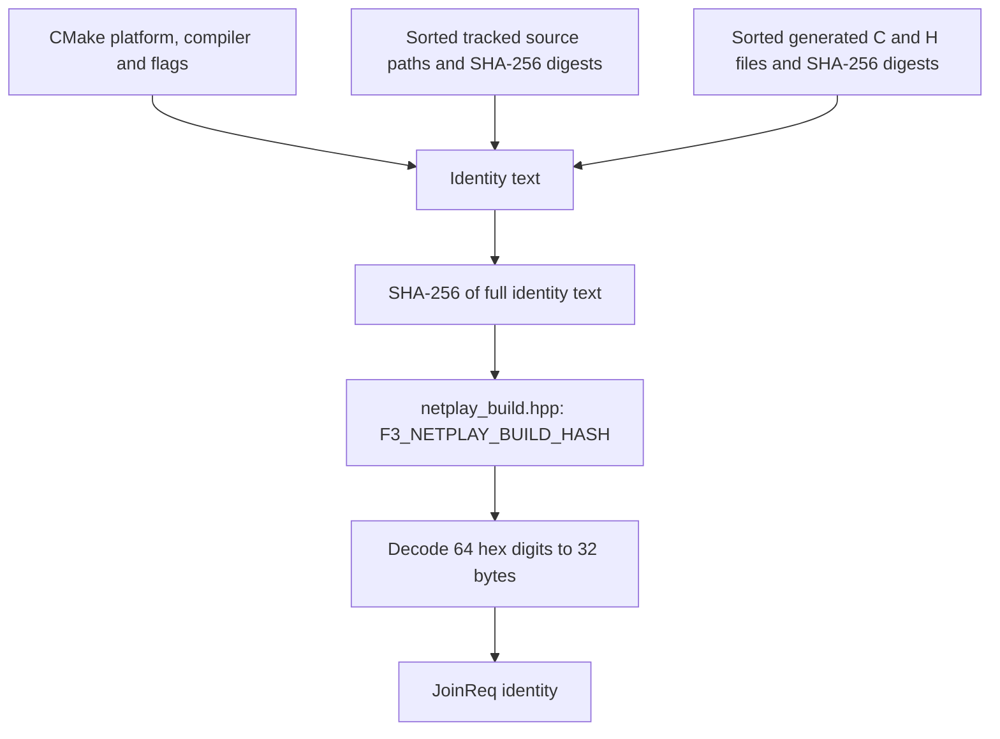

# Build identity

**What you will learn.** Learn what two clients compare before frame 0. Learn how CMake makes the build fingerprint. Use this page when a join fails or when you change simulation code.

Read [Determinism rules](/developer/netplay/determinism) first. For byte offsets, read [Wire protocol](/developer/netplay/protocol#identity-72-bytes).

## Why identity matters

Rollback sends inputs, not machine state. Equal inputs produce equal results only when both clients start with compatible code, data and state. The handshake refuses a mismatch before the game runs.

Identity is a compatibility check. It is not proof that a remote client is honest. CRC-32 is not a security hash. The relay cannot verify the state that a client claims.

## The identity record

`machine_identity(const Machine &, unsigned delay)` creates `Identity` in `runtime/netplay.cpp`. Its wire form has 72 bytes.

| Field | Size | Source of value |
| --- | ---: | --- |
| `rom_crc` | 7 × 4 bytes | CRC-32 of loaded regions, in order: `main`, `sprites`, `sprites_hi`, `tiles`, `tiles_hi`, `sound`, `samples` |
| `build_hash` | 32 bytes | Raw SHA-256 bytes decoded from `F3_NETPLAY_BUILD_HASH` |
| `settings` | 4 bytes | `0x10000u \| (bool(game_video) << 12) \| (bool(sound_native) << 13) \| delay` |
| `eeprom_crc` | 4 bytes | CRC-32 of 64 EEPROM words, each encoded high byte first |
| `initial_crc` | 4 bytes | `Machine::state_crc()` after configuration, before frame 0 |

The ROM CRCs describe the loaded regions. They are not CRCs of ZIP files or individual ROM filenames. The settings value marks schema revision 1 with `0x10000`. Bit 12 records GameVideo presence. Bit 13 records native sound presence. The delay is included without a separate mask. Normal callers validate delay as 0 to 8.

The initial CRC covers the canonical machine snapshot. It does not include ROM bytes, host pointers, sockets or diagnostic counters. The separate ROM CRCs cover the ROM data.

`JoinReq` also carries delay outside the identity record. The relay compares that field first. `MatchStart` returns the room baseline identity and delay. The client compares them again before it sets `ready()`.

## Cold boot and forbidden modes

The frontend builds identity after it selects the sound driver, enables GameVideo and registers generated main-CPU blocks. It does not run a frame while it waits for a match.

Both clients start with the erased 93C46 image: 64 words of `0xffff`. The game performs normal factory initialization. Netplay does not patch RAM, inject credits or load a boot snapshot.

The frontend requires these modes:

- Strict generated main CPU, with no interpreter fallback.
- GameVideo in `game` mode.
- Native sound CPU.
- Video scale 1 and border 0.
- No EEPROM persistence, sound trace or fallback report.

These restrictions avoid configuration paths outside the supported handshake contract. The core constructor separately checks frame 0, disabled fallback, no earlier fallback instructions, no sound trace and an empty audio queue. The headless oracle can test oracle sound and expanded snapshots. That does not make these modes supported in the player frontend.

See [Frontend integration](/developer/netplay/frontend-integration#configuration-gate) for the exact option checks.

## Fingerprint pipeline



CMake configures the source list. A build-time custom command runs `tools/netplay_build_id.cmake`. Runtime source changes can therefore update the hash without a new ROM-discovery or program-generation pass.

### Platform and compiler fields

`NETPLAY_IDENTITY` contains these CMake values in order:

1. `CMAKE_SYSTEM_NAME`, `CMAKE_SYSTEM_PROCESSOR`, `CMAKE_SIZEOF_VOID_P`.
2. C compiler ID and version, then C++ compiler ID and version.
3. `CMAKE_BUILD_TYPE`, C flags, C++ flags, C Release flags and C++ Release flags.
4. For `DEBUG`, `RELEASE`, `RELWITHDEBINFO` and `MINSIZEREL`: the configuration name, C flags and C++ flags.
5. `CMAKE_OSX_ARCHITECTURES`, `CMAKE_OSX_DEPLOYMENT_TARGET`, `CMAKE_SYSROOT`.

The fingerprint is deliberately conservative. A compiler version, platform or flag change can reject a match even when the actual game result would be equal. The project does not promise cross-platform snapshot compatibility.

### Source files

CMake recursively finds and sorts these paths relative to the source root:

```text
include/*.h       include/*.hpp
runtime/*.c       runtime/*.h       runtime/*.cpp       runtime/*.hpp
recomp/*.py       recomp/*.h        recomp/*.csv
games/*.toml
```

It also includes these explicit files:

```text
CMakeLists.txt
tools/compile_sound.py
tools/netplay_build_id.cmake
```

For each source, the script appends `;path:SHA256(file)` to the compiler identity text.

For each configured main and sound generated directory, the script finds direct-child `*.c` and `*.h` files. It sorts their relative names. It appends `;generated/name:SHA256(file)` for each file. The main directory is processed before the sound directory. The absolute generated directory path is not appended.

The script hashes the full text with SHA-256. It writes this generated header:

```cpp
#pragma once
#define F3_NETPLAY_BUILD_HASH "<64 lowercase hex digits>"
```

It does not rewrite the header when its content is unchanged. CMake lists the source and generated files as dependencies of the custom command. `f3rt` includes the output header as a private target source.

### What is not in the fingerprint

The fingerprint is not a hash of the executable file. It does not independently inspect every linker option, dependency version or environment value. The listed patterns include runtime third-party source under `runtime/`. They do not include relay Go files, documentation, the Python oracle runner or the oracle C++ source. ROM content has separate CRC fields.

When you add a new code or data directory that affects simulation, extend the identity input list. Do not assume that a Git revision identifies the build. The fingerprint does not use a commit ID or require a clean working tree.

## Mismatch diagnosis

The relay uses the first player as the baseline. For the second player, it checks delay, ROM CRCs, build hash, settings, EEPROM CRC and initial CRC in that order. It then checks slot availability.

| Reject | Action |
| --- | --- |
| Delay mismatch, code 9 | Set the same `--netplay-delay` on both clients. |
| ROM CRC mismatch, code 4 | Use the same supported loaded ROM set. |
| Build hash mismatch, code 5 | Use matching platform, compiler, flags, source and generated output. Rebuild both clients. |
| Settings mismatch, code 6 | Check the renderer, sound driver and delay. |
| EEPROM CRC mismatch, code 7 | Start with the same erased image. Do not add persistence to frontend netplay. |
| Initial CRC mismatch, code 8 | Compare configuration and cold-boot snapshot bytes. Do not bypass the check. |
| Invalid identity, code 13 | Check malformed payloads or changed identity during a known-nonce join retry. |

Read [Debugging a desync](/developer/netplay/debugging) to distinguish a handshake failure from a later state divergence.

## Source

- [Identity construction](https://github.com/ansxor/f3-recomp/blob/main/runtime/netplay.cpp).
- [CMake identity inputs](https://github.com/ansxor/f3-recomp/blob/main/CMakeLists.txt).
- [Build-time fingerprint script](https://github.com/ansxor/f3-recomp/blob/main/tools/netplay_build_id.cmake).
- [Public identity and transport API](https://github.com/ansxor/f3-recomp/blob/main/include/f3rt/netplay_transport.hpp).
