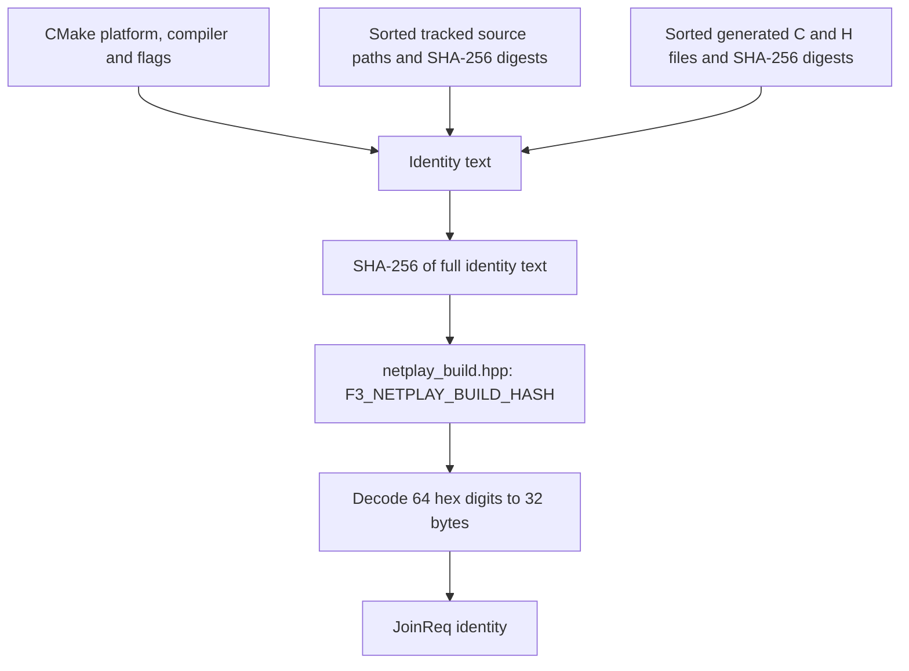

# Build identity

The join identity checks simulation compatibility before handoff, not equality of local histories. See [Determinism rules](/developer/netplay/determinism) and [Wire protocol](/developer/netplay/protocol).

## Why identity matters

Rollback exchanges inputs after the host transfers canonical state. Compatible code/data and the loaded host boundary are both required.

Identity is a compatibility check. It is not proof that a remote client is honest. CRC-32 is not a security hash. The relay cannot verify the state that a client claims.

## The identity record

`machine_identity(const Machine &)` creates `Identity` in `runtime/netplay.cpp`. Its wire form is 64 bytes.

| Field | Size | Source |
| --- | ---: | --- |
| `rom_crc` | 7 × 4 bytes | Loaded regions: `main`, `sprites`, `sprites_hi`, `tiles`, `tiles_hi`, `sound`, `samples` |
| `build_hash` | 32 bytes | SHA-256 bytes from `F3_NETPLAY_BUILD_HASH` |
| `state_format` | 4 bytes | Canonical representation and audio/video simulation compatibility |

EEPROM, initial-state CRC, presentation geometry and input delay are not identity fields. Join carries host/join role and requested delay separately; exactly one host is required and the host delay is authoritative. The host's fresh handoff snapshot replaces the guest's local state. Independent solo histories, EEPROM files and presentation settings are allowed.

Main execution remains strict native without fallback or sound tracing. A same-build match does not imply that arbitrary saves or third-party clients are safe or compatible.

## Fingerprint pipeline



CMake configures the source list. A build-time custom command runs `tools/netplay_build_id.cmake`. Runtime source changes can therefore update the hash without a new ROM-discovery or program-generation pass.

### Platform and compiler fields

`NETPLAY_IDENTITY` contains these CMake values in order:

1. `CMAKE_SYSTEM_NAME`, `CMAKE_SYSTEM_PROCESSOR`, `CMAKE_SIZEOF_VOID_P`.
2. C compiler ID and version, then C++ compiler ID and version.
3. `CMAKE_BUILD_TYPE`, C flags, C++ flags, C Release flags and C++ Release flags.
4. For `DEBUG`, `RELEASE`, `RELWITHDEBINFO` and `MINSIZEREL`: the configuration name, C flags and C++ flags.
5. `CMAKE_OSX_ARCHITECTURES`, `CMAKE_OSX_DEPLOYMENT_TARGET`, `CMAKE_SYSROOT`.

The fingerprint is deliberately conservative. A compiler version, platform or flag change can reject a match even when the actual game result would be equal. The project does not promise cross-platform snapshot compatibility.

### Source files

CMake recursively finds and sorts these paths relative to the source root:

```text
include/*.h       include/*.hpp
runtime/*.c       runtime/*.h       runtime/*.cpp       runtime/*.hpp
recomp/*.py       recomp/*.h        recomp/*.csv
games/*.toml
```

It also includes these explicit files:

```text
CMakeLists.txt
tools/compile_sound.py
tools/netplay_build_id.cmake
```

For each source, the script appends `;path:SHA256(file)` to the compiler identity text.

For each configured main and sound generated directory, the script finds direct-child `*.c` and `*.h` files. It sorts their relative names. It appends `;generated/name:SHA256(file)` for each file. The main directory is processed before the sound directory. The absolute generated directory path is not appended.

The script hashes the full text with SHA-256. It writes this generated header:

```cpp
#pragma once
#define F3_NETPLAY_BUILD_HASH "<64 lowercase hex digits>"
```

It does not rewrite the header when its content is unchanged. CMake lists the source and generated files as dependencies of the custom command. `f3rt` includes the output header as a private target source.

### What is not in the fingerprint

The fingerprint is not a hash of the executable file. It does not independently inspect every linker option, dependency version or environment value. The listed patterns include runtime third-party source under `runtime/`. They do not include relay Go files, documentation, the Python oracle runner or the oracle C++ source. ROM content has separate CRC fields.

When you add a new code or data directory that affects simulation, extend the identity input list. Do not assume that a Git revision identifies the build. The fingerprint does not use a commit ID or require a clean working tree.

## Mismatch diagnosis

The relay requires complementary host/join roles, matching ROM CRCs/build hash/state format and an available requested slot. Host delay is authoritative.

| Reject | Action |
| --- | --- |
| ROM CRC mismatch, code 4 | Use the same supported loaded ROM set. |
| Build hash mismatch, code 5 | Match platform, compiler, flags, source and generated output. |
| Snapshot format mismatch, code 6 | Match audio/video simulation configuration and state format. |
| Host/join role conflict, code 14 | Choose one host and one guest. |
| Invalid identity, code 13 | Check malformed payloads or changed identity in a nonce retry. |

Read [Debugging a desync](/developer/netplay/debugging) to distinguish a handshake failure from a later state divergence.

## Source

- [Identity construction](https://github.com/ansxor/f3-recomp/blob/main/runtime/netplay.cpp).
- [CMake identity inputs](https://github.com/ansxor/f3-recomp/blob/main/CMakeLists.txt).
- [Build-time fingerprint script](https://github.com/ansxor/f3-recomp/blob/main/tools/netplay_build_id.cmake).
- [Public identity and transport API](https://github.com/ansxor/f3-recomp/blob/main/include/f3rt/netplay_transport.hpp).
