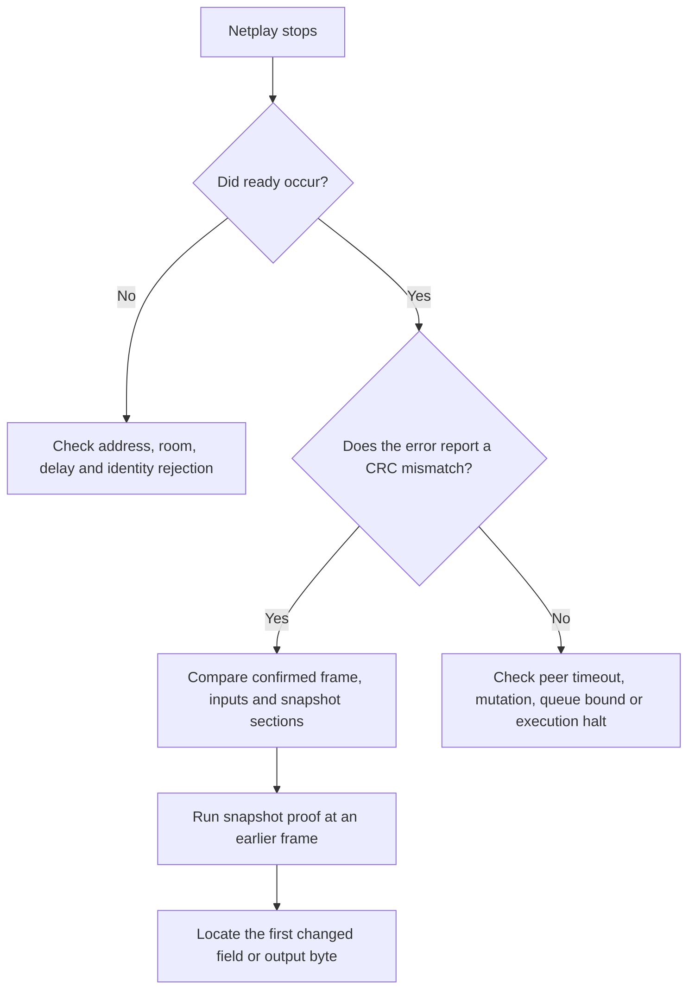

# Debugging a desync

**What you will learn.** Classify a netplay failure. Find the earliest wrong state without changing the compatibility or confirmation rules.

A desync means equal actual inputs produce different canonical state. A timeout, wrong room or build reject is not a desync.

## Classify the failure



Keep stderr from both clients and the relay start configuration. Keep the requested frame limit, delay, window, build configuration and input schedule. Do not disable a checksum or identity check to continue a broken match.

## Before the match starts

| Symptom | Check |
| --- | --- |
| `failed to resolve netplay server address` | Check host and port. The client splits at the last colon and does not strip IPv6 brackets. |
| `netplay handshake timeout` | Check the relay process, UDP firewall and reachability. A silent rate drop can also delay replies. |
| `netplay room wait timeout` | The total room wait exceeds the transport limit. Start a new attempt with a second player. |
| `requested slot already taken` | Use different requested players or automatic assignment. |
| `match already in progress` | A new nonce cannot join an active or finished room. Start a new room or wait for expiry. |
| ROM/build/state-format or role reject | Match simulation identity and choose one host/one guest. EEPROM/local history/presentation need not match. See [identity diagnosis](/developer/netplay/build-identity#mismatch-diagnosis). |

A join may be retried after packet loss. The client nonce makes these retries idempotent. The relay returns `MatchStart` again for a valid occupied nonce in an active room.

## During the match

| Error family | Meaning |
| --- | --- |
| `DESYNC at frame N: local CRC L remote CRC R` | Rollback compares canonical sync CRCs after N confirmed match-relative frames. Values are decimal. |
| `netplay desync detected at frame N` | Transport compares a received checksum with the local one. CRCs are hexadecimal. |
| `netplay finish CRC mismatch` | Finite end-state frame or CRC differs from the peer or server verdict. |
| `Peer changed previously received input` / `netplay input mutation detected` | A frame has two different actual controller words. Fix the sender; this is not prediction correction. |
| `Peer changed previously received checksum` | A repeated checksum frame has a different CRC. |
| `Netplay strict-native execution halted` | Main execution halts or uses interpreter fallback. Inspect the generated-code path. |
| `Confirmed audio queue full` | The frontend does not drain confirmed PCM during running or stalls. |
| `Checksum queue full` | The frontend does not drain core outgoing checksums. |
| `Rollback exceeded retained snapshot window` | A core invariant fails. Do not restore an arbitrary older state. |
| Peer silence or `MatchTerminated` | Session restores confirmed state and returns local. Ready a fresh Host/Join; same room allowed. |

Checksum frame N describes the state **before simulation frame N**, after N earlier frames run. It is not the input applied at frame N. Regular checks occur every 60 confirmed frames. A divergence can begin earlier than the first reported checksum.

## Find the first difference

1. Reproduce with matching build/ROM/simulation format, the actual negotiated host delay and input schedule.
2. Replay from the exact host `handoff.bin` for that match, with its match-index stream; compare to both clients. See [Oracle](/developer/netplay/oracle).
3. Determine whether the failure needs rollback. A clean-network reference difference suggests configuration or simulation divergence. A replay-only difference suggests missing state, a derived cache or an output-side effect.
4. Run snapshot proof before the failing frame. Select a small interval and an explicit replay depth:

```sh
build/f3rt-netplay-oracle --mode snapshot --seed 1 --frames 3000 --snapshot-interval 100 --snapshot-k 31 --sound-driver native
```

5. Read the first mismatch. The tool checks restored frame and CRC, memory arrays, pixels, PCM and sound trace bytes. A RAM mismatch reports an offset. The current RAM-offset error uses decimal conversion even though its text contains `0x`; verify the numeric value before using it as a hex address.
6. Compare the affected [snapshot section](/developer/netplay/snapshots#layout-and-size). Check both save and load visitors. Check queue order and derived-cache invalidation.
7. After a fix, rerun the same proof and then real-server parity. Verify the actual SDL surface separately if the change affects frontend behavior.

The snapshot API does not write a self-describing file. For local diagnostic byte comparison, save both machines at the same frame boundary with the same configuration into exact-size buffers. Use the published section offsets only for that configuration. Never exchange these diagnostic snapshots as netplay input.

## Common implementation causes

- A new state field is not visited on save or load.
- A retained sprite list, scene row or audio pipeline latch keeps its newer value after restore.
- A queue is saved in physical ring order instead of playback order.
- A host clock, random value or host pointer enters canonical state.
- A controller word is sampled again while the same simulation frame is stalled.
- Service, coin or test writes bypass synchronized input words.
- Speculative audio goes to SDL or WAV before confirmation.
- A diagnostic counter enters the state CRC and changes when replay does extra work.
- A new simulation source directory is not included in the build fingerprint.

Do not interpret all FDP fallback rendering as CPU fallback. Unsupported boot frames can use the established FDP rendering path while main-CPU execution remains strict native.

## Evidence and limits

A matching CRC is useful evidence, not collision-free identity. A seed controls controller input. A relay seed does not freeze OS packet arrival order. A final active-player flag can include character selection. Use visible captures for claims about sustained versus play.

Source: [runtime/netplay.cpp](https://github.com/ansxor/f3-recomp/blob/main/runtime/netplay.cpp), [runtime/netplay_transport.cpp](https://github.com/ansxor/f3-recomp/blob/main/runtime/netplay_transport.cpp), [tools/netplay_oracle.cpp](https://github.com/ansxor/f3-recomp/blob/main/tools/netplay_oracle.cpp).
