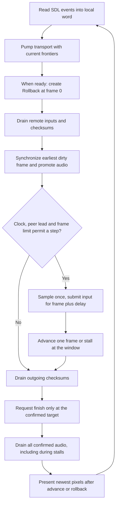

# Frontend integration

**What you will learn.** Learn how the SDL frontend connects controller input, transport and rollback. Learn which modes it accepts. Use the loop order as a model for another frontend.

The implementation is [runtime/frontend.cpp](https://github.com/ansxor/f3-recomp/blob/main/runtime/frontend.cpp). Read [Rollback engine](/developer/netplay/rollback) and [Transport](/developer/netplay/transport) for the two independent APIs.

## Start a pair

Start the relay. Use the same room and delay on both clients:

```sh
build/landmakr --netplay-server SERVER:9000 --netplay-room example --netplay-player 1 --netplay-delay 2
build/landmakr --netplay-server SERVER:9000 --netplay-room example --netplay-player 2 --netplay-delay 2
```

Replace `SERVER` with a reachable relay host. Omit `--netplay-player` for automatic assignment. CLI player 1 means wire slot 0. CLI player 2 means wire slot 1.

Each client runs the normal boot. Insert a coin on each client. Press start on each client. The game uses its normal challenge and character-selection flow. There is no netplay-only credit or game-mode patch.

## Configuration gate

Any of the four netplay options enables netplay validation. The frontend requires both `--netplay-server` and `--netplay-room`.

| Option | Behavior |
| --- | --- |
| `--netplay-server HOST:PORT` | Select the UDP relay. Transport uses port 9000 when the text has no colon. |
| `--netplay-room CODE` | Select a room. Transport requires 1 to 32 ASCII letters, digits, `_` or `-`. |
| `--netplay-player 1\|2` | Request a specific slot. Default is automatic (`TransportOptions::player = 0`). A taken requested slot fails; it does not fall back to automatic. |
| `--netplay-delay 0..8` | Schedule local input this many frames later. Default is 2. Both clients must agree. |

The frontend rejects netplay when any of these conditions is true:

- Main-CPU execution is not translated.
- `allow_fallback` is true.
- Video mode is not `game`.
- `GameVideoOptions::expanded()` is true: scale differs from 1 or border differs from 0.
- Sound driver is not `native`.
- An EEPROM persistence path is set.
- A sound-trace path or fallback-report path is set.

The `landmakr` target defaults to strict translated main CPU. When native sound is generated, native sound is the default. Strict `landmakr` selects GameVideo by default. Explicit diagnostic options can change these defaults, but the netplay gate still rejects incompatible modes.

The texture filter is a host presentation setting. `nearest` and `linear` are valid; the netplay gate does not reject `linear`. Muting host playback also does not disable emulated sound. The loop still drains confirmed audio.

`--frames N` selects a finite match. The frontend rejects `N >= UINT32_MAX - 1024`. A value of zero means no automatic frame limit. Headless mode requires a non-zero frame limit. Frame numbers do not wrap or resume in a new session.

## Controller state

SDL key events update one local active-high `InputWord`. They do not write a fixed player port in netplay mode.

| Key | Bit | Meaning |
| --- | ---: | --- |
| Up, Down, Left, Right | 0, 1, 2, 3 | Direction |
| Z, X, C | 4, 5, 6 | Button 1, 2, 3 |
| 1 or 2 | 7 | Start for the assigned local player |
| 5 or 6 | 8 | Coin for the assigned local player |
| F1 | 9 | Service for the assigned local player |
| F2 | 10 | Shared test switch |
| Escape | none | Quit the client |

A key-down sets a bit. A key-up clears it. Repeated SDL key-down events are ignored. Loss of window focus clears the whole local word. That neutral word enters the normal delayed-input path. The frontend does not directly clear the remote machine ports.

Both start keys are aliases of the same bit. Both coin keys are aliases too. They are not independent held-key counters: release of either alias clears its bit.

### Machine port mapping

`apply_inputs` resets `inputs[0..5]` to `0xffffffff` and `system_inputs` to `0xff`. It then applies both words. The underlying ports are active low.

For slot `p`, with `shift = 4 * p`:

- Direction bits 0 to 3 map to input port 1 at `word & 0xf`, shifted by `shift`.
- Button bits 4 to 6 map to input port 0 at `(word >> 4) & 7`, shifted by `shift`.
- Start maps to port 0 at `0x1000 << p`.
- Service maps to port 0 at `0x200 << p`.
- Coin clears `0x10 << p` in `system_inputs`.
- Test clears bit `0x02` in `system_inputs` if either player requests it.

All used bits travel through input history and rollback. A local-only coin, service or test write would violate this contract. Unknown bits outside `0x7ff` are errors.

## Loop order



The frontend constructs `Transport` with `machine_identity` before the loop. The machine stays at frame 0 during the join. After `ready()`, it constructs `Rollback` with the assigned slot and delay. It prints `netplay_ready player=... delay=...`.

Each pass gives all received inputs and checksums to rollback before synchronization. A rollback counts as a visual advance, even when no new frame runs. The frontend then refreshes the corrected image.

Call `local_input` only when `needs_local_input()` is true. A window stall can leave the same current frame across many loop passes. Sampling again would overwrite the scheduled input or throw an error.

`advance()` also synchronizes internally. The explicit earlier `synchronize()` is still needed: it repairs state and promotes confirmed output while pacing prevents a new step.

## Pacing

The F3 cadence is not 60 Hz:

```text
pixel_clock = 6,671,500
frame_pixels = 432 * 262 = 113,184
frame_rate = pixel_clock / frame_pixels ≈ 58.94384 Hz
```

After a successful step, the next deadline is:

```text
max(previous_deadline, now) + floor(1e9 * frame_pixels / pixel_clock) nanoseconds
```

The frontend does not run an unbounded burst to recover old wall-clock deadlines.

Transport reports frame advantage as the local advertised simulated frame minus the highest peer simulated frame received. The peer report is already one transit old. With throttling, the permitted lead is:

```text
2 + int(rtt_ms * pixel_clock / (2000 * frame_pixels) + 0.999)
```

The RTT term estimates one-way delay in frames. A step requires `frame_advantage() <= lead_limit`. With throttling disabled, the lead limit is 16 and the clock deadline is ignored. The rollback window still bounds prediction.

When transport exists and no visual advance occurs, the frontend sleeps for 1 ms. It continues to pump the socket, drain audio and update status on later passes. The offline `sleep_until` path is not used for netplay.

## Audio and presentation

The loop drains `Rollback::render_audio` until it returns zero. The local staging buffer has 8192 interleaved `int16_t` values, or 4096 stereo frames. WAV output and SDL playback both receive only these confirmed samples. This drain also runs during a prediction-window stall and with host audio muted.

The rollback core runs device mixing and rendering on every replayed frame. It never presents intermediate frames. The frontend uploads the latest GameVideo presentation after the entire repair or step. The native netplay image remains 320 × 232.

Frame dumps can run after a rollback because the `advanced` flag includes a correction. A dump or screenshot is a diagnostic observation, not state sent to the peer.

## Status and errors

The window title updates every 250 ms. The connecting status contains the room code. Connected status contains:

- Zero-based assigned `slot`.
- Smoothed `rtt` in milliseconds.
- `adv`, the frame advantage.
- `sim`, the simulated frame last passed to `pump`.
- `ack`, the highest local input frame acknowledged by the peer.
- `[finished]` after the server verdict.

The frontend appends integer `ping` and the last rollback depth as `rollback`. The last depth is not reset on each normal frame. The ACK is an input-delivery frontier, not the confirmed-machine frontier.

The netplay loop catches a fatal exception. In graphical mode it shows an SDL dialog titled `Netplay stopped`. The outer handler prints `f3rt: ...` on stderr and returns 1. Headless mode has no dialog.

## Finite completion and shutdown

For `--frames N`, stop stepping at N. Continue to receive input until `confirmed_frame() == N`. Call `finish(N, m.state_crc())` once. Continue pumping until `finished()` is true. The server verdict, not a peer finish ACK, ends the loop.

Escape or window close exits without waiting for confirmation. The transport destructor sends Leave code 0 when still connected but not finished. A successful finite match sends code 1. No hot resume or snapshot transfer occurs after disconnect.

See [Relay server](/developer/netplay/server#finish-records-and-the-verdict) for verdict retention. For an implementation checklist, read [Write a compatible client](/developer/netplay/writing-a-client).
