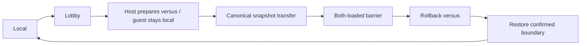

# Frontend integration

The SDL frontend owns host events/pacing/presentation. `Session` owns netplay lifecycle and connects `Transport` to `Rollback`. Start with the [user workflow](/guide/netplay); the CLI and menu share that lifecycle.

## Configuration gate

CLI entry uses `--netplay-host` or `--netplay-join`, server and room. Menu Host/Join marks ready. Main execution must be strict native without fallback or sound tracing. A previous local frame count, EEPROM file or expanded presentation is not a reason to reject a session. Identity checks ROMs, build and canonical audio/video representation, not initial state or presentation. Host role is independent of player slot; host delay (0–8, default 2) is authoritative.

## Lifecycle and loop order

Preparation uses ordinary coin/start/confirmation edges, automatically generated by `Session`, without RAM patches. Japan 2.01J handoff needs the versus latch at `$401f6e == 1`, both active low flags `($401f53 & 3) == 3`, and selection flags `($401f53 & 0xc0) != 0`. Tutorial/demo low flags alone are insufficient. Preparation is bounded to 3600 frames.

Each loop pumps the session, drains remote inputs/checksums and synchronizes before stepping. Sample local input once per scheduled frame; bounded stalls must still pump sockets and drain confirmed audio. Present only the latest corrected image. The native cadence is `6671500 / (432 * 262)`, about 58.94 Hz, not 60 Hz.

Guest handoff preserves a full local snapshot until the transfer is accepted. Network state loads with `load_sync_state` into its own geometry. Both-loaded acknowledgement is required before constructing rollback. Match-relative frame zero corresponds to the host snapshot's absolute machine time.

A confirmed natural exit or disconnect restores the last confirmed boundary before local return. A failed pre-barrier guest load restores its previous local state. A new session uses a fresh snapshot, including in the same room; it does not reconnect into the old rollback timeline.

## Input, menu and audio

`InputMapper` provides two offline profiles; network stepping uses local profile P1 for the assigned slot. Defaults and remapping are in [Controls and options](/guide/running). No `1`/`2` or `5`/`6` netplay aliases remain. All 11 input bits, including service/test/coin, use delayed history; test is shared.

F1 pauses solo, not network simulation, and neutralizes local P1 while open. Capture/focus loss releases held controls and suppresses them until physical release. F12 captures PNG; the overlay is not part of the postprocess image. Explicit Save preferences writes settings; CLI overrides loaded values.

Accurate/native audio drains only confirmed PCM, even while stalled or muted. HLE uses a separate non-rewound reconciliation path; do not treat it as PCM-equivalent to accurate audio. Host volume and GPU postprocess never alter canonical checksums.

## Sources and evidence

- [Session implementation](https://github.com/ansxor/f3-recomp/blob/main/runtime/netplay_session.cpp)
- [SDL frontend](https://github.com/ansxor/f3-recomp/blob/main/runtime/frontend.cpp)
- [ImGui, shaders and lifecycle evidence](https://github.com/ansxor/f3-recomp/blob/main/docs/developer/IMGUI-NETPLAY.md)
- [HLE audio design](https://github.com/ansxor/f3-recomp/blob/main/docs/developer/HLE-AUDIO.md)
