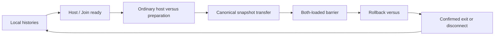

# How netplay works

Land Maker Japan 2.01J (`landmakrj`) runs locally until a versus session is ready. Two clients run the same simulation; the Go UDP relay routes a fresh host snapshot, then inputs and checksums. It does not emulate the game or stream video.

## Lifecycle

Exactly one host supplies state and input delay; role is independent of player slot. Preparation automatically uses ordinary coin/start/confirmation inputs, not RAM patches. The versus latch and both-active/selection flags distinguish genuine entry from tutorial/demo. A confirmed natural exit or disconnect restores confirmed state before local return. Rematches use a fresh handoff, including in the same room, without restarting.

## Canonical state and rollback

Full `Machine::save_state` includes expanded presentation buffers for local slots/replay. `save_sync_state` retains hardware, native pixels and rendering/trails but omits expanded presentation buffers. The guest restores canonical state into its own geometry. Valid save/load paths allocate no memory; parsers validate unsafe fields as well as byte count.

`Rollback` starts at match-relative frame zero with host absolute time retained as `origin_frame`. It predicts repeat-last remote input, stores full local snapshots including expanded presentation, and replays wrong predictions. Network CRCs hash canonical sync state, so geometry can differ. Only confirmed boundaries release accurate PCM/checksums. The default window is 16 (allowed 16–32), host delay is 2 (allowed 0–8); history capacity is not a latency guarantee.

Identity checks seven loaded ROM region CRCs, the build fingerprint and canonical audio/video state format. It does not compare EEPROM, initial-state CRC, requested delay or presentation settings. Main execution remains strict native, with no interpreter fallback or sound tracing.

## Layers and source map

| Layer | Source | Ownership |
| --- | --- | --- |
| Frontend/menu/input | `runtime/frontend.cpp`, `frontend_ui.cpp`, `frontend_settings.cpp` | SDL, ImGui, preferences, profiles, pacing/output |
| Lifecycle | `runtime/netplay_session.cpp` | Lobby, preparation, handoff, barrier and local return |
| Rollback | `runtime/netplay.cpp`, `include/f3rt/netplay.hpp` | Relative history, prediction, full local snapshots, canonical CRCs and confirmed outputs |
| Transport | `runtime/netplay_transport.cpp`, `include/f3rt/netplay_transport.hpp` | Protocol v2, bounded reliable transfer/input/checksum traffic |
| Machine state | `runtime/machine.cpp`, `runtime/state_io.hpp` | Full/local and canonical/sync representations and validation |
| Relay | `netplay/server/` | Roles/slots, endpoints, transfer/barrier, retained finish verdict, rematch retirement |

F1 pauses solo, not network simulation, and neutralizes local P1 while open. Network input uses the local P1 profile for the assigned slot. Volume, presentation geometry and GPU shaders remain host-local. HLE has separate non-rewound reconciliation; accurate PCM equivalence is not claimed.

## Reading map

- [User workflow](/guide/netplay), [controls/preferences/slots](/guide/running), [GPU shaders](/guide/video#f1-shaders-and-live-controls)
- [Snapshots](/developer/netplay/snapshots), [determinism](/developer/netplay/determinism), [rollback](/developer/netplay/rollback)
- [Transport](/developer/netplay/transport), [protocol](/developer/netplay/protocol), [relay](/developer/netplay/server), [identity](/developer/netplay/build-identity)
- [Frontend integration](/developer/netplay/frontend-integration), [compatible client](/developer/netplay/writing-a-client), [debugging](/developer/netplay/debugging), [limits/security](/developer/netplay/limits)
- [Detailed implementation and observed evidence](https://github.com/ansxor/f3-recomp/blob/main/docs/developer/IMGUI-NETPLAY.md), [HLE audio](https://github.com/ansxor/f3-recomp/blob/main/docs/developer/HLE-AUDIO.md)
