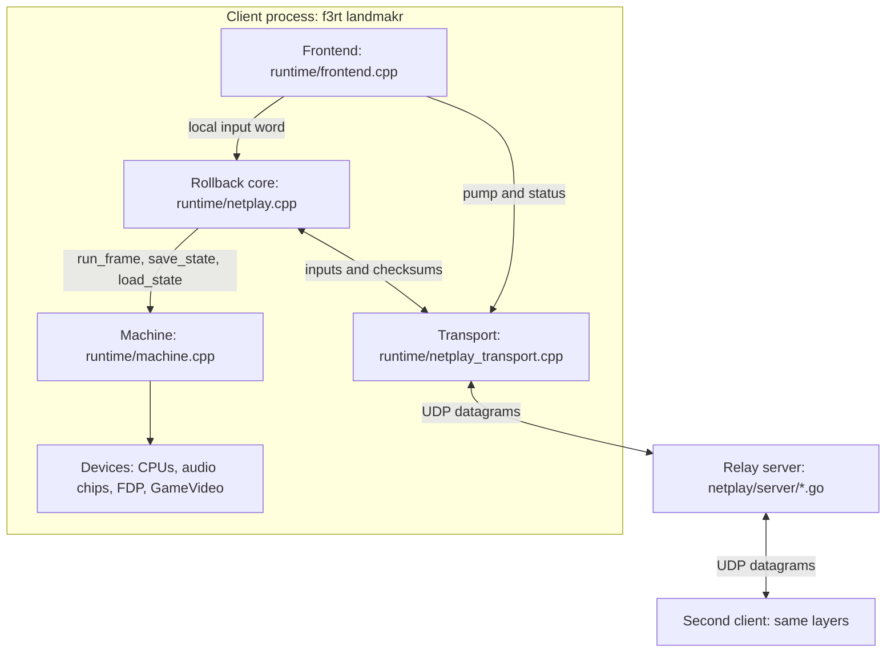
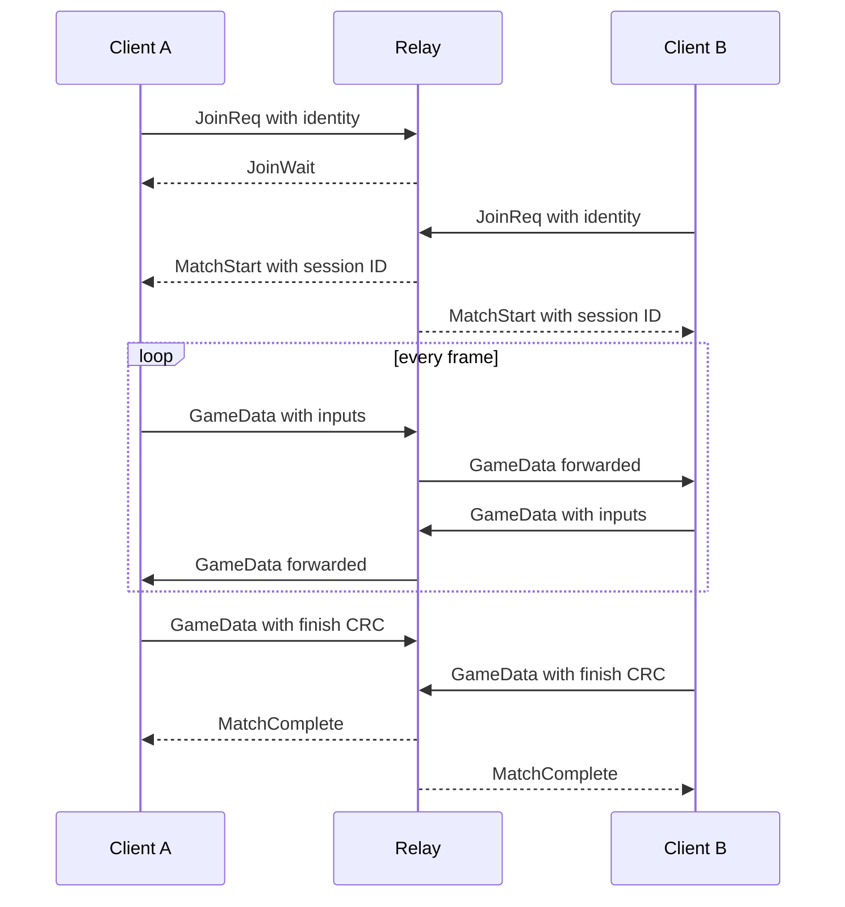

# How netplay works

**What you will learn.** This page explains the full netplay design in one place. You learn why the project uses rollback netcode. You see the layers, the files, and the main constants. Later pages give the details of each layer.

Netplay in this project is a two-player, opt-in mode for Land Maker (`landmakrj`). Two clients run the whole game on their own computers. They send only controller inputs to each other through a small relay server. The relay never runs the game.

## The problem in plain words

Two people play the same game on two computers. Each computer must show the same game. The network is slow. A message from the other player arrives many frames late.

There are two simple solutions. Both have a problem.

| Approach | How it works | Problem |
| --- | --- | --- |
| Lockstep | Each computer waits for the input of the other player before it runs a frame. | The game stops when the network is slow. |
| Server runs the game | A server runs the game and sends video to the players. | The server needs the ROMs and much CPU. The picture is late for every player. |

Rollback netcode is a third approach. It keeps the game fast and keeps both computers equal.

## The idea: rollback

Each client does the following steps for every frame.

1. The client reads the local controller.
2. The client sends the local input to the other client.
3. The client does not wait for the remote input. It **predicts** the remote input. The prediction is "the player holds the same buttons as in the last known frame".
4. The client runs the frame with the prediction.
5. When the real remote input arrives, the client compares it with the prediction.
6. If the prediction was right, nothing happens.
7. If the prediction was wrong, the client goes back to the state before the wrong frame. This step is the **rollback**. Then the client runs the frames again with the real input. This step is the **resimulation**.

The player sees only the last simulated frame. A wrong prediction shows for a short time and then the correction replaces it.

## Why rollback needs determinism

Both clients must reach exactly the same machine state for the same inputs. This property is **determinism**. If one bit differs, the two games slowly move apart. This failure is a **desync**.

The project guards determinism in four ways:

- The simulation uses integer machine clocks and no host time or random source. Some audio state uses `float`, so build compatibility remains important.
- The main CPU is statically recompiled. The interpreter is not allowed as a fallback in netplay.
- Both clients must run the same build with the same ROMs. The handshake checks this. See [Build identity](/developer/netplay/build-identity).
- A checksum of the full machine state is compared every 60 confirmed frames. A difference stops the match with a clear error. See [Determinism rules](/developer/netplay/determinism).

## Why rollback needs snapshots

A rollback goes back to an earlier frame. The program must have a copy of the complete machine state for that frame. This copy is a **snapshot**.

`Machine::save_state` writes a snapshot. `Machine::load_state` restores it. The rollback engine keeps a ring of 17 snapshots. A snapshot takes 4,231,509 bytes in the default netplay configuration. See [Snapshots](/developer/netplay/snapshots).

## Layers

The design has five layers in the client and one relay server.

Each layer has one job.

| Layer | Source file | Job |
| --- | --- | --- |
| Frontend | `runtime/frontend.cpp` | Reads keys. Paces the frames. Draws the picture. Plays the audio. Shows the title text. Runs the loop that connects the other layers. |
| Rollback core | `runtime/netplay.cpp`, `include/f3rt/netplay.hpp` | Holds input history, snapshots and checksums. Predicts, rolls back and resimulates. Has no SDL and no socket code. |
| Transport | `runtime/netplay_transport.cpp`, `include/f3rt/netplay_transport.hpp` | Talks to the relay over UDP. Does the handshake. Sends inputs and checksums with acknowledgements. Measures round-trip time. |
| Machine | `runtime/machine.cpp`, `runtime/state_io.hpp` | Runs one frame. Saves and loads the full state. |
| Relay server | `netplay/server/*.go` | Pairs two clients in a room. Checks their identity. Forwards their packets. Records the final verdict. |

The rollback core and the transport do not know each other. The frontend moves data between them. This split lets the oracle tool test the rollback core and the transport without SDL. See [Oracle and verification](/developer/netplay/oracle).

## Source map

| Path | Content |
| --- | --- |
| `include/f3rt/netplay.hpp` | `Rollback` class, `InputWord`, `apply_inputs`, `machine_identity` |
| `include/f3rt/netplay_transport.hpp` | `Transport` class, `Identity`, `Input`, `Checksum`, `TransportOptions` |
| `runtime/netplay.cpp` | Rollback implementation |
| `runtime/netplay_transport.cpp` | Transport implementation and wire code |
| `runtime/state_io.hpp` | `StateWriter`, `StateReader` and the packed `Canonical*` records |
| `runtime/state_oracle.h`, `runtime/core_state.c` | Packed record and export/import code for the Musashi sound CPU |
| `runtime/machine.cpp` | `Machine::save_state`, `load_state`, `state_size`, `state_crc` |
| `runtime/frontend.cpp` | Netplay command-line flags and the main loop |
| `netplay/server/` | Go relay: `protocol.go`, `room.go`, `server.go`, `impairment.go`, `main.go` and tests |
| `tools/netplay_oracle.cpp`, `tools/run_netplay_oracle.py` | Verification tools |
| `tools/gameplay_inputs.hpp` | Deterministic two-player input schedule used by the oracle |
| `tools/netplay_build_id.cmake`, `CMakeLists.txt` | Build fingerprint generator |
| `docs/NETPLAY.md` | Original design and evidence document |

The full documents are on GitHub: [docs/NETPLAY.md](https://github.com/ansxor/f3-recomp/blob/main/docs/NETPLAY.md) and [docs/developer/ABI-CHANGES.md](https://github.com/ansxor/f3-recomp/blob/main/docs/developer/ABI-CHANGES.md).

## A connection in short

The [Transport](/developer/netplay/transport) page and the [Wire protocol](/developer/netplay/protocol) page describe each message.

## A frame in short

For each loop pass the frontend does these actions in this order:

1. `Transport::pump` reads and sends UDP packets.
2. The frontend gives all new remote inputs and checksums to `Rollback`.
3. `Rollback::synchronize` repairs wrong predictions and confirms frames.
4. If the clock allows, the frontend samples the local input. `Rollback::local_input` assigns it to frame `frame + delay`. `Transport::submit` sends it.
5. `Rollback::advance` runs one new frame, unless the prediction window is full.
6. New checksums go from `Rollback` to `Transport`.
7. The frontend plays only **confirmed** audio and draws the newest simulated picture.

The [Rollback engine](/developer/netplay/rollback) page explains each step.

## Key numbers

| Item | Value | Source |
| --- | --- | --- |
| Players | 2 | `netplay/server/room.go` |
| Input delay | 0 to 8 frames, default 2 | `runtime/frontend.cpp` |
| Prediction window | 16 frames (the `Rollback` constructor accepts 16 to 32) | `runtime/netplay.cpp` |
| Snapshots in the ring | window + 1 = 17 | `runtime/netplay.cpp` |
| Snapshot size, native sound | 4,231,509 bytes | computed from `Machine::state_size` |
| Checksum interval | every 60 confirmed frames | `Rollback::checksum_interval` |
| Input word | 11 bits: mask `0x7ff` | `include/f3rt/netplay.hpp` |
| Input history in `Rollback` | 1024 frames | `Rollback::history_size` |
| Packet size limit | 1400 bytes | both sides |
| Protocol version | 1 | both sides |
| Frame rate | `6671500 / (432 * 262)`, about 58.94 frames per second | `Machine::pixel_clock`, `Machine::frame_pixels` |

## What netplay does not do

- It does not send state over the network. Clients never load a snapshot from a peer.
- It does not support more than two players, spectators, encryption, accounts or anti-cheat.
- It does not resume a match after a disconnect. Both clients must start a new match from frame zero.

See [Limits and security](/developer/netplay/limits) for the full list.

## Reading order

1. Read [Determinism rules](/developer/netplay/determinism) to learn why the same inputs must give the same state.
2. Read [Snapshots](/developer/netplay/snapshots) and [Rollback engine](/developer/netplay/rollback) for machine ownership, prediction, replay and confirmed output.
3. Read [Build identity](/developer/netplay/build-identity), [Transport](/developer/netplay/transport) and [Wire protocol](/developer/netplay/protocol) for handshake and reliability.
4. Read [Relay server](/developer/netplay/server) and [Frontend integration](/developer/netplay/frontend-integration) for the complete process lifecycle.
5. Read [Oracle and verification](/developer/netplay/oracle) and [Limits and security](/developer/netplay/limits) before you change or deploy the system.

Use [Write a compatible client](/developer/netplay/writing-a-client) as an integration checklist. Use [Debugging a desync](/developer/netplay/debugging) after a failure.

## Pages in this section

| Page | Topic |
| --- | --- |
| [Determinism rules](/developer/netplay/determinism) | What makes the emulation repeatable and how the project proves it |
| [Snapshots](/developer/netplay/snapshots) | The canonical state format, size and inventory |
| [Rollback engine](/developer/netplay/rollback) | Prediction, ring, resimulation, stalls, checksums and audio |
| [Transport](/developer/netplay/transport) | The client network layer |
| [Wire protocol](/developer/netplay/protocol) | Exact packet layouts |
| [Relay server](/developer/netplay/server) | Rooms, sessions, limits and the impairment simulator |
| [Frontend integration](/developer/netplay/frontend-integration) | Keys, delay, pacing, title text and forbidden modes |
| [Build identity](/developer/netplay/build-identity) | The build fingerprint |
| [Oracle and verification](/developer/netplay/oracle) | The test tools and the acceptance results |
| [Debugging a desync](/developer/netplay/debugging) | Error messages and how to find the cause |
| [Write a compatible client](/developer/netplay/writing-a-client) | A step-by-step guide |
| [Limits and security](/developer/netplay/limits) | Bounds, performance, and what is missing |

For the player view of this feature, read [Online play](/guide/netplay). For the command-line flags, read the [command-line reference](/reference/cli).
