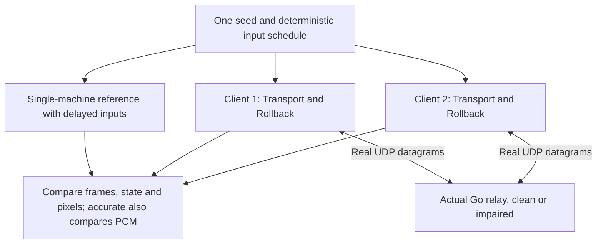

# Oracle and verification

**What you will learn.** Learn how the headless oracle tests snapshots and complete matches. Learn which results the runner accepts. Distinguish recorded evidence from a guarantee about every machine or network.

The tools are [tools/netplay_oracle.cpp](https://github.com/ansxor/f3-recomp/blob/main/tools/netplay_oracle.cpp) and [tools/run_netplay_oracle.py](https://github.com/ansxor/f3-recomp/blob/main/tools/run_netplay_oracle.py). The deterministic controller schedule is [tools/gameplay_inputs.hpp](https://github.com/ansxor/f3-recomp/blob/main/tools/gameplay_inputs.hpp).

## What an oracle means here

An oracle is a reference result. The network oracle runs the same strict-native machine once with both actual input streams and no prediction. It compares two real rollback clients with that reference.

The reference does not prove that the emulator matches original hardware. It checks that rollback and network timing do not change canonical game state and pixels; the accurate backend also checks PCM. Separate interpreter, sound and video parity tools address emulation accuracy.

Audio defaults to `--audio-backend accurate`. Reference and client modes also support opt-in `--audio-backend hle`; both peers must choose the same backend. Accurate compares confirmed PCM as well as game state and pixels. HLE compares canonical game state and pixels, not worker state or PCM: its independent worker intentionally follows speculative command history. See the [HLE worker policy](https://github.com/ansxor/f3-recomp/blob/main/docs/HLE-AUDIO.md#runtime-and-rollback-contract).



## Build prerequisites

Use a build with generated Land Maker main-CPU blocks. Accurate/native sound requires generated sound blocks too; HLE does not execute them. The oracle accepts only `landmakrj`. It disables main-CPU fallback and uses `GameVideoMode::Game`.

From the repository root, build the required targets:

```sh
cmake -S . -B build -G Ninja -DCMAKE_BUILD_TYPE=Release -DF3_ROM_DIR=../roms/landmakr
cmake --build build --target landmakr f3rt-netplay-oracle
(cd netplay/server && go build -o ../../build/netplay-server .)
```

Set the ROM path for your checkout. ROMs and generated output are local build inputs. The relay needs no ROMs.

## C++ tool modes

| Mode | Purpose |
| --- | --- |
| `snapshot` | Accurate only: save, replay, restore and replay again. Check outputs and save/load allocation counts. Also report performance. `snapshot-proof` is an accepted alias. |
| `reference` | Accurate or HLE: run both actual controller streams on one machine, with the requested input delay. This is the default mode. |
| `client` | Accurate/native or HLE: join the real relay. Run one assigned player with `Transport` and `Rollback`. Wait for the server completion verdict. |

The tool returns 0 on success. A caught failure prints `ORACLE ERROR: ...` on stderr and returns 1.

### Tool options and defaults

| Option | Default | Meaning |
| --- | --- | --- |
| `--rom-dir DIR` | Compiled `F3RT_DEFAULT_ROM_DIR`, if set | ROM directory; otherwise required |
| `--set SET` | `landmakrj` | Other sets fail |
| `--mode MODE` | `reference` | Select a mode |
| `--seed N` | 12345 | Controller schedule seed |
| `--frames N` | 20000 | Target frame count; must be positive |
| `--server ADDR` | `127.0.0.1:9000` | Client relay |
| `--room NAME` | `oracle_room` | Client room |
| `--player 1\|2` | 0 | Required in client mode |
| `--delay N` | 2 | Reference and client input delay |
| `--window N` | 16 | Client rollback window; constructor accepts 16 to 32 |
| `--audio-backend MODE` | `accurate` | `accurate` or `hle`; HLE supports reference/client, not snapshot proof, and rejects explicit `--sound-driver` |
| `--sound-driver MODE` | `native` | Accurate only: `native`, `oracle`; `all` runs both in snapshot mode |
| `--wav FILE` | none | Optional client output capture: confirmed accurate PCM or speculative HLE PCM |
| `--schedule MODE` | `versus` | `single` disables player 2 activity; other strings select versus in the current implementation |
| `--video-scale N`, `--video-border N` | 1, 0 | Configure GameVideo; useful for snapshot coverage, not supported player netplay modes |
| `--surface FILE.bmp` | none | Final native framebuffer BMP; `--capture-surface` is an alias |
| `--dump-dir DIR` | none | Machine dumps and available sample images |
| `--dump-every N` | 0 | Additional reference-mode sample interval; zero disables it |
| `--snapshot-interval N` | 1000 | Snapshot test points; must be positive in snapshot mode |
| `--snapshot-k N` | 0 | Zero selects depths 1, 7, 16, 31, 97; positive selects one depth |
| `--timeout SEC` | 120 | Client handshake, no-progress and finish watchdog intervals |
| `--unthrottled` | off | Use thread yield instead of the 200 µs stall sleep; not a player-rate pacing mode |
| `--stall-at FRAME`, `--stall-ms MS` | 0, 0 | One complete pause, including network pumping |
| `--withhold-input-at F`, `--withhold-input-ms MS` | 0, 0 | One pause of local sampling/submission while receive and synchronization continue |
| `--observe-event-at F` | 0 | Attribute corrections and full-window stalls near a test event |
| `--corrupt-build-hash` | off | Flip the first hash byte with `0xff` to test rejection |

## Snapshot proof

Run the accurate backend's native and interpreted-sound snapshot proof. HLE rejects this mode because its worker is not restored:

```sh
build/f3rt-netplay-oracle --mode snapshot --frames 6000 --seed 1 --sound-driver all
```

Test points are frame 0 and every positive interval below the frame limit. Default depths are `K = {1, 7, 16, 31, 97}`. A depth is skipped if `N + K` exceeds the limit. At each test point:

1. Save the machine into a preallocated exact-size buffer. Count allocations during that call.
2. Clone the input schedule. Run K frames with strict-native main CPU. Drain and retain PCM. Write a complete sound trace.
3. Save the final state CRC and copies of RAM, palette, graphics, control, shared memory and pixels.
4. Restore the original snapshot. Count allocations during this load. Check restored frame and immediate state CRC.
5. Reset the schedule clone. Replay K frames with identical inputs. Sleep for 1 ms at `k == K / 2` to change host timing.
6. Compare state CRC, all listed memory arrays, pixels, PCM and non-empty sound-trace bytes.
7. Restore the test-point snapshot again. Continue the outer run.

The tool fails on a tracked save/load allocation. Tracking wraps the measured save and first load for each comparison, not the entire run. The override counts scalar `operator new(size_t)` calls. It is not a general allocator profiler for arbitrary direct `malloc` or every allocation API.

The full snapshot is compared through CRC-32. The listed memory and output arrays are compared byte for byte. Do not describe CRC equality as a mathematical proof of byte equality for every possible state. The checksum can collide.

Temporary per-process trace directories are removed by an RAII cleanup object. Without `--dump-dir`, the temporary base is `build/tmp_snapshots`. The tool can allocate and write files outside the measured save/load calls.

### Performance fields

`SUCCESS snapshot_proof` reports `checks`, `state_size`, save/load mean, p95 and maximum, step timing, step FPS, affordable depth, save/load allocation totals and wall-clock perturbation count. It also reports final state, framebuffer and cumulative audio CRCs.

The affordable depth calculation uses a 16,666.67 µs budget:

```text
(D + 1) * (step_us + save_us) + load_us <= 16666.67
```

It reports a non-negative integer depth from mean, p95 and maximum measurements. The F3 frame cadence is about 58.94 Hz, but this calculation deliberately uses the stricter 60 Hz budget. It excludes transport, SDL, scheduling and periodic checksum cost. It is not a guarantee that the maximum rollback window fits one display interval.

Step measurements start at frame 1200. They include machine execution, rendering, audio drain and the harness PCM checksum. They exclude input scheduling, snapshot-proof trace passes and the final full-state CRC. The p95 helper sorts samples and chooses index `floor(0.95 * count)`, capped at the last index.


## Reference and client semantics

At simulation frame `f`, the reference uses neutral inputs if `f < delay`. Otherwise it applies `schedule.step(f - delay)`. A client samples at frame `f` and assigns the word to `f + delay`. These two rules produce the same applied stream.

Clients stop stepping exactly at the target. They continue receiving until the target is confirmed. Accurate drains all confirmed audio; HLE drains its independent speculative stream. Clients compute the final canonical state CRC and call `Transport::finish`. They pump until the retained server verdict matches that frame and CRC. This prevents an apparent pass that exits with speculative game state.

The client timeout is not a whole-match duration limit. In the simulation loop it measures time since progress. The tool also has handshake and finish watchdogs. Transport has its own 10-second no-server-reply, 120-second room-wait and 8-second peer-silence limits.

## Input schedule

The versus schedule follows the normal boot and game flow:

- Player 1 coin is held at sampled frames 700 to 719.
- Player 2 coin is held at sampled frames 740 to 759.
- Start pulses occur from 800 through 2399. Player 1 uses `f % 90 < 5`. Player 2 uses `45 <= f % 90 < 50`.
- At frame 1200 and every sixth frame after it, each player changes one of seven direction/button bits.
- Player 1 starts with the supplied seed. Player 2 starts with `seed ^ 0x9e3779b97f4a7c15`.
- Both streams use 64-bit wraparound LCG: `rng = rng * 6364136223846793005 + 1442695040888963407`.
- `(rng >> 33) % 7` selects a bit. `(rng >> 20) & 1` selects its state.

With delay 2, applied inputs occur two frames after these sampled frames. The schedule is deterministic. Packet arrival order is not.

## Python runner

Run the combined suite:

```sh
python3 tools/run_netplay_oracle.py --suite all --frames 20000 --seeds 1 2 3 5 --sound-driver all
```

To reproduce the recorded eight-seed impairment coverage:

```sh
python3 tools/run_netplay_oracle.py --suite impaired --frames 20000 --seeds 1 2 3 5 8 13 21 34
```

The runner launches the actual Go server and two separate C++ client processes. It picks a free loopback UDP port and waits for `Relay Server listening on` in the server output. It does not replace the network with an in-process mock.

The Python runner below exercises the default accurate backend; it does not expose an HLE backend option. Use the C++ reference/client modes for HLE scenarios. Optional client WAV captures are listening/inspection artifacts, not HLE peer-parity inputs.

| Runner option | Default |
| --- | --- |
| `--oracle-bin` | `build/f3rt-netplay-oracle` |
| `--server-bin` | `build/netplay-server` |
| `--rom-dir` | Omitted; use the binary default |
| `--seeds` | 1, 2, 3, 5 |
| `--frames` | 20000 |
| `--delay`, `--window` | 2, 16 |
| `--sound-driver` | `native` |
| `--suite` | `all`; choices: `all`, `snapshot`, `baseline`, `impaired`, `cases` |
| `--dump-captures-dir` | none |
| `--log-dir` | `build/netplay_logs` |

Snapshot runs use `min(frames, 6000)` and interval 1000. `--sound-driver all` runs oracle and native sound snapshots, then uses native sound for network suites. Edge cases always use native sound and their own frame counts and settings.

### Acceptance rules

The runner parses fields from `SUCCESS` lines. Its accurate-backend baseline and impaired matches require:

1. Both client processes exit successfully.
2. The reference and both clients report exactly the requested frame count.
3. Non-empty `final_crc`, `frame_crc`, `audio_crc` and `audio_samples` values exist in all three results.
4. Each of these values matches across all three results.

`audio_samples` counts stereo frames, not individual left/right samples. A non-empty CRC string can represent CRC zero; the runner does not require a non-zero CRC or audible sound.

The impaired suite uses 80 ms RTT, ±20 ms jitter, 3% loss and 3% reorder, with the schedule seed also used as relay impairment seed. It passes only if at least one client reports a rollback. It does not require a rollback in both clients. This suite does not enable duplication.

The snapshot runner requires successful exit and a non-empty final CRC. The C++ tool performs the actual per-check assertions. The runner does not independently recalculate them.

### Edge cases

| Case | Injection and acceptance |
| --- | --- |
| Late input | Seed 12345, 3000 frames, delay 2, window 16. Client 1 withholds at 1500 for 120 ms. Require begin/end markers, peer event rollback and non-zero depth, event stall at least 20 ms, and reference parity. |
| Long stall | Same stream and limit. Client 1 pauses at 1500 for 1000 ms. Require begin/end markers, peer event stall count, event stall at least 200 ms, and reference parity. |
| Build mismatch | Client 2 corrupts its build hash. Require non-zero exit and explicit `build hash mismatch`, not a handshake timeout. |
| Disconnect | Kill client 2 after observed client-1 confirmed progress of at least 800. Require a transport disconnect error, not the oracle `Timeout stalled` watchdog. |

Event rollback attribution uses corrections in `[event_at + delay, event_at + delay + window)`. Event stalls require a full prediction window near that interval. This distinguishes the injected event from earlier normal corrections.

## Recorded acceptance evidence

The following is recorded in [STATUS.md](https://github.com/ansxor/f3-recomp/blob/main/STATUS.md). It is historical evidence, not a result from reading this page.

- With the accurate backend, eight impaired seeds × 20,000 frames match reference state, framebuffer, PCM CRC and sample count. The seeds are 1, 2, 3, 5, 8, 13, 21 and 34. Runs record 877 to 988 rollbacks per client, including depth 16.
- Four clean-network seeds × 20,000 frames pass.
- 240 varied snapshot checks cover four seeds, both sound drivers, N = 0, 1000, 2000, 3000, 4000, 5000 and all five default depths.
- 120 dense snapshot/performance checks cover both sound drivers every 100 frames through 5900. Fifteen expanded-presentation checks cover scale 2, border 48 through frame 2200.
- The 120 ms withholding case records a depth-16 correction and a 49.23 ms full-window stall. The one-second pause records a 942.63 ms stall. Both recover to reference parity at frame 3000.
- Delay endpoints 0 and 8 pass real two-client 2000-frame matches. Separate input-MMIO and wrong-checksum smoke scenarios cover mapping and explicit `DESYNC` errors.
- Actual Cocoa/Metal frontend pairs complete 1800 and 3600 impaired frames with equal states and pixels. The 1800-frame WAV files are byte-equal.

The endpoint-delay, MMIO, expanded snapshot and SDL observations are additional recorded scenarios. The default Python `all` suite does not run every one of them.

The final impaired results are recorded in [docs/NETPLAY.md](https://github.com/ansxor/f3-recomp/blob/main/docs/NETPLAY.md#measured-results-and-limits):

| Seed | State CRC-32 | Confirmed PCM CRC-32 |
| ---: | --- | --- |
| 1 | `b9715bee` | `106b0e7b` |
| 2 | `d7e729ba` | `0e4cabc2` |
| 3 | `127ec5e5` | `4a491d11` |
| 5 | `99e5910b` | `94bee9b2` |
| 8 | `4b5925a8` | `7f7dda63` |
| 13 | `3aceeda3` | `754ea8b9` |
| 21 | `7d7d98da` | `0b76f433` |
| 34 | `b6288683` | `8fde76c0` |

These values belong to that recorded accurate-backend build and configuration. A compatible source change can intentionally change a result and the build fingerprint. Keep the three-way state/pixel parity contract and, for accurate, PCM parity; do not treat historical CRCs as universal ROM truth or require HLE PCM equality.


## Verification limits

The oracle covers finite schedules on the tested builds. It cannot prove all future game paths, floating-point environments or network conditions. The relay seed controls decisions only for a fixed packet arrival sequence. OS scheduling can change that sequence.

Headless parity does not test keyboard events, the SDL title, audio-device latency or graphical presentation. Verify the actual frontend separately when you change those paths. `BOTH_PLAYERS_ACTIVE` reads bits 0 and 1 at RAM address `0x00401f53`. It includes character selection. The raw word at `0x004078f6` is not a verified game-mode enumeration. Use captures to confirm visible versus play.

Read [Limits and security](/developer/netplay/limits) for the supported contract and [Debugging a desync](/developer/netplay/debugging) for failure analysis.
