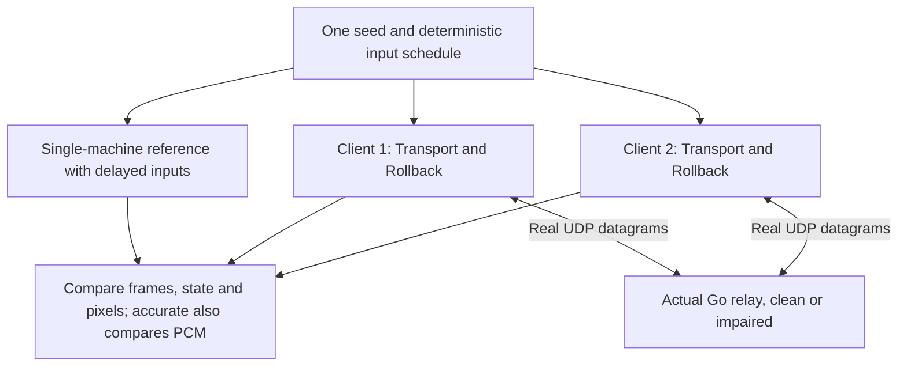

# Oracle and verification

`f3rt-netplay-oracle` checks snapshot replay and real relay lifecycle. The Python runner compares each versus match against its **actual host handoff**, not a shared cold-boot history. Recorded outcomes live in [IMGUI-NETPLAY.md](https://github.com/ansxor/f3-recomp/blob/main/docs/developer/IMGUI-NETPLAY.md); commands here are instructions, not new pass claims.

The tools are [tools/netplay_oracle.cpp](https://github.com/ansxor/f3-recomp/blob/main/tools/netplay_oracle.cpp) and [tools/run_netplay_oracle.py](https://github.com/ansxor/f3-recomp/blob/main/tools/run_netplay_oracle.py). The deterministic controller schedule is [tools/gameplay_inputs.hpp](https://github.com/ansxor/f3-recomp/blob/main/tools/gameplay_inputs.hpp).

## What an oracle means here

An oracle is a reference result. The network oracle runs the same strict-native machine once with both actual input streams and no prediction. It compares two real rollback clients with that reference.

The reference does not prove that the emulator matches original hardware. It checks that rollback and network timing do not change canonical game state and pixels; the accurate backend also checks PCM. Separate interpreter, sound and video parity tools address emulation accuracy.

Audio defaults to `--audio-backend accurate`. Reference and client modes also support opt-in `--audio-backend hle`; both peers must choose the same backend. Accurate compares confirmed PCM as well as game state and pixels. HLE compares canonical game state and pixels, not worker state or PCM: its independent worker intentionally follows speculative command history. See the [HLE worker policy](https://github.com/ansxor/f3-recomp/blob/main/docs/developer/HLE-AUDIO.md#runtime-and-rollback-contract).



## Build prerequisites

Use a build with generated Land Maker main-CPU blocks. Accurate/native sound requires generated sound blocks too; HLE does not execute them. The oracle accepts only `landmakrj`. It disables main-CPU fallback and uses `GameVideoMode::Game`.

From the repository root, build the required targets:

```sh
cmake --build build --target landmakr f3rt-netplay-oracle
(cd netplay/server && go build -o ../../build/netplay-server .)
python3 tools/run_netplay_oracle.py --suite baseline --frames 20000 --seeds 1
python3 tools/run_netplay_oracle.py --suite impaired --frames 20000 --seeds 1 2 3 5 8 13 21 34
python3 tools/run_netplay_oracle.py --suite cases
```

Use the appropriate local ROM path through `--rom-dir`. Never publish ROM-derived handoff/dump/audio artifacts.

## Binary modes

| Mode | Contract |
| --- | --- |
| `snapshot` | Accurate only: full local save/load and replay at multiple boundaries/depths, including allocation measurements |
| `sync-proof` | Accurate only: canonical import between differing presentation geometry, exact local full-state replay, native pixels/PCM and allocation proof |
| `client` | Accurate/native or HLE: independent one-start solo histories (P1 2400/P2 3200 frames by default), fresh host transfer, versus campaign, natural local return/rematch |
| `reference` | Accurate or HLE: replay delayed input from the saved canonical host snapshot for an independent per-match reference |

```sh
build/f3rt-netplay-oracle --mode sync-proof --frames 2400 --seed 1 --sound-driver native
build/f3rt-netplay-oracle --mode reference --frames 3000 --seed 1 \
  --initial-state build/campaign/host/match_0/handoff.bin --match-index 0 --delay 2
```

Handoff filenames above illustrate output layout; choose the actual host output directory. Host may be P2. Each rematch needs its own `handoff.bin`, origin and match-index stream.

## Binary options

| Option | Default / purpose |
| --- | --- |
| `--mode` | Select one of the modes above |
| `--set`, `--rom-dir` | `landmakrj`, built-in ROM directory |
| `--seed`, `--frames` | 12345, 20000 |
| `--server`, `--room` | `127.0.0.1:9000`, `oracle_room` |
| `--player`, `--host-player` | Client slot 1/2; host-player defaults to 1 and is independent of slot |
| `--delay`, `--window` | Host delay 2 (0–8), prediction window 16 (16–32) |
| `--prelude-frames` | Override independent solo history length (2400/3200 default) |
| `--initial-state`, `--match-index` | Canonical reference input and campaign stream index (default index 0) |
| `--sound-driver` | `native`; `oracle`; `all` for snapshots |
| `--audio-backend` | `accurate` or `hle`; HLE supports reference/client, not snapshot proof, and rejects explicit `--sound-driver` |
| `--schedule` | `versus` or `single` |
| `--video-scale`, `--video-border` | Geometry for local/canonical snapshot coverage; presentation is also supported in player netplay |
| `--snapshot-interval`, `--snapshot-k` | 1000-frame interval; default depths 1, 7, 16, 31, 97 |
| `--timeout` | 120 seconds |
| `--surface` / `--capture-surface`, `--dump-dir`, `--dump-every` | Local captures and handoff/reference artifacts |
| `--stall-at`, `--stall-ms` | Complete pause injection |
| `--withhold-input-at`, `--withhold-input-ms` | Late submission injection |
| `--observe-event-at` | Measure correction/stall around a frame |
| `--corrupt-build-hash` | Expected rejection scenario |
| `--unthrottled` | Remove yield sleep while stalled |

## Python runner

Suites are `all`, `snapshot`, `baseline`, `impaired`, `cases`. Defaults: `build/f3rt-netplay-oracle`, `build/netplay-server`, 20000 frames, delay 2, window 16, native sound and seeds **1, 2, 3, 5, 8, 13, 21, 34**. `--sound-driver all` uses both for snapshots and native for campaigns. See the [CLI reference](/reference/cli) and binary `--help` for diagnostic options.

Campaigns compare both clients to a per-match delayed reference loaded from the host's canonical handoff: canonical CRC, native framebuffer CRC, confirmed PCM CRC and stereo sample count. They require actual natural returns/rematches and no main interpreter fallback. Impairment covers snapshot chunks as well as gameplay (80 ms RTT, 20 ms jitter, 3% loss/reorder). Cases cover 120 ms withheld input, 1000 ms stall, geometry/requested-delay independence, host-P2 assignment, mismatch rejection and killed-peer local return.

## Historical pre-cutover acceptance evidence

The following is retained in [IMGUI-NETPLAY.md's historical archive](https://github.com/ansxor/f3-recomp/blob/main/docs/developer/IMGUI-NETPLAY.md#historical-measurements-pre-cutover-cold-start-implementation). It is pre-cutover evidence, not a result from reading this page.

- With the accurate backend, eight impaired seeds × 20,000 frames match reference state, framebuffer, PCM CRC and sample count. The seeds are 1, 2, 3, 5, 8, 13, 21 and 34. Runs record 877 to 988 rollbacks per client, including depth 16.
- Four clean-network seeds × 20,000 frames pass.
- 240 varied snapshot checks cover four seeds, both sound drivers, N = 0, 1000, 2000, 3000, 4000, 5000 and all five default depths.
- 120 dense snapshot/performance checks cover both sound drivers every 100 frames through 5900. Fifteen expanded-presentation checks cover scale 2, border 48 through frame 2200.
- The 120 ms withholding case records a depth-16 correction and a 49.23 ms full-window stall. The one-second pause records a 942.63 ms stall. Both recover to reference parity at frame 3000.
- Delay endpoints 0 and 8 pass real two-client 2000-frame matches. Separate input-MMIO and wrong-checksum smoke scenarios cover mapping and explicit `DESYNC` errors.
- Actual Cocoa/Metal frontend pairs complete 1800 and 3600 impaired frames with equal states and pixels. The 1800-frame WAV files are byte-equal.

The endpoint-delay, MMIO, expanded snapshot and SDL observations are additional recorded scenarios. The default Python `all` suite does not run every one of them.

The same archive retains the original pre-cutover impaired CRCs:

| Seed | State CRC-32 | Confirmed PCM CRC-32 |
| ---: | --- | --- |
| 1 | `b9715bee` | `106b0e7b` |
| 2 | `d7e729ba` | `0e4cabc2` |
| 3 | `127ec5e5` | `4a491d11` |
| 5 | `99e5910b` | `94bee9b2` |
| 8 | `4b5925a8` | `7f7dda63` |
| 13 | `3aceeda3` | `754ea8b9` |
| 21 | `7d7d98da` | `0b76f433` |
| 34 | `b6288683` | `8fde76c0` |

These values belong to that recorded accurate-backend build and configuration. A compatible source change can intentionally change a result and the build fingerprint. Keep the three-way state/pixel parity contract and, for accurate, PCM parity; do not treat historical CRCs as universal ROM truth or require HLE PCM equality.


## Verification limits

The oracle covers finite schedules on the tested builds. It cannot prove all future game paths, floating-point environments or network conditions. The relay seed controls decisions only for a fixed packet arrival sequence. OS scheduling can change that sequence.

Headless parity does not test keyboard events, audio-device latency or graphical presentation. Verify the actual frontend separately. Japan 2.01J entry requires the versus latch at `0x00401f6e`, both-active low flags at `0x00401f53` and at least one selection flag; low flags alone include tutorial/demo. See [frontend integration](/developer/netplay/frontend-integration).

Read [Limits and security](/developer/netplay/limits) for the supported contract and [Debugging a desync](/developer/netplay/debugging) for failure analysis.
Cross-presentation proof must retain native rendering/trails, validate unsafe parser fields and show no allocation per save/load. CRC equality supports observed correctness, not universal compatibility or cryptographic trust. Menu/gamepad/shader verification is separate actual frontend evidence, not something a headless oracle proves.
