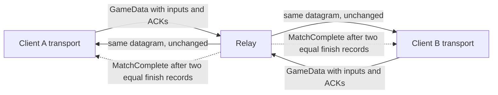

# Wire protocol

**What you will learn.** This page gives the exact UDP packet formats of netplay protocol version 1. A reader can use it to write a client or a relay that works with the existing code. The values come from `netplay/server/protocol.go` and `runtime/netplay_transport.cpp`. Both agree.

## Conventions

- The transport is UDP. One datagram holds one packet.
- All multi-byte numbers are **big-endian**.
- A datagram is at most **1400 bytes**. The relay drops longer datagrams.
- Text fields are ASCII, padded with zero bytes. They are not zero-terminated when full.
- `u8`, `u16`, `u32` and `u64` are unsigned integers of 1, 2, 4 and 8 bytes.
- The value `0xFFFFFFFF` in a frame field means "none".
- The sender slot `0xFF` means the relay or an unassigned client. `JoinWait` and `MatchStart` instead use the assigned receiver slot.
- Slots in the protocol are 0 and 1. The player number that users see is slot + 1.

## Header

Every packet starts with a 20-byte header.

| Offset | Size | Field | Value |
| ---: | ---: | --- | --- |
| 0 | 4 | `magic` | `0x46334E50` (ASCII `F3NP`) |
| 4 | 1 | `version` | 1 |
| 5 | 1 | `type` | See the next table |
| 6 | 2 | `flags` | Used by `GameData`. Zero in all other packets. |
| 8 | 8 | `session_id` | Set by the relay at match start. Zero before the match. |
| 16 | 1 | `sender_slot` | 0 or 1 for a client. `0xFF` for the relay or for an unassigned client. |
| 17 | 3 | `reserved` | Send zero. Receivers ignore the value. |

A receiver drops a packet that is shorter than 20 bytes, has another magic, or has another version. The relay answers a `JoinReq` with another version with a `JoinReject` (code 1). It drops other packet types with another version.

## Packet types

| Type | Name | Direction | Purpose |
| ---: | --- | --- | --- |
| 1 | `JoinReq` | client to relay | Ask to join a room |
| 2 | `JoinWait` | relay to client | The room waits for a second player |
| 3 | (reserved) | none | The Go constant is `PktJoinAck`. No code sends or reads it. |
| 4 | `JoinReject` | relay to client | The join failed |
| 5 | `MatchStart` | relay to client | Both players are in the room |
| 6 | `GameData` | client to client through the relay | Inputs, ACKs, checksums, ping, finish data |
| 7 | `Heartbeat` | client to client through the relay | Small liveness packet |
| 8 | `Leave` | client to relay | The client leaves |
| 9 | `MatchTerminated` | relay to client | The relay ended the match |
| 10 | `MatchComplete` | relay to client | The final verdict of a finite match |

## Packet flow



The relay checks `GameData` before it forwards the datagram. It does not change a single byte. The receiving client checks the packet again.

## Identity (72 bytes)

`Identity` is part of `JoinReq` and `MatchStart`. It lets the relay and the peer check that both clients run the same game.

| Offset | Size | Field | Meaning |
| ---: | ---: | --- | --- |
| 0 | 4 | `rom_crc[0]` | CRC-32 of the main CPU ROM region |
| 4 | 4 | `rom_crc[1]` | Sprite ROM |
| 8 | 4 | `rom_crc[2]` | Sprite high-plane ROM |
| 12 | 4 | `rom_crc[3]` | Tile ROM |
| 16 | 4 | `rom_crc[4]` | Tile high-plane ROM |
| 20 | 4 | `rom_crc[5]` | Sound CPU ROM |
| 24 | 4 | `rom_crc[6]` | Sample ROM |
| 28 | 32 | `build_hash` | SHA-256 build fingerprint (raw bytes) |
| 60 | 4 | `settings` | Configuration word |
| 64 | 4 | `eeprom_crc` | CRC-32 of the 128-byte EEPROM image |
| 68 | 4 | `initial_crc` | CRC-32 of the machine snapshot at frame 0 |

The `settings` word is `0x10000 | (game_video << 12) | (native_sound << 13) | delay`. Bit 16 is the schema revision. Bit 12 is 1 when GameVideo is active. Bit 13 is 1 when the native sound driver is active. The low bits hold the delay.

The EEPROM image is 64 words of 16 bits, written big-endian, 128 bytes in all. The CRC function is the standard CRC-32 (polynomial `0xedb88320`, initial value and final value inverted).

## `JoinReq` (type 1)

The client sends this packet. The header has `session_id = 0`, `sender_slot = 0xFF`.

| Payload offset | Size | Field | Meaning |
| ---: | ---: | --- | --- |
| 0 | 8 | `nonce` | Random, never zero. The client keeps it for the whole session. |
| 8 | 1 | `requested_slot` | 0 = automatic, 1 = slot 0, 2 = slot 1 |
| 9 | 1 | `delay` | Input delay, 0 to 8 |
| 10 | 1 | `room_length` | 1 to 32 |
| 11 | 32 | `room` | Room code: letters, digits, `_`, `-`. Zero-padded. |
| 43 | 72 | `identity` | See above |

The payload has 115 bytes. The packet has 135 bytes. The relay requires at least 115 payload bytes. It accepts trailing bytes in this type. It checks declared room length as 1 to 32, then trims trailing zero bytes from that declared slice. A malformed length fails parsing with reject code 13. An empty resulting name gets code 10.

The C++ sender validates the ASCII character set, slot 0 to 2 and delay 0 to 8. The current relay does not call `IsValidRoomName`. It does not enforce that character set, a non-zero nonce or the 0-to-8 delay range. Requested-slot values other than 1 or 2 follow the automatic branch.

## `JoinWait` (type 2)

The relay sends this packet while the room has one player. The header has `sender_slot` equal to the assigned slot.

| Payload offset | Size | Field |
| ---: | ---: | --- |
| 0 | 8 | `nonce` (echo) |
| 8 | 1 | `assigned_slot` |
| 9 | 32 | `message` (the relay sends `waiting for opponent`) |

The payload has 41 bytes. The C++ client reads only the first 9 bytes.

## `JoinReject` (type 4)

| Payload offset | Size | Field |
| ---: | ---: | --- |
| 0 | 8 | `nonce` (echo) |
| 8 | 1 | `reject_code` |
| 9 | 64 | `message` |

The payload has 73 bytes. The header has `sender_slot = 0xFF`. The client ignores the packet if the nonce is not its own.

### Reject codes

| Code | Name | Reason |
| ---: | --- | --- |
| 1 | `RejectProtocolMismatch` | The protocol version differs. |
| 2 | `RejectRoomFull` | The relay already holds 1024 rooms (the message is `server full`). The room code has a two-player branch for this code, but an active room answers with code 12 first. |
| 3 | `RejectSlotTaken` | The requested slot is taken. |
| 4 | `RejectRomCrcMismatch` | `rom_crc` differs from the first player. |
| 5 | `RejectBuildHashMismatch` | `build_hash` differs. |
| 6 | `RejectSettingsMismatch` | `settings` differs. |
| 7 | `RejectEepromCrcMismatch` | `eeprom_crc` differs. |
| 8 | `RejectInitialCrcMismatch` | `initial_crc` differs. |
| 9 | `RejectDelayMismatch` | `delay` differs. |
| 10 | `RejectInvalidRoom` | The parsed room name is empty or outside the length bound. A bad declared length already fails parsing with code 13. |
| 11 | `RejectRateLimited` | Defined. The current relay drops rate-limited packets without a reply. |
| 12 | `RejectMatchInProgress` | The room is active or finished, and the nonce is unknown. |
| 13 | `RejectInvalidIdentity` | The payload is malformed, or a known client changed its identity or delay. |

The relay checks a second player in this order: delay (9), ROM CRCs (4), build hash (5), settings (6), EEPROM CRC (7), initial CRC (8), then the slot (3 or 2). When several fields differ, the first check in this order names the reason.

## `MatchStart` (type 5)

The relay sends this packet to both players when the second player joins. The header has the new `session_id` and `sender_slot` equal to the receiver slot.

| Payload offset | Size | Field |
| ---: | ---: | --- |
| 0 | 8 | `nonce` (echo of the receiver nonce) |
| 8 | 1 | `assigned_slot` |
| 9 | 1 | `delay` |
| 10 | 2 | reserved, zero |
| 12 | 72 | `peer_identity` (the identity that the room stored from the first player) |

The payload has 84 bytes. The client must check the nonce, the slot (0 or 1), a non-zero session ID, the delay and the identity. See [Transport](/developer/netplay/transport#the-join-handshake).

## `GameData` (type 6)

Both clients send this packet throughout the match. The header carries the session and sender slot. A canonical sender sets the header and payload flags equal. The C++ receiver enforces equality. The current relay checks only payload flags; it does not compare them with header flags.

| Payload offset | Size | Field | Meaning |
| ---: | ---: | --- | --- |
| 0 | 4 | `simulated_frame` | The frame that the sender has simulated (`machine.frame`) |
| 4 | 4 | `ack_frame` | Highest input frame of the receiver that the sender has taken, or `0xFFFFFFFF` |
| 8 | 4 | `ack_checksum_frame` | Highest checksum frame of the receiver that the sender has received, or `0xFFFFFFFF` |
| 12 | 4 | `ping_id` | New ID for this packet, counting from 1 |
| 16 | 4 | `pong_id` | The last `ping_id` that the sender received, or 0 |
| 20 | 2 | `flags` | Bit 0: finish request. Bit 1: finish acknowledge. |
| 22 | 4 | `input_start` | Frame of the first input word |
| 26 | 2 | `input_count` | 0 to 128 |
| 28 | 2 * count | `inputs` | Input words for frames `input_start` and up |
| next | 2 | `checksum_count` | 0 to 32 (the C++ client sends at most 8) |
| next | 8 * count | `checksums` | Pairs of `frame` (u32) and `crc` (u32) |
| next | 8 | `finish` | Only if flag bit 0 is set: `final_frame` (u32) and `final_crc` (u32) |

The fixed part is 30 bytes (with both counts at zero). The receiver must reject a packet with any trailing byte.

### Input word

An input word has 11 used bits. Bits are active high (1 = pressed).

| Bit | Meaning |
| ---: | --- |
| 0 | Up |
| 1 | Down |
| 2 | Left |
| 3 | Right |
| 4 | Button 1 |
| 5 | Button 2 |
| 6 | Button 3 |
| 7 | Start |
| 8 | Coin |
| 9 | Service |
| 10 | Test |

The mask is `0x07FF`. A word with another bit set is invalid. The relay drops the packet. The C++ client stops with an error.

### Meaning of the frame fields

- **Delay and the first frame.** The first real input frame is `delay`. Frames below `delay` are neutral on both sides and are never sent.
- **Input ACK.** `ack_frame` says: "I have all your inputs up to this frame, in order." The sender of the inputs then stops repeating them. The C++ client sends `next_expected_frame - 1`, which is `delay - 1` at the start.
- **Redundancy.** A sender repeats the oldest unacknowledged contiguous run, up to 128 words. It stops at a missing local frame. A receiver accepts a duplicate only when its word is equal.
- **Checksum frame.** A normal checksum frame is a positive multiple of 60. The CRC covers the full machine snapshot after that many frames. Both sides publish it only after confirmation. The checksum ACK is separate from input ACK. The normal sender repeats oldest pending pairs first.
- **Ping and pong.** The receiver sends back the last `ping_id` that it saw. The first sender measures the round-trip time from it.
- **Finish.** See below.

### Worked example

This hex string is the payload that the Go test `TestGameDataWireCompatibility` uses. It has two inputs, one checksum and a finish record.

```text
0000003c  simulated_frame = 60
0000003b  ack_frame = 59
ffffffff  ack_checksum_frame = none
01020304  ping_id
05060708  pong_id
0001      flags = finish request
0000003a  input_start = 58
0002      input_count = 2
0100      input for frame 58 = coin (bit 8)
0080      input for frame 59 = start (bit 7)
0001      checksum_count = 1
0000003c  checksum frame 60
11223344  checksum CRC
0000003c  final_frame = 60
55667788  final_crc
```

### Finish records

A finite match ends when both clients send a finish record with the same frame and CRC.

1. A client that reached its target frame and confirmed it sets flag bit 0 and adds `final_frame` and `final_crc` to every `GameData` packet.
2. A client that has received the finish record of its peer also sets flag bit 1.
3. The relay stores the record of each slot. When both records exist and are equal, the relay sends `MatchComplete` to both clients.
4. A client is done only when it receives `MatchComplete` with a pair that equals its own. Bit 1 does not end the match.

## `Heartbeat` (type 7)

The payload has 16 bytes.

| Payload offset | Size | Field |
| ---: | ---: | --- |
| 0 | 4 | `ping_id` |
| 4 | 4 | `pong_id` |
| 8 | 4 | `simulated_frame` |
| 12 | 4 | `ack_frame` |

The relay forwards a `Heartbeat` to the peer. The C++ client reads it like a small `GameData`. The C++ client does not send it.

## `Leave` (type 8)

| Payload offset | Size | Field |
| ---: | ---: | --- |
| 0 | 1 | `leave_code` (0 = abort, 1 = normal finish) |
| 1 | 64 | `message` (optional) |

The C++ client sends 65 bytes (the code and 64 zero bytes). The Go parser needs only the first byte. If the payload is empty, the server defaults to abort code 0 and still checks session, slot and source endpoint. A code other than 1 also follows abort behavior. Only code 1 in an already Finished room leaves the peer undisturbed.

## `MatchTerminated` (type 9)

| Payload offset | Size | Field |
| ---: | ---: | --- |
| 0 | 1 | `reason_code` (the relay sends 0) |
| 1 | 64 | `message` |

The relay sends this packet with `sender_slot = 0xFF` and the match `session_id`. The text is `opponent left match` or `opponent connection timed out`. The client stops with `netplay disconnected: <message>` if the session ID is its own.

## `MatchComplete` (type 10)

| Payload offset | Size | Field |
| ---: | ---: | --- |
| 0 | 4 | `final_frame` |
| 4 | 4 | `final_crc` |

The header has `sender_slot = 0xFF` and the match `session_id`.

## Checks that the relay does for each type

The relay does these checks before it forwards a packet. A failed check drops the packet silently.

| Check | Applies to |
| --- | --- |
| Length of 20 to 1400 bytes | All |
| Per-IP rate limit | All (before parsing) |
| Magic and version | All |
| `session_id` is known | `GameData`, `Heartbeat`, `Leave` |
| Payload parses: lengths, payload flags, input count ≤128, checksum count ≤32, frame-range overflow, input mask, no trailing bytes | `GameData` |
| Sender address equals the registered address of `sender_slot` | `GameData`, `Heartbeat`, `Leave` |
| Room is active or finished | `GameData`, `Heartbeat` |

The relay does not enforce the client semantic meaning of ACKs, checksum cadence, delay-prefix frames or peer progress. It does reject overflow of `input_start + input_count`. The clients perform stronger semantic checks.

## Parser validation and asymmetries

Do not assume that all packet types have exact-length parsers. A compatible sender emits the canonical layout even where a receiver accepts more.

### `GameData`: relay

`UnmarshalGameDataPayload` requires at least 30 bytes. It rejects unknown **payload** flag bits, input count above 128, checksum count above 32, truncation of each variable section, any input bit outside `0x7ff`, a missing finish pair and any trailing byte. It checks `uint64(input_start) + input_count <= 0xffffffff`, including a zero count. The largest populated input range therefore cannot include frame `0xffffffff`.

The server first resolves the header session. It parses the entire payload before storing a finish record or forwarding. `Room.MarkFinish` checks sender slot and endpoint. `Room.GetPeer` checks room state, session, slot and endpoint. The original datagram is forwarded unchanged.

The relay does **not** compare header flags to payload flags. It does not check checksum frame cadence or ACK bounds. It does not reject pre-delay input frames. These are client checks, not relay guarantees.

### `GameData`: C++ client

The common handler requires the active session and opposite sender slot. The two-pass payload handler checks the same structural bounds and exact payload length. It also checks:

- Header flags have no unknown bits and equal payload flags.
- A non-empty input run starts at or after delay.
- Each checksum frame is at or after delay.
- Non-sentinel input ACK does not exceed the latest submitted input, if any input was submitted.
- Non-sentinel checksum ACK does not exceed the latest submitted checksum, if any checksum was submitted.

Most malformed packets are dropped without refreshing liveness. An invalid input word throws a fatal error during validation. Mutation and CRC errors can throw during application after structural validation succeeds.

Transport does not itself enforce the positive-multiple-of-60 checksum rule. The application must deliver received pairs to `Rollback::receive_checksum`, which validates cadence, future bounds and repeated values.

The C++ common handler does not independently enforce the 1400-byte limit. Its receive buffer is 1528 bytes. The relay ingress enforces the declared limit. This is a protocol bound, not a uniform parser guarantee.

### Other packets

| Type | Actual receiver behavior |
| --- | --- |
| `JoinReq` | Relay requires at least 115 payload bytes; extra bytes are accepted. See room-validation differences above. |
| `JoinWait` | C++ uses at least 9 payload bytes and matching nonce while Connecting. It does not validate the provisional slot range here. |
| `JoinReject` | C++ uses at least 9 payload bytes and matching nonce. It reads at most 64 message bytes. |
| `MatchStart` | C++ requires at least 84 payload bytes, matching nonce, slot 0/1, non-zero session, equal delay and identity while Connecting. Short or wrong-nonce packets are ignored. Extra bytes and reserved values are ignored. |
| `Heartbeat` | Relay endpoint-checks and forwards without calling its payload parser. C++ requires at least 16 payload bytes plus active session and opposite slot. It does not apply the `GameData` ACK upper-bound validation. |
| `Leave` | Relay accepts a code byte when present; malformed empty payload defaults to abort. Session and endpoint checks still apply. |
| `MatchTerminated` | C++ accepts matching session and reads optional reason text. It does not require the full 65-byte canonical payload. |
| `MatchComplete` | C++ requires matching session and at least 8 payload bytes. It checks final frame/CRC against local finish when requested. |

The C++ socket accepts traffic only from its connected relay endpoint. Server-origin completion and termination handlers rely on that endpoint plus session; they do not separately enforce header sender slot `0xff`. Unknown packet types are ignored. Reserved header bytes are not validated.

## Size summary

| Packet | Payload | Whole datagram |
| --- | ---: | ---: |
| `JoinReq` | 115 | 135 |
| `JoinWait` | 41 | 61 |
| `JoinReject` | 73 | 93 |
| `MatchStart` | 84 | 104 |
| `GameData` | 30 to 358 | 50 to 378 |
| `Heartbeat` | 16 | 36 |
| `Leave` | 65 | 85 |
| `MatchTerminated` | 65 | 85 |
| `MatchComplete` | 8 | 28 |

The 358-byte payload maximum is for the standard C++ client: 128 inputs, 8 checksums and a finish record. The parser format maximum is `30 + 256 + 256 + 8 = 550` payload bytes, or 570 bytes including the header, with 32 checksum pairs.

## Versioning

The header `version` is 1. The relay and the client reject other versions. A future change of any layout on this page must increase the version.

## Related pages

- [Transport](/developer/netplay/transport)
- [Relay server](/developer/netplay/server)
- [Write a compatible client](/developer/netplay/writing-a-client)

## Source

- [Go protocol definitions and parsers](https://github.com/ansxor/f3-recomp/blob/main/netplay/server/protocol.go).
- [Relay handlers](https://github.com/ansxor/f3-recomp/blob/main/netplay/server/server.go).
- [C++ packet writers and parsers](https://github.com/ansxor/f3-recomp/blob/main/runtime/netplay_transport.cpp).
- [Fixed wire vector and malformed cases](https://github.com/ansxor/f3-recomp/blob/main/netplay/server/protocol_test.go).

