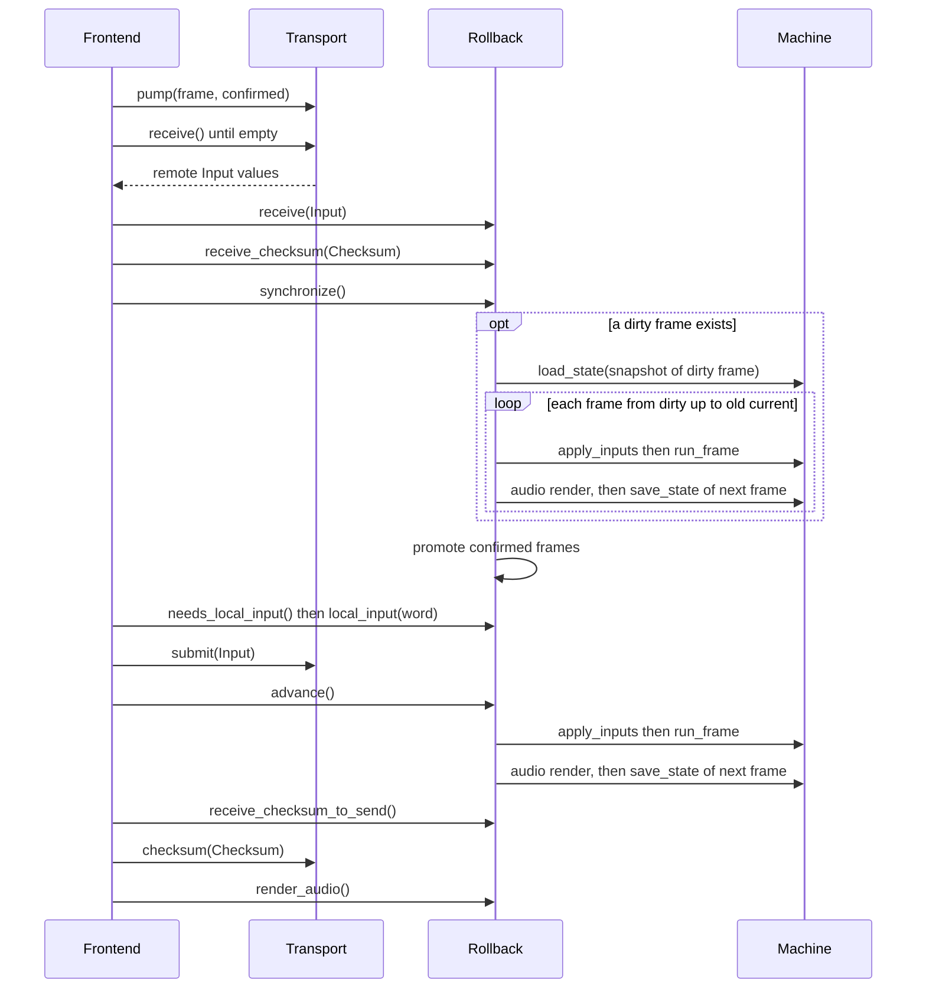
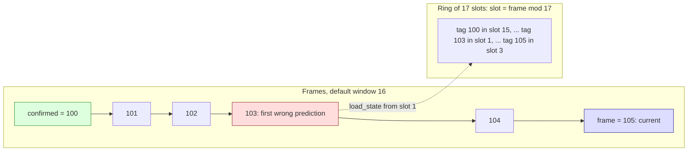

# Rollback engine

**What you will learn.** This page explains `Rollback`, the class in `runtime/netplay.cpp` that predicts remote inputs, keeps snapshots, repairs wrong predictions and checks that both clients agree. You also learn how audio stays correct.

`Rollback` has no SDL code and no socket code. It receives inputs and checksums as plain values. It calls only the `Machine`. The oracle tool and the frontend both use it.

## Vocabulary

| Term | Meaning |
| --- | --- |
| Frame | One video frame of the F3 machine. `Machine::run_frame` simulates one frame and increases `Machine::frame` by one. |
| Input word | A 16-bit value with 11 used bits. It holds the controller state of one player for one frame. |
| Input delay (`delay`) | Sampling-to-use distance, 0–8 frames; negotiated from the host, default 2. |
| Prediction | The guess for a remote input word that has not arrived. The guess is the word that the remote player used in the previous frame. |
| Dirty frame | The earliest frame that used a prediction that proved wrong. |
| Rollback | A `load_state` of the full local snapshot at the dirty frame, including presentation buffers. |
| Resimulation | Running the frames from the dirty frame up to the old current frame again. |
| Rollback depth | The number of resimulated frames. |
| Confirmed frame | A frame is confirmed when both actual inputs are known and the frame is simulated with them. `confirmed_frame()` is the first frame that is not confirmed. It is an exclusive bound. |
| Prediction window (`window`) | The maximum number of frames between the confirmed bound and the current frame. The default is 16. |
| Stall | The state when the window is full. The engine does not run a new frame until more inputs arrive. |

## Public interface

The class is declared in `include/f3rt/netplay.hpp`.

| Member | Behavior |
| --- | --- |
| `Rollback(Machine&, slot, delay = 2, window = 16)` | Starts from a drained canonical handoff, allocates snapshot/history/audio storage and saves match-relative frame 0. Requires valid slot, delay/window, strict-native execution and no sound trace. |
| `frame()` | Match-relative simulated frame, not absolute `machine.frame`. |
| `origin_frame()` | Absolute host machine frame at handoff. |
| `match_finished()` | Real-versus predicate became inactive at a confirmed boundary. |
| `restore_confirmed()` | Restore last confirmed state before local return. |
| `confirmed_frame()` | The exclusive bound of confirmed frames. |
| `needs_local_input()` | True if the local word for frame `frame() + delay` has not been sampled. |
| `local_input(word)` | Stores the local word for frame `frame() + delay`. Returns `Input{frame, word}` for the transport. |
| `receive(Input)` | Stores a remote word. Marks a dirty frame if the word differs from the word that the simulation used. |
| `receive_checksum(Checksum)` | Stores a remote checksum and compares it with the local one. |
| `synchronize()` | Repairs wrong predictions and confirms frames. It does not advance time. |
| `advance()` | Calls `synchronize()`, then runs one new frame unless the window is full. Returns true if it ran a frame. |
| `receive_checksum_to_send(Checksum&)` | Pops one local checksum that the transport must send. |
| `render_audio(int16_t*, max_frames)` | Copies confirmed audio to the caller. |
| `rollback_count()`, `last_rollback_depth()`, `maximum_rollback_depth()` | Statistics. |

Constants: `max_window = 32`, `history_size = 1024`, `checksum_interval = 60`, `input_mask = 0x7ff`.

## Versus entry and exit

For Japan 2.01J, `versus_match_active` requires word `$401f6e == 1` and `($401f53 & 3) == 3`. Handoff additionally requires `($401f53 & 0xc0) != 0`: at least one player is still selecting. Low flags alone include tutorial/demo. `$401f54` is random-stage state, not a mode discriminator; the old `$4078f6` heuristic is superseded.

The machine retains absolute host time while rollback input/history frames are relative to `origin_frame`. Exit detection happens only when actual inputs confirm the boundary. Restore that boundary before returning local; speculative departure must not end the match.

## Internal data

The core allocates snapshot, history and audio storage in the constructor. Its normal save/load and bookkeeping paths use that storage again. Error formatting and host frontend output are outside this allocation contract.

| Member | Type and size | Purpose |
| --- | --- | --- |
| `snapshots` | One `std::vector<uint8_t>` of `snapshot_size * (window + 1)` bytes | The snapshot ring. |
| `snapshot_tags` | `std::array<uint32_t, 33>` | The frame number stored in each ring slot. |
| `frames` | `std::array<Frame, 1024>` | Input history. Each `Frame` holds `tag`, `actual[2]`, `used[2]`, `known` (a bit mask), `simulated` and `crc`. |
| `audio` | `std::array<AudioFrame, 33>` | The PCM of each retained frame. Each holds up to 4096 `int16_t` values. |
| `hashes` | `std::array<Hash, 1024>` | Local and remote checksum for each checksum frame. |
| `outgoing` | `std::array<Checksum, 64>` | Checksums that wait for the transport. |
| `output` | `std::array<int16_t, 139264>` | The queue of confirmed PCM (`4096 * (max_window + 2)`). |

Each array uses the frame number as a tag. A slot is valid only when its `tag` equals the frame number. `entry(f)` resets a slot when the tag differs. This is how the 1024-frame history works as a ring.

The two fields `actual` and `used` are the key. `actual[p]` is the real word of player `p`. `known` bit `p` says that `actual[p]` is valid. `used[p]` is the word that the simulation applied. When the actual word is unknown, `used[p]` is a prediction.

## One loop pass

The frontend calls the functions in this order. The sequence shows one pass.



## Local input and delay

`local_input(word)` writes the word to frame `frame() + delay`. The write sets the known bit of the local slot.

At construction, the frames `0` to `delay - 1` are marked as known for both players (`known = 3`) with word 0. They are neutral inputs. Nobody sends them. The transport also starts to send inputs at frame `delay`.

Delay hides latency. A local input is not used for `delay` frames. The remote client has the same time to receive it. If `delay` is at least as large as the one-way network time in frames, remote inputs usually arrive before they are needed, and few rollbacks happen. A larger delay makes the controls feel slower. The frontend default is 2.

`advance()` throws `std::logic_error("Local input was not scheduled before advance")` if the local word for the current frame is missing. The caller must call `local_input` first.

## Prediction: repeat the last word

The function `Impl::step()` simulates frame `f`. For each player `p` it chooses the word:

```cpp
const auto previous = f ? entry(f - 1).used : std::array<InputWord, 2>{};
for (unsigned p = 0; p < 2; ++p)
    e.used[p] = (e.known & (1u << p)) ? e.actual[p] : previous[p];
apply_inputs(machine, e.used);
```

If the actual word is known, `step` uses it. If not, `step` uses the `used` word of frame `f - 1`. This is "repeat last". It works well for held buttons and directions.

`apply_inputs` (in `runtime/netplay.cpp`) first resets every input port to "released" and then applies the two words. See [Frontend integration](/developer/netplay/frontend-integration) for the bit mapping.

Then `step()` does these actions:

1. It runs `machine.run_frame(true)`. The argument `true` selects the recompiled code. An interpreter fallback is an error.
2. It renders the frame audio into `audio[f % (window + 1)]`. It checks that the machine audio queue is now empty.
3. It calls `save(f + 1)`. This stores the state **before** frame `f + 1`.
4. If `(f + 1)` is a multiple of 60, it stores the CRC of that snapshot in `e.crc`.
5. It sets `e.simulated = true`.

So the snapshot with tag `n` is the state before frame `n` runs. The snapshot for frame 0 is saved in the constructor.

## Receiving a remote word

`receive(Input)` handles one remote word.

1. It rejects a word with a bit outside `0x7ff`.
2. It throws `Peer input exceeds bounded receive window` if the frame is 512 or more frames ahead of `frame()`.
3. It ignores a word that is 512 or more frames older than the confirmed bound.
4. If the word for this frame is already known, a different value throws `Peer changed previously received input`. An equal value is a duplicate and has no effect.
5. A missing actual word below the confirmed frontier is a logic error. Otherwise store the word and set the known bit of the peer.
6. If the frame was already simulated and `used[peer]` differs from the new word, it sets `dirty = min(dirty, frame)`.

A repeated equal word never causes a rollback. A correct prediction costs nothing.

## Rollback and resimulation

`synchronize()` repairs the state when `dirty` is set.

```cpp
const uint32_t end = current(), begin = dirty;
if (begin < confirmed || snapshot_tags[begin % (window + 1)] != begin)
    throw std::logic_error("Rollback exceeded retained snapshot window");
machine.load_state(snapshot(begin));
last_depth = end - begin;
max_depth = std::max(max_depth, last_depth);
++rollbacks;
dirty = empty_frame;
while (current() < end) step();
```

Steps in words:

1. Remember the old current frame `end`.
2. Check that the snapshot for the dirty frame is still in the ring.
3. Load that snapshot. `machine.frame` becomes the dirty frame.
4. Run `step()` until the machine is at `end` again. Each step uses the best known words. Frames with a new actual word use it. Later frames recompute their predictions from the new words.
5. Call `promote()`.

A resimulation runs the real CPUs, the real renderers and the real sound devices. This is why the snapshot holds all of them. A resimulation does not draw to the screen and does not write WAV data. The frontend draws after the whole `synchronize()` call.

The earliest dirty frame wins. If two words arrive in one pass, one rollback covers both.

## The snapshot ring

The ring has `window + 1` slots. A frame `n` uses slot `n mod 17` for the default window of 16. The engine needs a snapshot for every frame from the confirmed bound to the current frame, so it needs `window + 1` snapshots.



When the engine saves frame `n + 1`, it overwrites the slot of frame `n - 16`. This frame is older than the confirmed bound, so nobody needs it.

The window check keeps this rule true. `advance()` returns false when `frame() - confirmed >= window`. After a step, the distance is at most `window`. So the oldest needed snapshot (the confirmed bound) is always in the ring.

A dirty frame below the confirmed bound cannot occur, because a confirmed frame has both actual words and `actual == used`.

## Confirmation

`promote()` moves the confirmed bound up. It loops while `confirmed < current()`:

1. Take the entry of frame `confirmed`. Stop if `known != 3` or `simulated` is false.
2. Check `actual == used`. A difference throws `Unreconciled input reached confirmation`.
3. Check that the PCM slot still has the right tag. A mismatch throws `Confirmed audio overwritten`.
4. Copy that frame PCM to the output queue. If the queue is full, throw `Confirmed audio queue full`.
5. Increase `confirmed`.
6. If `confirmed` is a multiple of 60, store the local checksum and queue it for sending.

`promote()` runs at the end of `synchronize()` and at the end of `advance()`.

## The window and stalls

`advance()` returns false when the window is full. The frontend then does not step. It keeps pumping the transport. When the missing remote words arrive, `synchronize()` confirms frames, the distance becomes smaller, and `advance()` runs again.

A stalled client freezes at a bounded frame. It loses no history. The oracle tests this with a pause of one second.

The engine does not guess a recovery when a correction is too old. It throws. This case cannot happen in normal use because the window blocks the simulation first.

## Checksums and desync

The engine compares the full machine state every 60 confirmed frames.

- At frame `n` (a multiple of 60), `step()` stores `crc32(snapshot(n))` in the entry of frame `n - 1`.
- When `promote()` confirms up to `n`, it moves the CRC into `hashes` as `local`. It queues `Checksum{n, crc}` in `outgoing`.
- The frontend sends it with `Transport::checksum`.
- When the peer checksum arrives, `receive_checksum` stores it as `remote`.
- When both are present and differ, the engine throws `DESYNC at frame N: local CRC L remote CRC R`. The numbers are in decimal.

The CRC of frame `n` is used only after frame `n` is confirmed. So a prediction cannot cause a false alarm. A real divergence shows at the first checksum frame after it starts, when both clients have confirmed that frame and exchanged the checksums.

`receive_checksum` rejects a frame that is zero, not a multiple of 60, or more than 512 frames ahead. It throws `Peer changed previously received checksum` if the peer sends two different values for one frame. The transport also compares checksums. See [Transport](/developer/netplay/transport).

Checksums at least 1024 frames behind the confirmed frontier are ignored. The core hash ring uses `(frame / 60) % 1024` plus an absolute frame tag. Both local and remote values can arrive first. A mismatch is detected as soon as both exist. The 64-pair outgoing queue is distinct from this history.


See [Debugging a desync](/developer/netplay/debugging) for the next steps after an error.

## Confirmed-only audio

With the default accurate backend, speculative audio is retained until confirmation. This avoids playing a wrong sound and then a corrected sound.

- Each simulated frame writes its PCM to `audio[f % (window + 1)]`. A resimulation replaces the PCM of that frame.
- Only `promote()` copies PCM to the output queue, and only for a confirmed frame.
- `render_audio` reads only from that queue.

The accurate/native path emits each confirmed sample once, without speculative output or crossfade, at the cost of latency. Drain the queue every pass, including stalls. Optional HLE output uses a separate non-rewound reconciliation path and is not accurate-PCM-equivalent; see [HLE audio](https://github.com/ansxor/f3-recomp/blob/main/docs/developer/HLE-AUDIO.md).

Each frame has up to 4096 interleaved `int16_t` values. This is more than four times the normal amount for one frame.

The 4096-value per-frame buffer holds 2048 stereo frames. The confirmed queue holds 139,264 values, or 69,632 stereo frames. These are sample-storage bounds, not a fixed number of F3 frames. If device audio remains after a frame drain, the core throws instead of truncating PCM.


## Opt-in non-rollback HLE audio

`--audio-backend hle` uses the same canonical main-CPU rollback, but excludes
worker voices/effects/PCM from snapshots. Commands are recorded per input
frame and reconciled after resimulation. Exact packet/program matches within
two frames retain their instance; missing direct SFX fade over 240 samples
(5 ms at 48 kHz). Music and already rendered audio never rewind.
`render_audio` drains the speculative HLE stream instead of the confirmation
queue. Peers may hear different corrected histories while state CRCs agree;
the backend is part of the handshake.

## A worked example

Settings: `delay = 2`, `window = 16`. Player 0 is local.

1. The simulation is at frame 100. The confirmed bound is 97. The local word for frame 102 was sampled earlier.
2. The remote words for frames 97 to 99 have not arrived. The engine used the remote word of frame 96 for them (repeat last).
3. The word for frame 97 arrives. It equals the prediction. `receive` sets the known bit and does nothing else.
4. The word for frame 98 arrives. It differs. `dirty = 98`.
5. `synchronize()` loads the snapshot with tag 98 (state before frame 98). It runs frames 98 and 99 again with the new word. For frame 99 the unknown remote word is now predicted from the corrected frame 98. The rollback depth is 2.
6. `promote()` confirms frames 97 and 98. It stops at frame 99, because the remote word for frame 99 is still unknown. The confirmed bound is now 99.
7. `advance()` runs frame 100 as usual.

## Error messages

| Message | Cause |
| --- | --- |
| `Invalid synchronized input word` | A word has a bit outside `0x7ff`. |
| `Netplay requires slot 0/1, delay 0..8, rollback window 16..32` | Bad constructor arguments. |
| `Rollback requires strict-native execution without sound tracing` | Fallback execution or a sound trace is active. |
| `Rollback requires an empty initial audio queue` | Handoff PCM was not drained before construction. |
| `Netplay frame counter exhausted; start a new match` | Match-relative frame approaches the protocol guard. |
| `Netplay strict-native execution halted at frame N` | The CPU halted or an interpreter fallback ran. |
| `Netplay frame audio capacity exceeded` | A frame produced more PCM than the 4096-value buffer holds. |
| `Peer input exceeds bounded receive window` | A remote word is 512 or more frames ahead. |
| `Peer changed previously received input` | The peer sent two different words for one frame. |
| `Invalid peer checksum frame` | A remote checksum frame is zero, not a multiple of 60, or too far ahead. |
| `Peer changed previously received checksum` | The peer sent two different checksums for one frame. |
| `DESYNC at frame N: local CRC L remote CRC R` | The two clients disagree on the state after N frames. |
| `Rollback exceeded retained snapshot window` | A logic error: a dirty frame is older than the ring. |
| `Unreconciled input reached confirmation` | A logic error: a confirmed frame used a wrong word. |
| `Confirmed audio overwritten` | A logic error: PCM of a confirmed frame was lost. |
| `Confirmed audio queue full; drain render_audio while stalled` | The caller does not drain audio. |
| `Checksum queue full; drain receive_checksum_to_send` | The caller does not drain checksums. |
| `Local input was not scheduled before advance` | The caller skipped `local_input`. |

## Related pages

- [Snapshots](/developer/netplay/snapshots)
- [Frontend integration](/developer/netplay/frontend-integration)
- [Transport](/developer/netplay/transport)
- [Limits and security](/developer/netplay/limits)

## Source

- [Rollback implementation and input mapping](https://github.com/ansxor/f3-recomp/blob/main/runtime/netplay.cpp).
- [Public rollback API](https://github.com/ansxor/f3-recomp/blob/main/include/f3rt/netplay.hpp).

