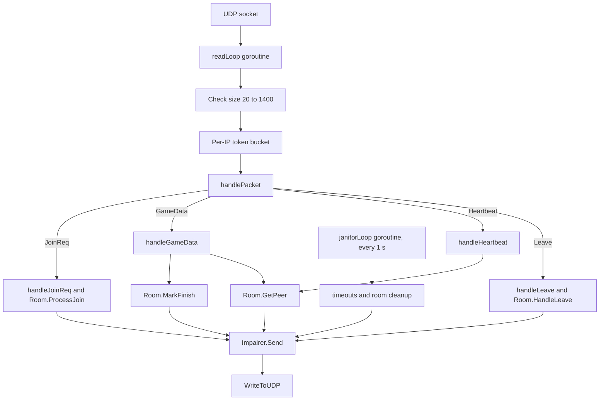
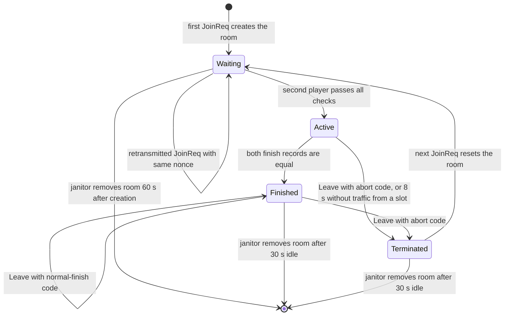

# Relay server

**What you will learn.** This page explains the Go relay in `netplay/server/`. You learn how it pairs two players, which packets it checks, how it keeps sessions apart, which limits it enforces, how to start it, and how to use its network impairment simulator.

The relay is small. It uses only the Go standard library. It needs Go 1.22 or newer (`go.mod` says `go 1.22`). It is **not** an emulator. It holds no ROM, no snapshot and no game state. It only pairs two clients and forwards their packets.

## Why a relay

Two clients behind home routers cannot easily send UDP packets to each other. A relay at a known address solves this: both clients send to the relay, and the relay sends to the other client. The relay also gives the clients a shared room name, checks that both clients run the same game, and keeps the final verdict of a finite match.

## Build and run

```sh
cd netplay/server
go build -o ../../build/netplay-server .
../../build/netplay-server -addr 0.0.0.0:9000
```

The relay prints `F3 Netplay Relay Server listening on <address>` when it is ready. The test runner waits for the text `Relay Server listening on`.

### Command-line flags

| Flag | Default | Meaning |
| --- | --- | --- |
| `-addr` | `127.0.0.1:9000` | UDP listen address. Use `0.0.0.0:9000` to accept clients from other computers. |
| `-port` | 0 | If above zero, listen on `127.0.0.1:<port>`. This overrides `-addr` and always uses the loopback address. |
| `-rtt` | 0 | Simulated round-trip time. The one-way delay is half of this value. |
| `-delay` | 0 | Simulated one-way delay. If non-zero, it replaces the value from `-rtt`. |
| `-jitter` | 0 | Random variation of the delay, plus or minus this value. |
| `-loss` | 0.0 | Probability to drop a packet, 0.0 to 1.0. |
| `-reorder` | 0.0 | Probability to delay a packet more than the rest. |
| `-duplicate` | 0.0 | Probability to send a packet twice. |
| `-dup` | 0.0 | Alias for `-duplicate`. Used only if `-duplicate` is zero and `-dup` is positive. |
| `-seed` | 0 | Seed of the impairment random generator. Zero selects a time-based seed. |

Time values use the Go duration syntax, for example `80ms`. All impairment flags default to off.

Use non-negative delays and probabilities from 0 to 1. The flag parser does not enforce these ranges. Negative or out-of-range values are not a supported impairment profile.


The relay stops on `Ctrl+C` (SIGINT) or SIGTERM.

## Source files

| File | Content |
| --- | --- |
| `main.go` | Flag parsing, server start, signal wait |
| `protocol.go` | Constants, packet structs, `Marshal` and `Unmarshal*` functions. The layouts match [Wire protocol](/developer/netplay/protocol). |
| `room.go` | `Room`, `ClientSlot`, the join logic and the finish and leave logic |
| `server.go` | The `Server`: read loop, packet handlers, janitor loop, rate limiter |
| `impairment.go` | `Impairer`: delay, jitter, loss, reorder and duplicate |
| `protocol_test.go`, `server_test.go`, `impairment_test.go` | Tests |

## Structure



The relay uses three goroutines: `readLoop`, `janitorLoop` and the impairment worker. It protects its data with four locks:

| Lock | Protects |
| --- | --- |
| `Server.mu` | The `rooms` map (room name to room) and the `sessions` map (session ID to room) |
| `Server.limiterMu` | The `limiters` map (IP to token bucket) |
| `Room.mu` | One room |
| `Impairer.mu` | The delay queue and the random generator |

The read loop uses a 2048-byte buffer and a read deadline of 500 ms, so it can see the stop signal.

## Room data

A `Room` holds:

| Field | Meaning |
| --- | --- |
| `Name` | Room code |
| `State` | `RoomWaiting`, `RoomActive`, `RoomFinished` or `RoomTerminated` |
| `SessionID` | Random 64-bit number, set when the match starts |
| `Delay`, `Identity` | The baseline from the **first** player |
| `Clients[2]` | One `ClientSlot` per slot |
| `FinalFrame`, `FinalCRC` | The stored verdict of a finished match |
| `CreatedAt`, `LastActive` | Times for the cleanup |

A `ClientSlot` holds `Occupied`, `Addr` (the UDP address), `Nonce`, `LastActive`, `Finished`, `FinishFrame` and `FinishCRC`.

## Room state machine



## Join logic

`Room.ProcessJoin` runs under the room lock. It does the following, in this order.

1. **Room is Active or Finished.** A nonce must belong to an occupied slot. The request rebinds that slot to the new source address only if identity and delay still equal the room baseline. A mismatch gets code 13. The relay sends `MatchStart` again to both recorded endpoints. An unknown or no-longer-occupied nonce gets code 12.
2. **Room is Terminated.** The relay clears both slots and the session ID. State becomes Waiting. The join result identifies the old session for removal from the `sessions` map. The request then continues as a new first player. `CreatedAt` is not reset, so an old room that returns to Waiting can meet the creation-age cleanup bound.
3. **Same nonce in a Waiting room.** This is a retransmission. The relay updates the address and answers `JoinWait`. This path does not revalidate a changed identity or delay; the first-player baseline remains unchanged.
4. **One player is already in the room.** The relay checks the request against the baseline: delay (code 9), ROM CRCs (4), build hash (5), settings (6), EEPROM CRC (7), initial CRC (8).
5. **Slot choice.** Requested slot 1 means slot 0. Requested slot 2 means slot 1. If the slot is taken, the code is 3. Automatic picks slot 0, then slot 1.
6. **First player.** The relay stores the identity and delay as the baseline and answers `JoinWait`.
7. **Second player.** The relay creates a session ID, sets the state to Active and sends `MatchStart` to both players.

The session ID comes from `crypto/rand`. Zero is replaced with 1. If the random source fails, the relay uses the time in nanoseconds.

The relay does not check that the delay is in the range 0 to 8. It checks that the two players have the same value. The client checks the range.

The relay also does not enforce the client room character set or requested-slot range. Its parser checks declared room length and trims trailing zero bytes. Slot values other than 1 or 2 use automatic assignment. See [Parser validation and asymmetries](/developer/netplay/protocol#parser-validation-and-asymmetries).


## Endpoint identity

The relay identifies a player by three values together: the **session ID**, the **sender slot** in the header, and the **UDP source address** (`IP:port` as text). `Room.GetPeer` rejects a packet when one of these does not match the room:

- the session ID differs from `Room.SessionID`,
- the sender slot is above 1,
- the source address is not the address registered for that slot.

The forwarding check rejects a packet from an unregistered source endpoint, even if it has the session ID. This protects against ordinary wrong-endpoint traffic. It is **not** authentication: nonce, session ID and room code travel in clear text, and a valid same-nonce join can rebind the endpoint. See [Limits and security](/developer/netplay/limits).

A client can change its source address (for example after a NAT rebinding) only by sending a `JoinReq` with its old nonce and unchanged identity.

The standard connected C++ client does not initiate this rebind after the handshake. The relay capability is not automatic frontend reconnect or hot resume.


## Forwarding

`handleGameData`:

1. Finds the room from the session ID. An unknown session is dropped.
2. Parses the payload with `UnmarshalGameDataPayload`. It checks length, payload flags, counts, frame-range overflow, input mask and trailing bytes. It does not compare header flags with payload flags. A malformed payload is dropped.
3. If the packet has the finish flag, calls `Room.MarkFinish`.
4. Calls `Room.GetPeer` for the checks of the previous section. It also refreshes `LastActive` for the sender slot.
5. Sends the **original datagram** to the other player through the impairer.

`handleHeartbeat` does step 1, 4 and 5 only.

If the other slot is empty (the player has left), `GetPeer` returns an error and the packet is dropped. In the Finished state, `GetPeer` still returns the last known address of a player who left, so a late finish packet can still reach him.

## Finish records and the verdict

`Room.MarkFinish(slot, addr, frame, crc)` stores the finish record of a slot. The sender address must match the slot. If both records exist and are equal, the room becomes Finished and keeps `FinalFrame` and `FinalCRC`.

The relay then sends `MatchComplete` to **both** players. It sends the packet again each time any finish packet arrives while the room is Finished. A packet without a finish flag from a player of a finished room also gets the verdict again. So a lost `MatchComplete` is not a problem, even when the other player has already left.

While the room is Active, unequal finish records produce no verdict. The clients see the difference themselves because `GameData` also forwards finish data. Once the room is Finished, later packets can receive the retained verdict.

The verdict remains in memory until the Finished room is more than 30 s idle. `GetPeer` refreshes room activity for endpoint-valid traffic, so ongoing retry traffic can extend retention. A relay restart loses the verdict. `MarkFinish` can update a slot's finish claim, but when the room is already Finished it still returns the retained verdict if the new claim does not form an equal pair. The relay does not independently emulate or verify that CRC.


## Leave and termination

`Room.HandleLeave` accepts a `Leave` only if the slot is occupied, the session ID matches and the address matches. It marks the slot empty. Then:

- If the room is Finished and the code is 1 (normal finish), nothing else happens. The other player is not disturbed.
- Otherwise the room becomes Terminated. The relay removes the session ID from the map and sends `MatchTerminated` (text `opponent left match`) to the other player, if he is still in the room.

An old session ID cannot end a new match in the same room. A `Leave` with a stale session ID does not match the room and is ignored. The test `TestStaleLeaveAfterNewSession` covers this.

## Limits and timers

| Constant | Value | Effect |
| --- | ---: | --- |
| `MaxRooms` | 1024 | A new room is refused with code 2. |
| `MaxTrackedIPs` | 4096 | When the rate-limit table is full, the relay removes one entry before it adds a new one. |
| `RateLimitTokensPerSec` | 500 | Token refill rate per source IP. |
| `RateLimitBurst` | 250 | Bucket size. A packet costs one token. A packet without a token is dropped silently. |
| `MaxPacketSize` | 1400 | Larger datagrams are dropped. Datagrams under 20 bytes are dropped. |
| `MaxInputs` | 128 | Input words per `GameData`. |
| `MaxChecksums` | 32 | Checksum pairs per `GameData`. |
| `ClientTimeout` | 8 s | An Active room ends when one slot sends nothing valid for 8 s. |
| `WaitingRoomTimeout` | 60 s | The janitor removes a Waiting room 60 s after its creation. |
| `FinishedRoomTimeout` | 30 s | The janitor removes a Finished or Terminated room 30 s after its last activity. |
| `MaxImpairmentQueue` | 2048 | Maximum packets in the delay queue. |

The janitor runs every second. It checks all rooms, sends `MatchTerminated` (`opponent connection timed out`) for a timed-out slot, removes old rooms and removes rate-limit entries that were idle for more than 60 s.

`CheckTimeouts` changes an Active room to Terminated. Unlike an accepted abort Leave, this timeout path does not immediately remove the session-map entry. `GetPeer` rejects a Terminated room. A later new join removes the old session entry, or the janitor removes it when the terminated room expires. The janitor uses its earlier room snapshot, so cleanup can occur on a later pass than the state change.


The rate limit is per source IP. Two clients behind one router share one bucket. Each standard client has a nominal regular-send ceiling of 125 packets/s, so two use about 250 tokens/s against a refill of 500. Immediate finish sends are outside the regular pacing gate. Other clients behind that IP share the same bucket.

A waiting client sends a `JoinReq` every 80 ms for up to 120 s, but the relay removes a Waiting room 60 s after creation. The next `JoinReq` creates the room again, so a waiting client is not lost. This follows from the code.

## Network impairment simulator

The relay has a built-in simulator for bad networks. It exists so that tests can show that rollback works with delay, jitter and loss. It is off by default. When all impairment values are zero, `Impairer.Send` sends at once.

The simulator affects **everything** that the relay sends, including `JoinWait` and `MatchStart`. It does not affect what the relay receives.

### How a packet is processed

For each packet that is sent while the simulator is on, `Impairer.Send` does:

1. If the queue has 2048 packets, drop the packet.
2. With probability `loss`, drop the packet.
3. Compute the delay: `delay`, plus a random value in the range from `-jitter` to `+jitter`. The minimum is zero.
4. With probability `reorder`, add `delay + jitter` to this packet. If both are zero, add 20 ms. This lets later packets pass it.
5. With probability `duplicate`, schedule a copy 5 ms after the original, if a second queue slot remains.
6. Put the packet in a heap ordered by delivery time, then by a sequence number.

A worker waits for the earliest delivery time and sends due packets. A new earlier packet wakes it. `Impairer.Close` tries to send the remaining queue. `Server.Close` closes the UDP socket first, so shutdown does not guarantee delivery of that queue.

### Reproducibility

The generator is `math/rand/v2` PCG. A non-zero seed uses `(seed, seed ^ 0x5DEECE66D)`, converted to unsigned 64-bit values. Seed zero uses `(now, now ^ 0x9E3779B97F4A7C15)`, where `now` is the host time in nanoseconds. The same seed repeats decisions only for the same arrival and send sequence. OS scheduling can change that sequence, so the simulator does not promise identical packet traces.

The impaired acceptance run uses:

```sh
build/netplay-server -addr 127.0.0.1:9000 \
  -rtt 80ms -jitter 20ms -loss .03 -reorder .03 -seed 5
```

To also test duplication, add `-duplicate .01`. The standard Python impaired suite does not add this flag. The queue counters count sends, drops, duplication decisions and reorder decisions. A duplication decision can lack a scheduled copy when only one queue slot remains. Send errors are ignored; `TotalSent` is not an acknowledged-delivery count.


## Tests

Run the tests with `cd netplay/server && go test -race ./...`.

| Test | What it proves |
| --- | --- |
| `TestHeaderInvalid` | The parser rejects a short header, a wrong magic and an unsupported version. |
| `TestGameDataWireCompatibility` | The `GameData` encoder and decoder match a fixed hex string. |
| `TestGameDataMalformed` | The parser rejects every truncation, trailing bytes, unknown flags, bad input bits, a bad count and a frame overflow. |
| `TestInputCountLimit` | 128 inputs are valid. 129 and 256 are not. |
| `TestRoomMatchAndGameDataFlow` | Two clients join, get `MatchStart` and exchange `GameData`. |
| `TestIdentityMismatchRejection` | A different build hash or delay gets a reject. |
| `TestIdentityMismatchesAllFields` | Each identity field has its own reject code. |
| `TestRoomCapacityAndSlotConflict` | A taken slot gets code 3. A third client gets code 12. |
| `TestProtocolMismatchRejection` | A wrong version in a `JoinReq` gets code 1. |
| `TestSlotEndpointSpoofing` | A packet that claims slot 0 from another address does not reach the peer. |
| `TestNonceMigrationRevalidation` | A known nonce with a changed identity gets code 13. |
| `TestDroppedCompletionRetryAfterOnePeerLeave` | The second finisher still gets `MatchComplete` after the first left. |
| `TestStaleLeaveAfterNewSession` | A late `Leave` of an old session does not end a new match. |
| `TestImpairmentDelay`, `TestImpairmentLoss`, `TestImpairmentDuplicate`, `TestHeapDeadlineOrder` | The simulator delays, drops, duplicates and orders packets as configured. |

## Operating notes

- Open the UDP port on the firewall of the relay host. Both clients must reach it.
- Use one room code for each pair. Room codes and session IDs are routing labels, not secrets.
- After a match ends or is stopped, use a new room code, or wait 30 s for the old room to expire. A Terminated room accepts a new match at once. A Finished room refuses new clients with code 12 until it expires.
- The relay logs startup, enabled impairment configuration and shutdown. It does not log individual packets.

## Related pages

- [Wire protocol](/developer/netplay/protocol)
- [Transport](/developer/netplay/transport)
- [Oracle and verification](/developer/netplay/oracle)
- [Limits and security](/developer/netplay/limits)

## Source

- [Room lifecycle](https://github.com/ansxor/f3-recomp/blob/main/netplay/server/room.go).
- [Server handlers, bounds and janitor](https://github.com/ansxor/f3-recomp/blob/main/netplay/server/server.go).
- [Impairment queue](https://github.com/ansxor/f3-recomp/blob/main/netplay/server/impairment.go).
- [CLI flags](https://github.com/ansxor/f3-recomp/blob/main/netplay/server/main.go).

