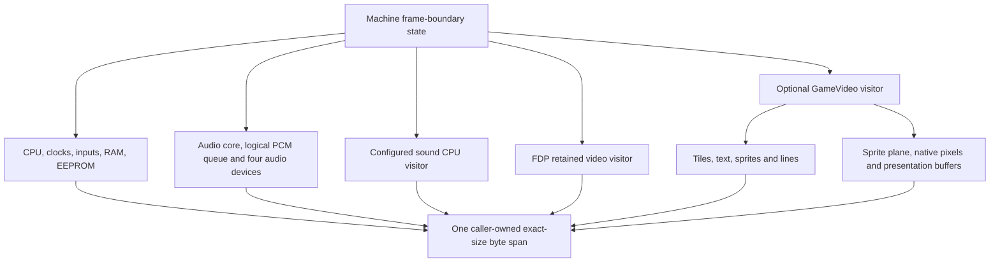

# Snapshots

**What you will learn.** This page explains the canonical machine snapshot. You learn why rollback needs it, which byte rules it follows, what it contains, how big it is, and how to add new state to it.

## Why rollback needs snapshots

A rollback goes back in time. The engine must put the whole machine in the exact state it had at an earlier frame. The engine cannot compute that state from the present state. So the engine saves a copy of the machine at every frame boundary. This copy is a **snapshot**.

A snapshot must be complete. If one field is missing, that field keeps its newer value after the restore. The resimulation then starts from a wrong state. The two clients no longer agree.

A snapshot must also be fast and must not allocate memory. The engine saves one snapshot for every simulated frame. On Apple M5 in Release mode, docs/developer/VALIDATION.md reports a mean save time of 113.0 microseconds and a mean load time of 99.8 microseconds for the native configuration.

## The four functions

`Machine` has four snapshot functions. They are declared in `include/f3rt/machine.hpp`.

| Function | Behavior |
| --- | --- |
| `size_t state_size() const` | Returns the exact snapshot size for the machine as configured now. |
| `void save_state(std::span<uint8_t> dst) const` | Writes the snapshot to `dst`. `dst` must have exactly `state_size()` bytes. Throws `std::invalid_argument` for another size. |
| `void load_state(std::span<const uint8_t> src)` | Restores the snapshot from `src`. `src` must have exactly `state_size()` bytes. |
| `uint32_t state_crc() const` | Saves a snapshot into an internal scratch buffer and returns its CRC-32. |

Rules for the callers:

- Call these functions only at a frame boundary.
- Call them only from the emulation thread. No other thread may use the machine at the same time.
- Configure the sound driver and the video mode **before** the first call. The size depends on them.
- Use `load_state` only on bytes that the same build wrote. The function checks the size. It does not check the content.

`save_state` and `load_state` allocate no memory. `state_crc()` allocates its scratch buffer one time, at the first call. The rollback engine does not use `state_crc()` per frame. It computes the CRC of a snapshot that it already saved.

The API does not check thread ownership or frame-boundary timing at runtime. These are caller obligations. The audio visitor takes its device mutex, but that lock does not make the whole machine snapshot atomic. A host consumer must not race save/load or drain the device queue while rollback owns it.

The format has no magic, version header, section lengths, portable byte order or embedded checksum. Load modifies the machine as it reads; it is not a transactional untrusted-file import. Exact size alone does not prove compatible configuration or valid field contents. Some device loads clamp counts, but they do not validate every enum, index or latch.


## Reader and writer

`runtime/state_io.hpp` has two small classes.

- `StateWriter` holds a pointer and a remaining-byte count. `write(value)` copies a trivially copyable value with `memcpy`. `write_bytes`, `write_array` and `write_span` copy blocks. A `static_assert` rejects types that are not trivially copyable. A write past the end throws `std::runtime_error("StateWriter buffer overflow")`.
- `StateReader` is the mirror. `read`, `read_bytes`, `read_array`, `read_span`, `skip` and `advance` consume bytes. A read past the end throws `StateReader buffer underflow`.

The same header declares the packed `Canonical*` records. They sit between `#pragma pack(push, 1)` and `#pragma pack(pop)`. `CanonicalSoundOracle` aliases the packed C record from `runtime/state_oracle.h`. `CanonicalGameVideoHeader` is declared but not emitted as one record: the GameVideo visitors write those metadata fields in their component sections.

There is no separate "visitor" class. Each component has its own `save_state(StateWriter &)` and `load_state(StateReader &)` methods. `Machine::save_state` calls them in a fixed order. A sub-component that has its own span-based API (`Audio`, `Video`, `GameVideo`) gets a slice of the buffer. `Machine` makes the slice with `writer.current()` and `writer.advance(size)`.

```cpp
// runtime/eeprom.hpp: a typical component
void save_state(StateWriter &writer) const {
    CanonicalEeprom st{};
    std::memcpy(st.words, words.data(), sizeof(st.words));
    st.mode = uint8_t(mode);
    st.selected = selected ? 1 : 0;
    st.old_clock = old_clock ? 1 : 0;
    st.data_out = data_out ? 1 : 0;
    st.writable = writable ? 1 : 0;
    st.shift = shift;
    st.count = count;
    st.address = address;
    st.read_bit = read_bit;
    st.ready_at = ready_at;
    writer.write(st);
}
```

## Byte rules

1. **No pointers and no virtual tables.** Records hold values only.
2. **No padding and no uninitialized bytes.** Each record is packed to 1-byte alignment. Save visitors zero-initialize records or explicitly initialize every field before writing them.
3. **Fixed-width integers.** `bool` values become `uint8_t`. Enums become `uint8_t`.
4. **Host byte order.** Records are copied as they are. A snapshot is not a portable file. It belongs to one build on one kind of CPU.
5. **No diagnostic state.** Excluded: `native_blocks`, `fallback_instructions`, `fallback_hits`, `sound_trace`, video fallback counters, trace sinks, SDL objects, sockets and host clocks. A resimulation must not change the state because it did extra work.
6. **Queued audio is canonical.** See below.
7. **Derived caches are not saved.** The load function resets them.

## Layout and size

`Machine::save_state` writes eight sections in a fixed order. The table shows the layout for the netplay configuration: native sound driver and GameVideo at scale 1 with border 0. The offsets and sizes come from the `sizeof` values of the `Canonical*` records and from `Machine::state_size()`. The total matches the 4,231,509 bytes in docs/developer/VALIDATION.md.

| # | Section | Offset | Bytes | Content |
| --- | --- | ---: | ---: | --- |
| 1 | Main CPU | 0 | 135 | `CanonicalF3Cpu` |
| 2 | Clocks, inputs, coins | 135 | 108 | `CanonicalMachineClocks` |
| 3a | Main RAM | 243 | 131,072 | `ram` (0x20000) |
| 3b | Palette RAM | 131,315 | 32,768 | `palette` (0x8000) |
| 3c | Graphics RAM | 164,083 | 262,144 | `graphics` (0x40000) |
| 3d | Control RAM | 426,227 | 32 | `control` (0x20) |
| 3e | Shared RAM | 426,259 | 2,048 | `shared` (0x800) |
| 3f | Framebuffer | 428,307 | 296,960 | `pixels`, 320 by 232 ARGB8888 |
| 4 | EEPROM | 725,267 | 157 | `CanonicalEeprom` |
| 5 | Audio | 725,424 | 2,430,547 | See the audio table |
| 6 | Sound CPU | 3,155,971 | 140 | `CanonicalSoundNative` |
| 7 | FDP video | 3,156,111 | 311,914 | See the video table |
| 8 | GameVideo | 3,468,025 | 763,484 | See the GameVideo table |
| | **Total** | | **4,231,509** | |

::: tip
With the oracle (interpreted) sound driver, section 6 is the 355-byte `f3rt_sound_oracle_state` record. The total is then 4,231,724 bytes. With GameVideo scale 2 and border 48, the presentation buffers add bytes. NETPLAY.md reports 6,547,797 bytes for that case. The frontend does not allow it in netplay.
:::

### Section 1 and 2: CPU and clocks

`CanonicalF3Cpu` holds D0 to D7, A0 to A7, PC, USP, SSP, MSP, VBR, SFC, DFC, CACR, CAAR, SR, the `stopped` and `halted` flags, the lazy condition-flag fields (`cc_src`, `cc_dst`, `cc_result`, `cc_op`, `cc_width`, `cc_mask`), `cycles` and `dispatch_deadline`.

The recompiler computes condition flags lazily. The snapshot saves the lazy fields as they are. A load therefore does not change them. See [Flags, timing and deadlines](/developer/recompiler/flags-and-timing).

`CanonicalMachineClocks` holds `hardware_cycles`, `next_vblank`, `irq3_at`, `watchdog_at`, `frame`, `pending_irqs`, `timer_control`, the six input ports, `system_inputs`, `coin_count[4]`, `coin_locked[4]` and `coin_word[2]`.

On load, `Machine::load_state` also sets `cpu.cc_pad = 0` and `cpu.runtime = this`. These two fields are not saved.

### Section 3 and 4: memory and EEPROM

These sections are plain byte copies. The EEPROM record holds the 64 words and the serial state machine: mode, chip select, clock latch, data out, write enable, shift register, bit count, address, read bit and the ready deadline.

### Section 5: audio

Audio is the largest section because the ES5510 DSP has a 2 MiB delay RAM.

| Part | Offset in section | Bytes | Content |
| --- | ---: | ---: | --- |
| `CanonicalAudioCore` | 0 | 135 | Bank mask, bank table, reset and halt lines, gain model, gain values, mixer accumulators, tick counters, queued-frame count |
| Work RAM | 135 | 65,536 | Sound CPU RAM (`WORK_RAM_SIZE` is 0x10000) |
| Queued PCM | 65,671 | 262,144 | 32,768 stereo frames of `float`, in playback order, padded with zeros |
| ES5505 (OTIS) | 327,815 | 3,281 | Chip state and 32 voices |
| ES5510 (DSP) | 331,096 | 2,099,371 | Registers (171 bytes), 192 GPRs (768 bytes), 160 instructions (1,280 bytes), delay RAM (2,097,152 bytes) |
| MC68681 (DUART) | 2,430,467 | 66 | Registers, timer, two transmitters |
| MB87078 (volume) | 2,430,533 | 14 | Channel latches and gain indexes |

**Queued PCM.** The audio device holds generated samples in a ring buffer. Its physical read/write positions are not serialized. `Audio::save_state` writes `rb_count` frames in playback order from the read position, in one or two contiguous blocks. It zeroes the remaining bytes in the fixed 32,768-frame area. Load sets read position to 0 and write position to `count % capacity`. Equal logical queues therefore produce equal bytes. In rollback, each step drains machine audio before saving the next snapshot, so this queue is normally empty at saved boundaries.

### Section 6: sound CPU

The sound CPU runs in one of two modes.

- **Native mode.** `SoundNative::save_state` writes `CanonicalSoundNative`: a `CanonicalF3Cpu` plus `needs_reset` and `reset_cycles`. See [Sound-CPU compiler](/developer/recompiler/sound-compiler).
- **Oracle mode.** `Interpreter::save_sound_state` calls `f3rt_sound_core_export` (in `runtime/core_state.c`). The function copies the fields of the Musashi 68000 core into the packed `f3rt_sound_oracle_state` record (`runtime/state_oracle.h`). The record has no pointer and no cycle table. On load, `f3rt_sound_core_import` copies the fields back. The interpreter then binds its callbacks again.

### Section 7: FDP video

| Part | Bytes | Content |
| --- | ---: | --- |
| `CanonicalVideo` | 24,938 | Flags, sprite bank, control registers, row-usage maps and the 1024-entry sprite list |
| Buffered sprite RAM | 65,536 | The buffered copy of the sprite RAM |
| Sprite framebuffer | 221,184 | 432 by 256 values of 16 bits |
| Sprite priority row usage | 256 | Row-usage map for sprite priority |

FDP is the TC0630FDP video chip. The FDP renderer runs even when GameVideo draws the picture. So its state is always part of the snapshot. On load, the renderer resets its line-cache keys (`last_y`), and the next draw rebuilds them.

### Section 8: GameVideo

GameVideo is the renderer that draws from game data. It exists in the netplay configuration. See [Video](/developer/runtime/video/).

| Part | Bytes | Content |
| --- | ---: | --- |
| `rendered` flag | 1 | Whether the last frame was drawn from game data |
| `GameTiles` | 65,556 | 4 layers of 2048 tile cells, plus validity flags and unsupported-state markers |
| `GameText` | 33,541 | 4096 text cells, glyph RAM and tables |
| `GameSprites` | 58,395 | Staging, submitted and current sprite buffers (1024 each) and scroll registers |
| `GameLines` | 87,847 | 256 line parameter records and 256 scene-row records |
| Sprite plane | 221,184 | 432 by 256 values of 16 bits |
| Native pixels | 296,960 | 320 by 232 ARGB8888 |
| Presentation buffers | 0 | Only used when scale is not 1 or border is not 0 |


## Save/load visitor inventory

This table lists every visitor in the snapshot traversal. The load traversal follows the same order. It does not replace the machine with a new object.

| Owner and source | Saved representation | Load responsibilities outside byte copies |
| --- | --- | --- |
| `Machine`, `runtime/machine.cpp` | Main CPU, clocks, ports, coins, five RAM arrays and framebuffer | Rebind `cpu.runtime`, clear `cc_pad`, synchronize the main interpreter context |
| `Eeprom`, `runtime/eeprom.hpp` | `CanonicalEeprom` | Restore serial mode and pin state |
| `Audio::Impl`, `runtime/audio.cpp` | `CanonicalAudioCore`, work RAM, canonical PCM, then four audio devices | Restore logical queue at position 0; recompute gains |
| `ES5505`, `runtime/third_party/audio/es5505.cpp` | `CanonicalES5505` with 32 voices | Restore chip and voice state; keep ROM/callback ownership in process |
| `ES5510`, `runtime/third_party/audio/es5510.cpp` | Register record, GPRs, instructions, DRAM | Restore pipeline and host latches as well as memory |
| `MC68681`, `runtime/third_party/audio/mc68681.cpp` | `CanonicalMC68681` with two transmitter records | Reapply the output-port callback and update interrupts |
| `MB87078`, `runtime/third_party/audio/mb87078.cpp` | `CanonicalMB87078` | Recompute channel gains |
| `SoundNative`, `runtime/sound_native.cpp` | `CanonicalSoundNative` | Rebind sound CPU runtime owner and clear `cc_pad` |
| `Interpreter`, `runtime/interpreter.cpp`, `runtime/core_state.c` | `f3rt_sound_oracle_state` | Import value fields; rebind active sound context callbacks when reset is not pending |
| `Video::Impl`, `runtime/video.cpp` | `CanonicalVideo`, buffered sprite RAM, sprite plane, priority usage | Invalidate playfield/text/pivot line caches and clear derived oracle scene rows |
| `GameVideo::Impl`, `runtime/game_video.cpp` | Rendered byte, four game visitors, sprite plane, native and presentation pixel buffers | Restore all retained buffers, not an approximate image |
| `GameTiles`, `runtime/game_tiles.cpp` | Four tile maps and per-layer metadata | Restore validity and unsupported-state markers |
| `GameText`, `runtime/game_text.cpp` | Text cells, glyphs, row usage, references and metadata | Restore the retained text map |
| `GameSprites`, `runtime/game_sprites.cpp` | Staging, submitted and current sprite lists and metadata | Restore lists and registers; clamp counts to capacity |
| `GameLines`, `runtime/game_lines.cpp` | Line parameters, scene rows, control registers and metadata | Restore retained rows and unsupported-state markers |

Immutable ROM bytes, decoded graphics, dispatch tables and callback targets remain owned by the configured machine. The snapshot does not rebuild or serialize their host addresses.

### Audio record fields

The following inventory names the fields in `runtime/state_io.hpp`. Arrays use their declared fixed capacities.

| Record | Fields |
| --- | --- |
| `CanonicalAudioCore` | `bank_mask`, `bank_table[32]`, `reset_asserted`, `esp_halted`, `gain_model`, `volume_gain[2]`, `otis_gain[2]`, `output_gain[2]`, `cpu_accum`, `duart_accum`, `sample_accum`, `clock_ticks`, `generated_frames`, `rb_count` |
| `CanonicalES5505` | `master_clock`, `sample_rate`, `active_voices`, `current_page`, `irqv`, `mode`, `voice_index`, `voice_bank[32]`, `voices[32]` |
| Each `CanonicalES5505Voice` | `control`, `freqcount`, `start`, `lvol`, `end`, `lvramp`, `accum`, `rvol`, `rvramp`, `ecount`, `k2`, `k2ramp`, `k1`, `k1ramp`, filter history `o4n1`, `o3n1`, `o3n2`, `o2n1`, `o2n2`, `o1n1`, `index`, `filtcount` |
| `CanonicalES5510Registers` | `halt_asserted`, `pc`, `state`, `ser_regs[8]`, `machl`, `mac_overflow`, `dil`, `memsiz`, `memmask`, `memincrement`, `memshift`, `dlength`, `abase`, `bbase`, `dbase`, `sigreg`, `mulshift`, `ccr`, `cmr`, `dol[2]`, `dol_count`, `dol_latch`, `dil_latch`, `dadr_latch`, `gpr_latch`, `instr_latch`, `ram_sel`, `host_control`, `host_serial`, `alu`, `mulacc`, `ram`, `ram_p`, `ram_pp` |
| `CanonicalES5510Alu` | `aReg`, `bReg`, `src`, `dst`, `op`, `aValue`, `bValue`, `result`, `update_ccr`, `write_result` |
| `CanonicalES5510MulAcc` | `cReg`, `dReg`, `src`, `dst`, `accumulate`, `cValue`, `dValue`, `product`, `result`, `write_result` |
| Each `CanonicalES5510Ram` | `address`, `io`, `cycle` |
| `CanonicalMC68681` | `acr`, `imr`, `isr`, `ivr`, `opcr`, `opr`, `ipcr`, `ip_last_state`, `ctr_preset`, `ct_remaining`, `half_period`, `ct_running`, channel A `mr1a`, `mr2a`, `mr_ptra`, `sra`, `csra`, `cra`, channel B `mr1b`, `mr2b`, `mr_ptrb`, `srb`, `csrb`, `crb`, `tx[2]` |
| Each `CanonicalMC68681Tx` | `phase`, `baud`, `remaining`, `sent`, `counter_prescaler`, `clock`, `running`, `enabled`, `buffered` |
| `CanonicalMB87078` | `gain_index[4]`, `channel_latch[4]`, `control`, `data` |

The DSP visitor also writes 192 `int32_t` GPRs, 160 `uint64_t` instructions and 1,048,576 `int16_t` delay words. Hardware values use narrower meaningful bit widths, but the snapshot uses these fixed storage types.

### Musashi sound record fields

`f3rt_sound_oracle_state` contains these fields:

- `cpu_type`, `dar[16]`, `dar_save[16]`, `ppc`, `pc`, `sp[7]`, `vbr`, `sfc`, `dfc`, `cacr`, `caar`, `ir`.
- Status fields `t1_flag`, `t0_flag`, `s_flag`, `m_flag`, `x_flag`, `n_flag`, `not_z_flag`, `v_flag`, `c_flag`, `int_mask`, `int_level`, `stopped`.
- Prefetch and execution fields `pref_addr`, `pref_data`, `address_mask`, `sr_mask`, `instr_mode`, `run_mode`, `has_pmmu`, `pmmu_enabled`, `fpu_just_reset`, `reset_cycles`.
- Scalar timing fields `cyc_bcc_notake_b`, `cyc_bcc_notake_w`, `cyc_dbcc_f_noexp`, `cyc_dbcc_f_exp`, `cyc_scc_r_true`, `cyc_movem_w`, `cyc_movem_l`, `cyc_movem_store_w`, `cyc_movem_store_l`, `cyc_shift`, `cyc_reset`.
- Interrupt fields `virq_state`, `nmi_pending`.
- MMU fields `mmu_crp_aptr`, `mmu_crp_limit`, `mmu_srp_aptr`, `mmu_srp_limit`, `mmu_tc`, `mmu_sr`.
- `sound_needs_reset`, supplied by the interpreter wrapper.

Scalar cycle adjustments are saved. Host cycle-table pointers are not. Callback and table ownership stays in the existing context.

### Retained video record fields

| Record or visitor | Fields |
| --- | --- |
| `CanonicalVideo` | `has_buffered_spriteram`, `flipscreen`, `sprite_bank`, `sprite_trails`, `sprite_extra_planes`, `sprite_pen_mask`, `sprite_count`, `control_0[8]`, `control_1[8]`, `tilemap_row_usage[32][8]`, `textram_row_usage[64]`, `spritelist[1024]` |
| Each `CanonicalTempsprite` | `code`, `color`, `flip_x`, `flip_y`, `pri`, `x`, `y`, `scale_x`, `scale_y` |
| Each `CanonicalGameTileCell` | `tile`, `palette`, `pen_mask`, `flip_x`, `flip_y`, `blend` |
| GameTiles metadata | Per layer: `valid` byte and `unsupported` u32 |
| Each `CanonicalGameTextCell` | `tile`, `palette`, `flip_x`, `flip_y` |
| GameText remainder | 256 × 64 glyph bytes, 256 glyph-row bytes, 256 u16 references, `map_valid` byte, `unsupported_pc` u32 |
| Each `CanonicalSceneSprite` | `x`, `y`, `scale_x`, `scale_y`, `tile`, `palette`, `flip_x`, `flip_y` |
| GameSprites metadata | Three u32 counts, each before its 1024-entry list; current flip/pen-mask/trails, scroll X/Y, register flip/pen-mask/trails, supported byte, unsupported PC |
| `CanonicalLineParams` | `clip[4]`, `blend[4]`, `x_sample`, `bg_palette`, `pivot`, `sp[4]`, `pf[4]` |
| `CanonicalLinePivot` | `mix_value`, `prio`, `blend_mode`, `clip_enable`, `clip_inv`, `clip_inv_mode`, `blend_select_v`, `x_sample_enable`, `pivot_control`, `pivot_enable` |
| `CanonicalLineSprite` | `mix_value`, `prio`, `blend_mode`, `clip_enable`, `clip_inv`, `clip_inv_mode`, `blend_select_v`, `x_sample_enable` |
| `CanonicalLinePlayfield` | `mix_value`, `prio`, `blend_mode`, `clip_enable`, `clip_inv`, `clip_inv_mode`, `x_sample_enable`, `colscroll`, `x_scale`, `y_scale`, `pal_add`, `rowscroll` |
| `CanonicalSceneRow` | `playfields[4]`, `sprites[4]`, `text`, `clips[4]`, `blend[4]`, `background`, `text_x`, `text_y`, `mosaic_period`, `bitmap` |
| Each `CanonicalScenePlayfield` | `layer`, `source_x`, `source_y`, `x_step`, `y_step`, `y_fraction`, `palette_add` |
| Each `CanonicalSceneLayer` | `priority`, `blend_mode`, `clip_enabled`, `clip_inverted`, `clip_inverse`, `enabled`, `blend_select`, `mosaic` |
| Each `CanonicalSceneClip` | `left`, `right` |
| GameLines remainder | `control_0[8]`, `control_1[8]`, `flipscreen` u16, supported byte, unsupported PC |
| GameVideo remainder | Rendered byte; 432 × 256 u16 sprite plane; 320 × 232 u32 native pixels; both configured presentation buffers |

Unsupported-state markers affect renderer behavior and are saved. Fallback diagnostic counters are not. Keep those two categories separate.



## Why the snapshot holds the framebuffer and renderer state

The checksum covers the whole snapshot. A renderer difference therefore counts as a desync. This is intended. Pixel output is part of the proof that both clients agree. The oracle also compares the framebuffer CRC at the end of a match.

The renderer state is also real machine state. Sprite lists, line parameters and tile maps are built by writes that the CPU did earlier. A resimulation from a snapshot must see the same retained data.

## Sizes of the ring

The rollback engine allocates one buffer of `state_size() * (window + 1)` bytes at start. For the defaults this is 17 times 4,231,509, which is 71,935,653 bytes (about 68.6 MiB). The ring is described in [Rollback engine](/developer/netplay/rollback).

## How to add new machine state

Follow this checklist when you add a field to any device.

1. Decide if the field can change the future behavior of the machine. If it can, it is state. If it is a cache or a counter for diagnostics, it is not state.
2. Add the field to the matching `Canonical*` record in `runtime/state_io.hpp`. Use fixed-width types.
3. Write the field in the `save_state` function. Read it in `load_state`. Keep both in the same order.
4. Update the matching `state_size()` function. For a plain `sizeof(Record)` size this is automatic.
5. Reset any derived cache in `load_state`.
6. Run the oracle snapshot suite. It compares two runs from the same snapshot. A missing field shows as a mismatch in state CRC, RAM, pixels, PCM or the sound trace. See [Oracle and verification](/developer/netplay/oracle).
7. Update the inventory in [docs/developer/ABI-CHANGES.md](https://github.com/ansxor/f3-recomp/blob/main/docs/developer/ABI-CHANGES.md#machine-snapshot-contract-and-canonical-state-inventory).

The build hash changes when you change the source. Old and new builds cannot join the same match.

## The canonical state CRC

`Machine::state_crc()` returns `f3rt::crc32` of the snapshot bytes. `crc32` is the standard CRC-32 (reflected polynomial `0xedb88320`, initial value all ones, final complement) in `runtime/rom.cpp`. The same function makes:

- the `initial_crc` field of the handshake identity (CRC of the machine after construction, before frame 0 runs),
- the checksums that the clients exchange every 60 confirmed frames,
- the final CRC of a finite match.

## Related pages

- [Rollback engine](/developer/netplay/rollback)
- [Determinism rules](/developer/netplay/determinism)
- [Machine, memory and scheduling](/developer/runtime/machine)
- [Audio](/developer/runtime/audio/)

## Source

- [Canonical C++ records and bounded I/O](https://github.com/ansxor/f3-recomp/blob/main/runtime/state_io.hpp).
- [Machine traversal and size](https://github.com/ansxor/f3-recomp/blob/main/runtime/machine.cpp).
- [Musashi canonical C record](https://github.com/ansxor/f3-recomp/blob/main/runtime/state_oracle.h).
- [Musashi value bridge](https://github.com/ansxor/f3-recomp/blob/main/runtime/core_state.c).
- [ABI state inventory](https://github.com/ansxor/f3-recomp/blob/main/docs/developer/ABI-CHANGES.md#machine-snapshot-contract-and-canonical-state-inventory).

