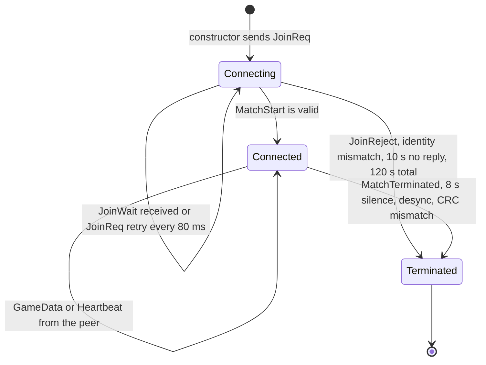
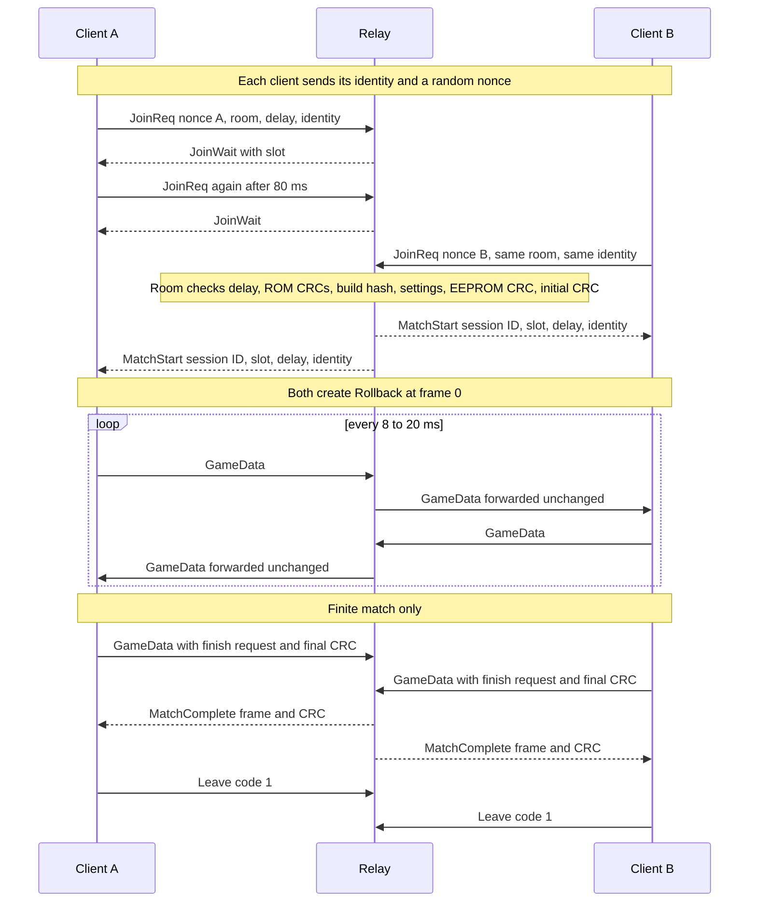

# Transport

**What you will learn.** This page explains `Transport`, the client network layer in `runtime/netplay_transport.cpp`. You learn how a client joins a match, how it sends inputs reliably over UDP, how it measures the round-trip time, how a finite match ends, and how a client detects that the peer is gone.

The exact byte layout of each packet is in [Wire protocol](/developer/netplay/protocol). This page explains the behavior.

## Why UDP and why a custom reliability layer

Game inputs are small and frequent. A late actual input is still needed: rollback uses it to repair prediction. TCP can hold later bytes behind a lost packet. UDP lets the client choose a bounded repeated input run.

Each packet repeats the oldest unacknowledged inputs, up to 128 words. The next packet repeats them again until the peer acknowledges them. The client does not need a retransmission timer for each packet.

## Public interface

The class is declared in `include/f3rt/netplay_transport.hpp`.

| Member | Behavior |
| --- | --- |
| `Transport(TransportOptions, Identity)` | Validates the options, opens the socket, sends the first `JoinReq`. Throws `std::invalid_argument` for a bad room name, player or delay. |
| `pump(simulated_frame, confirmed_frame)` | Reads all pending packets. Does timeouts. Sends packets when due. Call it in every loop pass. Throws `std::runtime_error` on any fatal error. |
| `ready()` | True after a valid `MatchStart`. |
| `slot()` | The assigned slot, 0 or 1. Throws before `ready()`. |
| `submit(Input)` | Stores a local input word for the next packets. |
| `receive(Input&)` | Returns the next remote input in frame order, once. |
| `checksum(Checksum)` | Queues a local checksum for sending. Compares it with received peer checksums. |
| `receive_checksum(Checksum&)` | Returns the next queued peer checksum. |
| `finish(frame, crc)` | Starts the end-of-match exchange and sends a packet now. |
| `finished()` | True when the relay confirmed the final verdict. |
| `rtt_ms()`, `frame_advantage()`, `status()` | Values for the title text. |

`TransportOptions` has `server` (text `HOST:PORT`), `room`, `player` (0 = automatic, 1 or 2) and `delay` (default 2).

`Identity` has the seven ROM CRCs, the build hash, the settings word, the EEPROM CRC and the initial-state CRC. `machine_identity(Machine&, delay)` in `runtime/netplay.cpp` builds it. See [Build identity](/developer/netplay/build-identity).

## State machine



There is no way back from `Terminated`. The transport throws from `pump` and the frontend stops. To play again, the user starts a new process. See [Disconnect and restart](#disconnect-and-restart).

## Constants

| Constant | Value | Meaning |
| --- | ---: | --- |
| `kMagic` | `0x46334E50` | ASCII `F3NP` |
| `kProtocolVersion` | 1 | |
| `kHeaderSize` | 20 | |
| `kIdentitySize` | 72 | |
| `kMaxPacketSize` | 1400 | Largest datagram |
| `kInputMask` | `0x07FF` | Valid input bits |
| `kMaxUnackedInputs` | 512 | `submit` throws when the frame exceeds effective ACK + 512; when ACK is none, the effective value is `delay` |
| `kInputRingCapacity` | 2048 | Local and remote input history |
| `kChecksumRingCapacity` | 512 | Checksum queues and history |
| `kPingTableCapacity` | 64 | Outstanding pings |
| `kMinSendIntervalMs` | 8 | At most 125 packets per second |
| Join retry | 80 ms | In state Connecting |
| No server reply | 10 s | Handshake fails |
| Total wait | 120 s | Waiting for an opponent |
| Idle send | 20 ms | Keep-alive when nothing is pending |
| Peer silence | 8000 ms | Connection fails |

Input, checksum and ping storage uses fixed arrays. The packet send path uses fixed member and stack buffers. Construction, option strings, `status()` and error formatting can allocate. The zero-allocation claim does not apply to all transport operations.

## Opening the socket

`init_socket()` does these actions:

1. It splits `server` at the **last** colon. The text after it is the port. The default port is 9000 when there is no colon. An IPv6 address needs a port, and the code does not handle brackets.
2. It calls `getaddrinfo` with `AF_UNSPEC` and `SOCK_DGRAM`. IPv4 and IPv6 work.
3. It creates the socket, sets it to non-blocking and calls `connect()`.

`connect()` on a UDP socket does not send anything. It makes the kernel drop datagrams from every other address. The client therefore hears only the relay.

## The join handshake

The constructor creates a random 64-bit **nonce** with `std::random_device` and `std::mt19937_64`. It replaces zero with 1. The nonce identifies this client process in the relay and correlates replies. It is not authentication.

The handshake has these steps.

1. The client sends `JoinReq` with the nonce, the requested slot, the delay, the room name and the 72-byte identity.
2. While the state is Connecting, `pump` sends `JoinReq` again every 80 ms. The relay treats a repeated request with the same nonce as the same request.
3. The relay answers each request with `JoinWait` while the room has one player. The client stores the slot and resets its "last server reply" timer.
4. When the second player joins, the relay sends `MatchStart` to both players.
5. The client accepts `MatchStart` only if all of these are true:
   - the packet is long enough (at least 104 bytes),
   - the nonce equals its own nonce,
   - the slot is 0 or 1,
   - the session ID is not zero,
   - the delay field equals the local delay,
   - the peer identity in the packet equals the local identity in every field.
6. The client stores the slot and the session ID, sets `is_ready` and enters Connected.

An unrelated nonce or a short packet is ignored. Invalid slot, zero session, delay mismatch or identity mismatch terminates the join and throws. The relay already checks identity, so the client check is a second layer.

`JoinReject` throws `netplay join rejected: <reason> (<message>)`. The reasons are listed in [Wire protocol](/developer/netplay/protocol#reject-codes).

After `ready()`, the frontend creates the `Rollback` object. This happens at frame 0 of the machine. Both clients start to simulate only after the handshake.



## Sending: `GameData`

After the handshake, all traffic is `GameData` packets. `pump` decides when to send.

The relay forwards `GameData` packets without change. The peer reads them. The packet has five jobs at once.

| Job | Fields |
| --- | --- |
| Carry inputs | `input_start`, `input_count`, the words |
| Acknowledge inputs | `ack_f` |
| Carry and acknowledge checksums | checksum list, `ack_cs` |
| Measure round-trip time | `ping`, `pong` |
| Report progress and end the match | `simulated frame`, finish fields |

### When `pump` sends

`pump` sends a packet when at least 8 ms passed since the last send and any of these is true:

- the peer has not acknowledged the latest submitted input,
- at least one checksum is not acknowledged,
- at least 20 ms passed since the last send,
- `finish()` was called.

Regular connected sends are limited to a nominal 125 packets per second. Idle traffic is due after 20 ms. `finish()` also sends immediately outside that pacing gate. Actual rates depend on how often the application pumps.

### What a packet holds

The `send_game_data` function does these steps:

1. It increases `ping_counter` and stores the send time in the ping table.
2. It sets the flags: `FinishReq` if `finish()` was called, plus `FinishAck` if the peer finish data was already received.
3. It chooses `input_start`. This is `peer_ack_frame + 1`, or `delay` if the peer has acknowledged nothing. The peer ACK starts at `delay - 1` (or "none" for delay 0).
4. It adds the words for frames `input_start` upward, up to the latest submitted frame. It stops at 128 words or at the first missing frame.
5. It adds up to 8 checksums whose frame is above the checksum ACK of the peer. The oldest come first.
6. It writes `ack_f`, `ack_cs`, the ping and the pong.
7. If `FinishReq` is set, it adds the final frame and CRC.
8. It sends the packet. The largest possible packet is 20 + 30 + 256 + 64 + 8 = 378 bytes.

A packet repeats the oldest unacknowledged run, up to 128 inputs. An input can be sent many times. This redundancy replaces per-packet retransmission timers.

## Receiving: validate first, then apply

`handle_packet` checks the length, the magic and the version. Other checks depend on the type. For `GameData` the packet must have the active session ID and the slot of the **other** player.

`validate_and_handle_game_data` works in two passes.

**Pass 1 checks the packet and changes nothing.** A failed check drops the whole packet without a sound, and the liveness timer is **not** refreshed. The checks are:

1. The payload has at least 30 bytes.
2. The flags contain only `FinishReq` and `FinishAck`.
3. The flags field in the payload equals the flags field in the header.
4. `input_count` is at most 128, and the words fit in the packet.
5. If `input_count` is above zero, `input_start` is at least `delay`.
6. `input_start + input_count` does not overflow 32 bits.
7. Every word has only bits in `0x7ff`. A bad word is a **fatal error** (`netplay peer sent invalid input word`), not a drop.
8. `checksum_count` is at most 32, and the pairs fit in the packet. Each checksum frame is at least `delay`.
9. If `FinishReq` is set, 8 more bytes exist.
10. The packet length is exactly the sum of the parts. No byte is left over.
11. If local inputs have been submitted, `ack_f` must not exceed the latest submitted frame. If local checksums have been submitted, `ack_cs` must not exceed the latest submitted checksum frame. The none sentinel is exempt.

**Pass 2 applies the packet.**

1. It refreshes the liveness timer.
2. It raises `peer_simulated_frame` to the packet value if it is larger.
3. It stores the peer ping ID for the pong in the next packet. It processes the pong (see [Round-trip time](#round-trip-time)).
4. It raises `peer_ack_frame` and `peer_ack_checksum_frame` if the new ACK is larger.
5. It stores each input word in the receive ring. If the slot already holds that frame with another word, it throws `netplay input mutation detected at frame N`.
6. For each checksum it compares with the local checksum of that frame. A difference throws `netplay desync detected at frame N` (hexadecimal CRCs). Then it queues the checksum if it is not already queued.
7. It reads the finish data (see [Ending a match](#ending-a-match)).

## Input delivery and ACKs

The receive ring holds up to 2048 frames. `receive(Input&)` gives the frame `next_expected_receive_frame` if it is present and not yet delivered. Then it marks the slot as delivered and increases the counter. It never skips a frame. A frame that arrives out of order waits until the earlier frames arrive.

The ACK that this client sends is `next_expected_receive_frame - 1`. It means: "I have given all frames up to this number to the application." The ACK grows only when the application calls `receive`. The frontend calls `receive` in every pass. The oracle also does. A client that never drains `receive` sends a stuck ACK.

The transport keeps delivered frames in the ring with their word. When the same frame arrives again with another word, the transport detects a changed input. This protects the rollback engine from a confused peer. Duplicates and reordered packets are harmless.

## Checksum exchange

Checksums use the same method as inputs but with a second ACK. This keeps loss of a packet from hiding a checksum.

- `checksum()` stores the pair in a 512-entry history and appends it to the outgoing queue.
- Each packet carries the oldest unacknowledged checksums, up to 8.
- The receiver queues new pairs. It acknowledges the highest checksum frame that it received (`latest_received_checksum_frame`).
- When a packet carries an `ack_cs`, the sender drops all queued checksums up to that frame.

The ACK advances to the highest frame of a pair newly added to the incoming queue. It does not advance for a pair omitted because the queue is full. It is not a general gap-tracking frontier. The normal sender repeats the oldest pending checksums first, so a valid packet carries the earlier pending pairs before any later one. A compatible sender must preserve that order.

Deduplication searches only the current incoming queue by frame. After a pair is popped, a later duplicate can enter the queue again. The rollback hash history provides the persistent remote-checksum mutation check.

When the outgoing or incoming 512-entry queue is full, the new pair is not appended. `checksum()` still updates local history. These queues never grow. Drain the receive and core outgoing APIs on every loop pass.

## Round-trip time

Every `GameData` packet carries a new ping ID and the last ping ID that the client received from the peer (the pong). When a packet arrives with a pong, `process_pong` looks the ID up in the 64-entry table. If found, the sample is `now - send time`. The first sample sets the value. Then the transport smooths it:

```text
rtt = rtt * 0.8 + sample * 0.2
```

The pong is sent with the next packet, not at once. The sample therefore includes the wait inside the peer, up to the send interval of 8 to 20 ms. The value is a bit larger than the network round trip. The frontend uses it only for the title and for pacing.

## Frame advantage

`frame_advantage()` returns `local simulated frame - peer simulated frame`. The peer simulated frame is the highest value that arrived in a packet. A positive value means this client runs ahead of the report from the peer. The report is already one transit time old. The frontend waits when the lead is too large. See [Frontend integration](/developer/netplay/frontend-integration#pacing).

## Ending a match

A match with `--frames N` ends in a controlled way. A match without `--frames` does not end by itself.

1. The frontend stops simulation at frame N and waits until `confirmed_frame()` is N.
2. It calls `finish(N, state_crc)`.
3. From now on, every `GameData` has `FinishReq` and carries `N` and the CRC. When the packet from the peer also had finish data, the client adds `FinishAck`.
4. The relay stores the finish data of each slot. When both slots have equal `(frame, CRC)`, the relay sends `MatchComplete` with that pair to **both** clients.
5. The client compares the pair with its own. If it is equal, `finished()` becomes true. If not, the client throws `netplay finish CRC mismatch`.
6. The client also compares its own pair with the finish data that the peer sent directly. A difference throws the same kind of error.

Only the `MatchComplete` from the relay ends the match. The `FinishAck` flag is informational. This design gives a final verdict that survives loss. The relay keeps the verdict and sends it again each time a finisher sends another finish packet. Even if the peer has already left, the second client still gets its verdict.

The verdict is retained in relay memory until the Finished room is more than 30 s idle. It is lost on relay restart. Repeated eligible traffic refreshes room activity. This is retryable completion, not durable result storage.


## Disconnect and restart

A client leaves in three ways.

| Case | What happens |
| --- | --- |
| Normal end | The destructor sends `Leave` with code 1 (`kLeaveNormalFinished`) if `finished()` is true. The relay does not stop the peer. |
| Abort | The destructor sends `Leave` with code 0 (`kLeaveAbort`) for any other exit while Connected. This includes an exception. The relay sends `MatchTerminated` to the peer. The peer throws `netplay disconnected: opponent left match`. |
| Crash or cable | The peer sends nothing. After 8 s the client throws `netplay connection timeout: peer unreachable for 8 seconds`. The relay also times out the slot after 8 s and sends `MatchTerminated` with the text `opponent connection timed out`. |

The destructor sends `Leave` only while the state is Connected. An error that first sets the state to Terminated (for example a `MatchTerminated` packet) sends no `Leave`.

There is **no** hot rejoin. The relay resets a terminated room when the next `JoinReq` arrives, so players can use the same room code again after a stop. Both clients must then start a new process and a new match from frame 0. A client with a new nonce cannot join a running match; the relay rejects it with code 12. See [Relay server](/developer/netplay/server).

## What the transport does not do

- It never sends `Heartbeat` packets. It can read them. The relay forwards them. `GameData` already works as heartbeat.
- `pump` stores `confirmed_frame` in `local_confirmed_frame`, but the current code does not use the value.
- It does not change the delay while the match runs.
- It has no congestion control. It limits itself to 125 packets per second.

## Related pages

- [Wire protocol](/developer/netplay/protocol)
- [Relay server](/developer/netplay/server)
- [Rollback engine](/developer/netplay/rollback)
- [Write a compatible client](/developer/netplay/writing-a-client)

## Source

- [Client transport implementation](https://github.com/ansxor/f3-recomp/blob/main/runtime/netplay_transport.cpp).
- [Public transport API](https://github.com/ansxor/f3-recomp/blob/main/include/f3rt/netplay_transport.hpp).

