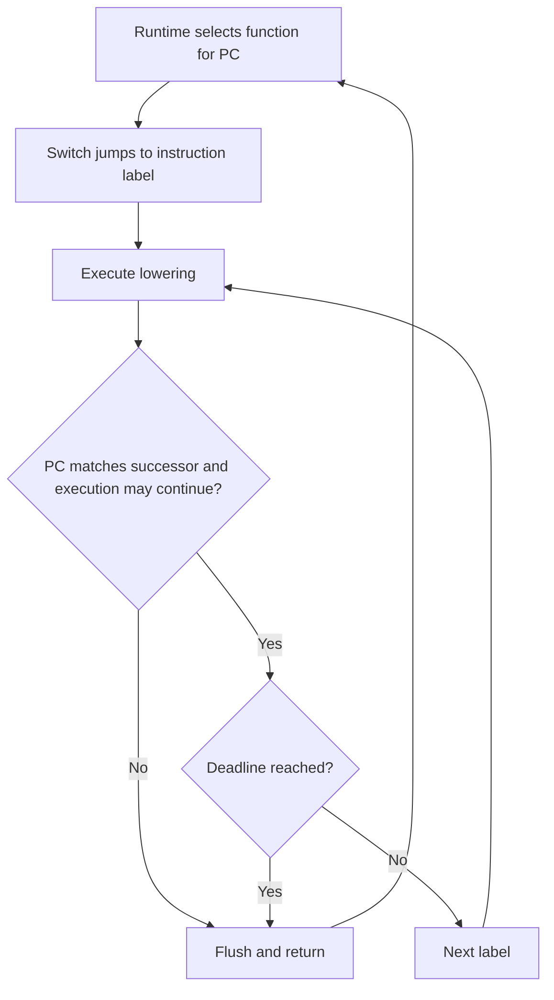

# Blocks, dispatch and sharding

The generator packs instruction statements into interruptible C functions. A sorted table maps each guest entry address to its native function.

Source: [`recomp/generate.py`](https://github.com/ansxor/f3-recomp/blob/main/recomp/generate.py).

## Grouping rules

`generate` defaults to 32 instruction slots and 128 blocks per source file. Both arguments must be positive.

In `all_aligned` mode, the page size is `max_block_instructions * 2` bytes. The generator groups decoded addresses by integer page number.

With the default, a page spans 64 bytes. It can hold up to 32 word-aligned starts, even when their decoded instructions overlap.

A start can lie inside another instruction's extension. Neither decode removes the other. Instructions can extend beyond the page that contains their start.

In recursive mode, the generator walks sorted discovery blocks. It removes duplicate PCs and splits on discontinuities or the size limit.

Any remaining decoded PC receives a one-instruction block. No decoded entry silently disappears.

## Function shape

Each function is named `f3_native_` followed by its first PC in hexadecimal. It starts with a switch and uses one scoped label per instruction.

This structural example omits the individual lowering statements:

```c
void f3_native_001000(f3_cpu *cpu) {
    switch (cpu->pc) {
    case 0x00001000u: goto L_001000;
    case 0x00001002u: goto L_001002;
    default: return;
    }
L_001000: {
    /* Instruction statements update PC and cycles here. */
    if (cpu->pc != 0x00001002u || cpu->stopped || cpu->halted ||
        cpu->cycles >= cpu->dispatch_deadline) {
        f3_cc_flush(cpu);
        return;
    }
    goto L_001002;
}
L_001002: {
    /* Instruction statements update PC and cycles here. */
    f3_cc_flush(cpu);
    return;
}
}
```

The braces isolate temporary C variables. The switch permits entry at an interior instruction without executing earlier instructions.

In exhaustive mode, continuation uses the actual successor `pc + insn.size`. It emits an explicit `goto` only when that successor belongs to the page.

This prevents C text order from executing an overlapping decode. A successor outside the page returns to dispatch.

Recursive blocks use guarded C fallthrough to the next listed instruction. Control transfers return when the resulting PC differs from that successor.

A branch to its sequential successor can continue within the function. Other branch destinations use dispatch, even when a label exists nearby.



## Unsupported instructions

When `lower` returns `None`, the label flushes flags and calls `f3_fallback(cpu)`. A false result sets `cpu->halted`.

The label then returns. This is an explicit one-instruction fallback path, not a native no-op.

The runtime's strict-native policy can reject fallback. See [Exceptions and hooks](/developer/recompiler/exceptions-and-hooks).

## Shared exception entries

In exhaustive mode, selected failed decodes receive shared exception functions in `program.c`.

Primary A-line and F-line words select vectors 10 and 11. Other zero-base-cost words select vector 4, except RESET.

A valid primary opcode with a rejected extension is not proof of an illegal instruction. Such decoder failures remain unregistered and explicit in the report.

## Files and registration

Each full shard becomes `blocks_NNNN.c`. A final partial shard is also written. Each shard includes the ABI and `recomp/cpu_ops.h`.

`program.c` declares the native functions and writes sorted `translated_blocks` entries. Multiple PCs can point to one function.

`f3_generated_register` passes this table to `f3_register_blocks` and its immutable exclusion metadata to `f3_register_exclusions`. The generated header and C preamble require `F3RT_ABI_VERSION == 3`. Excluded starts receive neither native entries nor shared exceptions.

`sources.cmake` lists the shards and `program.c` in `F3_GENERATED_SOURCES`. It uses paths based on `CMAKE_CURRENT_LIST_DIR`.

`program.bin` stores the input image for the loader. It is not embedded in the C source.

`coverage.json` stores discovery results. `lowering.json` stores decoded, native, fallback, block, exception, and registered-entry counts.

The report also includes mnemonic counts, fallback PCs, output filenames, coverage mode, ABI version, and block size.

The generator writes current output files. It does not remove old shard files from an existing output directory. The current source list selects the new set.

See [Generated files](/reference/generated-files), [Flags and timing](/developer/recompiler/flags-and-timing), and [Runtime dispatch](/developer/runtime/cpu-abi#f3-dispatch).
