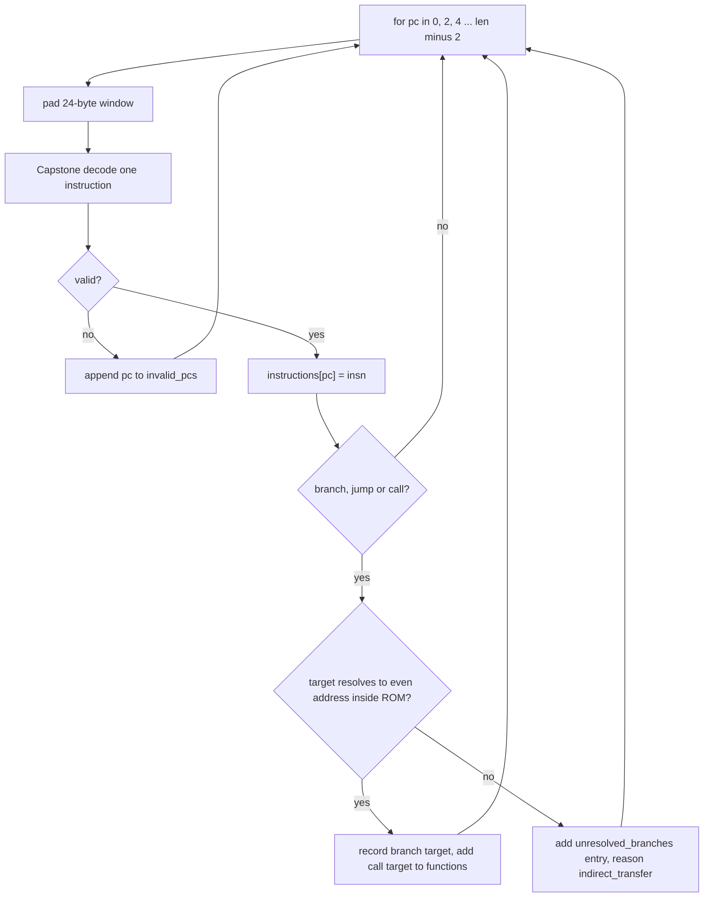
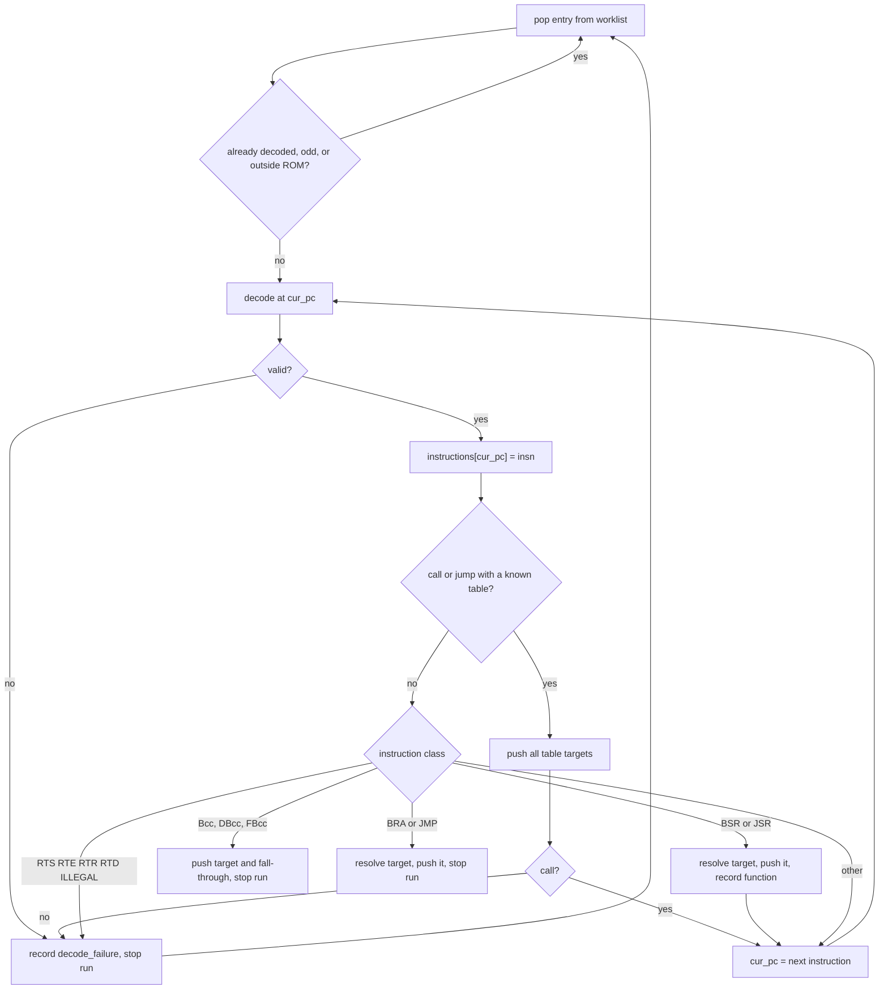

# Instruction discovery

**What you will learn.** This page explains how the recompiler finds the instructions in the ROM. It describes the two coverage modes, every kind of seed, the jump table scanners, the script scanner, the basic block step, and the `coverage.json` report. It also explains why the Japan config uses `all_aligned`.

The code is in [`recomp/discovery.py`](https://github.com/ansxor/f3-recomp/blob/main/recomp/discovery.py). The main function is `discover(rom, config)`.

## The problem

A ROM holds code and data with no marker between them. The recompiler must decide which addresses to turn into C. A wrong choice has two costs:

- If discovery misses code, the game jumps to an address that has no native block. The runtime then needs the interpreter for that instruction.
- If discovery accepts data as code, the output becomes larger. It does not become wrong, because the C for data is never run.

The 68020 makes the problem harder than a fixed-width CPU. Instructions are 2 to 22 bytes long, in 2-byte steps. A jump can land inside the extension words of another instruction. The game also uses computed jumps, jump tables and script byte code.

## Decoder setup

Discovery uses [Capstone](https://www.capstone-engine.org/) 5.0.9:

```python
md = Cs(CS_ARCH_M68K, CS_MODE_BIG_ENDIAN | CS_MODE_M68K_020)
md.detail = True
```

`detail = True` makes Capstone report the operands and addressing modes. The emitter needs them.

Discovery decodes one instruction at a time from a 24-byte window. If fewer than 24 bytes remain, the code pads the window with zero bytes. This padding matters at the end of the ROM. Capstone can read a truncated immediate as a shorter, valid instruction. The code decodes the padded window. Then it rejects any instruction that extends past the real end of the ROM.

An instruction is *valid* when all of these are true:

- `insn.id` is not 0.
- The mnemonic does not start with `dc` (Capstone's way to show a data word).
- `insn.size` is even.
- `pc + insn.size` is not past the ROM end.

Any other decode is a *decode failure*. Discovery stores the PC in `invalid_pcs`.

## Two coverage modes

`[discovery].coverage` in the config selects the mode.

| | `all_aligned` | `recursive` |
| --- | --- | --- |
| Idea | Decode at every nonexcluded even address. | Follow control flow from known roots. |
| Used by | `landmakrj` | Default when the key is missing. Also `landmakr`. |
| Needs metadata | No | Yes: entry points, tables, scripts |
| Finds starts inside another instruction | Yes, through independent aligned decodes. | Only when another discovered path enters that address. |
| Size of generated code | Large | Small |
| Seed scans | Off | On |

### Why `all_aligned` exists

Early builds used `recursive` mode. The game kept reaching code that discovery had not found. Each time, the project added more metadata: traced PCs, script tables, callbacks. `NOTES.md` shows the cycle. One run missed 1,265,436 executed instructions. Computed jumps, odd-address script pointers and long straight-line routines do not follow any fixed rule.

The project then switched to `all_aligned` for Japan and removed the observed-PC metadata. This mode does not need a proof that an address is code. It decodes everything. `NOTES.md` states the cost: the binary grew from 7,294,872 to 64,950,520 bytes in one Release build on an Apple Silicon machine. That is the price of the over-approximation.

::: info
A decoded address is not always real code. The report says so in `coverage_basis`: *"includes overlapping starts and data, not a reachability classification."*
:::

## `all_aligned` mode



The code loops over each nonexcluded interval in steps of two. Every decode is independent. An address that lies inside the extension words of an earlier instruction gets its own entry. Three decodes can overlap this way:

```text
address:  0x500  0x502  0x504
bytes:    203c   4e71   4e75
decode A: 0x500 MOVE.L #$4e714e75,D0   (uses 0x500..0x505)
decode B: 0x502 NOP                    (inside the immediate of A)
decode C: 0x504 RTS                    (inside the immediate of A)
```

The test `test_overlapping_starts` in `tools/test_discovery.py` uses these exact bytes. It checks that 0x500, 0x502 and 0x504 are all decoded.

All nonexcluded even addresses are independently decoded. Seed scans (`TRAP #1`, callbacks, scripts) are off in this mode. Vector/config/hook seeds and explicit jump-table targets inside exclusions reject generation; arbitrary apparent direct transfers into exclusions are reported for fatal runtime enforcement, because exhaustive data decodes also invent branches.

The mode still collects:

- `branch_targets`: direct targets of branches, jumps and calls.
- `functions`: seeds and direct call targets.
- `unresolved_branches`: indirect transfers such as `JMP (A0)`.

These items go into the report and into the basic block step. The emitter does not use them.

### Explicit exclusions

Top-level `[[exclude]]` records select half-open, even instruction-start ranges,
with `cpu`, `start`, `end`, `reason` and `evidence`. No instructions or shared
exception entries are generated for those PCs. Bytes remain accessible as data
or as operands of instructions starting outside the interval.

The full-image candidate count still equals `len(rom)/2`:
`aligned_decoded_count + aligned_invalid_count + excluded_candidate_count`.
The coverage report preserves each exclusion and apparent excluded transfers.
Computed destinations that cannot be proven at generation fail at runtime
before any interpreter fallback. See [Game config](/reference/game-config#exclude).


## `recursive` mode

### Seeds

A *seed* is a guest address where discovery starts to decode. There are two classes. The report counts them separately.

| Class | Source | Where in code |
| --- | --- | --- |
| Proven | Reset PC (vector 1) and all other vectors 2 to 255 that point into `0x400 .. len` at an even address. | `_extract_vector_seeds` |
| Proven | `entry_points` from the config. | `discover` |
| Proven | The `address` of each `[[hooks]]` entry. | `discover` |
| Speculative | Targets of `PEA` or `MOVE #imm` right before `TRAP #1`. | `_extract_trap1_tasks` |
| Speculative | `LEA d16(PC),An` followed by `MOVE.L An,<ea>` or `JMP <ea>`, if the target looks like code. | `_extract_lea_move_callbacks` |
| Speculative | Callback pointers in actor scripts. | `_extract_script_callbacks` |

The check for vector seeds ignores addresses below `0x400`, because the vector table itself occupies the first `0x400` bytes. It ignores vector 0 (the initial stack pointer). The speculative scans run only when `coverage` is not `all_aligned`. The two scans for traps and callbacks also need `scan_task_traps` and `scan_callbacks` to be true.

#### The `TRAP #1` scan

In the Taito operating system, `TRAP #1` starts a task. A task needs an entry address. The scan looks for the opcode word `0x4E41` at each even address. It decodes the 24 bytes before it. It walks the decoded instructions backward. The first `PEA` or `MOVE` that it finds decides. A `PEA` gives the entry. A `MOVE` gives the entry only when its source is an immediate value. The entry must be even and in `0x400 .. len`.

#### The callback scan

The scan looks at each pair of words. It accepts a pair when:

1. The first word matches `LEA d16(PC),An` (mask `0xF1FF`, value `0x41FA`).
2. The target is even and in `0x400 .. len`.
3. The second word is `MOVE.L An,<ea>` (a store of the address) or any `JMP` (a register link before a jump).
4. `_validate_code_sequence` accepts the target.

`_validate_code_sequence` decodes up to 32 instructions from the target. It succeeds when it reaches a return, a branch or a jump. It fails on any decode failure, `illegal`, or `dc`. A comment in the code says that the boot ROM uses `LEA return(PC),An; JMP routine` in place of `BSR` before a stack exists. The scan finds those return points.

### The worklist loop

The loop takes a seed from a queue and decodes forward. It stops at the end of a straight-line run.



The classes are sets of base mnemonics (the mnemonic text before the first `.`):

| Set | Members |
| --- | --- |
| `TERMINAL_MNEMONICS` | `rts`, `rte`, `rtr`, `rtd`, `illegal` |
| `CALL_MNEMONICS` | `bsr`, `jsr` |
| `UNCOND_BRANCH_MNEMONICS` | `bra`, `jmp` |
| `COND_BRANCH_MNEMONICS` | `bcc`, `bcs`, `beq`, `bge`, `bgt`, `bhi`, `ble`, `bls`, `blt`, `bmi`, `bne`, `bpl`, `bvc`, `bvs`, all `db` forms, and the `fb` forms |

`TRAP` is not a terminal. The loop assumes the trap returns and continues after it.

A call does not stop the run. The loop assumes the call returns and continues at the next instruction. A conditional branch or a jump stops the run.

### Resolving a branch target

`_resolve_target(insn, op)` returns a number or `None`.

| Operand kind | Target |
| --- | --- |
| Branch displacement (`BRA`, `BSR`, `Bcc`, `DBcc`) | `insn.address + 2 + disp` |
| Absolute short or long address | the address |
| PC with 16-bit displacement | `insn.address + 2 + disp` |
| Immediate | the value |
| Anything else (register indirect, indexed) | `None` |

A target is *usable* when it is even and inside the ROM. An unusable target adds an entry to `unresolved_branches`. The `reason` field is `indirect_call`, `indirect_branch` or `indirect_jump`.

### Jump table scanners

The code `JMP table(PC,D0.w)` jumps through a table. A scanner reads the table at discovery time and turns every entry into a seed. Four scanners exist. All of them need `scan_jump_tables` to be true.

| Function | Code pattern | How it reads the table |
| --- | --- | --- |
| `_scan_pci_index_table` | `JMP` or `JSR` with a PC-indexed operand (brief or base-displacement form). | The table of 16-bit signed offsets starts at `insn.address + 2 + disp`. The first offset must be positive and at most `0x7000`. Scan at most 128 entries or `first_offset / 2`. The smallest positive offset in the table marks where the table ends, because the code that follows the table is the first target. An offset of `-1` is skipped. Each target is `table + offset`. A target must be even and in `0x400 .. len`. |
| `_scan_pc_memi_table` | `JMP` or `JSR` with a PC memory-indirect operand (`([bd,PC,Xn])`). | The function reads base and outer displacements from the raw extension word. It does this because Capstone reports signed word displacements as unsigned numbers. It accepts the pre-indexed forms only. It then calls `_scan_absolute_table`. |
| `_scan_register_table` | `MOVEA.L table(PC,Xn),An` followed by `JMP (An)` or `JSR (An)`. Also `LEA table(PC,Xn),An` followed by `JMP ([An])`. | The function checks the jump opcode. It skips up to two `NOP` words (`0x4E71`) before the jump. It then checks the 4-byte load word. The load must use the same register, with a brief-format extension. It computes the table address and calls `_scan_absolute_table`. |
| `_scan_absolute_table` | Table of 32-bit absolute addresses. | Read at most 64 long words. Add an optional destination offset. Stop at the first entry that is odd, below `0x400`, past the ROM, or not decodable. If an entry points above the table start, the table cannot extend past that entry. A table can therefore have code before it. |

When a scanner returns targets, the loop stores them in `active_jump_tables[cur_pc]` and in `branch_targets[cur_pc]`. It adds each target to the worklist. For a `JSR`, each target also joins `functions`.

An explicit table from the config works the same way. The config gives the address of the `JMP` or `JSR` instruction and the targets. See `[[discovery.jump_tables]]` in the [game config reference](/reference/game-config). The key `targets` lists the destinations. As an alternative, `table` and `count` read `count` long words from the ROM.

### Inline string helpers

Some routines print a string that follows the `JSR` in the code. After the call, execution continues after the string. The config key `inline_string_helpers` lists these call targets. For such a call the loop skips the NUL-terminated string and rounds up to an even address. The next instruction starts there.

### Actor scripts

The game has a byte-code language for actors. A script contains pointers to native callback code. A linear scan would decode the script words as instructions and produce nonsense.

`_extract_script_callbacks(rom, spec)` follows the script instead. It uses the `[discovery.actor_scripts]` table of the config. Land Maker Japan's `[discovery]` section does not use it any more, but the code remains for `recursive` mode. The keys that the code reads:

| Key | Meaning |
| --- | --- |
| `operand_bytes` | List indexed by opcode. The number of operand bytes after the opcode word. A negative value marks an invalid opcode. |
| `code_pointer_opcodes` | Opcodes whose first long word operand is a native code address. |
| `pointer_field` | The actor field offset that holds a script pointer. |
| `return_opcode`, `call_opcode`, `jump_opcode` | Control-flow opcodes of the script language. |
| `entry_points` | Extra script roots. |
| `pointer_table_strides` | Table entry sizes for indexed script loads. Default `[4]`. |
| `pointer_tables` | Explicit tables. Each entry has `table` and `count`. |

The function finds script roots in three ways:

- `MOVE.L #script,d16(An)` where `d16` equals `pointer_field`.
- `MOVE.L table(PC,Xn),d16(An)` with the same field. Or the same load into a register, followed by a store of that register to `d16(An)`. A `NOP` word may sit between the two instructions. The code reads a table of script pointers at `table` for each configured stride, up to 64 entries.
- Entries in `entry_points` and `pointer_tables`.

It then walks each script. It collects the code pointers, follows calls and jumps, and stops at returns. A table walk stops when an entry does not point to a valid script opcode.

::: tip
`tools/test_discovery.py` has five tests for this code. They use a synthetic ROM. See "Tests" below.
:::

## Basic blocks

After the decode phase both modes build *basic blocks*. A basic block is a run of instructions with one entry and one exit. The code first computes a set of *leaders*. A leader starts a block. These addresses are leaders:

- Every seed that decoded.
- Every direct branch, jump and table target.
- The instruction after a conditional branch or a call.
- The instruction after a return or a jump.

A block ends after any return, jump, branch or conditional branch. A call does not end a block by itself. The next instruction is a leader, so the next block starts there.

The result is the dictionary `Discovery.blocks`, which maps a leader to its list of PCs. In `recursive` mode `generate` uses it to form native blocks. In `all_aligned` mode `generate` ignores it. The report still counts it (`total_blocks`).

## The `Discovery` object

`discover` returns a `Discovery` dataclass.

| Field | Content |
| --- | --- |
| `instructions` | `dict` from PC to Capstone `CsInsn`. Each PC is an entry. |
| `blocks` | Basic blocks: leader PC to list of PCs. |
| `functions` | Set of seeds and direct call targets. |
| `report` | The dictionary written to `coverage.json`. |
| `aligned_candidate_count` | `len(rom) / 2` in `all_aligned` mode, else 0. |
| `aligned_decoded_count` | Number of decoded instructions. |
| `aligned_invalid_count` | Number of decode failures. |
| `invalid_pcs` | Sorted list of PCs that failed to decode. |

## The `coverage.json` report

| Field | Meaning |
| --- | --- |
| `coverage_mode` | `all_aligned` or `recursive`. |
| `coverage_basis` | A sentence that states what the numbers mean. |
| `summary.rom_size_bytes` | Image size. |
| `summary.total_instructions` | Number of decoded instructions. |
| `summary.total_blocks`, `total_functions` | Number of basic blocks and function candidates. |
| `summary.potential_entries` | Same as `total_instructions`. |
| `summary.code_bytes`, `coverage_pct` | Bytes covered by at least one decoded instruction. `coverage_pct` is `code_bytes` divided by the image size, as a percent. |
| `summary.aligned_*`, `invalid_pcs_count` | Counts of candidates, decoded entries and failures. |
| `summary.proven_seeds_count`, `speculative_seeds_count` | Seed counts. |
| `summary.unresolved_branches_count` | Number of indirect transfers that discovery could not resolve. |
| `excluded_candidate_count`, `exclusions` | Skipped even starts and their explicit bounds/reason/evidence. |
| `excluded_transfers` | Apparent exhaustive direct transfers into exclusions; runtime-enforced, not proof of reachability. |
| `invalid_pcs`, `proven_seeds`, `speculative_seeds` | Sorted lists of PCs as `0x...` strings. |
| `unresolved_branches` | List of `{pc, mnemonic, op_str, reason}`. |
| `bank_summary` | One entry per 64 KiB bank: range, instruction count, code bytes, and a class (`contains_decoded_code` or `unreached_or_data`). |

In `recursive` mode `invalid_pcs` holds the PCs of the `decode_failure` entries.

`NOTES.md` records these results for earlier `recursive` runs. After script-aware discovery: 37,659 instructions, 138,528 bytes (6.606 %), and 86 unresolved transfers. In the final `recursive` run before the switch: 43,986 instructions, 163,286 bytes (7.786 %), 2,040 function candidates and 94 unresolved transfers. For `all_aligned`: 464,523 decoded starts from 1,048,576 aligned candidates. The report states that unresolved transfers and these counts do not prove which bytes are data.

## Limits of discovery

- Only even addresses are candidates. The 68020 requires even instruction addresses, so this is complete for instruction starts.
- `all_aligned` mode decodes data as code. Large zero-filled areas decode as `ORI.B #0,D0`. This is expected.
- `recursive` mode misses code that no scan can find. The runtime must then use the interpreter.
- Both modes ignore code in RAM. The dispatcher only looks up PCs below `0x200000` (the ROM). Any other PC goes to the fallback.
- A decode failure for a valid primary opcode word (for example a reserved addressing-mode extension) has no native entry. See [Blocks, dispatch and sharding](/developer/recompiler/blocks-and-dispatch).

## Tests

[`tools/test_discovery.py`](https://github.com/ansxor/f3-recomp/blob/main/tools/test_discovery.py) uses small ROM images that the test builds in memory. It has two test classes.

| Class | What it checks |
| --- | --- |
| `ActorDiscoveryTests` | Long callbacks and cyclic script calls. Register-staged script records. Explicit table counts that exclude adjacent data. Staged jump tables with backward destinations. A negative displacement in a full extension word. |
| `AllAlignedDiscoveryTests` | A computed target with no pointer in the ROM. An odd 24-bit pointer target. More than 32 straight-line instructions with no filter. Overlapping starts. Odd PCs and a truncated instruction at the ROM end. That `recursive` mode still works. |

Run them with:

```sh
PYTHONPATH=build/python python3 -m unittest discover -s tools -p 'test_*.py'
```

For the next stage, read [Instruction emission](/developer/recompiler/emission).
