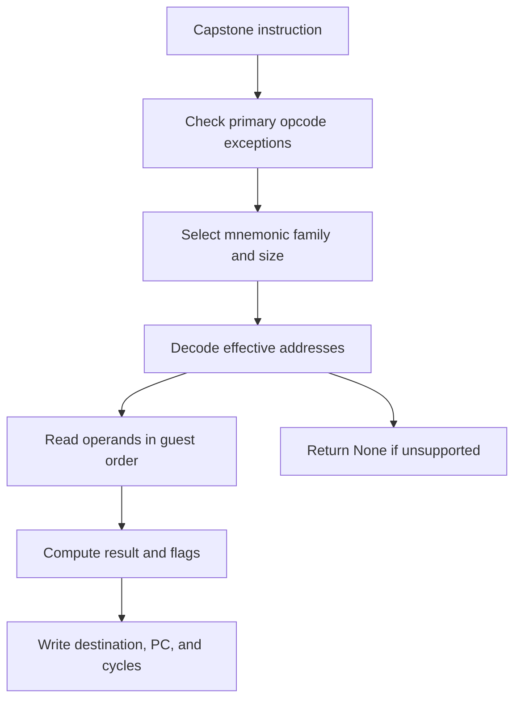

# Instruction emission

The emitter converts one decoded guest instruction into C statements. It does not compile guest functions into host calls.

Source: [`recomp/emitter.py`](https://github.com/ansxor/f3-recomp/blob/main/recomp/emitter.py).

## Contract

`lower(insn)` accepts a detailed Capstone `CsInsn`. It returns a list of C statements, or `None` for an unsupported lowering.

The statements use the `f3_cpu` ABI. They change registers, guest memory, condition codes, PC, and cumulative cycles. They can also call exception helpers.

`_get_base_mnemonic` removes the size suffix. `_get_size` reads Capstone's size, then the mnemonic suffix. Its final default is four bytes.

`MASK_MAP` and `SIGN_MAP` define byte, word, and long masks. `_decode_ea` describes operands. `_gen_write` emits destination writes.



There is no intermediate optimizer. The host C compiler optimizes the literal statements and inline helpers.

## Actual synthetic examples

These examples come from Capstone 5.0.9 and `lower()`, with the instruction address set to `0x1000`. They contain no game ROM data.

### Signed immediate

Bytes `70 ff` decode as `moveq #$ff, d0`:

```c
cpu->d[0] = 0xffffffffu;
cpu->cc_op = F3_CC_OP_LOGIC; cpu->cc_result = cpu->d[0]; cpu->cc_width = 4;
cpu->pc = 0x00001002u;
cpu->cycles += 2u;
```

`MOVEQ` sign-extends its eight-bit immediate. The pending logic flags use the full result. X remains unchanged.

### Partial data register

Bytes `10 01` decode as `move.b d1, d0`:

```c
uint32_t move_value = (uint8_t)(cpu->d[1] & 0xffu);
cpu->d[0] = (cpu->d[0] & 0xffffff00u) | ((move_value) & 0xffu);
cpu->cc_op = F3_CC_OP_LOGIC; cpu->cc_result = move_value; cpu->cc_width = 1;
cpu->pc = 0x00001002u;
cpu->cycles += 2u;
```

The upper 24 bits remain intact. The temporary captures the source before destination addressing changes any registers.

### Guest subroutine call

Bytes `61 02` decode as `bsr.b $1004`:

```c
cpu->a[7] -= 4u;
f3_write32(cpu, cpu->a[7], 0x00001002u);
cpu->pc = 0x00001004u;
cpu->cycles += 7u;
```

The return address lives on the guest stack. There is no host recursion. The block guard returns after this control transfer.

## Ordering rules

Source setup and reads precede destination setup. Postincrement source reads complete their register update before destination evaluation.

Read-modify-write destinations keep one effective address. Their postincrement follows the write. A byte access through A7 changes A7 by two bytes.

Long `MOVE` predecrement writes the low word first. `MOVEM` has its own ordered transfer loop. Bus callback order can affect devices.

Address arithmetic uses unsigned 32-bit values where required. This avoids host signed-overflow behavior during guest wraparound.

## What comes next

- [Addressing modes](/developer/recompiler/addressing-modes) explains operand decoding.
- [Instruction reference](/developer/recompiler/instruction-reference) covers every native family.
- [Flags and timing](/developer/recompiler/flags-and-timing) explains state and scheduling.
- [Blocks and dispatch](/developer/recompiler/blocks-and-dispatch) explains statement assembly.
- [Exceptions and hooks](/developer/recompiler/exceptions-and-hooks) explains calls into the runtime.
- [Limits](/developer/recompiler/limits-and-known-issues) separates decoder failures from unsupported lowerings.
