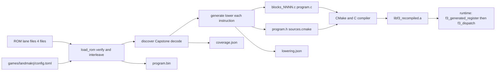

# Recompiler overview

**What you will learn.** This page shows what the recompiler does, why it works this way, and where each part lives. It gives the full pipeline, the files it writes, and the rules that every other page builds on. Read this page first. Then read the detail pages in the order shown at the end.

## What the recompiler does

The Taito F3 main CPU is a Motorola 68EC020. The game program is a 2 MiB ROM image of 68020 machine code. The recompiler is a Python program. It reads the ROM once, at build time. It writes C source code that does the same work as the machine code. The C compiler then builds this code into a static library, `libf3_recompiled.a`.

This method is called *static recompilation*. The project follows the design of [N64Recomp](https://github.com/N64Recomp/N64Recomp). Each machine instruction becomes a short, literal piece of C. The generated code does not make decisions about the game. It does what the original instruction does.

Some terms have a fixed meaning in these pages:

| Term | Meaning |
| --- | --- |
| Guest | The 68020 program and its CPU state. |
| Host | The real computer that runs the runtime and the generated C. |
| Lowering | The step that turns one 68020 instruction into C statements. The function `lower()` does it. |
| Native block | One generated C function. It holds the code for several guest instructions. |
| Entry | A guest address (PC) that the dispatcher can start at. Each entry has a row in the block table. |
| Dispatch | The runtime step that picks the native block for the current guest PC and runs it. |
| Fallback | Running one instruction in the Musashi interpreter instead of generated C. |

## Pipeline

The recompiler has three stages. Each stage reads the output of the stage before it.



1. **Load.** `load_rom` reads the four lane files. It checks size, CRC32 and SHA-1 of each file. It interleaves the bytes into one 2 MiB image. See [ROM loading and game config](/developer/recompiler/rom-and-config).
2. **Discover.** `discover` decodes the image with Capstone. It finds which addresses hold instructions. It writes `coverage.json`. See [Instruction discovery](/developer/recompiler/discovery).
3. **Emit.** `generate` calls `lower()` for each instruction. It groups the C statements into native blocks. It splits the blocks into source files. See [Instruction emission](/developer/recompiler/emission) and [Blocks, dispatch and sharding](/developer/recompiler/blocks-and-dispatch).

At run time the runtime calls `f3_generated_register` once. Then it calls `f3_dispatch` in a loop. See [Blocks, dispatch and sharding](/developer/recompiler/blocks-and-dispatch).

## Source files

All recompiler code is in the [`recomp/`](https://github.com/ansxor/f3-recomp/tree/main/recomp) directory.

| File | Role |
| --- | --- |
| [`recomp/__main__.py`](https://github.com/ansxor/f3-recomp/blob/main/recomp/__main__.py) | Command-line entry point. Commands `discover` and `emit`. |
| [`recomp/discovery.py`](https://github.com/ansxor/f3-recomp/blob/main/recomp/discovery.py) | ROM loader (`load_rom`), decoder, seed finders, table scanners, basic blocks, `coverage.json` report. |
| [`recomp/emitter.py`](https://github.com/ansxor/f3-recomp/blob/main/recomp/emitter.py) | `lower()`: one Capstone instruction to a list of C statements. |
| [`recomp/generate.py`](https://github.com/ansxor/f3-recomp/blob/main/recomp/generate.py) | Native block formation, sharding, `program.c`, `program.h`, `sources.cmake`, `lowering.json`. |
| [`recomp/timing.py`](https://github.com/ansxor/f3-recomp/blob/main/recomp/timing.py) | Cycle cost of each instruction. Reads `68020_cycles.csv`. |
| [`recomp/cpu_ops.h`](https://github.com/ansxor/f3-recomp/blob/main/recomp/cpu_ops.h) | C helpers that generated code calls: lazy flags, conditions, shifts, MUL, DIV, bit tests. |
| [`recomp/bitfield.h`](https://github.com/ansxor/f3-recomp/blob/main/recomp/bitfield.h) | C helper `f3_bitfield` for the eight 68020 bit-field instructions. |
| [`recomp/68020_cycles.csv`](https://github.com/ansxor/f3-recomp/blob/main/recomp/68020_cycles.csv) | Base cycle table for the main CPU. It has no game data. |
| [`recomp/68000_cycles.csv`](https://github.com/ansxor/f3-recomp/blob/main/recomp/68000_cycles.csv) | Base cycle table for the sound CPU. Only the [sound compiler](/developer/recompiler/sound-compiler) uses it. |
| [`recomp/requirements.txt`](https://github.com/ansxor/f3-recomp/blob/main/recomp/requirements.txt) | One line: `capstone==5.0.9`. |
| [`recomp/CMakeLists.txt`](https://github.com/ansxor/f3-recomp/blob/main/recomp/CMakeLists.txt) | Builds the generated sources as the static library `f3_recompiled`. |
| [`include/f3rt/cpu_abi.h`](https://github.com/ansxor/f3-recomp/blob/main/include/f3rt/cpu_abi.h) | The ABI. It defines `f3_cpu`, `f3_block` and the callbacks. The runtime owns it. |

The [sound compiler](/developer/recompiler/sound-compiler) in `tools/compile_sound.py` imports `lower` and `_decode_ea` from `recomp/emitter.py`. A change to the emitter can change the sound CPU code too. See [Extending the emitter](/developer/recompiler/extending-the-emitter).

## Output files

`python3 -m recomp emit` writes these files into the output directory. The files hold ROM-derived data. Git ignores them. Never commit them.

| File | Content |
| --- | --- |
| `blocks_0000.c`, `blocks_0001.c`, ... | Native blocks. Each file holds up to 128 blocks. |
| `program.c` | The sorted block table, the exception entry functions, and `f3_generated_register`. |
| `program.h` | The header for `f3_generated_register`. It checks the ABI version. |
| `sources.cmake` | A list of all generated `.c` files, in the variable `F3_GENERATED_SOURCES`. |
| `program.bin` | The interleaved ROM image. The runtime loads it. The C code does not contain it. |
| `coverage.json` | The discovery report. |
| `lowering.json` | The emission report: native counts, fallback counts, mnemonic tables. |

See [Generated files](/reference/generated-files) for the reference description.

## How to run it

Install the one Python dependency. Python 3.11 or later is required, because the code uses `tomllib`.

```sh
python3 -m pip install -r recomp/requirements.txt
```

Run the recompiler from the repository root.

```sh
python3 -m recomp emit \
  --config games/landmakrj/config.toml \
  --rom-dir /path/to/roms/landmakr \
  --output build/generated/landmakrj
```

The command `discover` runs only stages 1 and 2. It writes only `coverage.json`. The options are in [CLI reference](/reference/cli). The normal build does not need you to run these commands. The top-level `CMakeLists.txt` runs `python -m recomp emit` at configure time when you set `F3_ROM_DIR`. See [Build pipeline](/developer/build-pipeline).

::: warning
Handled ROM, config, import, and file errors return exit code 1. The message starts with `f3-recomp: ` on standard error. Argument-parser errors use argparse's exit code 2. The command does not replace missing or wrong ROM files.
:::

## Rules that shape the design

These rules explain most of the code. Each rule has a reason.

1. **The guest PC and stack live in `f3_cpu`, not on the host stack.** A `JSR` writes a return address to guest memory and sets `cpu->pc`. The block then returns to the dispatcher. *Why:* the game uses computed jumps, exceptions and `RTE`. Host recursion could not model them. The dispatcher can also take an interrupt between any two blocks.
2. **Every decoded instruction is an entry.** A block can start at any decoded instruction, not only at a block start. A `switch` on `cpu->pc` at the top of each native block jumps to the right label. *Why:* the game can jump to an address that discovery did not predict. Execution must continue natively from there.
3. **Flags are lazy.** Arithmetic stores its inputs and result. It does not compute N, Z, V and C. A flush step computes them when something needs them. The X flag is the exception. It is always current. *Why:* most flags are never read. See [Flags and timing](/developer/recompiler/flags-and-timing).
4. **Only memory callbacks may see pending flags.** Every other call into the runtime needs a flush first. *Why:* the runtime reads `cpu->sr` and expects it to be correct.
5. **Every instruction adds its cycle cost.** A block stops at the first instruction boundary where `cpu->cycles` reaches `cpu->dispatch_deadline`. *Why:* the video and sound hardware must get time at the right moment. A long block must not delay an interrupt.
6. **Unknown things are explicit.** An instruction that the emitter cannot lower becomes a call to `f3_fallback`. The reports list it. Nothing is skipped without a trace.

## Results on the supplied game

These numbers come from `NOTES.md` in the repository. They describe the exhaustive run on Land Maker Japan (`landmakrj`).

- Discovery decodes 464,523 instruction starts from 1,048,576 word-aligned candidates.
- 460,668 of those decoded entries lower to native C. The other decoded entries use `f3_fallback` when executed.
- 568,753 more entries point to shared exception handlers (illegal, A-line, F-line).
- The result is 17,534 native blocks (one per 64-byte page that holds code).
- The strict native run of the game executes with zero fallback instructions. `STATUS.md` records the run details.

These counts include data that looks like code. They do not prove that all those instructions can run. See [Limits and known issues](/developer/recompiler/limits-and-known-issues).

## Reading order

| Page | Topic |
| --- | --- |
| [ROM loading and game config](/developer/recompiler/rom-and-config) | `load_rom`, lane interleave, verification, config keys. |
| [Instruction discovery](/developer/recompiler/discovery) | `all_aligned` and `recursive` modes, seeds, tables, scripts. |
| [Instruction emission](/developer/recompiler/emission) | How one instruction becomes C. The main page. |
| [Addressing modes](/developer/recompiler/addressing-modes) | Every effective-address mode and its C. |
| [Instruction reference](/developer/recompiler/instruction-reference) | Each instruction family, its helper and its flag behavior. |
| [Flags and timing](/developer/recompiler/flags-and-timing) | Lazy flags, cycle accounting, deadline, timing corrections. |
| [Blocks, dispatch and sharding](/developer/recompiler/blocks-and-dispatch) | Block shape, page grouping, `program.c`, the dispatch loop. |
| [Exceptions, privilege and hooks](/developer/recompiler/exceptions-and-hooks) | Traps, privilege checks, SR, hooks, fallback. |
| [Extending the emitter](/developer/recompiler/extending-the-emitter) | How to add or change an instruction. |
| [Limits and known issues](/developer/recompiler/limits-and-known-issues) | What the recompiler does not do. |

Related pages: [Architecture](/developer/architecture), [CPU ABI](/developer/runtime/cpu-abi), [Sound compiler](/developer/recompiler/sound-compiler), [Differential tests](/developer/testing/differential).
