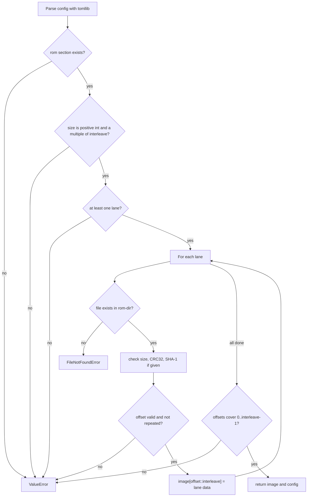

# ROM loading and game config

**What you will learn.** This page explains how the recompiler turns four ROM files and one TOML file into one verified 2 MiB image. It lists every config key that the recompiler reads, what each key does, and which errors you can get.

The code is the function `load_rom` in [`recomp/discovery.py`](https://github.com/ansxor/f3-recomp/blob/main/recomp/discovery.py). The command-line wrapper is in [`recomp/__main__.py`](https://github.com/ansxor/f3-recomp/blob/main/recomp/__main__.py).

## Why the recompiler checks the ROM so strictly

The recompiler bakes ROM addresses into C code. A wrong ROM would give wrong code with no visible error. Two Land Maker versions exist: World (`landmakr`) and Japan (`landmakrj`). The ROM lanes of the two versions have different names and hashes. `NOTES.md` records that the first supplied ROM set was the Japan set, and that nobody must treat it as the World set. For this reason `load_rom` checks the size, the CRC32 and the SHA-1 of every file. It never replaces a missing file with another file.

## The command line

The entry point is `main()` in `recomp/__main__.py`. It uses `argparse`.

| Argument | Required | Default | Meaning |
| --- | --- | --- | --- |
| `command` | Yes | none | `discover` or `emit`. |
| `--config PATH` | Yes | none | Path to the game TOML file. |
| `--rom-dir PATH` | Yes | none | Directory that holds the ROM lane files. |
| `--output PATH` | Yes | none | Output directory. The command creates it if it does not exist. |
| `--max-block-instructions N` | No | `32` | Block size limit. In `all_aligned` mode it sets the page size to `2 * N` bytes. |

The function `generate` has a second parameter, `blocks_per_file` (default 128). The command line does not expose it.

The command does this in order:

1. It calls `load_rom(config, rom_dir)`.
2. It calls `discover(rom, config)`.
3. It writes `coverage.json` and prints a JSON summary to standard output.
4. For `emit` only: it calls `generate(...)`. It prints the report, without the lists `fallback_pcs` and `source_files`.

The function catches `OSError`, `ValueError`, `KeyError` and `ImportError`. It prints `f3-recomp: ` and the error text to standard error. It returns exit code 1. Every error in the tables below ends this way.

## What `load_rom` does

`load_rom(config_path, rom_dir)` returns a pair: the interleaved image (`bytes`) and the parsed config (`dict`).



### Step by step

1. `tomllib.loads` parses the file. A syntax error raises `tomllib.TOMLDecodeError`. This class is a `ValueError`.
2. The function reads `game.id` for use in error messages. If it is missing, the text `unknown` is used.
3. The `[rom]` section must exist. `size` must be a positive integer. `interleave` defaults to `4`. It must be a positive integer, and `size` must be a multiple of it.
4. `[[rom.lanes]]` must contain at least one lane.
5. For each lane the function does these checks, in this order:
   1. The lane needs a `file` key. The file must exist in `--rom-dir`.
   2. If the lane has a `size` key, the file length must equal it.
   3. If the lane has a `crc` key, the CRC32 of the file must match. The compare ignores case.
   4. If the lane has a `sha1` key, the SHA-1 of the file must match.
   5. `offset` (default `0`) must be an integer with `0 <= offset < interleave`.
   6. The file length must equal `size / interleave`. Each lane must fill its share of the image.
   7. No two lanes may use the same `offset`.
6. The function copies the file into the image with one Python slice: `rom_data[offset::interleave] = data`.
7. After the last lane, the set of offsets must equal `0 .. interleave-1`. This makes sure that every byte of the image has a source.

The `size`, `crc` and `sha1` keys of a lane are optional in the code. The two shipped configs set all three for every lane. Keep them in any new config.

### How the interleave works

The ROM is a 32-bit program memory. Four 8-bit chips each provide one byte of every 32-bit word. Lane `k` provides bytes `k, k+4, k+8, ...` of the image. The 68020 is big-endian. Offset 0 is therefore the most significant byte of each long word.

```text
lane offset 0:  b0  .   .   .   b4  .   .   .
lane offset 1:  .   b1  .   .   .   b5  .   .
lane offset 2:  .   .   b2  .   .   .   b6  .
lane offset 3:  .   .   .   b3  .   .   .   b7
image:          b0  b1  b2  b3  b4  b5  b6  b7  ...
```

### Lanes of Land Maker Japan

The values come from [`games/landmakrj/config.toml`](https://github.com/ansxor/f3-recomp/blob/main/games/landmakrj/config.toml). Each lane file has 524,288 bytes (`0x80000`). Four lanes give 2,097,152 bytes (`0x200000`).

| Offset | File | CRC32 |
| --- | --- | --- |
| 0 | `e61-13.20` | `0af756a2` |
| 1 | `e61-12.19` | `636b3df9` |
| 2 | `e61-11.18` | `279a0ee4` |
| 3 | `e61-10.17` | `daabf2b2` |

The World config, [`games/landmakr/config.toml`](https://github.com/ansxor/f3-recomp/blob/main/games/landmakr/config.toml), lists `e61-19.20`, `e61-18.19`, `e61-17.18` and `e61-16.17`. `NOTES.md` states that World is configuration only and that it was never tested. A run with World config and the Japan files stops with `Missing ROM lane file 'e61-19.20' ...`.

## Errors from `load_rom`

| Error class | Message starts with | Cause |
| --- | --- | --- |
| `ValueError` | `Config '...' is missing [rom] section.` | No `[rom]` table. |
| `ValueError` | `Config '...' must specify positive integer 'size' under [rom].` | `size` is missing, zero, negative or not an integer. |
| `ValueError` | `ROM size must be a positive multiple of its interleave.` | `interleave` is not a positive integer, or `size` is not a multiple of it. |
| `ValueError` | `Config '...' must define at least one [[rom.lanes]].` | Empty lane list. |
| `ValueError` | `Lane definition in '...' is missing 'file' name.` | A lane has no `file`. |
| `FileNotFoundError` | `Missing ROM lane file '...' in '...' for game '...'.` | The lane file is not in `--rom-dir`. |
| `ValueError` | `ROM lane '...' size mismatch` | File length differs from the lane `size`. |
| `ValueError` | `ROM lane '...' CRC32 mismatch` | Wrong CRC32. |
| `ValueError` | `ROM lane '...' SHA1 mismatch` | Wrong SHA-1. |
| `ValueError` | `ROM lane '...' has invalid byte offset N.` | `offset` is not in `0 .. interleave-1`. |
| `ValueError` | `ROM lane '...' does not fill the configured image.` | File length is not `size / interleave`. |
| `ValueError` | `Duplicate lane offset N in '...'.` | Two lanes use the same offset. |
| `ValueError` | `ROM lane configuration must cover every byte of the image.` | Some offsets have no lane. |

After `load_rom`, `discover` checks two more things. The image must hold at least 1,024 bytes (the full vector table). The image length must be even.

## Config keys that the recompiler reads

The recompiler reads only the keys below. It ignores other keys. The runtime and other tools can read more keys; see [Game config reference](/reference/game-config).

### `[game]`

| Key | Type | Use |
| --- | --- | --- |
| `id` | string | Used in the `FileNotFoundError` message. |

`name` and `platform` exist in the files. The recompiler does not read them.

### `[rom]` and `[[rom.lanes]]`

See the step list above. The keys are `size`, `interleave`, and for each lane `file`, `offset`, `size`, `crc`, `sha1`.

### `[discovery]`

The function `discover` reads these keys. [Instruction discovery](/developer/recompiler/discovery) explains each key in detail.

| Key | Type | Default | Use |
| --- | --- | --- | --- |
| `coverage` | string | `"recursive"` | `"all_aligned"` or `"recursive"`. Any other value raises `ValueError`. `generate` also reads this key. |
| `scan_jump_tables` | bool | `true` | Enable the jump table scanners (recursive mode). |
| `scan_task_traps` | bool | `true` | Enable the `TRAP #1` task scan (recursive mode only). |
| `scan_callbacks` | bool | `true` | Enable the `LEA ... ; MOVE.L` callback scan (recursive mode only). |
| `entry_points` | list of addresses | empty | Extra code roots. Each must be even. |
| `jump_tables` | list of tables | empty | Explicit targets for one `JMP` or `JSR` instruction. |
| `inline_string_helpers` | list of addresses | empty | Call targets that consume an inline NUL-terminated string. |
| `actor_scripts` | table | empty | Description of the game script byte code (recursive mode only). |

An address can be an integer or a string. A string that starts with `0x` is hexadecimal. Any other string is decimal.

### `[[hooks]]`

| Key | Type | Use |
| --- | --- | --- |
| `address` | integer | Guest PC of the instruction to hook. It must be even. It must be a decoded instruction. |
| `symbol` | string | C identifier of the hook function. The pattern is `[A-Za-z_][A-Za-z_0-9]*`. |

`discover` adds each hook address to the list of proven seeds. `generate` emits the hook call. Two hooks at one address raise `ValueError`. See [Exceptions, privilege and hooks](/developer/recompiler/exceptions-and-hooks).

## The two shipped configs

| | `landmakrj` (Japan) | `landmakr` (World) |
| --- | --- | --- |
| Status | The target game. All tests run on it. | Configuration only. Never run. |
| `coverage` | `"all_aligned"` | not set, so `"recursive"` |
| `[[hooks]]` | 69 entries, all with symbol `f3_landmakr_video_hook` | none |
| `entry_points` | not set | empty list |

The Japan config has no `entry_points`, `jump_tables` or `actor_scripts`. `NOTES.md` explains why. Exhaustive decoding replaced all observed-address metadata.

The hook function `f3_landmakr_video_hook` is in [`runtime/game_video.cpp`](https://github.com/ansxor/f3-recomp/blob/main/runtime/game_video.cpp). It calls `GameVideo::observe()`.

## How the config reaches the C build

The top-level [`CMakeLists.txt`](https://github.com/ansxor/f3-recomp/blob/main/CMakeLists.txt) runs the recompiler at configure time when `F3_ROM_DIR` is set. It uses `games/landmakrj/config.toml` and writes into `build/generated/landmakrj` by default. CMake tracks `recomp/*.py`, `recomp/*.csv` and the config file as configure dependencies. A change to any of them makes CMake run the recompiler again. See [Build pipeline](/developer/build-pipeline) and [Build options](/reference/build-options).

## Tests

`tools/test_discovery.py` builds small synthetic ROM images in memory and calls `discover` on them. It does not call `load_rom`. No test calls `load_rom` with real ROM files, because the files are not in the repository.
