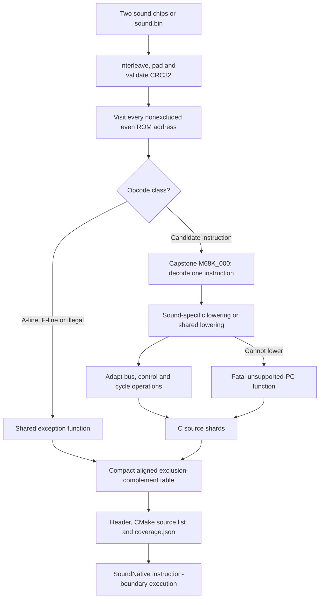

# The sound-CPU compiler

`tools/compile_sound.py` compiles the Land Maker Japan sound ROM into C. The generated code executes the original 68000 driver.

It does not convert the driver into a note player. The ROM's tasks, mailbox parser, allocation, sequencer and DSP worker remain compiled instructions.

## Source map

| Source | Role |
|---|---|
| [compile_sound.py](https://github.com/ansxor/f3-recomp/blob/main/tools/compile_sound.py) | ROM validation, 68000 decoding, adaptations, timing and file generation. |
| [68000_cycles.csv](https://github.com/ansxor/f3-recomp/blob/main/recomp/68000_cycles.csv) | Mask/match/base-cycle rows for all 16-bit opcode values. |
| [emitter.py](https://github.com/ansxor/f3-recomp/blob/main/recomp/emitter.py) | Shared instruction lowering and effective-address decoding. |
| [cpu_ops.h](https://github.com/ansxor/f3-recomp/blob/main/recomp/cpu_ops.h) | Shared arithmetic and condition-code operations. |
| [sound_native_ops.h](https://github.com/ansxor/f3-recomp/blob/main/runtime/sound_native_ops.h) | Sound bus, control, division and dynamic-cycle helpers. |
| [sound_native.cpp](https://github.com/ansxor/f3-recomp/blob/main/runtime/sound_native.cpp) | Generated-table dispatch and 68000 execution state. |

The [main recompiler](/developer/recompiler/) has a discovery phase. This sound compiler does not discover reachable basic blocks.

## Pipeline



## ROM input and validation

The compiler requires Python and the Capstone M68K module. Use the configured environment from [the build pipeline](/developer/build-pipeline).

CMake supplies its local `build/python` dependency directory through `PYTHONPATH`. A manual invocation needs an equivalent module search path.

Use the supplied sound chips in a local ROM directory:

```sh
python3 tools/compile_sound.py --rom-dir /path/to/roms/landmakr \
  --config games/landmakrj/config.toml --output build/generated/sound-landmakrj
```

`load_sound_rom` first looks for both chip files:

| File | Lane |
|---|---|
| `e61-14.32` | High byte, even interleaved offsets. |
| `e61-15.33` | Low byte, odd interleaved offsets. |

A `0x20000`-byte chip receives `0xff` padding to `0x40000` bytes. Other chip sizes must already equal `0x40000`.

The compiler interleaves them into `0x80000` bytes. If both files are not present, it accepts `sound.bin` instead.

It then requires CRC32 `0x5a7e9117`. This compiler targets that program, not arbitrary F3 sound ROMs.

The chip path enforces sizes explicitly. The `sound.bin` path relies on the CRC check and has no separate size check.

`SoundNative` independently checks the loaded runtime ROM CRC and validates the exact every-even exclusion complement, including sorted entries and nonoverlapping exclusion metadata.

Keep ROM-derived generated files in ignored build directories. Do not commit them.

## One entry per aligned address

The ROM base is `0xc00000`. The compiler visits every nonexcluded even offset.

Without exclusions, a 512 KiB ROM produces 262,144 entries. Explicit
`[[exclude]] cpu = "sound"` intervals remove their instruction starts and
shared exception entries. Each retained entry is a syntactic candidate,
not a known reachable instruction.

An entry can point into data or the extension words of another instruction. Adjacent entries can therefore describe overlapping decodes.

Capstone receives at most 16 bytes and decodes at most one instruction. The mode is `CS_MODE_M68K_000`, with operand detail enabled.

A lowered function executes that one instruction. It updates registers, PC and cycle count, then returns to the runtime dispatcher.

A-line, F-line and known illegal entries share exception functions. They do not each require a separate generated function.

The table is complete outside exclusions even when lowering is incomplete. Unsupported retained candidates still fail if reached. Excluded targets fail before an instruction fetch, with no interpreter fallback.

There is no trace-derived coverage filter. The CLI accepts only `--coverage all_aligned`.

## Opcode classification and invalid handling

Classification happens before Capstone decoding:

1. A-line opcodes select vector 10.
2. F-line opcodes select vector 11.
3. A zero base-cycle entry selects illegal-instruction vector 4, except opcode `0x4e70` (`RESET`).
4. Other opcodes proceed to decoding and lowering.

An invalid opcode that has architectural exception behavior is not an unsupported lowering error.

A candidate with a recognized decode but no lowering emits `f3_sound_unsupported_pc`. An undecodable remaining candidate emits the same failure call.

The failure reads the opcode, reports PC and opcode, sets `halted`, and throws `std::runtime_error`.

It does not call Musashi or replay a trace. Work-RAM execution and odd or out-of-range PCs also fail in runtime dispatch.

### Ignored immediate bits

Capstone rejects some immediates with a nonzero upper byte. The 68000 ignores that byte for the relevant effective operand.

For CCR immediate opcodes `0x003c`, `0x023c` and `0x0a3c`, the compiler clears decoder input byte 2.

It also clears that byte for opcodes matching `(opcode & 0xff00) == 0x0800`, the immediate bit-operation family.

Only the temporary decode buffer changes. The loaded ROM, CRC and runtime data reads remain unchanged.

The effective bit operand uses the required low bits. This is a decoder adaptation, not a modified game ROM.

## 68000 control adaptations

`sound_lower` handles instructions whose main-CPU implementation differs from the sound CPU.

| Operation | Sound behavior |
|---|---|
| A-line / F-line | Vector 10 or 11, returning to the faulting instruction address. |
| `ILLEGAL` and the `0x4848` opcode family | Vector 4, returning to the faulting instruction address. |
| `RTE` | Runtime helper pops a six-byte SR/PC frame. There is no 68020 format word. |
| `STOP` | Runtime helper sets SR and stopped state. A newly unmasked pending IRQ can enter immediately. |
| `TRAP #n` | Vector `32 + n`, with the next instruction PC as the return address. |
| `DBcc` | Sound-specific condition, word counter and exact path-dependent timing. |
| Word multiply/divide | Read the effective-address operand once. Use sound timing and division exceptions. |

For `DBcc`, the branch target is `instruction address + 2 + displacement`.

If the condition is false, the compiler decrements only the low register word. A non-exhausted counter branches in 10 cycles.

A counter that becomes `0xffff` falls through in 14 cycles. A true condition leaves the counter unchanged and costs 12 cycles.

### Shared lowering adaptations

Other instructions use `recomp.emitter.lower`. The compiler then adapts the resulting statements:

- Redirect memory calls to `f3_sound_read8/16/32` and `f3_sound_write8/16/32`.
- Redirect SR and exception calls to sound runtime helpers.
- Redirect word multiply/divide names to sound helpers where required.
- Replace emitted main-CPU cycle additions with the sound cycle expression.
- Set the next PC before an SR update that can recognize an interrupt.

`MOVE` from SR is unprivileged on a 68000. The compiler removes the shared lowerer's privilege exception for this operation.

The sound CPU's `RESET` output is unconnected in the oracle bridge. The compiler removes device-reset calls but retains the instruction's timing.

Condition-code and ordinary arithmetic helpers remain shared. Successful generated function bodies append `f3_sound_cc_flush(cpu)`.

Control paths can return before that final statement. Their lowering or runtime helpers handle the required flag state.

## Instruction timing

`load_68000_base_cycles` expands CSV mask/match rows into a 65,536-byte opcode table. Later matching rows can overwrite earlier costs.

`sound_instruction_cycles` computes a cost before instruction statements mutate registers or flags.

| Instruction class | Adjustment |
|---|---|
| Conditional branch, conditions 2–15 | Untaken byte branch: base minus 2. Untaken word branch: base plus 2. |
| `MOVEM` | Add register count times 4 for words or 8 for longs. |
| Register shift/rotate | Add twice the effective count. Register counts use `& 63`; immediate zero means eight. |
| Register `BCHG`, `BCLR`, `BSET` | Subtract 2 when effective bit number is below 16. |
| Register `Scc`, conditions 2–15 | Add 2 when the condition is true. |
| `RESET` | Use 132 cycles. |

Word multiplication uses base cycles plus a source-dependent helper. Unsigned multiplication adds twice the source population count.

Signed multiplication uses the source-bit transition calculation in `f3_sound_muls_cycles`.

Unsigned division replaces the table's 140-cycle component with `f3_sound_divu_cycles`. Its overflow shortcut returns a 10-cycle component.

Signed division retains the base-cycle cost in the compiler. It does not use the unsigned dynamic timing helper.

Division by zero enters vector 5 through the sound runtime. The exception path returns before normal result assignment and cycle charging.

The division helpers pack remainder above quotient. Quotient overflow preserves the destination and sets V while clearing C.

The signed helper also handles dividend `0x80000000` divided by `-1` without host-language signed division overflow.

[The native runtime page](/developer/runtime/audio/native-driver) describes reset debt, exception costs, IRQ entry, SR masking and stack switching.

## Generated files

| File | Contents |
|---|---|
| `sound_blocks_0000.c`, successive shards | Candidate functions that need distinct generated bodies. |
| `sound_program.h` | C-compatible declarations of `f3_sound_blocks` and `f3_sound_block_count`. |
| `sound_program.c` | Shared vector functions, function declarations and the ordered `const f3_block` table. |
| `sources.cmake` | `F3_SOUND_GENERATED_SOURCES`, with paths relative to its CMake directory. |
| `coverage.json` | CRC, coverage label, word and entry counts, source names and mnemonic summaries. |

`--blocks-per-file` defaults to 1024. It counts generated distinct bodies in a shard, not shared-vector table entries.

`coverage.json` reports `compiled_blocks`, `supported_instructions` and `unsupported_words`. Supported counts include architectural exception entries.

It also reports supported and unsupported mnemonic counts. Undecoded candidates use names such as `raw_0x1234`.

The report writes `unsupported_pcs`, `excluded_words`, `excluded_regions`, true `emitted_functions`, and apparent `deferred_excluded_targets` with fatal runtime enforcement.

The output directory is created when absent. The compiler writes its current files but does not remove obsolete shards from earlier generations.

## Build and runtime integration

CMake generates sound code when `F3_ROM_DIR` is supplied. A pre-generated build can use `F3_SOUND_GENERATED_DIR`.

See [build options](/reference/build-options) and [the build pipeline](/developer/build-pipeline) for target integration.

Programs built with `F3RT_SOUND_GENERATED` include the ABI-guarded
`sound_program.h`. They pass its table/count and
`{f3_sound_excluded_ranges,f3_sound_excluded_count}` span to
`Machine::use_native_sound` before execution.

Dispatch computes `(pc - 0xc00000)/2`, subtracting the word counts of
preceding excluded intervals. A target inside an exclusion throws before
any opcode/data read. Odd or out-of-ROM instruction starts also fail.
No second map is allocated. The table's exact complement order and immutable
exclusion metadata are part of the compiler/runtime contract.

## Coverage and proof limits

The [driver evidence](https://github.com/ansxor/f3-recomp/blob/main/docs/SOUND-DRIVER.md) reports 944 unlowered aligned candidates in its retained manifest.

Those candidates include data and overlapping decodes. None is reached in the documented comparison runs.

That count is historical evidence, not a guarantee for a future compiler revision or another ROM.

Every reached instruction still requires exact bus and timing parity. Use [strict sound traces](/developer/runtime/audio/tracing), then compare WAV bytes separately.

The model matches the oracle at instruction boundaries. It does not measure physical bus timing or prove every packet variant and sequence alias.
