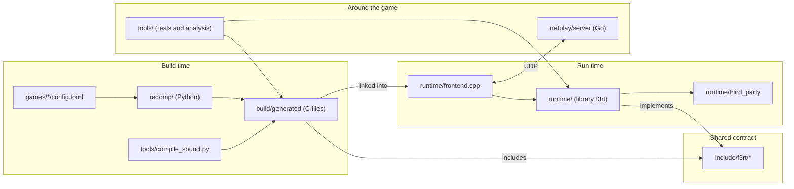

# Repository tour

**What you will learn:** where each file lives, what it does, and where to start reading each subsystem.

The repository has five main parts. The `recomp/` folder holds the recompiler. The `runtime/` folder holds the runtime library. The `include/f3rt/` folder holds the ABI between them. The `netplay/server/` folder holds the relay server. The `tools/` folder holds test and analysis tools. The tables describe source responsibilities, not file sizes. Generated files and local dependency caches have separate roles.

## How the directories relate

The diagram shows which directory produces or uses which other directory.

## Where to start reading

Open these files first. Then follow the subsystem pages.

| Subsystem | Start in | Then read | Site page |
| --- | --- | --- | --- |
| ABI | `include/f3rt/cpu_abi.h` | `runtime/cpu_abi.cpp` | [CPU ABI](/developer/runtime/cpu-abi) |
| Machine and scheduler | `include/f3rt/machine.hpp` | `runtime/machine.cpp` (`advance_to`, `boundary`) | [Machine](/developer/runtime/machine) |
| Frontend | `runtime/frontend.cpp` | `runtime/capture_io.hpp` | [Frontend](/developer/runtime/frontend) |
| Recompiler | `recomp/__main__.py` | `recomp/generate.py`, then `recomp/emitter.py` | [Recompiler](/developer/recompiler/) |
| Discovery | `recomp/discovery.py` (`discover`) | `games/landmakrj/config.toml` | [Discovery](/developer/recompiler/discovery) |
| Timing and flags | `recomp/timing.py` | `recomp/cpu_ops.h` (`f3_cc_flush`) | [Flags and timing](/developer/recompiler/flags-and-timing) |
| Sound compiler | `tools/compile_sound.py` | `runtime/sound_native.cpp` | [Sound compiler](/developer/recompiler/sound-compiler) |
| FDP renderer | `include/f3rt/video.hpp` | `runtime/video.cpp` | [FDP](/developer/runtime/video/fdp) |
| Game-data video | `include/f3rt/game_video.hpp` | `runtime/game_video.cpp`, `runtime/game_scene.hpp` | [Game-data HLE](/developer/runtime/video/game-hle) |
| Audio | `include/f3rt/audio.hpp` | `runtime/audio.cpp` | [Audio](/developer/runtime/audio/) |
| Interpreter | `runtime/interpreter.cpp` | `runtime/core_state.c` | [Interpreter](/developer/runtime/interpreter) |
| Snapshots | `runtime/state_io.hpp` | Full/local and canonical/sync APIs in `runtime/machine.cpp` | [Snapshots](/developer/netplay/snapshots) |
| Rollback | `include/f3rt/netplay.hpp` | `runtime/netplay.cpp` | [Rollback](/developer/netplay/rollback) |
| Transport | `include/f3rt/netplay_transport.hpp` | `runtime/netplay_transport.cpp` | [Client transport](/developer/netplay/transport) |
| Session lifecycle | `include/f3rt/netplay_session.hpp` | `runtime/netplay_session.cpp` | [Frontend integration](/developer/netplay/frontend-integration) |
| Relay server | `netplay/server/main.go` | `server.go`, `room.go`, `protocol.go` | [Relay server](/developer/netplay/server) |
| Tests | `runtime/check.cpp` | `tools/gameplay_regression.cpp` | [Testing](/developer/testing/) |

## File lists

Each table lists one directory. The link on each file name opens the file on GitHub.

### Top level

| File | Purpose |
| --- | --- |
| [`CMakeLists.txt`](https://github.com/ansxor/f3-recomp/blob/main/CMakeLists.txt) | Top-level build. Runs the recompiler at configure time. Builds Musashi, `f3rt`, the frontends and the test tools. Writes the netplay build ID. |
| [`README.md`](https://github.com/ansxor/f3-recomp/blob/main/README.md) | Project overview, build and run commands, and a short description of each test. |
| [`docs/developer/IMGUI-NETPLAY.md`](https://github.com/ansxor/f3-recomp/blob/main/docs/developer/IMGUI-NETPLAY.md) | Overlay, shader ABI, canonical versus handoff and observed verification. |
| [`NOTES.md`](https://github.com/ansxor/f3-recomp/blob/main/NOTES.md) | Long dated log of recompiler and timing decisions. It is the evidence trail. |
| [`.gitignore`](https://github.com/ansxor/f3-recomp/blob/main/.gitignore) | Ignores `build/`, `roms/`, `games/*/generated/`, `wt/`, `*.bin`, `*.wav` and captures. |

### recomp/ (ROM to C recompiler, Python)

| File | Purpose |
| --- | --- |
| [`recomp/__main__.py`](https://github.com/ansxor/f3-recomp/blob/main/recomp/__main__.py) | Command line for `python3 -m recomp discover` and `python3 -m recomp emit`. |
| [`recomp/__init__.py`](https://github.com/ansxor/f3-recomp/blob/main/recomp/__init__.py) | Package marker. |
| [`recomp/discovery.py`](https://github.com/ansxor/f3-recomp/blob/main/recomp/discovery.py) | ROM lane loader (`load_rom`) and instruction discovery (`discover`). Writes the coverage report. |
| [`recomp/emitter.py`](https://github.com/ansxor/f3-recomp/blob/main/recomp/emitter.py) | Lowers one Capstone 68020 instruction to C statements (`lower`). |
| [`recomp/generate.py`](https://github.com/ansxor/f3-recomp/blob/main/recomp/generate.py) | Packs lowered instructions into C blocks and shards. Writes `program.c`, `program.h` and `sources.cmake`. |
| [`recomp/timing.py`](https://github.com/ansxor/f3-recomp/blob/main/recomp/timing.py) | Computes the cycle cost of each instruction from the cycle table. |
| [`recomp/cpu_ops.h`](https://github.com/ansxor/f3-recomp/blob/main/recomp/cpu_ops.h) | C helpers that generated code includes: lazy flag flush, condition test, shifts, rotates, multiply, divide and bit operations. |
| [`recomp/bitfield.h`](https://github.com/ansxor/f3-recomp/blob/main/recomp/bitfield.h) | C helper for the 68020 bitfield instructions. |
| [`recomp/68020_cycles.csv`](https://github.com/ansxor/f3-recomp/blob/main/recomp/68020_cycles.csv) | 68EC020 opcode cost table exported from Musashi. It holds CPU data, not game data. |
| [`recomp/68000_cycles.csv`](https://github.com/ansxor/f3-recomp/blob/main/recomp/68000_cycles.csv) | 68000 opcode cost table. The sound CPU compiler uses it. |
| [`recomp/CMakeLists.txt`](https://github.com/ansxor/f3-recomp/blob/main/recomp/CMakeLists.txt) | Small CMake project that builds the static library `f3_recompiled` from `sources.cmake`. |
| [`recomp/requirements.txt`](https://github.com/ansxor/f3-recomp/blob/main/recomp/requirements.txt) | Python dependency: `capstone==5.0.9`. |

### include/f3rt/ (public interfaces)

| File | Purpose |
| --- | --- |
| [`include/f3rt/cpu_abi.h`](https://github.com/ansxor/f3-recomp/blob/main/include/f3rt/cpu_abi.h) | The C ABI: `f3_cpu`, `f3_block`, bus accessors and `f3_dispatch`. `F3RT_ABI_VERSION` is 2. |
| [`include/f3rt/machine.hpp`](https://github.com/ansxor/f3-recomp/blob/main/include/f3rt/machine.hpp) | `f3rt::Machine`: CPU, memory regions, devices, scheduler and snapshot API. |
| [`include/f3rt/rom.hpp`](https://github.com/ansxor/f3-recomp/blob/main/include/f3rt/rom.hpp) | `RomSet` and `crc32`. |
| [`include/f3rt/video.hpp`](https://github.com/ansxor/f3-recomp/blob/main/include/f3rt/video.hpp) | `Video`: the FDP (TC0630FDP) software renderer. |
| [`include/f3rt/game_video.hpp`](https://github.com/ansxor/f3-recomp/blob/main/include/f3rt/game_video.hpp) | `GameVideo`, `GameVideoMode` and `GameVideoOptions`: the game-data renderer. |
| [`include/f3rt/audio.hpp`](https://github.com/ansxor/f3-recomp/blob/main/include/f3rt/audio.hpp) | `Audio`: the sound board (OTIS, DSP, DUART, volume) and PCM output. |
| [`include/f3rt/netplay.hpp`](https://github.com/ansxor/f3-recomp/blob/main/include/f3rt/netplay.hpp) | `Rollback`, `InputWord`, `apply_inputs` and `machine_identity`. |
| [`include/f3rt/netplay_transport.hpp`](https://github.com/ansxor/f3-recomp/blob/main/include/f3rt/netplay_transport.hpp) | `Transport`, `Identity`, `Input`, `Checksum` and `TransportOptions`. |

### runtime/ core (machine, scheduler, CPUs)

These files form the `f3rt` library core and the frontend.

| File | Purpose |
| --- | --- |
| [`runtime/machine.cpp`](https://github.com/ansxor/f3-recomp/blob/main/runtime/machine.cpp) | `Machine`: reset, bus read and write with the memory map, `advance_to`, `boundary`, `run_frame`, inputs, coin logic, snapshot save and load. |
| [`runtime/cpu_abi.cpp`](https://github.com/ansxor/f3-recomp/blob/main/runtime/cpu_abi.cpp) | Implements the C functions of `cpu_abi.h`: `f3_read8` to `f3_write32`, `f3_set_sr`, `f3_exception`, `f3_dispatch`, `f3_fallback`. |
| [`runtime/interpreter.cpp`](https://github.com/ansxor/f3-recomp/blob/main/runtime/interpreter.cpp) | Wraps Musashi. Runs the main CPU one instruction at a time (fallback and reference mode). Runs the sound 68000 in oracle mode. |
| [`runtime/interpreter.hpp`](https://github.com/ansxor/f3-recomp/blob/main/runtime/interpreter.hpp) | `Interpreter` class declaration. |
| [`runtime/core_state.c`](https://github.com/ansxor/f3-recomp/blob/main/runtime/core_state.c) | C bridge that copies state between `f3_cpu` and the Musashi context, and exports the sound CPU state. |
| [`runtime/state_oracle.h`](https://github.com/ansxor/f3-recomp/blob/main/runtime/state_oracle.h) | Packed struct `f3rt_sound_oracle_state` for the interpreted sound CPU. |
| [`runtime/state_io.hpp`](https://github.com/ansxor/f3-recomp/blob/main/runtime/state_io.hpp) | `StateWriter`, `StateReader` and the packed `Canonical*` records used by snapshots. |
| [`runtime/rom.cpp`](https://github.com/ansxor/f3-recomp/blob/main/runtime/rom.cpp) | `RomSet::load` and `crc32`. Checks the size and CRC32 of every ROM chip. |
| [`runtime/eeprom.hpp`](https://github.com/ansxor/f3-recomp/blob/main/runtime/eeprom.hpp) | 93C46 EEPROM (64 words of 16 bits) with busy timing, load and save. |
| [`runtime/frontend.cpp`](https://github.com/ansxor/f3-recomp/blob/main/runtime/frontend.cpp) | SDL3 program. Parses all command-line options, drives the frame loop, audio, window, and netplay. |
| [`runtime/frontend_ui.cpp`](https://github.com/ansxor/f3-recomp/blob/main/runtime/frontend_ui.cpp) | Dear ImGui overlay: preferences, slots, input capture, shader controls and netplay actions. |
| [`runtime/frontend_settings.cpp`](https://github.com/ansxor/f3-recomp/blob/main/runtime/frontend_settings.cpp) | Preference persistence and two independent keyboard/gamepad input profiles. |

### runtime/ video

| File | Purpose |
| --- | --- |
| [`runtime/video.cpp`](https://github.com/ansxor/f3-recomp/blob/main/runtime/video.cpp) | FDP software renderer (`Video`). It reads the emulated FDP RAM. It is the oracle for the game-data renderer. |
| [`runtime/game_video.cpp`](https://github.com/ansxor/f3-recomp/blob/main/runtime/game_video.cpp) | `GameVideo`: gathers the game scene, decides when to fall back to `Video`, and defines `f3_landmakr_video_hook`. |
| [`runtime/game_scene.hpp`](https://github.com/ansxor/f3-recomp/blob/main/runtime/game_scene.hpp) | Shared scene types: `GameMemory`, `ScenePixel`, `SceneSprite`, `SceneLayer`, `ScenePlayfield`, `SceneClip`, `SceneRow`. |
| [`runtime/game_tiles.cpp`](https://github.com/ansxor/f3-recomp/blob/main/runtime/game_tiles.cpp) | Playfield tile maps rebuilt from the game tile-block routines. |
| [`runtime/game_tiles.hpp`](https://github.com/ansxor/f3-recomp/blob/main/runtime/game_tiles.hpp) | `GameTiles` declaration. |
| [`runtime/game_text.cpp`](https://github.com/ansxor/f3-recomp/blob/main/runtime/game_text.cpp) | Text layer rebuilt from the game string, rectangle and glyph routines. |
| [`runtime/game_text.hpp`](https://github.com/ansxor/f3-recomp/blob/main/runtime/game_text.hpp) | `GameText` declaration. |
| [`runtime/game_sprites.cpp`](https://github.com/ansxor/f3-recomp/blob/main/runtime/game_sprites.cpp) | Sprite lists rebuilt from the game sprite routines, and the sprite rasterizer. |
| [`runtime/game_sprites.hpp`](https://github.com/ansxor/f3-recomp/blob/main/runtime/game_sprites.hpp) | `GameSprites` declaration. |
| [`runtime/game_lines.cpp`](https://github.com/ansxor/f3-recomp/blob/main/runtime/game_lines.cpp) | Line RAM data (scroll, zoom, clip and mix per scanline) rebuilt from the game routines. |
| [`runtime/game_lines.hpp`](https://github.com/ansxor/f3-recomp/blob/main/runtime/game_lines.hpp) | `GameLines` declaration. |
| [`runtime/game_compositor.cpp`](https://github.com/ansxor/f3-recomp/blob/main/runtime/game_compositor.cpp) | `compose_game_scene`: mixes layers into final pixels, at native or enlarged size. |
| [`runtime/game_compositor.hpp`](https://github.com/ansxor/f3-recomp/blob/main/runtime/game_compositor.hpp) | Declaration of `compose_game_scene`. |

### runtime/ audio

| File | Purpose |
| --- | --- |
| [`runtime/audio.cpp`](https://github.com/ansxor/f3-recomp/blob/main/runtime/audio.cpp) | `Audio`: sound work RAM, ES5505, ES5510, DUART and volume chips, the sound-CPU time slicing and the PCM ring buffer. |
| [`runtime/sound_native.cpp`](https://github.com/ansxor/f3-recomp/blob/main/runtime/sound_native.cpp) | `SoundNative`: runs the statically compiled sound driver and implements the `f3_sound_*` runtime functions. |
| [`runtime/sound_native.hpp`](https://github.com/ansxor/f3-recomp/blob/main/runtime/sound_native.hpp) | `SoundNative` declaration. |
| [`runtime/sound_native_ops.h`](https://github.com/ansxor/f3-recomp/blob/main/runtime/sound_native_ops.h) | C header that the generated sound code includes (`f3_sound_read8`, `f3_sound_exception` and more). |
| [`runtime/sound_trace.cpp`](https://github.com/ansxor/f3-recomp/blob/main/runtime/sound_trace.cpp) | `SoundTrace`: writes the F3SND2 bus trace file. |
| [`runtime/sound_trace.hpp`](https://github.com/ansxor/f3-recomp/blob/main/runtime/sound_trace.hpp) | `SoundTrace` declaration and the record kinds. |

### runtime/ netplay, tools and tests

| File | Purpose |
| --- | --- |
| [`runtime/netplay.cpp`](https://github.com/ansxor/f3-recomp/blob/main/runtime/netplay.cpp) | SDL-independent rollback core (`Rollback`), `apply_inputs`, `machine_identity`. |
| [`runtime/netplay_transport.cpp`](https://github.com/ansxor/f3-recomp/blob/main/runtime/netplay_transport.cpp) | Protocol-v2 pairing, compressed canonical transfer/barrier, inputs/checksums, ping and finish verdict. |
| [`runtime/netplay_session.cpp`](https://github.com/ansxor/f3-recomp/blob/main/runtime/netplay_session.cpp) | Local/lobby/preparation/handoff/versus/local-return lifecycle, including fresh rematches. |
| [`runtime/capture_io.hpp`](https://github.com/ansxor/f3-recomp/blob/main/runtime/capture_io.hpp) | Helpers that dump frames, RAM and CPU state to files, and the `WavWriter`. |
| [`runtime/replay.cpp`](https://github.com/ansxor/f3-recomp/blob/main/runtime/replay.cpp) | `f3rt-replay`: renders MAME captures with the FDP renderer, or replays a MAME audio trace to a WAV file. |
| [`runtime/check.cpp`](https://github.com/ansxor/f3-recomp/blob/main/runtime/check.cpp) | `f3rt-check`: unit checks for devices, timing, EEPROM, DUART, mixer and game-video descriptors. |
| [`runtime/LICENSES.txt`](https://github.com/ansxor/f3-recomp/blob/main/runtime/LICENSES.txt) | Licenses of the vendored MAME-derived and Musashi code. |

### runtime/third_party/ (vendored code)

| File | Purpose |
| --- | --- |
| [`runtime/third_party/musashi/m68kcpu.c`](https://github.com/ansxor/f3-recomp/blob/main/runtime/third_party/musashi/m68kcpu.c) | Musashi 68k core, with the documented MAME-parity patches. |
| [`runtime/third_party/musashi/m68k_in.c`](https://github.com/ansxor/f3-recomp/blob/main/runtime/third_party/musashi/m68k_in.c) | Musashi opcode source. `m68kmake` turns it into `m68kops.c` at build time. |
| [`runtime/third_party/musashi/m68kmake.c`](https://github.com/ansxor/f3-recomp/blob/main/runtime/third_party/musashi/m68kmake.c) | Musashi code generator, built as `f3rt_m68kmake`. |
| [`runtime/third_party/musashi/m68kconf.h`](https://github.com/ansxor/f3-recomp/blob/main/runtime/third_party/musashi/m68kconf.h) | Musashi configuration. |
| [`runtime/third_party/musashi/m68k.h`](https://github.com/ansxor/f3-recomp/blob/main/runtime/third_party/musashi/m68k.h) | Musashi public API. |
| [`runtime/third_party/musashi/m68kcpu.h`](https://github.com/ansxor/f3-recomp/blob/main/runtime/third_party/musashi/m68kcpu.h) | Musashi internal header. |
| [`runtime/third_party/musashi/m68kfpu.c`](https://github.com/ansxor/f3-recomp/blob/main/runtime/third_party/musashi/m68kfpu.c) | Musashi FPU code. |
| [`runtime/third_party/musashi/m68kmmu.h`](https://github.com/ansxor/f3-recomp/blob/main/runtime/third_party/musashi/m68kmmu.h) | Musashi MMU code. |
| [`runtime/third_party/musashi/softfloat/softfloat.c`](https://github.com/ansxor/f3-recomp/blob/main/runtime/third_party/musashi/softfloat/softfloat.c) | Software floating point used by Musashi. |
| [`runtime/third_party/musashi/readme.txt`](https://github.com/ansxor/f3-recomp/blob/main/runtime/third_party/musashi/readme.txt) | Upstream core documentation and license information. |
| [`runtime/third_party/musashi/softfloat/softfloat.h`](https://github.com/ansxor/f3-recomp/blob/main/runtime/third_party/musashi/softfloat/softfloat.h) | Floating-point types, modes, and operation declarations. |
| [`runtime/third_party/musashi/softfloat/milieu.h`](https://github.com/ansxor/f3-recomp/blob/main/runtime/third_party/musashi/softfloat/milieu.h) | Common environment definitions and Boolean constants. |
| [`runtime/third_party/musashi/softfloat/mamesf.h`](https://github.com/ansxor/f3-recomp/blob/main/runtime/third_party/musashi/softfloat/mamesf.h) | Integer types, byte order, and constant macros for the vendored environment. |
| [`runtime/third_party/musashi/softfloat/softfloat-macros`](https://github.com/ansxor/f3-recomp/blob/main/runtime/third_party/musashi/softfloat/softfloat-macros) | Internal arithmetic helpers included by SoftFloat. |
| [`runtime/third_party/musashi/softfloat/softfloat-specialize`](https://github.com/ansxor/f3-recomp/blob/main/runtime/third_party/musashi/softfloat/softfloat-specialize) | NaN, exception, and platform specialization helpers. |
| [`runtime/third_party/musashi/softfloat/README.txt`](https://github.com/ansxor/f3-recomp/blob/main/runtime/third_party/musashi/softfloat/README.txt) | SoftFloat release and distribution information. |
| [`runtime/third_party/audio/es5505.cpp`](https://github.com/ansxor/f3-recomp/blob/main/runtime/third_party/audio/es5505.cpp) | ES5505 (OTIS) sound chip: 32 voices, filters and banks. |
| [`runtime/third_party/audio/es5505.hpp`](https://github.com/ansxor/f3-recomp/blob/main/runtime/third_party/audio/es5505.hpp) | ES5505 declaration. |
| [`runtime/third_party/audio/es5510.cpp`](https://github.com/ansxor/f3-recomp/blob/main/runtime/third_party/audio/es5510.cpp) | ES5510 (ESP) DSP: microcode, delay RAM and host interface. |
| [`runtime/third_party/audio/es5510.hpp`](https://github.com/ansxor/f3-recomp/blob/main/runtime/third_party/audio/es5510.hpp) | ES5510 declaration. |
| [`runtime/third_party/audio/mc68681.cpp`](https://github.com/ansxor/f3-recomp/blob/main/runtime/third_party/audio/mc68681.cpp) | MC68681 DUART: timers, serial transmitters and IRQ. |
| [`runtime/third_party/audio/mc68681.hpp`](https://github.com/ansxor/f3-recomp/blob/main/runtime/third_party/audio/mc68681.hpp) | MC68681 declaration. |
| [`runtime/third_party/audio/mb87078.cpp`](https://github.com/ansxor/f3-recomp/blob/main/runtime/third_party/audio/mb87078.cpp) | MB87078 electronic volume chip. |
| [`runtime/third_party/audio/mb87078.hpp`](https://github.com/ansxor/f3-recomp/blob/main/runtime/third_party/audio/mb87078.hpp) | MB87078 declaration. |

### netplay/server/ (relay server, Go)

| File | Purpose |
| --- | --- |
| [`netplay/server/main.go`](https://github.com/ansxor/f3-recomp/blob/main/netplay/server/main.go) | Command-line flags and start-up. |
| [`netplay/server/server.go`](https://github.com/ansxor/f3-recomp/blob/main/netplay/server/server.go) | UDP read loop, packet dispatch, rate limits and the janitor that removes old rooms. |
| [`netplay/server/room.go`](https://github.com/ansxor/f3-recomp/blob/main/netplay/server/room.go) | Room state: pairing of two slots, identity checks, finish verdict, timeouts. |
| [`netplay/server/protocol.go`](https://github.com/ansxor/f3-recomp/blob/main/netplay/server/protocol.go) | Wire format: constants, packet encode and decode, validation. |
| [`netplay/server/impairment.go`](https://github.com/ansxor/f3-recomp/blob/main/netplay/server/impairment.go) | Optional delay, jitter, loss, reorder and duplicate for tests. |
| [`netplay/server/server_test.go`](https://github.com/ansxor/f3-recomp/blob/main/netplay/server/server_test.go) | Relay tests (end to end through UDP sockets). |
| [`netplay/server/protocol_test.go`](https://github.com/ansxor/f3-recomp/blob/main/netplay/server/protocol_test.go) | Packet parser tests. |
| [`netplay/server/impairment_test.go`](https://github.com/ansxor/f3-recomp/blob/main/netplay/server/impairment_test.go) | Impairment tests. |
| [`netplay/server/go.mod`](https://github.com/ansxor/f3-recomp/blob/main/netplay/server/go.mod) | Go module file (`go 1.22`, no dependencies). |

### tools/ (test, capture and analysis tools)

| File | Purpose |
| --- | --- |
| [`tools/compile_sound.py`](https://github.com/ansxor/f3-recomp/blob/main/tools/compile_sound.py) | Compiles the sound 68000 ROM to C. CMake runs it at configure time. |
| [`tools/netplay_build_id.cmake`](https://github.com/ansxor/f3-recomp/blob/main/tools/netplay_build_id.cmake) | CMake script that hashes sources and generated C into `netplay_build.hpp`. |
| [`tools/gameplay_regression.cpp`](https://github.com/ansxor/f3-recomp/blob/main/tools/gameplay_regression.cpp) | `f3rt-gameplay-regression`: seeded headless gameplay runs. |
| [`tools/gameplay_inputs.hpp`](https://github.com/ansxor/f3-recomp/blob/main/tools/gameplay_inputs.hpp) | Input schedule shared by the gameplay and netplay oracle tools. |
| [`tools/run_gameplay_regression.py`](https://github.com/ansxor/f3-recomp/blob/main/tools/run_gameplay_regression.py) | Runs the gameplay regression over several seeds. |
| [`tools/netplay_oracle.cpp`](https://github.com/ansxor/f3-recomp/blob/main/tools/netplay_oracle.cpp) | `f3rt-netplay-oracle`: snapshot proof, reference run and headless netplay client. |
| [`tools/run_netplay_oracle.py`](https://github.com/ansxor/f3-recomp/blob/main/tools/run_netplay_oracle.py) | Starts the Go server and two clients, then compares results with the reference. |
| [`tools/sound_extract.cpp`](https://github.com/ansxor/f3-recomp/blob/main/tools/sound_extract.cpp) | `f3rt-sound-extract`: plays chosen sound commands and records WAV and trace. |
| [`tools/decode_sound.py`](https://github.com/ansxor/f3-recomp/blob/main/tools/decode_sound.py) | Decodes F3SND2 traces into JSON lines. |
| [`tools/compare_sound.py`](https://github.com/ansxor/f3-recomp/blob/main/tools/compare_sound.py) | Compares two F3SND2 traces exactly. |
| [`tools/compare_audio.py`](https://github.com/ansxor/f3-recomp/blob/main/tools/compare_audio.py) | Compares two WAV files (needs NumPy and SciPy). |
| [`tools/compare_frames.py`](https://github.com/ansxor/f3-recomp/blob/main/tools/compare_frames.py) | Compares frames against MAME captures. |
| [`tools/test_discovery.py`](https://github.com/ansxor/f3-recomp/blob/main/tools/test_discovery.py) | Unit tests for discovery. |
| [`tools/test_generate.py`](https://github.com/ansxor/f3-recomp/blob/main/tools/test_generate.py) | Unit tests for block generation and dispatch deadlines. |
| [`tools/test_decode_sound.py`](https://github.com/ansxor/f3-recomp/blob/main/tools/test_decode_sound.py) | Unit tests for the sound trace decoder. |

### tools/differential/ and tools/mame/

| File | Purpose |
| --- | --- |
| [`tools/differential/__main__.py`](https://github.com/ansxor/f3-recomp/blob/main/tools/differential/__main__.py) | Command line of the instruction differential test. |
| [`tools/differential/__init__.py`](https://github.com/ansxor/f3-recomp/blob/main/tools/differential/__init__.py) | Differential tool package marker. |
| [`tools/differential/run.py`](https://github.com/ansxor/f3-recomp/blob/main/tools/differential/run.py) | Script wrapper for the same command. |
| [`tools/differential/runner.py`](https://github.com/ansxor/f3-recomp/blob/main/tools/differential/runner.py) | Builds and runs the generated tests against Musashi. |
| [`tools/differential/generator.py`](https://github.com/ansxor/f3-recomp/blob/main/tools/differential/generator.py) | Generates deterministic instruction test cases. |
| [`tools/differential/harness_abi.c`](https://github.com/ansxor/f3-recomp/blob/main/tools/differential/harness_abi.c) | C harness that runs lowered code and the reference core on the same state. |
| [`tools/differential/harness_abi.h`](https://github.com/ansxor/f3-recomp/blob/main/tools/differential/harness_abi.h) | Harness declarations. |
| [`tools/differential/musashi_build.py`](https://github.com/ansxor/f3-recomp/blob/main/tools/differential/musashi_build.py) | Builds the reference Musashi core. |
| [`tools/differential/export_cycles.py`](https://github.com/ansxor/f3-recomp/blob/main/tools/differential/export_cycles.py) | Exports the cycle table CSV from the generated Musashi table. |
| [`tools/mame/capture.lua`](https://github.com/ansxor/f3-recomp/blob/main/tools/mame/capture.lua) | MAME Lua script that captures frames, RAM, registers and audio state. |
| [`tools/mame/audio_trace.lua`](https://github.com/ansxor/f3-recomp/blob/main/tools/mame/audio_trace.lua) | MAME Lua script that records sound device writes. |
| [`tools/mame/run_capture.sh`](https://github.com/ansxor/f3-recomp/blob/main/tools/mame/run_capture.sh) | Shell script that stages ROMs and runs MAME captures. |
| [`tools/mame/stage_roms.py`](https://github.com/ansxor/f3-recomp/blob/main/tools/mame/stage_roms.py) | Finds ROM files, checks CRC32 values and stages them for MAME. |
| [`tools/mame/README.md`](https://github.com/ansxor/f3-recomp/blob/main/tools/mame/README.md) | Capture protocol and commands. |

### games/ and docs/

| File | Purpose |
| --- | --- |
| [`games/landmakrj/config.toml`](https://github.com/ansxor/f3-recomp/blob/main/games/landmakrj/config.toml) | Land Maker Japan: ROM lanes, `all_aligned` discovery and the video hook list. This is the execution target. |
| [`games/landmakr/config.toml`](https://github.com/ansxor/f3-recomp/blob/main/games/landmakr/config.toml) | Land Maker World: ROM lanes only. It is untested. |
| [`docs/developer/ABI-CHANGES.md`](https://github.com/ansxor/f3-recomp/blob/main/docs/developer/ABI-CHANGES.md) | ABI history and full/local versus canonical/sync snapshot contracts. |
| [`docs/NETPLAY.md`](https://github.com/ansxor/f3-recomp/blob/main/docs/NETPLAY.md) | Netplay usage, protocol, determinism and measurements. |
| [`docs/VIDEO-HLE.md`](https://github.com/ansxor/f3-recomp/blob/main/docs/VIDEO-HLE.md) | Game-data video addresses, layouts and parity evidence. |
| [`docs/SOUND-DRIVER.md`](https://github.com/ansxor/f3-recomp/blob/main/docs/SOUND-DRIVER.md) | Sound driver evidence, trace format and native driver. |

### Documentation site and publishing

| File or directory | Purpose |
| --- | --- |
| [`docs/site/package.json`](https://github.com/ansxor/f3-recomp/blob/main/docs/site/package.json) | VitePress, Mermaid, and local `dev`, `build`, and `preview` commands. |
| [`docs/site/package-lock.json`](https://github.com/ansxor/f3-recomp/blob/main/docs/site/package-lock.json) | Locked npm dependency graph used by `npm ci`. |
| [`docs/site/.gitignore`](https://github.com/ansxor/f3-recomp/blob/main/docs/site/.gitignore) | Excludes dependencies, generated pages, and the VitePress cache. |
| [`docs/site/.vitepress/config.mts`](https://github.com/ansxor/f3-recomp/blob/main/docs/site/.vitepress/config.mts) | Project URL base, navigation, sidebars, search, source links, and Mermaid integration. |
| [`docs/site/.vitepress/theme/index.ts`](https://github.com/ansxor/f3-recomp/blob/main/docs/site/.vitepress/theme/index.ts) | Loads the default VitePress theme and the diagram stylesheet. |
| [`docs/site/.vitepress/theme/style.css`](https://github.com/ansxor/f3-recomp/blob/main/docs/site/.vitepress/theme/style.css) | Keeps diagram labels readable and confines scrolling to each diagram. |
| [`docs/site/index.md`](https://github.com/ansxor/f3-recomp/blob/main/docs/site/index.md) | Site entry point. |
| `docs/site/guide/` | Player setup, controls, video, sound, netplay, and troubleshooting. |
| `docs/site/reference/` | CLI, build options, game config, generated files, and tools. |
| `docs/site/developer/` | Architecture and source tour, with subsystem explanations below. |
| `docs/site/developer/recompiler/` | ROM loading, discovery, emission, flags, timing, and sound compilation. |
| `docs/site/developer/runtime/` | CPU ABI, machine, bus, scheduling, frontend, interpreter, snapshots, and support. |
| `docs/site/developer/runtime/video/` | Hardware renderer, game-data producers, scenes, composition, and presentation. |
| `docs/site/developer/runtime/audio/` | Sound CPUs, mailbox, timing, chips, native driver, and PCM output. |
| `docs/site/developer/netplay/` | Rollback, state identity, transport, relay, determinism, and limits. |
| `docs/site/developer/testing/` | Unit checks, differential cases, captures, comparisons, gameplay, sound, and netplay oracles. |
| [`.github/workflows/docs.yml`](https://github.com/ansxor/f3-recomp/blob/main/.github/workflows/docs.yml) | Builds documentation on matching pushes and pull requests, or manual dispatch. Publishes non-PR builds to Pages. |

The [Developer overview](/developer/#every-developer-page) lists the individual subsystem pages.
The [Contributing page](/developer/contributing#work-on-this-documentation-site) explains local documentation commands and Pages setup.

## Files and folders that are not in Git

The `.gitignore` file hides these items. You will see some of them in your own checkout.

| Item | What it is |
| --- | --- |
| `build/` | CMake build directory. It holds generated C, libraries, executables, captures and WAV files. |
| `build/python/` | Optional folder for the Capstone Python package (`pip install --target build/python`). The CMake configure step adds it to `PYTHONPATH`. |
| `roms/` | ROM sets. The project never contains ROMs. The README uses `../roms/landmakr` as an example path outside the repository. |
| `games/*/generated/` | Optional output folder for a manual `python3 -m recomp emit` run. |
| `wt/` | Git worktrees from earlier development phases. Ignore this folder. |
| `games/*/rom/` | Optional local ROM input directory. |
| `captures/`, `diffs/`, `nvram/`, `cfg/` | Local capture, comparison, and emulator working data. |
| `__pycache__/`, `*.pyc`, `.venv/` | Python caches and local virtual environments. |
| `docs/site/node_modules/` | Installed documentation dependencies. |
| `docs/site/.vitepress/dist/`, `docs/site/.vitepress/cache/` | Built pages and VitePress cache. |

::: info ROM directory name
The README uses a directory named `landmakr` for Japanese chip files. Any directory name works if it contains the required files. The program option `--set landmakrj` selects the Japanese set. The code never replaces the Japanese set with the World set. See [ROM loading and config](/developer/recompiler/rom-and-config).
:::
