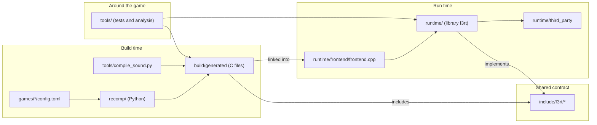

# Repository tour

**What you will learn:** where each file lives, what it does, and where to start reading each subsystem.

The repository has four main parts. The `recomp/` folder holds the recompiler. The `runtime/` folder holds the runtime library. The `include/f3rt/` folder holds the ABI between them. The `tools/` folder holds test and analysis tools. The tables describe source responsibilities, not file sizes. Generated files and local dependency caches have separate roles.

The exercised game is Land Maker Japan 2.01J. The World configuration is untested;
shared F3 models are not a claim of other-game support. Video and audio devices
are MAME-derived reference models, not physical-chip-verified implementations.
See the [evidence index](/developer/evidence) for recorded comparisons and limits.

## How the directories relate

The diagram shows which directory produces or uses which other directory.

## Where to start reading

Open these files first. Then follow the subsystem pages.

| Subsystem | Start in | Then read | Site page |
| --- | --- | --- | --- |
| ABI | `include/f3rt/cpu_abi.h` | `runtime/cpu_abi.cpp` | [CPU ABI](/developer/runtime/cpu-abi) |
| Machine and scheduler | `include/f3rt/machine.hpp` | `runtime/machine.cpp` (`advance_to`, `boundary`) | [Machine](/developer/runtime/machine) |
| Frontend | `runtime/frontend/frontend.cpp` | `runtime/capture_io.hpp` | [Frontend](/developer/runtime/frontend) |
| Recompiler | `recomp/__main__.py` | `recomp/generate.py`, then `recomp/emitter.py` | [Recompiler](/developer/recompiler/) |
| Discovery | `recomp/discovery.py` (`discover`) | `games/landmakrj/config.toml` | [Discovery](/developer/recompiler/discovery) |
| Timing and flags | `recomp/timing.py` | `recomp/cpu_ops.h` (`f3_cc_flush`) | [Flags and timing](/developer/recompiler/flags-and-timing) |
| Sound compiler | `tools/compile_sound.py` | `runtime/audio/reference/native/sound_native.cpp` | [Sound compiler](/developer/recompiler/sound-compiler) |
| FDP renderer | `include/f3rt/video.hpp` | `runtime/renderer/fdp/video.cpp` | [FDP](/developer/runtime/video/fdp) |
| Game-data video | `include/f3rt/game_video.hpp` | `runtime/renderer/game/video.cpp`, `runtime/renderer/game/scene.hpp` | [Game-data HLE](/developer/runtime/video/game-hle) |
| Audio | `include/f3rt/audio.hpp` | `runtime/audio/audio.cpp` | [Audio](/developer/runtime/audio/) |
| Interpreter | `runtime/interpreter.cpp` | `runtime/core_state.c` | [Interpreter](/developer/runtime/interpreter) |
| Save states | `runtime/state_io.hpp` | `save_state`, `load_state` and `state_crc` in `runtime/machine.cpp` | [Machine](/developer/runtime/machine) |
| Tests | `runtime/tests/*.cpp` | `tools/gameplay_regression.cpp` | [Testing](/developer/testing/) |

## File lists

Each table lists one directory. The link on each file name opens the file on GitHub.

### Top level

| File | Purpose |
| --- | --- |
| [`CMakeLists.txt`](https://github.com/ansxor/f3-recomp/blob/main/CMakeLists.txt) | Top-level build. Runs the recompiler at configure time. Builds Musashi, `f3rt`, the frontends and the test tools. |
| [`README.md`](https://github.com/ansxor/f3-recomp/blob/main/README.md) | Project identity, support scope, build and run commands, defaults, and credits. |
| [`docs/developer/VALIDATION.md`](https://github.com/ansxor/f3-recomp/blob/main/docs/developer/VALIDATION.md) | Retained validation scenarios, measurements, and limits. |
| [`docs/developer/DECISIONS.md`](https://github.com/ansxor/f3-recomp/blob/main/docs/developer/DECISIONS.md) | Technical rationale and observed compatibility evidence. |
| [`.gitignore`](https://github.com/ansxor/f3-recomp/blob/main/.gitignore) | Ignores `build/`, `roms/`, `games/*/generated/`, `wt/`, `*.bin`, `*.wav` and captures. |

### recomp/ (ROM to C recompiler, Python)

| File | Purpose |
| --- | --- |
| [`recomp/__main__.py`](https://github.com/ansxor/f3-recomp/blob/main/recomp/__main__.py) | Command line for `uv run python -m recomp discover` and `uv run python -m recomp emit`. |
| [`recomp/__init__.py`](https://github.com/ansxor/f3-recomp/blob/main/recomp/__init__.py) | Package marker. |
| [`recomp/discovery.py`](https://github.com/ansxor/f3-recomp/blob/main/recomp/discovery.py) | ROM lane loader (`load_rom`) and instruction discovery (`discover`). Writes the coverage report. |
| [`recomp/emitter.py`](https://github.com/ansxor/f3-recomp/blob/main/recomp/emitter.py) | Lowers one Capstone 68020 instruction to C statements (`lower`). |
| [`recomp/generate.py`](https://github.com/ansxor/f3-recomp/blob/main/recomp/generate.py) | Packs lowered instructions into C blocks and shards. Writes `program.c`, `program.h` and `sources.cmake`. |
| [`recomp/timing.py`](https://github.com/ansxor/f3-recomp/blob/main/recomp/timing.py) | Computes the cycle cost of each instruction from the cycle table. |
| [`recomp/cpu_ops.h`](https://github.com/ansxor/f3-recomp/blob/main/recomp/cpu_ops.h) | C helpers that generated code includes: lazy flag flush, condition test, shifts, rotates, multiply, divide and bit operations. |
| [`recomp/bitfield.h`](https://github.com/ansxor/f3-recomp/blob/main/recomp/bitfield.h) | C helper for the 68020 bitfield instructions. |
| [`recomp/68020_cycles.csv`](https://github.com/ansxor/f3-recomp/blob/main/recomp/68020_cycles.csv) | 68EC020 opcode cost table exported from Musashi. It holds CPU data, not game data. |
| [`recomp/68000_cycles.csv`](https://github.com/ansxor/f3-recomp/blob/main/recomp/68000_cycles.csv) | 68000 opcode cost table. The sound CPU compiler uses it. |
| [`recomp/CMakeLists.txt`](https://github.com/ansxor/f3-recomp/blob/main/recomp/CMakeLists.txt) | Small CMake project that builds the static library `f3_recompiled` from `sources.cmake`. |
| [`pyproject.toml`](https://github.com/ansxor/f3-recomp/blob/main/pyproject.toml) | Python project dependencies (`capstone==5.0.9`; analysis group: NumPy, SciPy) managed by `uv`. |

### include/f3rt/ (public interfaces)

| File | Purpose |
| --- | --- |
| [`include/f3rt/cpu_abi.h`](https://github.com/ansxor/f3-recomp/blob/main/include/f3rt/cpu_abi.h) | The C ABI: `f3_cpu`, `f3_block`, bus accessors and `f3_dispatch`. `F3RT_ABI_VERSION` is 2. |
| [`include/f3rt/machine.hpp`](https://github.com/ansxor/f3-recomp/blob/main/include/f3rt/machine.hpp) | `f3rt::Machine`: CPU, memory regions, devices, scheduler and snapshot API. |
| [`include/f3rt/rom.hpp`](https://github.com/ansxor/f3-recomp/blob/main/include/f3rt/rom.hpp) | `RomSet` and `crc32`. |
| [`include/f3rt/video.hpp`](https://github.com/ansxor/f3-recomp/blob/main/include/f3rt/video.hpp) | `Video`: the FDP (TC0630FDP) software renderer. |
| [`include/f3rt/game_video.hpp`](https://github.com/ansxor/f3-recomp/blob/main/include/f3rt/game_video.hpp) | `GameVideo`, `GameVideoMode` and `GameVideoOptions`: the game-data renderer. |
| [`include/f3rt/audio.hpp`](https://github.com/ansxor/f3-recomp/blob/main/include/f3rt/audio.hpp) | `Audio`: the sound board (OTIS, DSP, DUART, volume) and PCM output. |

### runtime/ core (machine, scheduler, CPUs)

These files form the `f3rt` library core and the frontend.

| File | Purpose |
| --- | --- |
| [`runtime/machine.cpp`](https://github.com/ansxor/f3-recomp/blob/main/runtime/machine.cpp) | `Machine`: reset, bus read and write with the memory map, `advance_to`, `boundary`, `run_frame`, inputs, coin logic, snapshot save and load. |
| [`runtime/cpu_abi.cpp`](https://github.com/ansxor/f3-recomp/blob/main/runtime/cpu_abi.cpp) | Implements the C functions of `cpu_abi.h`: `f3_read8` to `f3_write32`, `f3_set_sr`, `f3_exception`, `f3_dispatch`, `f3_fallback`. |
| [`runtime/interpreter.cpp`](https://github.com/ansxor/f3-recomp/blob/main/runtime/interpreter.cpp) | Wraps Musashi. Runs the main CPU one instruction at a time (fallback and reference mode). Runs the sound 68000 in oracle mode. |
| [`runtime/interpreter.hpp`](https://github.com/ansxor/f3-recomp/blob/main/runtime/interpreter.hpp) | `Interpreter` class declaration. |
| [`runtime/core_state.c`](https://github.com/ansxor/f3-recomp/blob/main/runtime/core_state.c) | C bridge that copies state between `f3_cpu` and the Musashi context, and exports the sound CPU state. |
| [`runtime/audio/reference/state_oracle.h`](https://github.com/ansxor/f3-recomp/blob/main/runtime/audio/reference/state_oracle.h) | Packed struct `f3rt_sound_oracle_state` for the interpreted sound CPU. |
| [`runtime/state_io.hpp`](https://github.com/ansxor/f3-recomp/blob/main/runtime/state_io.hpp) | `StateWriter`, `StateReader` and the packed `Canonical*` records used by save states. |
| [`runtime/rom.cpp`](https://github.com/ansxor/f3-recomp/blob/main/runtime/rom.cpp) | `RomSet::load` and `crc32`. Checks the size and CRC32 of every ROM chip. |
| [`runtime/eeprom.hpp`](https://github.com/ansxor/f3-recomp/blob/main/runtime/eeprom.hpp) | 93C46 EEPROM (64 words of 16 bits) with busy timing, load and save. |
| [`runtime/frontend/frontend.cpp`](https://github.com/ansxor/f3-recomp/blob/main/runtime/frontend/frontend.cpp) | SDL3 program. Parses all command-line options, drives the frame loop, audio and window. |
| [`runtime/frontend/ui.cpp`](https://github.com/ansxor/f3-recomp/blob/main/runtime/frontend/ui.cpp) | Dear ImGui overlay: preferences, slots, input capture, and shader controls. |
| [`runtime/frontend/settings.cpp`](https://github.com/ansxor/f3-recomp/blob/main/runtime/frontend/settings.cpp) | Preference persistence and two independent keyboard/gamepad input profiles. |

### runtime/ video

| File | Purpose |
| --- | --- |
| [`runtime/renderer/fdp/video.cpp`](https://github.com/ansxor/f3-recomp/blob/main/runtime/renderer/fdp/video.cpp) | FDP software renderer (`Video`). It reads the emulated FDP RAM. It is the oracle for the game-data renderer. |
| [`runtime/renderer/game/video.cpp`](https://github.com/ansxor/f3-recomp/blob/main/runtime/renderer/game/video.cpp) | `GameVideo`: decodes the scene from video RAM at VBSTART, decides when to fall back to `Video`. |
| [`runtime/renderer/decode.cpp`](https://github.com/ansxor/f3-recomp/blob/main/runtime/renderer/decode.cpp) | Generic VRAM decode: char-RAM tile unpack and sprite display-list walk. |
| [`games/landmakrj/video/video.cpp`](https://github.com/ansxor/f3-recomp/blob/main/games/landmakrj/video/video.cpp) | Per-game `video_writer_known` store-PC lists for `--discovery-log`. |
| [`runtime/renderer/game/scene.hpp`](https://github.com/ansxor/f3-recomp/blob/main/runtime/renderer/game/scene.hpp) | Shared scene types: `VideoRam`, `ScenePixel`, `SceneSprite`, `SceneLayer`, `ScenePlayfield`, `SceneClip`, `SceneRow`. |
| [`runtime/renderer/game/tiles.cpp`](https://github.com/ansxor/f3-recomp/blob/main/runtime/renderer/game/tiles.cpp) | Playfield tile maps snapshotted from FDP video RAM (shared `decode`). |
| [`runtime/renderer/game/tiles.hpp`](https://github.com/ansxor/f3-recomp/blob/main/runtime/renderer/game/tiles.hpp) | `GameTiles` declaration. |
| [`runtime/renderer/game/text.cpp`](https://github.com/ansxor/f3-recomp/blob/main/runtime/renderer/game/text.cpp) | Text layer decoded from the video-RAM text map and glyph RAM. |
| [`runtime/renderer/game/text.hpp`](https://github.com/ansxor/f3-recomp/blob/main/runtime/renderer/game/text.hpp) | `GameText` declaration. |
| [`runtime/renderer/game/sprites.cpp`](https://github.com/ansxor/f3-recomp/blob/main/runtime/renderer/game/sprites.cpp) | Sprite latch and rasterizer; the display list is decoded from video RAM. |
| [`runtime/renderer/game/sprites.hpp`](https://github.com/ansxor/f3-recomp/blob/main/runtime/renderer/game/sprites.hpp) | `GameSprites` declaration. |
| [`runtime/renderer/game/lines.cpp`](https://github.com/ansxor/f3-recomp/blob/main/runtime/renderer/game/lines.cpp) | Line RAM decode (scroll, zoom, clip and mix per scanline) and row normalization. |
| [`runtime/renderer/game/lines.hpp`](https://github.com/ansxor/f3-recomp/blob/main/runtime/renderer/game/lines.hpp) | `GameLines` declaration. |
| [`runtime/renderer/game/compositor.cpp`](https://github.com/ansxor/f3-recomp/blob/main/runtime/renderer/game/compositor.cpp) | `compose_game_scene`: mixes layers into final pixels, at native or enlarged size. |
| [`runtime/renderer/game/compositor.hpp`](https://github.com/ansxor/f3-recomp/blob/main/runtime/renderer/game/compositor.hpp) | Declaration of `compose_game_scene`. |

### runtime/ audio

| File | Purpose |
| --- | --- |
| [`runtime/audio/audio.cpp`](https://github.com/ansxor/f3-recomp/blob/main/runtime/audio/audio.cpp) | `Audio`: sound work RAM, ES5505, ES5510, DUART and volume chips, the sound-CPU time slicing and the PCM ring buffer. |
| [`runtime/audio/reference/native/sound_native.cpp`](https://github.com/ansxor/f3-recomp/blob/main/runtime/audio/reference/native/sound_native.cpp) | `SoundNative`: runs the statically compiled sound driver and implements the `f3_sound_*` runtime functions. |
| [`runtime/audio/reference/native/sound_native.hpp`](https://github.com/ansxor/f3-recomp/blob/main/runtime/audio/reference/native/sound_native.hpp) | `SoundNative` declaration. |
| [`runtime/audio/reference/native/sound_native_ops.h`](https://github.com/ansxor/f3-recomp/blob/main/runtime/audio/reference/native/sound_native_ops.h) | C header that the generated sound code includes (`f3_sound_read8`, `f3_sound_exception` and more). |
| [`runtime/audio/sound_trace.cpp`](https://github.com/ansxor/f3-recomp/blob/main/runtime/audio/sound_trace.cpp) | `SoundTrace`: writes the F3SND2 bus trace file. |
| [`runtime/audio/sound_trace.hpp`](https://github.com/ansxor/f3-recomp/blob/main/runtime/audio/sound_trace.hpp) | `SoundTrace` declaration and the record kinds. |
| [`runtime/audio/reference/state_oracle.h`](https://github.com/ansxor/f3-recomp/blob/main/runtime/audio/reference/state_oracle.h) | Packed sound Musashi interpreter state record. |
| [`runtime/audio/hle/audio.cpp`](https://github.com/ansxor/f3-recomp/blob/main/runtime/audio/hle/audio.cpp) | `AudioEngine`: top-level HLE (enhanced) audio driver. |
| [`runtime/audio/hle/synth.cpp`](https://github.com/ansxor/f3-recomp/blob/main/runtime/audio/hle/synth.cpp) | ROM sample synthesis and voice allocation. |
| [`runtime/audio/hle/sequencer.cpp`](https://github.com/ansxor/f3-recomp/blob/main/runtime/audio/hle/sequencer.cpp) | HLE command sequencer. |

### runtime/ capture, replay and tests

| File | Purpose |
| --- | --- |
| [`runtime/capture_io.hpp`](https://github.com/ansxor/f3-recomp/blob/main/runtime/capture_io.hpp) | Helpers that dump frames, RAM and CPU state to files, and the `WavWriter`. |
| [`runtime/replay.cpp`](https://github.com/ansxor/f3-recomp/blob/main/runtime/replay.cpp) | `f3rt-replay`: renders MAME captures with the FDP renderer, or replays a MAME audio trace to a WAV file. |
| [`runtime/tests/video.cpp`](https://github.com/ansxor/f3-recomp/blob/main/runtime/tests/video.cpp), [`input.cpp`](https://github.com/ansxor/f3-recomp/blob/main/runtime/tests/input.cpp), [`eeprom.cpp`](https://github.com/ansxor/f3-recomp/blob/main/runtime/tests/eeprom.cpp), [`cpu.cpp`](https://github.com/ansxor/f3-recomp/blob/main/runtime/tests/cpu.cpp), [`sprites.cpp`](https://github.com/ansxor/f3-recomp/blob/main/runtime/tests/sprites.cpp), [`audio.cpp`](https://github.com/ansxor/f3-recomp/blob/main/runtime/tests/audio.cpp) | Per-area synthetic-ROM checks. Shared fixtures and assertions are in [`runtime/tests/support.cpp`](https://github.com/ansxor/f3-recomp/blob/main/runtime/tests/support.cpp). |
| [`runtime/LICENSES.txt`](https://github.com/ansxor/f3-recomp/blob/main/runtime/LICENSES.txt) | Licenses of the vendored MAME-derived and Musashi code. |

### runtime/third_party/ (vendored code)

| File | Purpose |
| --- | --- |
| [`runtime/third_party/musashi/m68kcpu.c`](https://github.com/ansxor/f3-recomp/blob/main/runtime/third_party/musashi/m68kcpu.c) | Musashi 68k core, with the documented MAME-parity patches. |
| [`runtime/third_party/musashi/m68k_in.c`](https://github.com/ansxor/f3-recomp/blob/main/runtime/third_party/musashi/m68k_in.c) | Musashi opcode source. `m68kmake` turns it into `m68kops.c` at build time. |
| [`runtime/third_party/musashi/m68kmake.c`](https://github.com/ansxor/f3-recomp/blob/main/runtime/third_party/musashi/m68kmake.c) | Musashi code generator, built as `f3rt_m68kmake`. |
| [`runtime/third_party/musashi/m68kconf.h`](https://github.com/ansxor/f3-recomp/blob/main/runtime/third_party/musashi/m68kconf.h) | Musashi configuration. |
| [`runtime/third_party/musashi/m68k.h`](https://github.com/ansxor/f3-recomp/blob/main/runtime/third_party/musashi/m68k.h) | Musashi public API. |
| [`runtime/third_party/musashi/m68kcpu.h`](https://github.com/ansxor/f3-recomp/blob/main/runtime/third_party/musashi/m68kcpu.h) | Musashi internal header. |
| [`runtime/third_party/musashi/m68kfpu.c`](https://github.com/ansxor/f3-recomp/blob/main/runtime/third_party/musashi/m68kfpu.c) | Musashi FPU code. |
| [`runtime/third_party/musashi/m68kmmu.h`](https://github.com/ansxor/f3-recomp/blob/main/runtime/third_party/musashi/m68kmmu.h) | Musashi MMU code. |
| [`runtime/third_party/musashi/softfloat/softfloat.c`](https://github.com/ansxor/f3-recomp/blob/main/runtime/third_party/musashi/softfloat/softfloat.c) | Software floating point used by Musashi. |
| [`runtime/third_party/musashi/readme.txt`](https://github.com/ansxor/f3-recomp/blob/main/runtime/third_party/musashi/readme.txt) | Upstream core documentation and license information. |
| [`runtime/third_party/musashi/softfloat/softfloat.h`](https://github.com/ansxor/f3-recomp/blob/main/runtime/third_party/musashi/softfloat/softfloat.h) | Floating-point types, modes, and operation declarations. |
| [`runtime/third_party/musashi/softfloat/milieu.h`](https://github.com/ansxor/f3-recomp/blob/main/runtime/third_party/musashi/softfloat/milieu.h) | Common environment definitions and Boolean constants. |
| [`runtime/third_party/musashi/softfloat/mamesf.h`](https://github.com/ansxor/f3-recomp/blob/main/runtime/third_party/musashi/softfloat/mamesf.h) | Integer types, byte order, and constant macros for the vendored environment. |
| [`runtime/third_party/musashi/softfloat/softfloat-macros`](https://github.com/ansxor/f3-recomp/blob/main/runtime/third_party/musashi/softfloat/softfloat-macros) | Internal arithmetic helpers included by SoftFloat. |
| [`runtime/third_party/musashi/softfloat/softfloat-specialize`](https://github.com/ansxor/f3-recomp/blob/main/runtime/third_party/musashi/softfloat/softfloat-specialize) | NaN, exception, and platform specialization helpers. |
| [`runtime/third_party/musashi/softfloat/README.txt`](https://github.com/ansxor/f3-recomp/blob/main/runtime/third_party/musashi/softfloat/README.txt) | SoftFloat release and distribution information. |
| [`runtime/third_party/audio/es5505.cpp`](https://github.com/ansxor/f3-recomp/blob/main/runtime/third_party/audio/es5505.cpp) | ES5505 (OTIS) sound chip: 32 voices, filters and banks. |
| [`runtime/third_party/audio/es5505.hpp`](https://github.com/ansxor/f3-recomp/blob/main/runtime/third_party/audio/es5505.hpp) | ES5505 declaration. |
| [`runtime/third_party/audio/es5510.cpp`](https://github.com/ansxor/f3-recomp/blob/main/runtime/third_party/audio/es5510.cpp) | ES5510 (ESP) DSP: microcode, delay RAM and host interface. |
| [`runtime/third_party/audio/es5510.hpp`](https://github.com/ansxor/f3-recomp/blob/main/runtime/third_party/audio/es5510.hpp) | ES5510 declaration. |
| [`runtime/third_party/audio/mc68681.cpp`](https://github.com/ansxor/f3-recomp/blob/main/runtime/third_party/audio/mc68681.cpp) | MC68681 DUART: timers, serial transmitters and IRQ. |
| [`runtime/third_party/audio/mc68681.hpp`](https://github.com/ansxor/f3-recomp/blob/main/runtime/third_party/audio/mc68681.hpp) | MC68681 declaration. |
| [`runtime/third_party/audio/mb87078.cpp`](https://github.com/ansxor/f3-recomp/blob/main/runtime/third_party/audio/mb87078.cpp) | MB87078 electronic volume chip. |
| [`runtime/third_party/audio/mb87078.hpp`](https://github.com/ansxor/f3-recomp/blob/main/runtime/third_party/audio/mb87078.hpp) | MB87078 declaration. |

### tools/ (test, capture and analysis tools)

| File | Purpose |
| --- | --- |
| [`tools/tool.cpp`](https://github.com/ansxor/f3-recomp/blob/main/tools/tool.cpp) | `f3rt-tool`: unified CLI for gameplay, gpu-compare, motion, sound-extract, and sprite-check. |
| [`tools/runner/`](https://github.com/ansxor/f3-recomp/blob/main/tools/runner/) | Shared machine runner and input schedule implementations (`f3rt-runner`). |
| [`tools/commands/`](https://github.com/ansxor/f3-recomp/blob/main/tools/commands/) | Subcommand implementations for `f3rt-tool`. |
| [`cmake/check_game_geometry_literals.cmake`](https://github.com/ansxor/f3-recomp/blob/main/cmake/check_game_geometry_literals.cmake) | CTest geometry literal guard. |

### tools/differential/ and tools/mame/

| File | Purpose |
| --- | --- |
| [`tools/differential/__main__.py`](https://github.com/ansxor/f3-recomp/blob/main/tools/differential/__main__.py) | Command line of the instruction differential test. |
| [`tools/differential/__init__.py`](https://github.com/ansxor/f3-recomp/blob/main/tools/differential/__init__.py) | Differential tool package marker. |
| [`tools/differential/run.py`](https://github.com/ansxor/f3-recomp/blob/main/tools/differential/run.py) | Script wrapper for the same command. |
| [`tools/differential/runner.py`](https://github.com/ansxor/f3-recomp/blob/main/tools/differential/runner.py) | Builds and runs the generated tests against Musashi. |
| [`tools/differential/generator.py`](https://github.com/ansxor/f3-recomp/blob/main/tools/differential/generator.py) | Generates deterministic instruction test cases. |
| [`tools/differential/harness_abi.c`](https://github.com/ansxor/f3-recomp/blob/main/tools/differential/harness_abi.c) | C harness that runs lowered code and the reference core on the same state. |
| [`tools/differential/harness_abi.h`](https://github.com/ansxor/f3-recomp/blob/main/tools/differential/harness_abi.h) | Harness declarations. |
| [`tools/differential/musashi_build.py`](https://github.com/ansxor/f3-recomp/blob/main/tools/differential/musashi_build.py) | Builds the reference Musashi core. |
| [`tools/differential/export_cycles.py`](https://github.com/ansxor/f3-recomp/blob/main/tools/differential/export_cycles.py) | Exports the cycle table CSV from the generated Musashi table. |
| [`tools/mame/capture.lua`](https://github.com/ansxor/f3-recomp/blob/main/tools/mame/capture.lua) | MAME Lua script that captures frames, RAM, registers and audio state. |
| [`tools/mame/audio_trace.lua`](https://github.com/ansxor/f3-recomp/blob/main/tools/mame/audio_trace.lua) | MAME Lua script that records sound device writes. |
| [`tools/mame/run_capture.sh`](https://github.com/ansxor/f3-recomp/blob/main/tools/mame/run_capture.sh) | Shell script that stages ROMs and runs MAME captures. |
| [`tools/mame/stage_roms.py`](https://github.com/ansxor/f3-recomp/blob/main/tools/mame/stage_roms.py) | Finds ROM files, checks CRC32 values and stages them for MAME. |
| [`tools/mame/README.md`](https://github.com/ansxor/f3-recomp/blob/main/tools/mame/README.md) | Capture protocol and commands. |

### games/ and docs/

| File | Purpose |
| --- | --- |
| [`games/landmakrj/config.toml`](https://github.com/ansxor/f3-recomp/blob/main/games/landmakrj/config.toml) | Land Maker Japan: ROM lanes, `all_aligned` discovery and the video entry-point seeds. This is the execution target. |
| [`games/landmakr/config.toml`](https://github.com/ansxor/f3-recomp/blob/main/games/landmakr/config.toml) | Land Maker World: ROM lanes only. It is untested. |
| [`docs/developer/ABI-CHANGES.md`](https://github.com/ansxor/f3-recomp/blob/main/docs/developer/ABI-CHANGES.md) | ABI history. |
| [`docs/developer/VIDEO-HLE.md`](https://github.com/ansxor/f3-recomp/blob/main/docs/developer/VIDEO-HLE.md) | Game-data video addresses, layouts and parity evidence. |
| [`docs/SOUND-DRIVER.md`](https://github.com/ansxor/f3-recomp/blob/main/docs/SOUND-DRIVER.md) | Sound driver evidence, trace format and native driver. |
| [`docs/developer/`](https://github.com/ansxor/f3-recomp/tree/main/docs/developer) | Canonical validation, decisions, ABI history, video evidence, and binary-size measurements. See the [evidence index](/developer/evidence). |

### Documentation site and publishing

| File or directory | Purpose |
| --- | --- |
| [`docs/site/package.json`](https://github.com/ansxor/f3-recomp/blob/main/docs/site/package.json) | VitePress, Mermaid, and local `dev`, `build`, and `preview` commands. |
| [`docs/site/package-lock.json`](https://github.com/ansxor/f3-recomp/blob/main/docs/site/package-lock.json) | Locked npm dependency graph used by `npm ci`. |
| [`docs/site/.gitignore`](https://github.com/ansxor/f3-recomp/blob/main/docs/site/.gitignore) | Excludes dependencies, generated pages, and the VitePress cache. |
| [`docs/site/.vitepress/config.mts`](https://github.com/ansxor/f3-recomp/blob/main/docs/site/.vitepress/config.mts) | Project URL base, navigation, sidebars, search, source links, and Mermaid integration. |
| [`docs/site/.vitepress/theme/index.ts`](https://github.com/ansxor/f3-recomp/blob/main/docs/site/.vitepress/theme/index.ts) | Loads the default VitePress theme and the diagram stylesheet. |
| [`docs/site/.vitepress/theme/style.css`](https://github.com/ansxor/f3-recomp/blob/main/docs/site/.vitepress/theme/style.css) | Keeps diagram labels readable and confines scrolling to each diagram. |
| [`docs/site/index.md`](https://github.com/ansxor/f3-recomp/blob/main/docs/site/index.md) | Site entry point. |
| `docs/site/guide/` | Player setup, controls, video, sound, and troubleshooting. |
| `docs/site/reference/` | CLI, build options, game config, generated files, and tools. |
| `docs/site/developer/` | Architecture and source tour, with subsystem explanations below. |
| `docs/site/developer/recompiler/` | ROM loading, discovery, emission, flags, timing, and sound compilation. |
| `docs/site/developer/runtime/` | CPU ABI, machine, bus, scheduling, frontend, interpreter, save states, and support. |
| `docs/site/developer/runtime/video/` | Hardware renderer, game-data renderer, scenes, composition, and presentation. |
| `docs/site/developer/runtime/audio/` | Sound CPUs, mailbox, timing, chips, native driver, and PCM output. |
| `docs/site/developer/testing/` | Unit checks, differential cases, captures, comparisons, gameplay, and sound. |
| [`.github/workflows/docs.yml`](https://github.com/ansxor/f3-recomp/blob/main/.github/workflows/docs.yml) | Builds documentation on matching pushes and pull requests, or manual dispatch. Publishes non-PR builds to Pages. |

The [Developer overview](/developer/#every-developer-page) lists the individual subsystem pages.
The [Contributing page](/developer/contributing#work-on-this-documentation-site) explains local documentation commands and Pages setup.

## Files and folders that are not in Git

The `.gitignore` file hides these items. You will see some of them in your own checkout.

| Item | What it is |
| --- | --- |
| `build/` | CMake build directory. It holds generated C, libraries, executables, captures and WAV files. |
| `.venv/` | Python virtual environment managed by `uv`. |
| `roms/` | ROM sets. The project never contains ROMs. The README uses `../roms/landmakr` as an example path outside the repository. |
| `games/*/generated/` | Optional output folder for a manual `uv run python -m recomp emit` run. |
| `wt/` | Local Git worktrees. Ignored and not part of the distributed source tree. |
| `games/*/rom/` | Optional local ROM input directory. |
| `captures/`, `diffs/`, `nvram/`, `cfg/` | Local capture, comparison, and emulator working data. |
| `__pycache__/`, `*.pyc` | Python bytecode caches. |
| `docs/site/node_modules/` | Installed documentation dependencies. |
| `docs/site/.vitepress/dist/`, `docs/site/.vitepress/cache/` | Built pages and VitePress cache. |

::: info ROM directory name
The README uses a directory named `landmakr` for Japanese chip files. Any directory name works if it contains the required files. The program option `--set landmakrj` selects the Japanese set. The code never replaces the Japanese set with the World set. See [ROM loading and config](/developer/recompiler/rom-and-config).
:::
