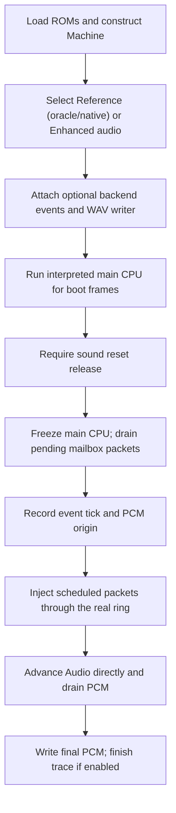

# Extracting music and sound effects

`f3rt-tool sound-extract` sends actual command packets through the mailbox. It produces PCM from the selected audio backend and optional backend-specific events.

The default `--audio-backend reference` executes the sound driver (the interpreted Musashi oracle by default, or the native driver with `--sound-driver native`) and the audio chips. `--audio-backend enhanced` uses a direct ROM sequencer and PCM synthesizer at 48 kHz on its own worker, without executing the sound CPU or ES chips; it is available only for `landmakrj`. Neither mode exports ROM samples; the main game initializes the board before extraction.

Source: `tools/commands/sound_extract.cpp`.

## Execution phases



The main CPU uses interpretation during boot, even when Reference sound uses the native driver or Enhanced is selected. The tool calls `run_frame(false)`.

After boot, the tool stops running the main CPU. It calls `Audio::advance` directly, so extraction does not trigger the main watchdog.

With Reference audio, the original sound driver, OTIS, DSP, DUART, banks and gain controller continue to run. Enhanced consumes the same mailbox packets through its ROM sequencer and PCM synthesizer instead.

## Options

| Option | Meaning and default |
|---|---|
| `--rom-dir DIR` | ROM directory. Required unless `F3RT_DEFAULT_ROM_DIR` was compiled into the tool. |
| `--set SET` | ROM set. Default: `landmakrj`. |
| `--audio-backend enhanced\|reference` | Audio backend. Default: `reference`. Enhanced is `landmakrj` only and uses the threaded ROM sequencer/PCM synthesizer at 48 kHz. |
| `--sound-driver oracle\|native` | Reference-audio sound CPU implementation. Default: `oracle`. Native requires generated sound code in the binary. Enhanced rejects an explicit driver option. |
| `--boot-frames N` | Positive interpreted-main boot frame count. Default: 900. |
| `--seconds DURATION` | Positive extraction duration after the event origin. Default: 5.0 seconds. |
| `--packet HEX` | Packet at event time zero. Repeat the option to submit several packets. |
| `--at SECONDS:HEX` | Packet at a nonnegative time relative to the event origin. Repeat as required. |
| `--sound-trace FILE` | Complete binary sound trace from cold boot through extraction. Reference audio only; rejected with Enhanced. |
| `--hle-events FILE` | HLE voice start/release/stop/parameter CSV. Requires `--audio-backend enhanced`; this is not an F3SND2 bus trace. |
| `--wav FILE` | Stereo signed-16-bit PCM WAV at the advertised audio sample rate. |
| `--wav-window full\|event` | WAV interval. Default: `full`. |
| `--help`, `-h` | Usage and startup notes. |

Omitting `--wav`, `--sound-trace` or `--hle-events` disables the corresponding file output. Audio generation and counters still run.

## Why boot lasts 900 frames

The main game sends startup packets and releases the sound CPU reset line. It also writes four output-gain requests.

[The driver evidence](https://github.com/ansxor/f3-recomp/blob/main/docs/SOUND-DRIVER.md) places those requests near 13.2338 seconds, at main `0xc007f8..0xc007fb`.

The former 660-frame boot ended before those writes. It produced heavily attenuated output.

The 900-frame default includes the gain initialization. Earlier custom boot points can retain startup attenuation or require extra sequence-start packets.

The tool adds no hidden initialization packets. It does not override master gain.

## Event origin and packet drain

The final boot instruction can cross a video boundary. The tool therefore uses `Audio::clock_ticks()`, not an assumed frame endpoint.

It sets `m.cpu.cycles` to that cursor and freezes main execution.

Before setting the event origin, it waits for consumer and producer indices to match. It advances audio in 1000-tick slices.

This wait has a one-second limit. Failure to drain pending packets is an error.

The event origin contains an absolute tick and PCM ordinal. Scheduled packet times are relative to this origin.

The evidence document reports tick 244,300,326 and PCM ordinal 454,413 for its supplied-ROM default run.

That result is approximately 15.268770 seconds. It is not a hard-coded tool constant.

## Packet syntax and publication

A packet uses hexadecimal bytes. Whitespace is permitted inside the packet string.

The parser requires an even number of hexadecimal characters. It also requires at least two bytes.

Byte 0 must equal the complete packet length, including the length and opcode bytes. The parser does not validate opcode-specific operand semantics.

With Reference audio, the driver applies its own command checks after consumption. Enhanced consumes these packets without driver execution. See [the mailbox command table](/developer/runtime/audio/mailbox).

`publish_packet` performs these actions:

1. Read the doubled producer word from `shared[0x480..0x481]`.
2. Set synthetic writer PC `0xffffffff` and the synchronized main tick.
3. Write packet bytes into the 1024-byte ring, wrapping with `& 0x3ff`.
4. Write the new doubled producer high byte at `0xc00480`.
5. Commit its low byte at `0xc00481`.

The packet travels through the same shared RAM as a game command. For Reference audio, [the trace decoder](/developer/runtime/audio/tracing) reconstructs its publication and ownership.

### Scheduling rules

Times and duration round once to the 16 MHz clock with `std::round`. The tool uses the resulting integer ticks for execution.

Packets are stable-sorted by requested time. Equal requested times retain CLI argument order.

A packet must be earlier than the duration after clock rounding. An event at the exact end is an error.

The execution loop advances at most 1000 ticks per slice. It shortens a slice to the next scheduled packet tick.

All packets due at the current tick are submitted before audio advances again.

The ring reserves one byte to distinguish full from empty. Free space is `1023 - occupied`.

If a due packet does not fit, extraction fails. The tool does not delay it, drop it or silently extend the duration.

## Reference-audio music example

This example starts looping sequence 8 and sets its sequence volume to `0x74`:

```sh
build/f3rt-tool sound-extract --rom-dir /path/to/roms/landmakr \
  --sound-driver native --packet 038108 --packet 04860874 --seconds 5 \
  --wav-window event --sound-trace build/music.sound --wav build/music.wav
uv run f3 decode build/music.sound \
  --output build/music-full.jsonl
```

`038108` contains opcode `0x81` and sequence 8. `04860874` contains opcode `0x86`, sequence 8 and volume `0x74`.

The volume packet does not replace the start packet as the owner of sequenced notes.

## Reference-audio direct sound-effect example

This example selects program `0x4002` on sequence 1, track 7. It starts key `0x27` with velocity `0x68`.

It releases the same key after 1.5 seconds:

```sh
build/f3rt-tool sound-extract --rom-dir /path/to/roms/landmakr \
  --sound-driver native --packet 068d01074002 --packet 068e01072768 \
  --at 1.5:058f010727 --seconds 3 --wav-window event \
  --sound-trace build/sfx.sound --wav build/sfx.wav
uv run f3 decode build/sfx.sound --notes-only \
  --output build/sfx-onsets.jsonl
```

The direct note has a software duration of `0x7fff`. The scheduled `0x8f` packet releases it through the driver.

It does not rewrite the ES5505 sample end address. A logical track, program ID and physical voice are different identifiers.

No command guarantees audible output for every program or sequence. A missing track can produce no note.

## WAV windows and counters

A Reference sound trace always begins at cold boot. `--wav-window event` changes only which drained PCM frames enter the WAV, in either backend.

| Window | WAV contents |
|---|---|
| `full` | Boot, pre-origin packet drain and extraction. |
| `event` | Extraction from the established event origin. |

Both windows drain boot audio. This prevents an old boot queue from appearing in the event-only WAV.

The extraction loop drains roughly every 16,000 ticks and performs a final drain. Its buffer holds 4096 stereo frames per read.

The final status includes backend, set, packet count, duration, total audio frames, peak, nonzero sample count, sound PC and wall time.

Audio counters include boot and the pre-origin drain, even with an event-only WAV. `packets` counts synthetic submissions, not startup game packets.

JSONL uses absolute trace ticks and PCM ordinals. Subtract the printed event origin when you need an event-relative timeline.

For HLE voice event inspection, replace the Reference example's `--sound-driver native --sound-trace ...` with `--audio-backend enhanced --hle-events build/music-hle.csv` and use a distinct WAV filename. The CSV columns are `kind,instance,tick,sequence,track,key,layer,pair,start,end,frequency,left,right,k1,k2,loop,reverse`. `decode_sound.py` and `compare_sound.py` accept F3SND2 traces, not this CSV.

## Compare Reference sound drivers

Keep `--audio-backend reference` (the default) and repeat each extraction with `--sound-driver oracle` and distinct output filenames. Compare complete traces and WAV files separately:

```sh
python3 tools/compare_sound.py build/music-oracle.sound \
  build/music-native.sound --json build/music-parity.json
cmp build/music-oracle.wav build/music-native.wav
```

The evidence document reports these retained gates:

| Stimulus | Identical trace records | Event-window PCM frames | Peak |
|---|---:|---:|---:|
| Music example | 1,697,152 | 148,805 | 414 |
| Direct SFX example | 1,446,519 | 89,283 | 530 |

Each gate has byte-identical oracle and native WAVs. These are historical results, not new executions for this documentation.

For complete reproduction, decode the full stream. `--notes-only` omits later pitch, envelope, filter and control writes.

## Errors

The tool reports `SOUND_EXTRACT ERROR` and exits with status 1 for failures.

Important failures include malformed packets, invalid times, missing ROMs, unavailable native code, halted boot and unreleased sound reset.

It also rejects an undrained ring, insufficient ring space, out-of-range clock intervals and packets at or after the duration.

A successful Reference trace capture writes a trace `End` record. Failed captures can lack it; the decoder rejects such incomplete traces. Enhanced rejects sound tracing and explicit sound-driver selection; `--hle-events` is rejected unless Enhanced is selected.
