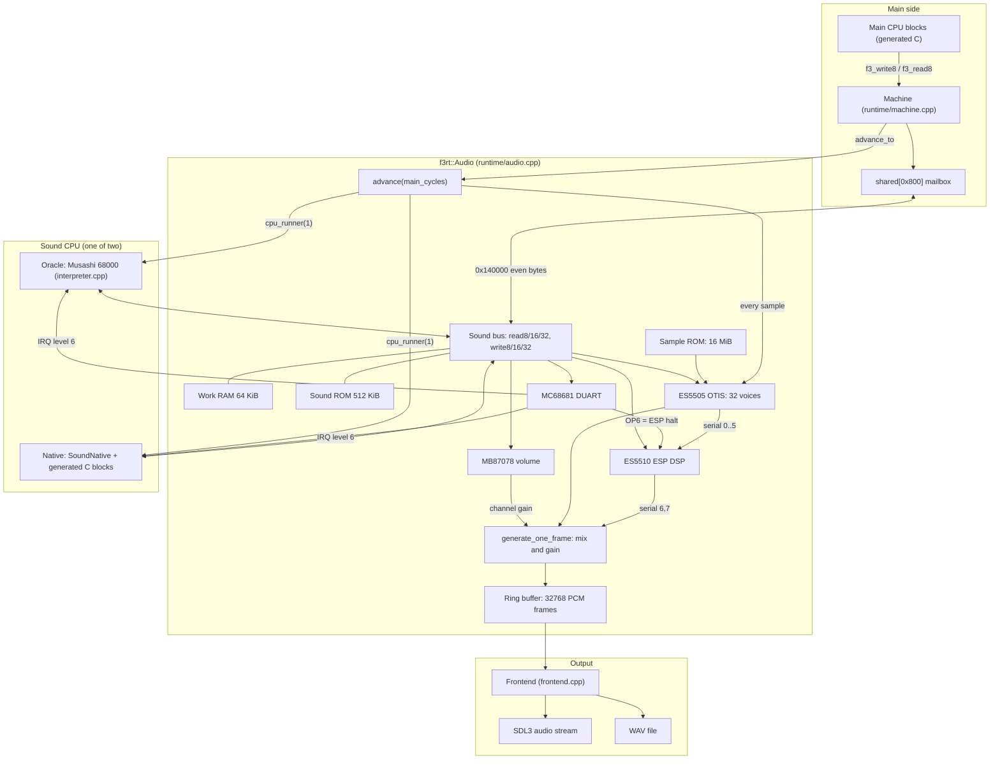
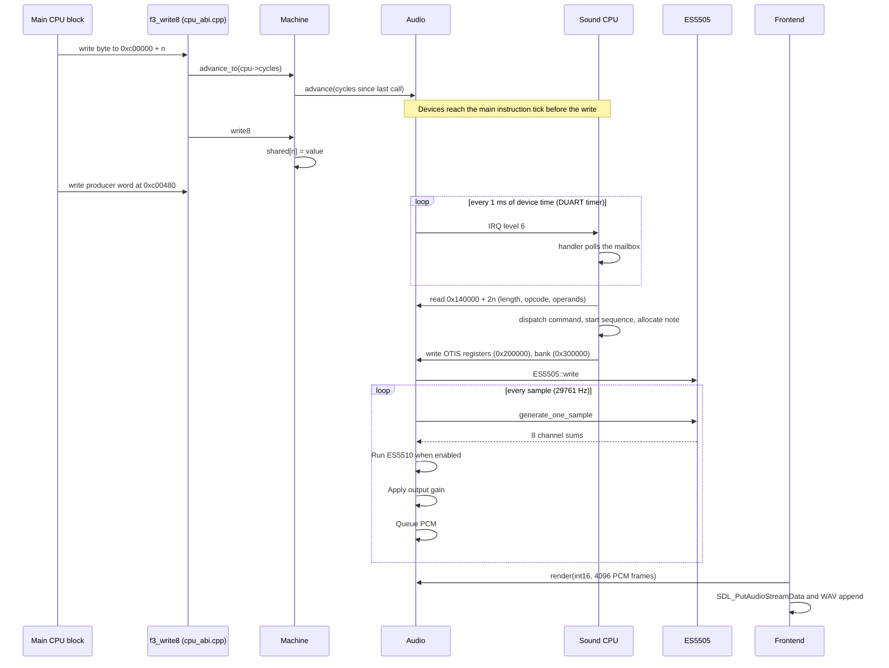

# Audio and the sound CPU

The runtime models a sound board with its own CPU, program ROM, RAM and audio devices. The main CPU sends commands through shared RAM.

The sound CPU reads those commands and programs the devices. `f3rt::Audio` owns the device models, sound bus, clock and PCM queue.

The sound CPU has two backends: the interpreted oracle and the statically recompiled native driver.

These device pages describe the default `--audio-backend accurate` path.
Opt-in `--audio-backend hle` bypasses sound CPU/device execution and runs
ROM-data sequencing, sample mixing and approximate effects on a non-rollback
48 kHz thread. See [the sound guide](/guide/sound#opt-in-hle-audio) and
[HLE implementation evidence](https://github.com/ansxor/f3-recomp/blob/main/docs/HLE-AUDIO.md).

Sources: [audio.hpp](https://github.com/ansxor/f3-recomp/blob/main/include/f3rt/audio.hpp) and [audio.cpp](https://github.com/ansxor/f3-recomp/blob/main/runtime/audio.cpp).

## Words used on these pages

The table gives the terms that this section uses. Each term has one meaning.

| Term | Meaning |
|---|---|
| Main CPU | The Motorola 68EC020 that runs the game. The recompiler turns its program into C. |
| Sound CPU | The Motorola 68000 on the sound board. It runs the sound driver. |
| Sound driver | The program in the sound ROM chips `e61-14.32` and `e61-15.33`. |
| Mailbox | The shared RAM through which the main CPU sends commands to the sound CPU. |
| ES5505, OTIS | The Ensoniq chip that plays 32 sample voices. |
| ES5510, ESP | The Ensoniq digital signal processor (DSP) that makes effects such as reverb. |
| MC68681, DUART | The Motorola chip that has a timer and two serial ports. The sound board uses it for the timer interrupt and for one control pin. |
| MB87078 | The Fujitsu chip that sets the master volume. |
| PCM frame | One pair of samples, one for the left channel and one for the right channel. |
| Device time | A counter of main-clock ticks. All sound chips use this counter. One tick is 1/16,000,000 second. |
| Oracle | The sound CPU that Musashi (a 68000 interpreter) runs. It is the reference. |
| Native driver | The sound driver after static recompilation. It runs as generated C code. |

## The audio components

The diagram shows the parts of the audio system and the data that flows between them.

Only one sound CPU is active in a run. `Machine::use_native_sound` replaces the oracle with the native driver before the machine starts.

## Sound CPU memory map

The sound CPU sees the address space below. The table comes from the bus handlers `Audio::Impl::read8` and `write8` in `runtime/audio.cpp`. The code masks every address to 24 bits.

| Address range | Device | Notes |
|---|---|---|
| `0x000000` - `0x03ffff` | Work RAM, 64 KiB | The code uses `address & 0xffff`. The 64 KiB repeats four times. |
| `0x140000` - `0x140fff` | Mailbox (shared RAM) | Only even addresses hold data. The byte index is `(address - 0x140000) / 2`. |
| `0x200000` - `0x20001f` | ES5505 registers | Sixteen 16-bit registers. Register number is `(address >> 1) & 0x0f`. |
| `0x260000` - `0x2601ff` | ES5510 host interface | Only odd addresses hold data. Register number is `(address >> 1) & 0xff`. |
| `0x280000` - `0x28001f` | MC68681 DUART | Only odd addresses hold data. Register number is `(address >> 1) & 0x0f`. |
| `0x300000` - `0x30003f` | ES5505 bank table | One 16-bit word for each voice. |
| `0x340000` - `0x340003` | MB87078 volume | Only even addresses hold data. |
| `0xc00000` - `0xc7ffff` | Sound program ROM | 512 KiB. Reads past the loaded size return `0xff`. |
| `0xff0000` - `0xffffff` | Work RAM mirror | Same bytes as `0x000000`. |
| All other addresses | Not mapped | Reads return `0xff`. Writes do nothing. |

The main CPU sees the same mailbox bytes at `0xc00000` - `0xc007ff`. The sound CPU sees each byte at twice the offset. The two CPUs use different byte lanes of the same 2 KiB array.

## Source files

This table lists the core audio files and tools. Frontend output also uses `runtime/frontend.cpp` and `runtime/capture_io.hpp`.

| File | Role |
|---|---|
| `include/f3rt/audio.hpp` | The public `Audio` class. |
| `runtime/audio.cpp` | Bus handlers, device time, mixer, ring buffer, state save and load. |
| `runtime/third_party/audio/es5505.*` | OTIS voices. |
| `runtime/third_party/audio/es5510.*` | ESP DSP. |
| `runtime/third_party/audio/mc68681.*` | DUART timer, serial transmitters and output pins. |
| `runtime/third_party/audio/mb87078.*` | Volume controller. |
| `runtime/sound_native.*`, `runtime/sound_native_ops.h` | The native driver runtime. |
| `runtime/sound_trace.*` | The bus trace writer. |
| `runtime/interpreter.cpp` | The oracle (Musashi) sound CPU. |
| `tools/compile_sound.py` | The sound driver compiler. |
| `tools/sound_extract.cpp`, `tools/decode_sound.py`, `tools/compare_sound.py` | Extraction, decoding and comparison tools. |

The four chip files come from the MAME project under the BSD 3-Clause license. The file `runtime/LICENSES.txt` names the authors. The project did not link the MAME framework.

## Public API and ownership

`Audio` owns its implementation through `std::unique_ptr`. It is movable but not copyable.

`load_sound_rom` copies the input bytes. `load_sample_rom` converts big-endian byte pairs into owned 16-bit words and attaches them to OTIS.

An unmatched final sample byte is not converted. The sample-address mask assumes the power-of-two region used by the ROM loader.

`set_shared_ram` attaches an external pointer and size. It does not copy or own the main machine's shared array.

`set_cpu_runner`, `set_reset_callback` and `set_irq_callback` attach CPU integration. They do not choose a backend by themselves.

`advance` changes device time and produces PCM. `render` consumes queued PCM; it does not execute the CPU or generate new frames.

`sample_rate`, `available_frames`, `clock_ticks` and `generated_frames` expose rate, queue depth and timeline counters.

The two `render` overloads return the number of stereo frames consumed. Their output uses interleaved left/right samples.

See [timing](/developer/runtime/audio/timing) for reset, queue locking, gain selection and exact-size state spans.

## Follow one mailbox write to a sample

This section follows a start-music command from the main CPU to PCM output. The detail pages explain each step.

The steps are:

1. A generated main-CPU store calls `f3_write8` in `runtime/cpu_abi.cpp`.
2. For a mailbox address, `bus()` calls `Machine::advance_to(cpu->cycles)` before the transfer.
3. `Audio::advance` completes earlier device and sound-CPU work. The new mailbox byte is not yet visible.
4. `Machine::write8` records an optional trace row, then stores the byte in `shared`.
5. The main program writes the doubled producer index last. Its low byte at `0xc00481` commits the packet.
6. The configured DUART raises level 6. The sound IRQ handler polls and consumes the packet.
7. A later driver task dispatches the command. A music command starts sequence work and note allocation.
8. The driver writes OTIS registers and a per-voice bank. OTIS generates eight channel sums from sample ROM.
9. Gain-scaled pairs 1–3 enter ES5510 serial inputs. The DSP runs when enabled; pair 0 bypasses it.
10. The mixer combines DSP output and pair 0, applies output gain, and queues a stereo PCM frame.
11. `Audio::render` drains frames. The frontend sends them to SDL3 and, when requested, a WAV file.

Command publication, consumption, dispatch and key-on have different timestamps. The [trace decoder](/developer/runtime/audio/tracing) preserves their ownership.

## Where to read next

- [Device time, sample rate and output](/developer/runtime/audio/timing) explains `Audio::advance`, the cursors and the ring buffer.
- [The sound CPU](/developer/runtime/audio/sound-cpu) explains the two CPU backends, reset and interrupts.
- [The mailbox](/developer/runtime/audio/mailbox) explains the packet format and the command list.
- [ES5505](/developer/runtime/audio/es5505), [ES5510](/developer/runtime/audio/es5510) and [DUART and volume](/developer/runtime/audio/duart-and-gain) explain the chips.
- [The native driver](/developer/runtime/audio/native-driver) explains `SoundNative`.
- [Sound traces](/developer/runtime/audio/tracing) and [extraction](/developer/runtime/audio/extraction) explain how the project proved that the native driver matches the oracle.
- [The sound-CPU compiler](/developer/recompiler/sound-compiler) explains `tools/compile_sound.py`.
- [Sequences and allocation](/developer/runtime/audio/sequences) explains driver tables, note events, sample splits and software envelopes.
- The repository file [docs/SOUND-DRIVER.md](https://github.com/ansxor/f3-recomp/blob/main/docs/SOUND-DRIVER.md) holds the detailed evidence.
