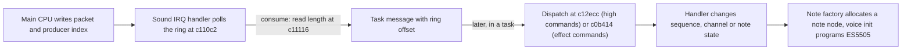

# The mailbox: how the main CPU talks to the sound CPU

The mailbox is shared RAM between the main CPU and sound CPU. This page explains its byte lanes, packet ring and driver commands.

Sources: [audio.cpp](https://github.com/ansxor/f3-recomp/blob/main/runtime/audio.cpp), [machine.cpp](https://github.com/ansxor/f3-recomp/blob/main/runtime/machine.cpp), and [driver evidence](https://github.com/ansxor/f3-recomp/blob/main/docs/SOUND-DRIVER.md).

## Shared RAM

The main CPU and the sound CPU share a 2 KiB dual-port RAM. The code calls it the **mailbox**. In the runtime it is the array `Machine::shared` (`std::array<uint8_t, 0x800>`). `Machine::Machine` gives a pointer to it to `Audio::set_shared_ram`.

The two CPUs see the same bytes at different addresses:

| CPU | Address range | Rule |
|---|---|---|
| Main | `0xc00000` - `0xc007ff` | One byte per address. |
| Sound | `0x140000` - `0x140fff` | Data only at even addresses. Byte `i` is at `0x140000 + 2 * i`. |

A sound read of an odd address returns `0xff`. A sound 16-bit read of a mailbox word returns `(byte << 8) | 0xff`. A 16-bit write stores the high byte. The check in `runtime/check.cpp` tests both directions ("DPRAM sound high-byte lane" and "DPRAM reverse lane").

Neither side has a lock or an interrupt for the mailbox. Both sides use plain reads and writes. The sound driver polls the ring in its timer interrupt.

## The command ring

The main CPU sends commands through a ring buffer. The facts below come from the tools in the repository and from `docs/SOUND-DRIVER.md`.

| Item | Main address | Sound address | Offset in `shared` |
|---|---|---|---|
| Ring, 1024 bytes | `0xc00000` - `0xc003ff` | `0x140000` - `0x1407fe` | `0x000` - `0x3ff` |
| Producer index | `0xc00480` - `0xc00481` (big-endian) | `0x140900` | `0x480` - `0x481` |
| Consumer index | `0xc00482` - `0xc00483` | `0x140904` | `0x482` - `0x483` |

The index words are **doubled**. The value is two times the byte index in the ring. The ring wraps with `& 0x3ff`. The tool code in `tools/sound_extract.cpp` (`RingBufferState`) reads the producer as `(shared[0x480] << 8) | shared[0x481]` and the byte index as `producer / 2`.

The main CPU is the producer:

1. It copies the packet bytes into the ring at the producer position.
2. It writes the new doubled producer value. The last byte that it writes is the low byte at `0xc00481`.

The write to `0xc00481` is the commit. `tools/decode_sound.py` uses it the same way: it parses packets only when it sees a write to `0xc00481`.

The sound driver is the consumer. It reads the packet length at `$c11116` (sound ROM address), reads the opcode at `$c11128`, and advances and wraps the consumer index at `$c11146` - `$c11150`. It publishes the new index with a `MOVEP` instruction. These addresses come from `docs/SOUND-DRIVER.md`.

The extraction tool reserves one byte to distinguish full from empty. Its `available_bytes` computes free space as `1023 - occupied`.

This is the tool's injection policy. It is not a new hardware capacity limit.

::: warning
An older note in the project said the ring had 2048 command bytes. `docs/developer/DECISIONS.md` corrects this: the ring has 1024 bytes with doubled indices.
:::

## Packet format

A packet is a byte string:

```text
byte 0      total length, including this byte and the opcode
byte 1      opcode
byte 2...   payload (operands)
```

`parse_hex` in `sound_extract.cpp` enforces the first rule: the packet needs at least 2 bytes, and byte 0 must equal the packet size. Multi-byte operands are big-endian.

The main program has two helper routines (main ROM addresses `$2fde` and `$3270`) that copy one packet, or a list of packets, into the ring. This is from `docs/SOUND-DRIVER.md`.

## From packet to action

A packet goes through three stages in the driver. The stages have different time stamps.



The dispatcher checks the packet. For the high commands (opcodes `0x80` and above) it clears opcode bit 7, checks that the index is below `$11` (17 entries), and requires the exact length from a table. An invalid packet can be consumed and do nothing.

Submit, consume, dispatch, note allocation and the first voice write all happen at different times. [The decoder](/developer/runtime/audio/tracing) follows the packets by ring offset. It does not match an audio event to the last packet that it saw.

## Command list

The table lists the commands that the Land Maker sound driver accepts. The source is `docs/SOUND-DRIVER.md`. The project derived the table from the ROM. It did not re-derive it for this site. The addresses are sound ROM addresses.

| Opcode | Length | Payload | Effect (handler) |
|---|---:|---|---|
| `0x20` | 3 | effect | Select an effects configuration (below 13). Queue the effects worker. (`$c0b454`) |
| `0x21` | 4 | parameter, value | Store a byte in the effects state at `$c84a + 2 * parameter`. (`$c0b47e`) |
| `0x80` | 3 | sequence | Stop and restart. Start a non-looping sequence. (`$c12f20`, start `$c12ce0`) |
| `0x81` | 3 | sequence | Stop and restart. Start a looping sequence. (`$c12f26`, start `$c12ce6`) |
| `0x82` | 3 | sequence | Stop and remove an active sequence. (`$c12f1a`) |
| `0x83` | 3 | sequence | Set the sequence rate to zero and release track notes. (`$c12f2c`) |
| `0x84` | 3 | sequence | Restore the saved sequence rate. (`$c12f42`) |
| `0x85` | 5 | sequence, position high, position low | Seek: advance the event cursors. (`$c1301a`) |
| `0x86` | 4 | sequence, volume | Set the sequence volume at `+$20`. Clear the fade step `+$22`. (`$c12f62`) |
| `0x87` | 4 | sequence, value | Set channel `+0x26/+0x2d` for all active tracks. (`$c12f96`) |
| `0x88` | 4 | sequence, rate | Set the current and saved rate. (`$c12f7a`) |
| `0x89` | 7 | sequence, start, end, rate index, unused | Fade the volume with a multiplier table. (`$c12fcc`) |
| `0x8a` | 5 | sequence, track, value | Set channel `+0x20/+0x2c`. (`$c130c6`) |
| `0x8b` | 5 | sequence, track, value | Set channel `+0x26/+0x2d`. (`$c130ba`) |
| `0x8c` | 6 | sequence, track, index, value | Call a controller routine. (`$c130d2`) |
| `0x8d` | 6 | sequence, track, program high, program low | Select the instrument (program) for a track. (`$c130da`) |
| `0x8e` | 6 | sequence, track, key, velocity | Start a sustained note with duration `$7fff`. (`$c130ea`) |
| `0x8f` | 5 | sequence, track, key | Release the matching note. (`$c1313c`) |
| `0x90` | 6 | sequence, track, key, value | Matching path attempts a write to ROM `0xc1314e` through return-PC A3; the bus ignores it. It does not override note RAM or pressure. (`0xc13146`) |

Two limits apply to this table:

- The channel-field names for `0x87`, `0x8a` and `0x8b` are not inferred from captured runs. Command `0x90`'s ignored-ROM-write behavior is established from the driver code, not an audible effect in the captured run.
- Bit 7 of the sequence number is not always ignored. Some routines use it as extra state. The decoder uses ordinary sequence numbers only. If it cannot find the origin of a note, it writes `null`.

The high-command handler table is at `0xc1323e`. Its accepted-length table is at `0xc13260`.

Track lookup `0xc13072` reads four argument bytes even for five-byte packets. Handlers that do not need the last byte ignore it.

The fade handler accepts length seven but reads only four operands. The final byte's meaning is not established.

Invalid opcode or length can produce consumption without a driver action. Publication alone does not prove command acceptance.

## What the game sends

The main sound-selector pointer table is at `0x6bde`. Its maximum selector, `0x5f`, is stored at `0x6d5e`.

Dispatcher `0x30be` handles the descriptor types below. These locations come from the driver evidence document.

| Type | Layout | What the main code emits |
|---|---|---|
| 0 | `[type, song, volume]` | Command `0x81` (start looping song), then `0x86` (volume). |
| 2 | `[type, unit, velocity, track, program high, program low, key, duration]` | An optional `0x8f` for the old note, then `0x8d` and `0x8e`. The main game schedules the duration. |
| 3 | Counted raw bytes | The bytes go to the ring through the list routine. |

A selector is not an opcode and is not a voice number.

## Example packets

These examples come from the README and from the extraction tool. They are valid packets.

| Hex | Meaning |
|---|---|
| `038108` | Length 3, opcode `0x81` (start looping sequence), sequence 8. |
| `04860874` | Length 4, opcode `0x86` (sequence volume), sequence 8, volume `0x74`. |
| `068d01074002` | Length 6, opcode `0x8d`, sequence 1, track 7, program `0x4002`. |
| `068e01072768` | Length 6, opcode `0x8e`, sequence 1, track 7, key `0x27`, velocity `0x68`. |
| `058f010727` | Length 5, opcode `0x8f`, sequence 1, track 7, key `0x27`. |

The page about [extraction](/developer/runtime/audio/extraction) shows how to send them.

See [sequences and allocation](/developer/runtime/audio/sequences) for the work after packet dispatch.

## Replies

The sound CPU also writes to the shared RAM. The test `check_main_sound_ordering` makes the sound CPU write a reply byte, and the main CPU reads it. The Land Maker use of the reply area is not part of the evidence documents. This page does not describe it.
