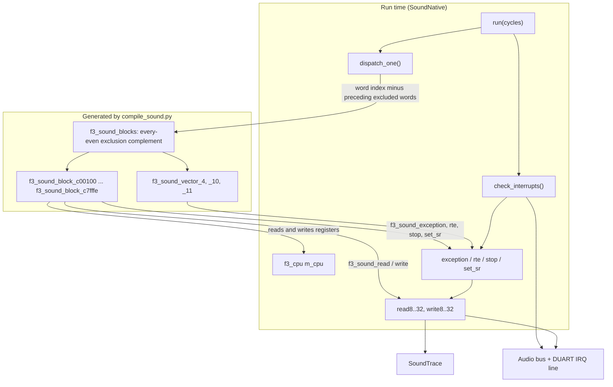
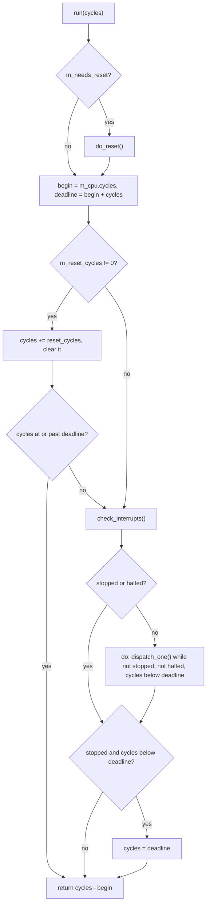

# The native sound driver at run time

`SoundNative` runs generated sound instructions. It supplies the bus, exceptions, interrupts, reset and `STOP` behavior that generated arithmetic cannot provide alone.

This is static translation of the sound ROM, not HLE. It retains the emulated
sound devices. Agreement with the interpreter at instruction boundaries does not
verify physical CPU bus timing or sound-board output.

Sources: [sound_native.hpp](https://github.com/ansxor/f3-recomp/blob/main/runtime/audio/reference/native/sound_native.hpp), [sound_native.cpp](https://github.com/ansxor/f3-recomp/blob/main/runtime/audio/reference/native/sound_native.cpp), and [sound_native_ops.h](https://github.com/ansxor/f3-recomp/blob/main/runtime/audio/reference/native/sound_native_ops.h).

The compiler is described on [another page](/developer/recompiler/sound-compiler). This page covers the run-time half: `runtime/audio/reference/native/sound_native.hpp`, `runtime/audio/reference/native/sound_native.cpp` and `runtime/audio/reference/native/sound_native_ops.h`.

## The idea

In ordinary/tier builds the compiler creates one table entry per nonexcluded aligned sound-ROM address. Entries select a single-instruction function, a shared exception function, or an unsupported-instruction failure.

`SoundNative` keeps registers in `f3_cpu` and dispatches through that table.

The diagram below describes the default full-coverage table. Profile tiers keep
that dense table. Explicit `F3_PROFILE_SLIM` builds instead validate a nonempty,
strictly sorted retained table and binary-search it; a missing sound entry aborts
with address, ROM CRC, re-profile hint and a durable cold-hit record. It never
switches to the interpreter. Instrumentation counts each actual single-instruction
or shared-exception entry once, outside canonical machine/snapshot state.

## The ABI: `f3_cpu`, `f3_block` and `sound_native_ops.h`

The structure `f3_cpu` is in `include/f3rt/cpu_abi.h`. The main CPU also uses it. It holds `d[8]`, `a[8]`, `pc`, the stack pointers, `sr`, the lazy-flag fields (`cc_src`, `cc_dst`, `cc_result`, `cc_op`, `cc_width`, `cc_mask`), the 64-bit `cycles` counter and a `runtime` pointer. See [the CPU ABI page](/developer/runtime/cpu-abi).

A table entry is `f3_block { uint32_t address; f3_block_fn execute; }`. A block function takes only the `f3_cpu` pointer.

The generated code calls functions that depend on the bus. The main CPU build uses `f3_read8`, `f3_write8` and so on. They go to `Machine`. For the sound CPU the compiler renames them to `f3_sound_read8` and the like. The header `runtime/audio/reference/native/sound_native_ops.h` declares the sound versions and some helpers:

| Item in `sound_native_ops.h` | Purpose |
|---|---|
| `f3_sound_read8/16/32`, `f3_sound_write8/16/32` | Sound bus access. |
| `f3_sound_set_sr`, `f3_sound_exception`, `f3_sound_rte`, `f3_sound_stop` | CPU control. These need the SR rules of a 68000. |
| `f3_sound_unsupported_pc` | Called by a stub for an instruction that the compiler could not lower. |
| Macros `f3_sound_cc_flush`, `f3_sound_eval_cond`, `f3_sound_lsl` ... `f3_sound_bchg` | Aliases for the shared helpers in `recomp/cpu_ops.h` (`f3_cc_flush`, `f3_eval_cond`, and so on). The arithmetic is the same on both CPUs. |
| `f3_sound_mulu_w`, `f3_sound_muls_w` | Aliases for `f3_mulu_w` and `f3_muls_w`. |
| `f3_sound_divu_w`, `f3_sound_divs_w` | Inline functions. A division by zero calls `f3_sound_exception(cpu, 5, pc)` and sets `*ex`. An overflow sets `V`. |
| `f3_sound_mulu_cycles`, `f3_sound_muls_cycles`, `f3_sound_divu_cycles` | Data-dependent timing of the 68000 multiply and divide. |

The functions with the prefix `f3_sound_` that need the runtime are implemented in `sound_native.cpp` inside an `extern "C"` block. Each one casts `cpu->runtime` to `SoundNative *` and calls the member function.

## The constructor

The constructor performs two validation checks and initializes its CPU state:

1. The loaded sound image CRC32 must match the selected generated program's `f3_sound_rom_crc32`, passed as the expected CRC. A mismatch rejects the binding; this is not a hardcoded Japan identity. Command War/Riding Fight map their 256 KiB physical bank twice into 512 KiB; RayForce uses a physical 512 KiB image. Their native runs do not establish full audio parity; Command War/Riding Fight parity remains under investigation.
2. Ordinary/tier tables contain exactly the sorted every-even ROM exclusion complement; with no exclusions the count is 262,144. Explicit slim tables are nonempty sorted subsets of that complement. Both modes validate even, nonoverlapping exclusion metadata and reject entries in excluded ranges.
3. The CPU's `runtime` pointer identifies this `SoundNative`. Initial SR is `F3_CCR_Z`, matching the zeroed oracle's inverted-Z latch.

## `run(cycles)`

`Audio::advance_slice` calls `SoundNative::run(1)` when one CPU cycle is due. The function runs one instruction (or the pending IRQ entry and its first handler instruction) and returns the cycles used.

Notes on the algorithm:

- The loop is `do { dispatch_one(); } while (...)`. The first instruction always runs, even if `check_interrupts` already used the whole budget. The code comment says: "Musashi executes the first handler instruction even when IRQ entry already exhausted the requested one-cycle dispatch budget." This keeps the order of events equal to the oracle.
- In the stopped state (after `STOP`), a call advances the cycle counter to the deadline. A stopped CPU therefore uses one cycle for each call, as in Musashi.
- A reset takes the whole call. After `do_reset`, `m_reset_cycles` is 40. The first call adds 40 cycles and returns.

### `do_reset`

The function runs at the first `run` after the reset line is released. It does these actions:

1. Clear `stopped` and `halted`, flush the lazy flags.
2. If the CPU was in user mode, save `a[7]` in `usp`.
3. Set `SR` to `0x2700 | (old CCR bits)`. This means supervisor mode and interrupt mask 7.
4. Load `a[7]` (and `ssp`) with the long word at address 0 and `pc` with the long word at address 4. It reads them from `audio->read32`. They come from the work RAM copy of the ROM vectors.
5. Set `m_reset_cycles = 40`.

### `dispatch_one`

Ordinary/tier `dispatch_one` computes the compact table index by subtracting
preceding excluded words from `(pc - ROM_BASE)/2`; no second map is allocated.
Slim instead binary-searches its sorted retained table and aborts on a cold miss.
In both modes the physical 24-bit PC is checked against exclusions first,
including odd addresses and aliases, before any opcode read or cold-miss handling.
An excluded target throws with its PC/range/reason; an odd or out-of-ROM start
also throws. The sound program cannot run from work RAM; there is no fallback.

A block function updates `pc`, `cycles` and the registers. After it returns, the next call to `dispatch_one` reads the new `pc`.

## Interrupts and exceptions

The generated code does not handle exceptions by itself. It calls back into `SoundNative`.

### `check_interrupts`

The function asks `audio->irq_level()`. If the level is above the mask in `SR` bits 10-8 (or equals 7), it takes the interrupt:

1. Clear `stopped`.
2. Get the vector from `audio->irq_ack(level)`. A vector of 0 becomes 15 (the uninitialized interrupt vector).
3. Flush the lazy flags. Switch to the supervisor stack if needed.
4. Set `SR` to supervisor mode with the new mask. Clear the lazy-flag state.
5. Push SR at `a[7] - 6` and PC at `a[7] - 4`. (The frame is 6 bytes.)
6. Load PC from the vector table: `read32(vector * 4)`.
7. Add 44 cycles.

### `exception(vector, return_pc)`

It builds the same 6-byte frame for a trap or a fault. It sets supervisor mode and clears the trace bit. It adds the cycle cost from the array `s_sound_exception_cycles[16]` for vectors 0 to 15, 44 for vectors 24 to 31, 34 for vectors 32 to 47, and 4 for the rest. A vector above 255 halts the CPU.

### `rte`

It checks supervisor mode. In user mode it raises the privilege violation (vector 8). Otherwise it pops SR and PC, adds 20 cycles and calls `set_sr` (which can enter an interrupt at once).

### `stop(new_sr, next_pc)`

It checks supervisor mode. Then it sets `stopped`, `pc = next_pc`, adds 4 cycles and calls `set_sr(new_sr)`. If the new mask lets a pending interrupt in, `set_sr` clears `stopped` at once, and the code adds 4 more cycles. The comment says this is the "pending-at-STOP polling cost in the oracle".

### `set_sr`

It masks the new SR with `0xa71f`. It swaps `usp` and `ssp` when the supervisor bit changes. It sets `cc_op` to `F3_CC_OP_NONE`, which drops pending lazy flags. Then it calls `check_interrupts`.

## The bus and the trace

`SoundNative::read8/16/32` and `write8/16/32` call the `Audio` bus handlers and `trace_sound`. They are the only way for generated code to reach memory. The order is:

- A read: first the `Audio` read, then `trace_sound` with the result.
- A write: first `trace_sound`, then the `Audio` write.

This order matches the oracle. Context observation reads work RAM only, without extra device-register reads or scheduler changes.

`trace_sound` first applies the metadata probes that are specific to the Land Maker sound ROM. Then it filters out bus addresses outside `0x140000` - `0x340003` and records the access. [The tracing page](/developer/runtime/audio/tracing) lists the probes.

## How the native timing equals the oracle

The native backend aims to perform the same bus operations at the same device time as Musashi. These choices support that contract:

| Choice | Where |
|---|---|
| Normally one instruction for each `run(1)` call; reset, STOP and IRQ rules remain explicit. | `Audio::advance_slice` and `SoundNative::run`. |
| Cycle cost for each instruction from the Musashi 68000 table (`recomp/68000_cycles.csv`), with the same data-dependent rules. | `tools/compile_sound.py`. |
| Cost of exceptions, IRQ entry, `RTE`, `STOP` and reset. | `SoundNative` members above. |
| IRQ recognition at the start of each instruction. | `check_interrupts` in `run`. |
| Bus access at the instruction boundary, not at a cycle inside an instruction. | Each block function does its reads and writes in one call. |
| `PC` points to the current instruction during its bus accesses. | The generated code sets `cpu->pc` after the access. |

This is compatibility at **instruction boundaries**, not cycle-accurate bus timing. For example, `$c17814` performs an OTIS read-modify-write whose sample-edge placement follows the oracle's instruction-boundary execution rather than a modeled physical bus transaction. The native driver deliberately reproduces the oracle value. This is not a measured real-bus discrepancy. See `docs/SOUND-DRIVER.md`.

## State

`save_state` writes a `CanonicalSoundNative` structure: registers, SR, stack pointers, lazy-flag fields, cycle counter, `dispatch_deadline`, `needs_reset` and `reset_cycles`. `load_state` reads it and sets `runtime` to itself. The instruction counter `m_instruction_count` is not part of the state.

## New-title audio investigation

Command War/Riding Fight checks must compare native and oracle sound on the same
main-CPU state. Investigation isolated Command War's EEPROM validation/initial
sound-volume divergence to main-CPU `CMPM.B` lowering, not sound ROM mirroring:
incorrect main initialization left the volume bytes zero instead of 31. Keep
native main initialization in the parity diagnosis; do not treat a sound CPU
comparison with different boot states as proof of a sound-driver defect. The
main-lowering correction and post-fix audio evidence are tracked by the bring-up
work; no full-campaign or general waveform parity claim is made here.

## Selecting the native driver

`Machine::use_native_sound(program, count, excluded, expected_crc)` receives the
block table/count, exclusion span and selected generated image CRC:

1. Checks that no time has passed (reset line asserted and clock 0).
2. Makes the `SoundNative`.
3. Sets the CPU runner to `sound_native->run`.
4. Sets the reset callback to `sound_native->reset`.
5. Clears the IRQ callback.
6. Calls `sound_native->reset(true)`.

The frontend, the gameplay regression tool and the extraction tool call it with `f3_sound_blocks` and `f3_sound_block_count` from the generated header `sound_program.h`. Only programs built with `F3RT_SOUND_GENERATED` can do that. See the [build options](/reference/build-options).
