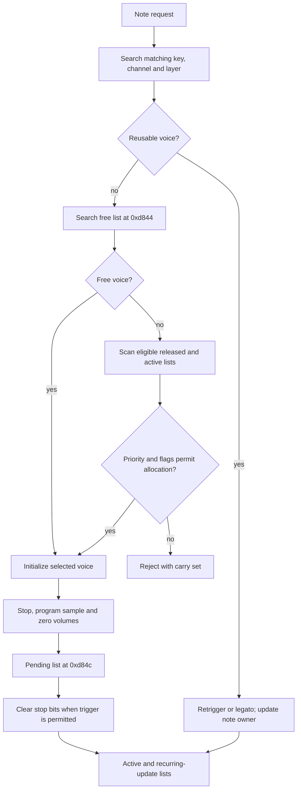

# Sequences, notes and voice allocation

The Land Maker sound driver implements sequencing and envelopes in software. The ES5505 plays the samples that the driver programs.

The native backend preserves this logic as compiled ROM instructions. It does not implement a second high-level sequencer.

The addresses and structures below come from [docs/SOUND-DRIVER.md](https://github.com/ansxor/f3-recomp/blob/main/docs/SOUND-DRIVER.md).

They apply to the supplied Land Maker Japan sound program, CRC32 `5a7e9117`. The repository does not commit its ROM contents.

## Identifier types

| Identifier | Meaning |
|---|---|
| Main sound selector | An index into the main game's descriptor table. |
| Mailbox opcode | A driver command operation. |
| Sequence ID | A sequence slot or a ROM-specific sequence selection. |
| Logical track | A track within a sequence. |
| Program | An instrument or patch selection for a track. |
| Note node | A software note allocation in work RAM. |
| Physical voice | One of 32 ES5505 voice numbers. |
| Sample word address | An address into the big-endian 16-bit sample region. |

Do not treat these values as interchangeable. A single note allocation can require voice selection, patch lookup and sample-split selection.

## Driver tables

| Location | Structure or role |
|---|---|
| RAM `0x5e5c` | 100 sequence slots, stride `0x28`. |
| RAM `0x6dfc` | Null-terminated active-sequence pointer list. |
| RAM `0xd404` | Sequence-stream bank base. Lookup uses a long offset at base `+8+4*ID`. |
| RAM `0xd408` | Sequence-header bank base. Lookup uses a word offset at base `+8+2*ID`. |
| RAM `0x5daa` | Word channel-pointer table. |
| RAM `0xd94a` | Physical voice records, stride `0xaa`. |
| ROM `0xc1c1e0` | Word offsets relative to sample-split table `0xc1ae76`. |
| ROM `0xc1ae76` | Sample-split records, stride 14 bytes. |
| ROM `0xc0a734` | Sample-loop-mode to OTIS control-byte lookup. |
| ROM `0xc089dc` | Signed scale multipliers for fades, pitch and envelopes. |
| ROM `0xc08bec` | Additional voice scaling table. |
| ROM `0xc1c2d2` | Thirteen effects configurations, stride 16 bytes. |
| ROM `0xc1c3a2` | DSP-program pointer table. |

Only formats and locations are documented here. Generated data and ROM-derived table contents remain in local ignored output directories.

## Sequence timing

The observed initialization writes DUART counter `0x07d0`, ACR `0x60` and IMR `0x2b`.

The IRQ handler at `0xc10da0` reads `0x28001f`, updates task delays, ticks the sequencer and polls the mailbox.

The documented modal IRQ spacing is 16,000 main ticks: one millisecond. Instruction boundaries add timing variation.

The ROM also contains an alternate initialization with counter `0x09c4`. Do not substitute it for the observed 32-voice mode.

For each active sequence, routine `0xc12e3e` adds rate `+0` to accumulator `+2`.

At threshold `0x271` (625), it subtracts the threshold, advances the subdivision and posts a worker message.

At the observed 1 kHz IRQ cadence, rate 120 produces 192 sequence ticks per second.

This corresponds to 96 ticks per quarter note at 120 BPM. The result follows the documented arithmetic and cadence.

The sample clock does not directly advance the sequence. The DUART and task messages determine sequence work.

Pause sets the current rate to zero. Resume restores the saved rate at sequence `+0x1c`.

Submission, consumption, dispatch, allocation and hardware start occur at different times. [Tracing](/developer/runtime/audio/tracing) retains those distinctions.

## Sequence event decoding

Routines `0xc14730` and `0xc1475a` scan big-endian words for bit 15 set.

The low byte selects the event class. The upper seven bits usually encode delta time.

| Event class | Documented decoding |
|---|---|
| Below `0x58` | Note, packed velocity and duration at `0xc148b2`. |
| `0x58..0xaf` | Separate callback class with an adjusted key or index. |
| `0xb0..0xd8` | Another callback class with an adjusted key or index. |
| `0xd9`, `0xda`, `0xdb` | Further control classes. |
| `0xdc` | Relative note reference. |
| `0xe6..0xe9` | Extended control records. |

Callbacks come from a caller-provided word table. The same stream can be played, scanned or positioned.

Thus, an event token is not always a note onset. The stream is not a direct list of ES5505 register writes.

Note duration has a 10-bit field. A zero field introduces an additional word.

The note factory adds `0x15` to the decoded key for the internal note representation. Mailbox `0x8f` applies the same adjustment before matching.

Sequence bit 7 is not a universal ignored flag. Selection and alias routines use additional state and linked headers.

The offline decoder does not fully model every alias. Missing command ownership remains `null` instead of using the latest command.

## Direct notes and ownership

Mailbox `0x8e` has operands `[sequence, logical_track, key, velocity]`. Its handler at `0xc130ea` enters the same note factory as music.

At `0xc140e4`, A5 identifies the note node, A1 the channel, and A6 the track.

The voice initializer stores the note node at voice `+0x0e`. It stores the channel pointer at voice `+0x10`.

Channel `+0x0e` points to the owning sequence slot. This supports offline sequence ownership reconstruction.

Direct notes belong to their `0x8e` command. Sequenced notes belong to the sequence-start command, not the nearest later control command.

`0xc13072` searches for a live track by logical ID. An absent track produces no note.

## Voice allocation

Allocation is not a simple oldest-voice replacement rule. Routine `0xc1748e` first searches matching voices and the free list.

On exhaustion, routines `0xc17670` and `0xc17678` scan released and active lists at `0xd850` and `0xd848`.

They prefer priority class zero, then class `0x40` when permitted, then other eligible list heads.

The class comes from patch `+0x60`, bits 6–7. The driver stores it at voice `+0x97`.

Flag checks at `0xc176f8` can reject allocation with carry set.

Retrigger and legato paths can reuse a physical voice and replace its note owner. They need not create a new CR start transition.

## Voice programming and release

Routine `0xc17b94` initializes a selected voice. Routine `0xc17e62` selects its OTIS page and programs the hardware.

It stops the voice, clears volume, initializes filters and accumulator, then programs the sample. The pending-start list is at `0xd84c`.

Routine `0xc177f6` walks that list. At `0xc17814`, it clears CR stop bits unless voice-state high-byte bit 4 suppresses the trigger.

Routine `0xc1781c` updates rotating-list links and joins the pending list to the active list.

Routine `0xc1789a` frees a voice and returns it to `0xd844`. Routine `0xc17a88` silences and reinitializes the hardware.

Mailbox `0x8f` unlinks a matching note and releases it through `0xc141ce`. A software release can continue to produce register updates.

## Established voice fields

| Voice offset | Meaning |
|---|---|
| `+0`, `+2` | Next and previous list links. |
| `+4..+7` | Effective key/channel/layer tags. Preserve uncertain tag meanings as raw values. |
| `+0x0c` | High-byte flags and low-byte OTIS voice number. |
| `+0x0e` | Owning note node. |
| `+0x10` | Channel pointer. |
| `+0x16` | Patch pointer. |
| `+0x1a` | Selected sample-split pointer. RAM descriptors include decompressed sample-bank metadata; they do not establish a runtime override. |
| `+0x24`, `+0x26` | Rotating update-list links. |
| `+0x8c` | Channel's embedded descriptor pointer. |
| `+0x97` | Saved allocation priority class. |
| `+0xa2` | Sample-bank selector. |

The decoder distinguishes `patch_descriptor`, `sample_descriptor` and `channel_descriptor`. These pointers have different roles.

Use `driver.origin.note` for the command or sequence key. Raw `driver.key` and tag fields preserve effective allocation data.

## Sample splits and banks

A sample-split record contains tuning at `+0`, packed address/control longwords at `+2`, `+6` and `+10`.

It also contains a cutoff key at `+5` and a loop-mode byte at `+9`.

Routine `0xc17cfa` selects the first split with a cutoff at least equal to the effective key.

The packed address includes flags and OTIS fixed-point bits. It is not an unqualified 24-bit sample index.

Routine `0xc1807e` shifts the bank selector right once. It places the old low bit at bit 28 of OTIS addresses.

Routine `0xc180b2` writes the board bank at `0x300001 + 2*voice`.

Use decoded `start_word`, `end_word` and `sample_word` to index sample ROM. Do not index it with the raw descriptor's flag-bearing byte.

The metadata observed around sound RAM `0x711a` is decompressed sample-bank data copied from ROM. It is not a runtime sample override at `0xd840`. See the [ROM-derived HLE data description](https://github.com/ansxor/f3-recomp/blob/main/docs/HLE-AUDIO.md#rom-derived-protocol-and-data).

[The OTIS page](/developer/runtime/audio/es5505) explains address fractions, interpolation and per-voice banks.

## Software envelopes and recurring work

The ring at `0xd85a` schedules recurring voice work through routines `0xc18360` and `0xc18a2e`.

It does more than record allocation order. Pitch, filter and volume writes continue after key-on.

The driver writes FC at paths including `0xc18296`. The ES5505 does not generate these software envelopes.

A note-on-only export loses the later curves. It cannot reproduce the complete audio by itself.

## Effects worker

Commands `0x20` and `0x21` update effects state at `0xc84a`. Routine `0xc0f430` posts work to queue `0xfb28`.

Routine `0xc0f4bc` selects an effects configuration. Configuration byte `+5` selects the DSP-program pointer used by `0xc19982`.

Routines `0xc19982` and `0xc19998` load typed blocks through host-register commits. This is not a flat note array.

The [ES5510 page](/developer/runtime/audio/es5510) explains 48-bit instructions, 24-bit GPRs, host latches and delay memory.

## Evidence limits

The evidence document reports 1,639 allocations and 2,202 non-startup voice starts in its seed-5 capture.

Of those starts, 277 are direct notes and 1,925 are sequenced. Two additional starts are silent initialization probes.

These results do not prove every allocation rejection, sequence alias or command variant. The documentation preserves unknown field meanings instead of guessing.
