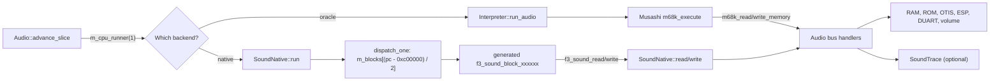

# The sound CPU: oracle and native driver

The sound 68000 runs the game driver. This page explains ROM loading, reset, interrupts, backend selection and the `Audio` runner contract.

Sources: [interpreter.cpp](https://github.com/ansxor/f3-recomp/blob/main/runtime/interpreter.cpp), [sound_native.cpp](https://github.com/ansxor/f3-recomp/blob/main/runtime/sound_native.cpp), and [rom.cpp](https://github.com/ansxor/f3-recomp/blob/main/runtime/rom.cpp).

## What the sound CPU is

The sound board has a Motorola 68000. It runs a program from the sound ROM at `0xc00000`. The program is the sound driver of the game. It does these jobs:

- It reads commands from the mailbox.
- It plays music sequences. A sequencer reads note events and starts voices.
- It allocates ES5505 voices, programs their registers, and changes pitch, filter and volume over time.
- It loads DSP programs into the ES5510.
- It uses the DUART timer as the time base for all of this.

The repository does not contain the game ROM or its disassembly. The facts about the driver in these pages come from `docs/SOUND-DRIVER.md`. That document records what the project measured with traces. Treat the ROM addresses in it as evidence from one ROM set: Land Maker Japan, with the sound program CRC32 `5a7e9117`.

## Loading the sound ROM

`RomSet::load` in `runtime/rom.cpp` builds the sound program. The 68000 is big-endian and has a 16-bit data bus. The ROM board uses two 8-bit chips:

| Chip | Lane | Position in each 16-bit word |
|---|---|---|
| `e61-14.32` | Even bytes (`lane(..., 0, 2)`) | High byte |
| `e61-15.33` | Odd bytes (`lane(..., 1, 2)`) | Low byte |

Each chip should have 0x40000 bytes. The supplied dumps have 0x20000 bytes. The loader accepts a short dump, pads it with `0xff` to 0x40000 bytes, and checks the CRC32 of the padded data. The result is a 0x80000-byte region (`r.sound`). The sound CPU sees it at `0xc00000` - `0xc7ffff`.

The chip CRCs for the padded and the short dumps are in `rom.cpp`: `0x18961bbb` (short `0xb905f4a7`) for `e61-14.32`, and `0x2c64557a` (short `0x87909869`) for `e61-15.33`. `tools/compile_sound.py` uses the same layout, and `SoundNative` checks the CRC32 `0x5a7e9117` of the interleaved region.

`Audio::load_sound_rom` copies the region into `m_sound_rom`. It also copies the first 8 bytes to work RAM at address 0.

## Boot vectors

A 68000 reads its first stack pointer from address 0 and its first program counter from address 4. On this board the ROM is at `0xc00000`, not at 0. The runtime copies the first 8 bytes of the ROM into the first 8 bytes of work RAM. This happens in `load_sound_rom` and in `reset_board`. The reset vector of the Land Maker sound ROM is `$c1089e`, according to `docs/SOUND-DRIVER.md`.

## Reset and the reset line

`Audio::m_reset_asserted` is the state of the CPU reset line. It starts as true. The main CPU controls it:

| Main CPU write | Effect |
|---|---|
| `0xc80000` - `0xc80003` | `audio->set_reset(false)`. The sound CPU is released. |
| `0xc80100` - `0xc80103` | `audio->set_reset(true)`. The sound CPU is held. |

While the line is asserted, `advance_slice` does not run the CPU and sets `m_cpu_accum` to 0.

`set_reset` calls the reset callback only when the value changes. Each backend uses the callback in the same way: when the line is released, the CPU loads its vectors on the next call.

- Oracle: `Interpreter::audio_reset(false)` sets `sound_needs_reset`. The next `run_audio` calls `m68k_pulse_reset()`.
- Native: `SoundNative::reset(false)` sets `m_needs_reset`. The next `run` calls `do_reset()`.

The native `do_reset` sets a 40-cycle reset debt. A one-cycle runner call consumes that debt without executing an instruction.

The documented strict trace gates establish matching oracle timing for the exercised runs. They are not new executions for this page.

A sound CPU `RESET` instruction does not reset connected runtime devices. Its output is unconnected in the oracle bridge.

The compiler removes the shared device-reset call and charges 132 cycles. Privilege checks and ordinary instruction effects still apply.

The watchdog in the main machine (`Machine::boundary`) calls `reset_devices()` and `audio->reset_board()`, writes a `Reset` trace row, and resets the main CPU. See [device time](/developer/runtime/audio/timing) for what `reset_board` keeps.

## Interrupts

The only interrupt source is the DUART. `Audio::irq_level()` returns 6 when the DUART has a pending interrupt, and 0 when it has not. The IVR gives the vector. The interrupt is level 6, so the CPU takes it only if the mask in `SR` is lower than 6.

The two backends read the line in different ways:

| Backend | How the CPU learns about the line |
|---|---|
| Oracle | `Interpreter::run_audio` calls `m68k_set_irq(audio->irq_level())` before it runs. The DUART callback `audio_irq` also calls `m68k_set_irq(asserted ? 6 : 0)` during execution. The reason is in the code comment: DUART acknowledge and mask writes can lower the line while an instruction runs. A late update would cause a second, false interrupt after `RTE`. |
| Native | `Machine::use_native_sound` sets the IRQ callback to an empty function. `SoundNative::check_interrupts` reads `audio->irq_level()` directly at the start of each `run`, and again after each SR write. |

An IRQ entry costs 44 cycles in both backends. The stack frame is 6 bytes (SR and PC) in both: the 68000 has no format word.

## The CPU runner contract

`Audio` holds a `std::function<int(int cycles)>` through `set_cpu_runner`. The runner returns the number of sound-CPU cycles consumed.

`advance_slice` passes 1. This normally executes one instruction, but reset debt or a stopped CPU can consume a call without execution.

An IRQ entry can share a call with the first handler instruction. Existing `check_sound_irq` checks also use larger explicit budgets.

`Machine` sets the runner:

| Backend | Runner | Reset callback | IRQ callback |
|---|---|---|---|
| Oracle (default after construction) | `interpreter->run_audio(cycles)` | `interpreter->audio_reset` | `interpreter->audio_irq` |
| Native | `sound_native->run(cycles)` | `sound_native->reset` | none |

## The oracle

The oracle uses Musashi in `runtime/third_party/musashi`. `Interpreter` keeps separate saved contexts for the main and sound CPUs.

Each runner loads its context, executes, then saves it. The sound context uses a 68000; the main context uses a 68EC020.

The memory callbacks `m68k_read_memory_*` and `m68k_write_memory_*` check a global flag `sound_bus`. The function `bind(machine, sound)` sets the flag. When it is true, the callbacks call the `Audio` bus handlers and `trace_sound`. When it is false, they call `Machine::read8` and the other main bus functions.

`run_audio` sets the CPU type to `M68K_CPU_TYPE_68000` at reset, so the sound CPU gets 68000 cycle costs and a 6-byte exception frame. The main CPU runs as `M68K_CPU_TYPE_68EC020`.

The oracle is the **reference**. The project defines correct sound behavior as what the oracle does. The native driver must match it exactly. The next sections and pages explain the proof.

## The native driver

The native driver replaces Musashi with generated C. It is a static recompilation of the sound ROM. [The sound-CPU compiler](/developer/recompiler/sound-compiler) makes the C code. [The native driver page](/developer/runtime/audio/native-driver) explains the runtime class `SoundNative`.

The native driver is not a rewrite of the music logic. It runs the same 68000 program of the ROM, instruction by instruction, as C. It keeps the ROM tasks, mailbox parser, tables and sequencer. It has its own `f3_cpu` register state. It does not call Musashi.

## Choosing a backend

| Program | Default | How to choose |
|---|---|---|
| `landmakr`, `f3rt-run` | Native, if the build made the sound program (`F3RT_SOUND_GENERATED`). Otherwise oracle. | `--sound-driver oracle` or `--sound-driver native` |
| `f3rt-gameplay-regression` | Oracle | `--sound-driver native` |
| `f3rt-sound-extract` | Oracle | `--sound-driver native` |
| Netplay | Native only | Netplay refuses the oracle. |

The code in `frontend.cpp` sets the default to `native` when the macro `F3RT_SOUND_GENERATED` exists and the user gave no `--sound-driver`. A request for `native` in a build without the macro stops with the error "Native sound requires a generated sound program (F3_ROM_DIR)". `Machine::use_native_sound` must run before the machine executes. It throws "Select the native sound driver before machine execution" if the reset line is released or the audio clock has started.

See the [command-line reference](/reference/cli) for all options.

The frontend help text names different defaults for `landmakr` and `f3rt-run`. The implemented generated-build rule selects native for both.

`docs/SOUND-DRIVER.md` also names a native gameplay default. The current gameplay tool initializes `sound_driver` to `oracle`; select the backend explicitly.

## Why keep the oracle

Oracle sound costs more execution time than native. Current snapshot sizes are 4,231,509 canonical bytes for native and 4,231,724 for oracle; full local expanded geometry adds buffers. See [current proof and limits](https://github.com/ansxor/f3-recomp/blob/main/docs/developer/IMGUI-NETPLAY.md), rather than treating old throughput measurements as guarantees.

The oracle gives the proof. Without it, nobody can check that the generated C is right. See [sound traces](/developer/runtime/audio/tracing).

## State

For snapshots, `Machine::save_state` writes the sound CPU state after the audio state. With the native driver it calls `SoundNative::save_state` (a `CanonicalSoundNative` structure with the registers, lazy-flag fields, cycle counters and the reset state). With the oracle it calls `Interpreter::save_sound_state`. The sizes differ, so a snapshot is valid only for the same backend.
