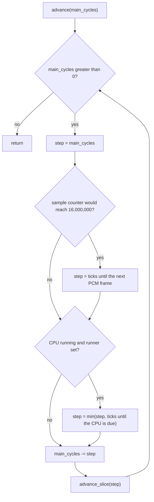
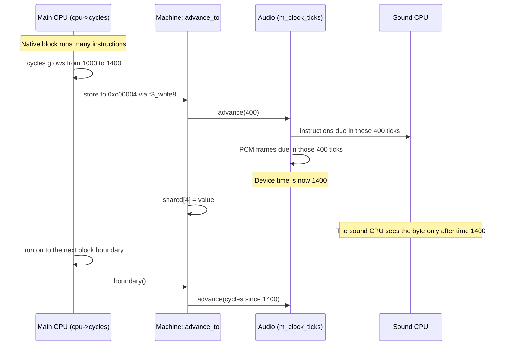

# Device time, sample rate and output

`Audio::advance` moves the sound devices through main-clock time. This page explains instruction deadlines, PCM generation, output queues and reset behavior.

Sources: [audio.cpp](https://github.com/ansxor/f3-recomp/blob/main/runtime/audio/audio.cpp), [cpu_abi.cpp](https://github.com/ansxor/f3-recomp/blob/main/runtime/cpu_abi.cpp), and [machine.cpp](https://github.com/ansxor/f3-recomp/blob/main/runtime/machine.cpp).

## Why a device clock exists

The main CPU runs as generated C code. A generated block can run many instructions before the runtime looks at the other devices. The sound devices must not run ahead of the main CPU. They must also not fall behind when the main CPU reads or writes the mailbox.

The runtime solves this with one counter. `Audio` counts main-clock ticks in `m_clock_ticks`. The main clock is 16,000,000 Hz (`Machine::main_clock`). The sound devices change state only when the machine calls `Audio::advance`.

## The clocks

The table lists every rate that the audio code uses.

These are configured reference-model rates, not oscillator measurements from a
physical board. Integer-clock and partitioning checks establish scheduling
invariants within the model, not physical sound-board timing or waveform equality.
See [audio comparison](/developer/testing/audio-compare).

| Clock | Value | Where the code uses it |
|---|---|---|
| Main clock | 16,000,000 Hz | Unit of device time (`Machine::main_clock`). |
| Sound CPU | 15,238,090 Hz | Constant `15238090` in `Audio::Impl::advance_slice`. It is also the ES5505 master clock. |
| DUART | 4,000,000 Hz | The code divides main ticks by 4 (`m_duart_accum`). |
| PCM frame rate | `15238090 / (16 * (voices))` | `ES5505::sample_rate()`. With 32 voices the result is 29761 Hz (integer division). |

The header comment in `audio.hpp` says "about 29762 Hz". The integer division gives 29761. The MAME tools README also says 29761 Hz. Use 29761.

The ES5505 changes its rate when the driver writes the `ACT` register (number of active voices). The frontend reads `sample_rate()` only once, at start-up. The WAV header and the SDL stream keep that first rate.

## The accumulators

`Audio::Impl` keeps three fractional counters. They hold the part of a tick that does not fill a whole unit yet.

| Counter | Type | Meaning |
|---|---|---|
| `m_duart_accum` | `uint32_t` | Main ticks that do not fill one DUART tick (0 to 3). |
| `m_sample_accum` | `uint64_t` | Main ticks times the sample rate. A PCM frame is due when it reaches 16,000,000. |
| `m_cpu_accum` | `int64_t` | Main ticks times 15,238,090. It holds sound-CPU cycles times 16,000,000. |

All three counters use integer arithmetic. Fractional remainders survive caller partitions.

`check_audio_partitioning` in `runtime/tests/audio.cpp` checks partition-independent CPU state. A separate ten-second clock check expects exactly `10 * sample_rate()` frames.

These are descriptions of existing checks, not new executions for this page.

## What `Audio::advance` does

`Audio::advance(main_cycles)` calls `Impl::advance`. This function cuts the time into slices. Each slice ends at the next event. An event is the next PCM frame or the next sound-CPU instruction.

The function `advance_slice(step)` does these actions in this order:

1. It adds `step` to `m_clock_ticks`.
2. It converts accumulated main ticks into 4 MHz DUART ticks, retaining a remainder of zero to three.
3. It adds `step * sample_rate` to the PCM counter. Each threshold of 16,000,000 generates a frame.
4. For an active CPU runner, it adds `step * 15238090` to the CPU counter.
5. When that counter reaches 16,000,000, it calls `m_cpu_runner(1)` and subtracts the returned cycles times 16,000,000.
6. With reset asserted or no runner, it clears the CPU counter.

The order is on purpose. The comment in the source says: "Device edges precede the CPU dispatch due at this clock." The DUART and the sample clock update first. The CPU instruction runs after them. This order makes the CPU see the IRQ line and the chip state of its own time.

### The CPU debt model

An instruction uses 4 or more CPU cycles, but the loop starts it as soon as one CPU cycle is due. The instruction then makes `m_cpu_accum` negative. The CPU does not run again until the counter is positive. This model keeps the long-term CPU speed exact. It also keeps the order of events the same, whatever the size of the caller's time pieces.

The one-cycle budget normally dispatches one complete instruction. Reset debt can consume the call without an instruction.

IRQ entry can precede the first handler instruction in the same call. A stopped CPU can consume the budget without executing an instruction.

This boundary-based scheduling prevents IRQ recognition from depending on caller partitions.

## How main-CPU blocks and device time stay in step

The main CPU has its own counter, `cpu->cycles`. Device time (`m_clock_ticks`) can be smaller than `cpu->cycles`. The runtime moves device time forward in three places.

1. At each block boundary, `Machine::boundary()` calls `advance_to(cpu.cycles)`.
2. At each mailbox or reset-line access, `bus()` in `runtime/cpu_abi.cpp` calls `advance_to(cpu->cycles)` before the access.
3. At each video event (vertical blank, IRQ 3), `advance_to` stops at the event time first.

The function `Machine::advance_to` loops. It takes the smaller of the target and the next video event. It calls `audio->advance(end - hardware_cycles)` and then handles the video event.

The same rule holds for reads. A read of a mailbox byte first catches up device time. The main CPU then sees replies that the sound CPU made before the read. The checks in `runtime/tests/audio.cpp` (`check_main_sound_ordering`) test this for byte, word and long accesses. They also test an unaligned long access that starts at `0xbfffff` and crosses into the mailbox.

The tests in `runtime/tests/audio.cpp` also show two more facts:

- A release of the sound reset line does not run the sound CPU over the time before the release.
- An assertion of the reset line keeps the sound work that came before the reset instruction.

## The sound trace clock

`Audio::clock_ticks()` returns `m_clock_ticks`. `Audio::generated_frames()` returns the number of PCM frames made so far. The trace writer uses both values for each row. See [sound traces](/developer/runtime/audio/tracing).

## Reset

`Audio` has two kinds of reset.

| Call | What it does | What it keeps |
|---|---|---|
| `set_reset(bool)` | Sets or clears the CPU reset line. A change calls the reset callback. | All chips, RAM, clocks and queued PCM. |
| `reset_board()` | Holds the CPU, clears CPU debt, resets DUART/DSP/volume, and restores the eight vector bytes. | Other work RAM, OTIS, device/sample clocks, DUART fractional phase and queued PCM. |

`Audio` starts with the reset line asserted (`m_reset_asserted = true`). The main CPU releases it by writing to `0xc80000` - `0xc80003`. It asserts it again with a write to `0xc80100` - `0xc80103`. `Machine::write8` calls `audio->set_reset(a >= 0xc80100)`.

`Machine::reset` and the watchdog call `reset_board`. The check in [`runtime/tests/audio.cpp`](https://github.com/ansxor/f3-recomp/blob/main/runtime/tests/audio.cpp) confirms that a board reset keeps queued audio and the fractional sample phase.

## Making one PCM frame

`Impl::generate_one_frame` makes one stereo sample. The steps are:

1. `m_es5505.generate_one_sample(cursample)` gives eight signed sums. They are four stereo pairs.
2. The code divides each sum by 524,288 (2^19) and clamps it to the range -1 to +1. The ES5505 has a signed 20-bit accumulator. The code multiplies the result by `m_otis_gain[i & 1]`.
3. The six values from pairs 1 to 3 go to the ESP serial inputs with `ser_w(i, int16_t(channels[i + 2] * 32768))`.
4. If the ESP is not halted, `m_es5510.run_once()` runs the DSP program for one sample.
5. The main outputs are `ser_r(6)` (left) and `ser_r(7)` (right).
6. Pair 0 does not enter the ESP. The mixer adds it as a float.
7. The output is `(main / 32768 + pair0) * 0.5 * m_output_gain`.
8. `push_frame` stores the two floats.

The page about [the DUART and the volume chip](/developer/runtime/audio/duart-and-gain) gives the gain values.

## The ring buffer

`push_frame` writes into a ring buffer of `RING_BUFFER_CAPACITY` = 32,768 stereo PCM frames. That is about 1.1 seconds at 29761 Hz. Each frame is two floats. A mutex (`m_audio_mutex`) protects the buffer.

If the buffer is full, `push_frame` drops the oldest frame. The code comment says this keeps the delay low in real time.

`Audio::render` takes frames out of the buffer. It has two forms:

- `render(int16_t *, max_frames)` multiplies each float by 32768, clamps it and returns 16-bit samples. A value of +1.0 becomes 32767.
- `render(float *, max_frames)` returns the floats without change.

`available_frames()` returns the number of frames that wait in the buffer.

## How the frontend delivers samples

The loop in `runtime/frontend/frontend.cpp` drains audio once for each loop pass, after the machine ran a video frame. It calls `Audio::render_ready`. That call never waits for the Enhanced worker: it returns only PCM already produced, so Enhanced synthesis overlaps the next frame (the Reference backend behaves like `render`). After the loop ends, a blocking `Audio::render` drains the remainder, so the WAV and the counters cover the complete stream. It reads at most 4096 PCM frames at a time (the buffer `samples` has 8192 `int16_t`). For each block it does these actions:

1. It updates the counters `audio_frames`, `audio_peak` and `nonzero_samples`. The final status line prints them.
2. If `--wav` is set, it appends the samples to the `WavWriter`.
3. If SDL audio is open, it calls `SDL_PutAudioStreamData`.

SDL opens with `SDL_AudioSpec{SDL_AUDIO_S16, 2, audio_rate}` through `SDL_OpenAudioDeviceStream` on the default playback device. SDL converts the 29761 Hz signal to the rate of the real device. The frontend does not slow down for audio. The wall-clock sleep for video (`sleep_until`) sets the speed. With `--unthrottled` the machine can make samples faster than the device plays them.

The option `--no-audio` skips `SDL_INIT_AUDIO`. The machine still makes samples, and `--wav` still works. The option `--headless` opens no window and no audio device. Use `--headless --frames N --wav FILE` to write a file without a display.

### The WAV writer

`WavWriter` in `runtime/capture_io.hpp` writes a 44-byte header and then raw samples. The header has these fields: format 1 (PCM), 2 channels, the sample rate, byte rate `rate * 4`, block align 4 and 16 bits per sample. The destructor writes the header again with the final byte count. The file is therefore valid only after the writer closes.

## State save and load

`Audio::save_state` writes a fixed-size block. It starts with `CanonicalAudioCore`: banks, gains, flags, accumulators, clocks and queue length.

The block then holds 64 KiB work RAM, the PCM ring in playback order, and all four device states.

Unused ring slots are zero in the snapshot. Loading normalizes the read position to zero and restores queued frames in order.

Both public state methods require an exact span size. They also check that the writer or reader consumes the complete span.

ROM bytes, device callbacks, mutexes and the shared-RAM pointer are not serialized. The owning machine supplies those attachments.

See the [machine page](/developer/runtime/machine) for the machine-level state API.
