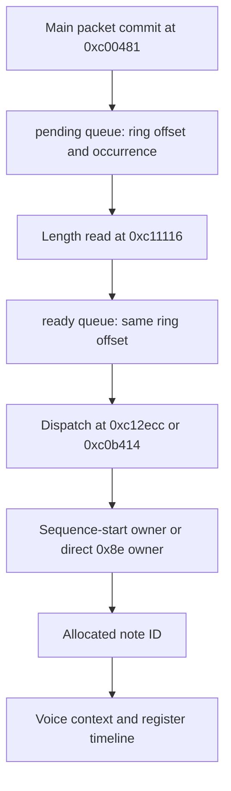

# Sound traces and command ownership

A sound trace records bus operations and driver context. It does not replace the sound CPU or the audio devices.

The runtime writes binary records during execution. `tools/decode_sound.py` decodes them after execution. This separation avoids extra reads of device registers.

## Source map

| Source | Responsibility |
|---|---|
| [sound_trace.hpp](https://github.com/ansxor/f3-recomp/blob/main/runtime/sound_trace.hpp) | Record kinds and writer API. |
| [sound_trace.cpp](https://github.com/ansxor/f3-recomp/blob/main/runtime/sound_trace.cpp) | Binary encoding, work-RAM snapshots and end marker. |
| [interpreter.cpp](https://github.com/ansxor/f3-recomp/blob/main/runtime/interpreter.cpp) | Oracle bus observation and ROM-specific probes. |
| [sound_native.cpp](https://github.com/ansxor/f3-recomp/blob/main/runtime/sound_native.cpp) | Equivalent native bus observation. |
| [machine.cpp](https://github.com/ansxor/f3-recomp/blob/main/runtime/machine.cpp) | Main mailbox writes, reset-line writes and board-reset markers. |
| [decode_sound.py](https://github.com/ansxor/f3-recomp/blob/main/tools/decode_sound.py) | Format validation, register reconstruction and command ownership. |
| [compare_sound.py](https://github.com/ansxor/f3-recomp/blob/main/tools/compare_sound.py) | Strict record comparison. |

## Capture a trace

Select the oracle explicitly when you need an interpreted reference. Sound-driver selection is independent of main-CPU selection.

```sh
build/f3rt-gameplay-regression --seed 5 --frames 6000 \
  --sound-driver oracle --sound-trace build/seed5-oracle.sound \
  --wav build/seed5-oracle.wav
python3 tools/decode_sound.py build/seed5-oracle.sound \
  --output build/seed5-writes.jsonl.gz
```

The frontend and [extraction tool](/developer/runtime/audio/extraction) also accept `--sound-trace FILE`.

These commands are examples. The historical results below come from the repository evidence document, not a new capture for this page.

## Binary format

The header contains eight bytes: `F3SND2\0\0`. Each record contains 32 bytes. Numeric fields use little-endian order.

The Python format is `struct.Struct("<QQIIIBB2x")`.

| Byte offset | Field | Size | Meaning |
|---:|---|---:|---|
| 0 | `tick` | 8 | Absolute time in 16 MHz main-clock ticks. |
| 8 | `sample` | 8 | Number of PCM frames already generated. |
| 16 | `pc` | 4 | Sound instruction PPC, native instruction PC, or main writer PC. |
| 20 | `address` | 4 | Bus address or context pointer. |
| 24 | `value` | 4 | Read result, write operand or context data. |
| 28 | `kind` | 1 | Record kind from the table below. |
| 29 | `width` | 1 | Transfer size in bytes, or a metadata-specific size. |
| 30 | Padding | 2 | The writer leaves these bytes zero. |

The padding bytes are not returned by Python unpacking. The comparator compares the seven decoded fields, not the padding or raw file bytes.

### Record kinds

| Kind | Name | Address and value |
|---:|---|---|
| 1 | `MainWrite` | Main mailbox or CPU-reset-line byte write. Width is 1. |
| 2 | `SoundRead` | Original sound bus address and actual returned value. Width is 1, 2 or 4. |
| 3 | `SoundWrite` | Original sound bus address and write operand. Width is 1, 2 or 4. |
| 4 | `Reset` | Warm board reset. Current callers use address 0, value 2 and width 0. |
| 5 | `End` | Completed capture. PC, address, value and width are zero. |
| 6 | `VoiceContext` | Voice-record RAM pointer and physical voice number. Width is 0. |
| 7 | `RamSnapshot` | Work-RAM offset and one big-endian RAM longword. Width is 4. |
| 8 | `NoteContext` | Note-node RAM pointer. Value packs track pointer above channel pointer. Width is 0. |
| 9 | `DirectNote` | Actual direct-note operand write. The current probe uses width 1. |
| 10 | `NoteEvent` | Note-event RAM pointer. Value and width are zero. |

Thus, not every metadata record has width zero. `DirectNote` preserves its operand transfer width, and `RamSnapshot` carries four RAM bytes.

### Two timestamp fields

For kind 1, `SoundTrace::record` uses `Machine::cpu.cycles`. The main bus synchronizes devices before a mailbox or reset-line access.

For all other kinds, it uses `Audio::clock_ticks()`. This is the effective device cursor, not the endpoint of a main block.

The `sample` field always uses `Audio::generated_frames()`. It identifies the PCM boundary already reached at the operation.

Several operations can have the same tick and sample. Their record order remains significant.

[Device scheduling](/developer/runtime/audio/timing) advances the DUART and PCM before a sound instruction due at that tick. Bus transfers remain instruction-atomic.

The trace does not claim physical bus-cycle timestamps. It preserves the runtime's instruction-boundary model.

## Observation order and scope

A sound read reaches `Audio` first. The observer then records the returned value.

A sound write reaches the observer first. The runtime then performs the write.

The observer retains accesses within `0x140000..0x340003`, including gaps in that range. It excludes ordinary ROM and RAM accesses.

ROM-specific RAM probes run before this range filter. They add ownership evidence without tracing all RAM traffic.

A raw long transfer remains one width-4 record. Offline decoding expands it into two ordered word transfers at the same timestamp.

Repeated writes remain separate records. An unchanged value can still describe driver timing.

### Work-RAM context probes

The probes require the instruction PC, address and width to match. A matching PC alone is not sufficient.

| Sound PC | Required transfer | Added context |
|---|---|---|
| `0xc130f0` | Byte write to `A4 + 0x14` | `DirectNote` operand. |
| `0xc140e4` | Word write to `A1 + 0x24` | Note `A5`, channel `A1`, track `A6`, event `A4`. |
| `0xc17632` | Word write to `A4 + 0x0a` | Voice context after a legato owner change. |
| `0xc17e62` or `0xc17806` | Word write to OTIS PAGE at `0x20001e` | Voice context from `A4`. |

An IRQ stack write can retain an interrupted instruction's PPC. Address and width checks prevent that write from creating false note metadata.

`voice_context` snapshots these work-RAM regions:

- The voice record: `0xac` bytes.
- The channel referenced at voice `+0x10`: `0x40` bytes.
- The descriptor referenced at voice `+0x8c`: `0x20` bytes.
- The driver region at `0xd81a`: `0x28` bytes.

It emits the completed kind-6 context after these RAM records. The physical voice comes from voice `+0x0c`, masked with 31.

`note_context` snapshots the channel, track, event and `0xd40e`. It then emits `NoteEvent`, followed by `NoteContext`.

Snapshot reads use the `0xff0000` work-RAM mirror. They do not read OTIS, DSP, DUART or gain registers.

Older `F3SND1` captures use different ordering. The decoder rejects them. Recapture them instead of changing their header.

## Offline register reconstruction

`records()` rejects these conditions:

- An incorrect header.
- A partial 32-byte record.
- A backward tick.
- A missing end marker.
- Data after the end marker.

`Decoder.decode()` rejects unknown record kinds. `words()` rejects invalid bus widths.

### OTIS state

The decoder tracks PAGE, ACT, banks and low-page voice registers. It applies the implemented masks for frequency, addresses, filters and volume.

Each low-page voice write includes the reconstructed voice state. Bank writes also include a voice snapshot.

A `voice_start` is an observed CR transition from stopped to running. It is not proof of audible output.

The decoder emits separate fields for loop, bidirectional loop, direction, stop state and output pair.

Sample addresses use ROM words, not byte offsets. `sample_step` is effective `FC / 1024` words per PCM frame.

`sample_word` uses the last observed ACC value. It is not a simulated live playback position between writes.

### DSP and other devices

The decoder tracks the nine GPR and instruction latch bytes. A select write can include a 24-bit `gpr_value` or 48-bit `instruction`.

A DSP read-select can load values that change during execution. The decoder therefore invalidates its known latch bytes at register `0x80`.

Actual subsequent reads or writes restore known bytes. Unknown combined values remain `null`.

DUART, MB87078 and mailbox transfers remain explicit events. A board-reset event clears decoder DSP latch state and preserves OTIS state.

## Command ownership



`CommandRing` reconstructs the [1024-byte packet ring](/developer/runtime/audio/mailbox). Each publication receives an increasing `command_id`.

The producer commit contains twice the byte index. The decoder checks its alignment, range and complete packet lengths.

Consumption removes the oldest pending occurrence at the packet's ring offset. Dispatch removes the oldest ready occurrence at that offset.

These checks reject unpublished consumption, unconsumed dispatch and length disagreement. Ring reuse does not merge command occurrences.

For commands `0x80` and `0x81`, the decoder stores the sequence-start command as the sequence owner.

A direct `0x8e` probe requires a dispatched note-on command. Note allocation checks its sequence, track, key and velocity against the packet.

Each note allocation receives a stable `note_id`. The decoder associates it with the current note-node pointer.

A voice context saves that origin object. Later node reuse does not rewrite earlier events.

Subsequent volume, program and control commands remain separate timeline events. They do not become false note initiators.

Legato can change voice ownership without a CR start transition. Kind 6 records preserve that change.

Some ROM sequence aliases remain outside the established inference. Missing ownership stays `null`; the decoder never substitutes the nearest command.

## Output projections

```sh
python3 tools/decode_sound.py build/seed5-oracle.sound \
  --output build/seed5-all.jsonl
python3 tools/decode_sound.py build/seed5-oracle.sound --notes-only \
  --output build/seed5-onsets.jsonl
python3 tools/decode_sound.py build/seed5-oracle.sound --commands-only \
  --output build/seed5-commands.jsonl
```

| Mode | Included events |
|---|---|
| Default | All decoded events. |
| `--notes-only` | `command`, `command_consumed`, `voice_start`, `board_reset`, `end`. |
| `--commands-only` | `command`, `command_consumed`. |

If both flags are supplied, `--commands-only` takes precedence. Neither projection includes standalone `command_dispatch` or `note_source` rows.

Voice starts still contain their current driver origin. An onset projection omits later envelope, pitch, filter and ownership changes.

An output name ending in `.gz` selects gzip. The decoder prints counts for all decoded event types, including events excluded from the output.

## Strict oracle/native comparison

```sh
python3 tools/compare_sound.py build/seed5-oracle.sound \
  build/seed5-native.sound --json build/seed5-parity.json
cmp build/seed5-oracle.wav build/seed5-native.wav
```

The comparator compares all seven fields in order. It does not sort, deduplicate, fit lag or permit timing tolerance.

A mismatch reports the first differing record and up to eight recent submitted commands. Exit status is 0 for equality and 1 for failure.

WAV equality is a separate check. Matching PCM alone does not prove matching driver operations.

The comparator uses the validating record reader. Equal complete captures therefore require valid headers, record boundaries and end markers.

It returns immediately at a first mismatch. It need not validate unread tails after that mismatch.

[The evidence document](https://github.com/ansxor/f3-recomp/blob/main/docs/SOUND-DRIVER.md) reports a seed-5 gate with 12,258,121 identical records.

That gate includes 3,768 voice contexts, 1,639 note allocations and 852 commands. Its WAVs contain 3,029,425 identical PCM frames.

Those are recorded compatibility results. They do not prove all ROM paths or physical hardware equality.
