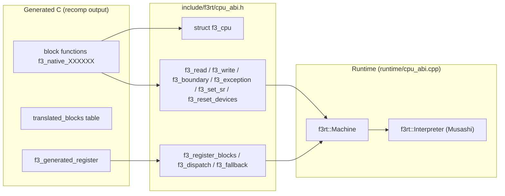
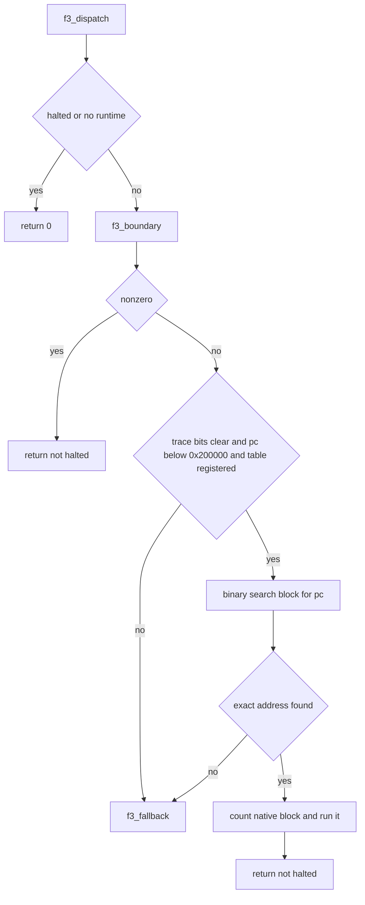
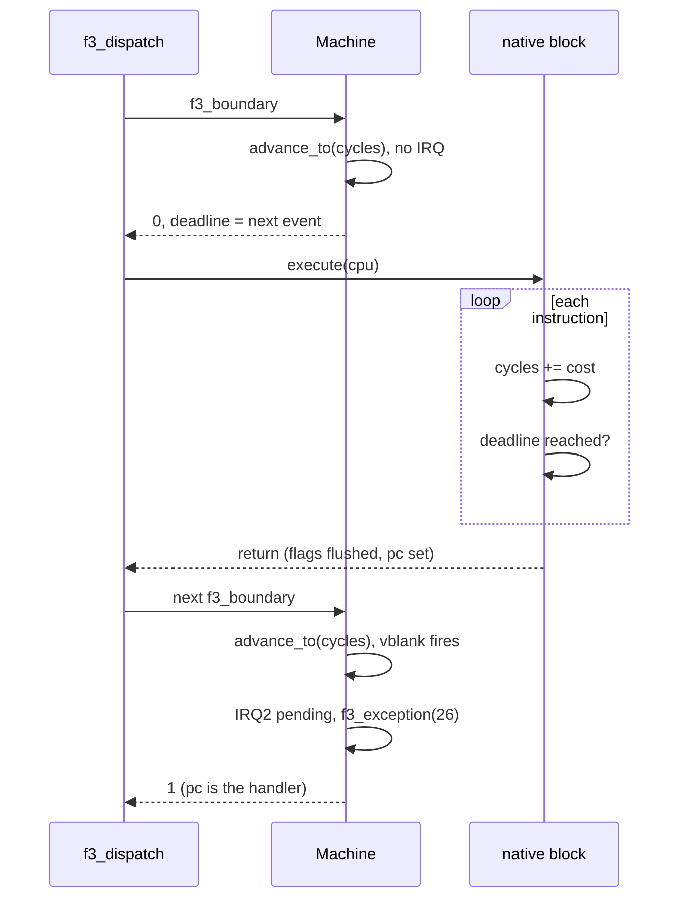
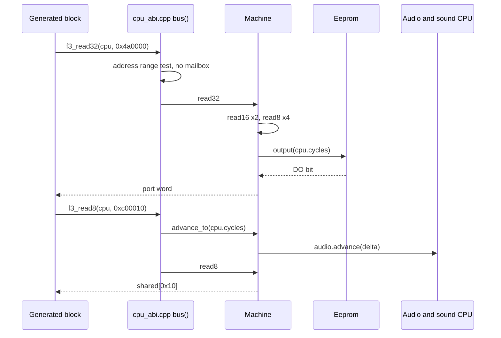

# The CPU ABI

The CPU ABI connects generated C code to the runtime.
This page describes CPU fields, callbacks, lazy flags, block registration, exceptions, bus synchronization, and instruction deadlines.

The ABI is the only contract between two parts of the project. The recompiler writes C code. The runtime runs that code. The files are in `include/f3rt/cpu_abi.h` and `runtime/cpu_abi.cpp`.

## Why the ABI exists

The recompiler turns each 68020 instruction of the game ROM into C. The generated C does not know about SDL, video or sound. It only knows a CPU context and a small set of callbacks. The runtime provides the callbacks.

This split has three benefits:

- The runtime builds without a game ROM. Generated code is optional.
- The generated code builds with a plain C compiler. The header uses `extern "C"` so C++ can also include it.
- A fixed header lets two programs agree on the layout of the CPU state.

Read [Emission](/developer/recompiler/emission) for how the recompiler writes the blocks. Read [Flags and timing](/developer/recompiler/flags-and-timing) for the cycle model.



## The f3_cpu struct

`f3_cpu` holds all state of the main CPU. The CPU is a Motorola 68EC020. The struct lives inside `Machine` as the member `cpu`. Generated code gets a pointer to it as the argument `cpu`.

The header comment gives three rules:

- `a[7]` is the active stack pointer.
- All addresses and registers are host integers. Bus accesses are big-endian.
- The runtime can write SR. A write to SR invalidates `cc_op`.

| Field | Type | Meaning |
| --- | --- | --- |
| `d[8]` | `uint32_t` | Data registers D0 to D7. |
| `a[8]` | `uint32_t` | Address registers A0 to A7. `a[7]` is the stack pointer that is active now. |
| `pc` | `uint32_t` | Program counter. A block writes the address of its successor here before it returns. |
| `usp` | `uint32_t` | User stack pointer. Holds the value only while the CPU runs in another mode. |
| `ssp` | `uint32_t` | Interrupt stack pointer (supervisor, M bit clear). Inactive copy. |
| `msp` | `uint32_t` | Master stack pointer (supervisor, M bit set). Inactive copy. |
| `vbr` | `uint32_t` | Vector base register. `f3_exception` reads the handler address at `vbr + vector * 4`. |
| `sfc`, `dfc` | `uint32_t` | Source and destination function code registers. The runtime stores them. |
| `cacr`, `caar` | `uint32_t` | Cache control and cache address registers. The runtime stores them. |
| `sr` | `uint16_t` | Status register. The condition code bits can be stale while `cc_op` is not zero. |
| `stopped` | `uint8_t` | Set by the STOP instruction. The CPU waits for an interrupt. |
| `halted` | `uint8_t` | Set on a fatal error. `f3_dispatch` returns 0 when this is set. |
| `cc_src`, `cc_dst`, `cc_result` | `uint32_t` | Operands and result of the last flag-setting instruction. |
| `cc_op` | `uint8_t` | Kind of the pending flag operation. 0 means no pending flags. |
| `cc_width` | `uint8_t` | Width in bytes (1, 2 or 4) of the pending operation. |
| `cc_mask` | `uint8_t` | Part of the lazy flag storage. Generated code owns it. |
| `cc_pad` | `uint8_t` | Padding. `Machine::load_state` sets it to 0. |
| `cycles` | `uint64_t` | Monotonic scheduling clock in 16 MHz main cycles. It is not exact hardware timing. |
| `dispatch_deadline` | `uint64_t` | Absolute cycle count. A native block must stop when `cycles` reaches it. Added in ABI 2. |
| `runtime` | `void *` | Opaque pointer. The runtime sets it to the owning `Machine`. |

### Stack pointers

The 68020 has three stack pointers: user, interrupt and master. Only one is active. `a[7]` always holds the active one. The fields `usp`, `ssp` and `msp` hold the other two. `f3_set_sr` copies `a[7]` into the old slot and loads the new one when the S or M bit changes.

The function `stack(cpu, sr)` in `cpu_abi.cpp` chooses the slot:

- S bit (`0x2000`) clear: `usp`.
- S bit set and M bit (`0x1000`) set: `msp`.
- S bit set and M bit clear: `ssp`.

### Lazy condition codes

Many instructions change the condition bits C, V, Z, N, and X.
The recompiler can defer their calculation.
It stores operands in `cc_src` and `cc_dst`, the result in `cc_result`, and the operation kind in `cc_op`.
`f3_cc_flush` in `recomp/cpu_ops.h` calculates the pending bits and updates `sr`.
It then clears `cc_op`.

The operation codes are in `recomp/cpu_ops.h`:

| Constant | Value |
| --- | --- |
| `F3_CC_OP_NONE` | 0 |
| `F3_CC_OP_LOGIC` | 1 |
| `F3_CC_OP_ADD` | 2 |
| `F3_CC_OP_SUB` | 3 |
| `F3_CC_OP_CMP` | 4 |

`cc_width` selects byte, word, or long masks.
Logic and compare operations preserve X.
Logic clears C and V.
Add and subtract calculate carry or borrow, overflow, zero, negative, and extend.
Compare calculates subtraction flags without changing X.
`f3_eval_cond` flushes first, then evaluates the 16 standard condition codes.
`cc_mask` remains part of the stored ABI state; this flush helper does not read it.

The header says these flags are private to the recompiler. The rule for the runtime is simple:

::: warning
Generated code must flush pending flags before it calls any runtime callback, except an ordinary memory read or write. The runtime then sees a correct `sr`.
:::

The runtime also clears `cc_op` when it writes SR. `f3_set_sr` does this, and `f3rt_core_export` does this after an interpreter step. See [Musashi and core_state.c](/developer/runtime/musashi).

## ABI versions

The macro `F3RT_ABI_VERSION` is `2u`. The full history is in [ABI-CHANGES.md](https://github.com/ansxor/f3-recomp/blob/main/docs/ABI-CHANGES.md).

### Version 1

Version 1 froze the initial interface. It defined:

- The register layout with MSP and the lazy flag fields.
- Big-endian bus accessors.
- A per-block boundary hook, exception entry, sorted block registration and device reset.
- A one-instruction interpreter fallback.

The main CPU clock is 16 MHz, as in MAME. The boundary advances hardware by the change in `cpu.cycles`.

### Version 2

Version 2 adds the field `dispatch_deadline` right after `cycles`. The old model let a block run to its end before hardware events could fire. A long block then delayed an interrupt. With version 2, a native block checks the deadline between instructions. It flushes SR and returns when `cycles >= dispatch_deadline`. Multi-instruction blocks and lazy flags still work.

Version 2 also changes these rules:

- A mailbox or reset-line access catches the sound device up to `cpu->cycles` first. See [Bus access path](#bus-access-path).
- `f3_exception` charges the full exception cost. For `TRAP #n` (vectors 32 to 47) the charge is 24 cycles.
- The sound 68000 timing corrections do not change the ABI.

### The version check

The check happens at compile time. `recomp/generate.py` has the constant `_RUNTIME_ABI_VERSION = 2`. Each generated source file and `program.h` include this guard:

```c
#if F3RT_ABI_VERSION != 2
#error "Generated program and f3rt ABI versions differ"
#endif
```

The runtime has no check at run time. If you change the header version, you must regenerate the C code. The file `coverage.json` also records `runtime_abi_version`. The sound program from `tools/compile_sound.py` includes the same header but has no guard.

## The functions

All functions are declared in `cpu_abi.h` with C linkage. The file `runtime/cpu_abi.cpp` defines them for the main CPU.

### Bus accessors

`f3_read8`, `f3_read16`, `f3_read32`, `f3_write8`, `f3_write16` and `f3_write32` perform bus accesses. They convert the `runtime` pointer to a `Machine` and call the matching `Machine::read*` or `write*` method. The `bus()` helper adds time synchronization. See [Bus access path](#bus-access-path).

### f3_boundary

`int f3_boundary(f3_cpu *cpu)` calls `Machine::boundary()`. The dispatcher calls it before every block lookup. It:

1. Sets `dispatch_deadline` to 0.
2. Advances all devices to `cpu.cycles`.
3. Takes the highest pending interrupt that the SR mask allows.
4. Checks the watchdog.
5. If the CPU is stopped, jumps time to the next event.
6. Otherwise publishes the next event time in `dispatch_deadline`.

A nonzero result means "do not run the block you chose". The IRQ changed `pc`, or the CPU stopped, or the CPU halted. See [Scheduling and interrupts](/developer/runtime/scheduling).

### f3_exception

`void f3_exception(f3_cpu *cpu, unsigned vector, uint32_t return_pc)` builds an exception stack frame and jumps to the handler. Steps:

1. Return at once with `halted = 1` if `vector > 255`.
2. Save the old SR. Call `f3_set_sr` with S set and the T0 and T1 trace bits (`0xc000`) cleared.
3. Clear `stopped`.
4. Push the frame on `a[7]`: 12 bytes for format 2 (vectors 5, 6, 7 and 9), otherwise 8 bytes. The frame holds the old SR at +0, `return_pc` at +2, and the format word at +6. The format word is `vector * 4`, with `0x2000` added for format 2. A format 2 frame also holds the instruction address at +8.
5. Read the new `pc` from `vbr + vector * 4`.
6. Add the exception cycle charge.

The charge table is `system_cycles[16]` for vectors 0 to 15. Other ranges use fixed values:

| Vector | Cycles |
| --- | --- |
| 0, 1 | 4 |
| 2 (bus error), 3 (address error) | 50 |
| 4 (illegal), 10 (A-line), 11 (F-line) | 20 |
| 5 (divide by zero) | 38 |
| 6 (CHK) | 40 |
| 7 (TRAPV) | 20 |
| 8 (privilege) | 34 |
| 9 (trace) | 25 |
| 12, 13, 14 | 4 |
| 15 (uninitialized interrupt) | 30 |
| 24 to 31 (autovector interrupts) | 30 |
| 32 to 47 (`TRAP #n`) | 24 |
| all other vectors | 4 |

::: info
Generated code must not add the normal instruction cost on a path that calls `f3_exception`. The function owns the whole charge. The numbers are model values from the pinned reference. They are not measured bus timing.
:::

The master-mode interrupt frame is not built here. `Machine::boundary` adds it. See [Scheduling and interrupts](/developer/runtime/scheduling).

### f3_set_sr

`void f3_set_sr(f3_cpu *cpu, uint16_t sr)` writes the status register. It:

1. Masks the value with `0xf71f`. These are the writable bits of the 68EC020 SR.
2. Sets `dispatch_deadline` to 0 if the new interrupt mask (bits 8 to 10) is lower than the old mask. A pending interrupt may now be allowed.
3. Swaps `a[7]` with the stack slot if the stack selection changes.
4. Stores the SR and sets `cc_op = 0`.

A higher mask keeps the deadline. This is safe because it can only delay interrupts.

### f3_reset_devices

`void f3_reset_devices(f3_cpu *cpu)` runs for the privileged RESET instruction. It first calls `advance_to(cpu->cycles)` so that earlier device time runs before the reset. Then it calls `Machine::reset_devices()`. It does not reset the CPU. The watchdog uses a different path.

### f3_register_blocks and f3_generated_register

`int f3_register_blocks(f3_cpu *cpu, const f3_block *blocks, size_t count)` stores a pointer to a block table. A block is a pair of address and function pointer:

```c
typedef void (*f3_block_fn)(f3_cpu *cpu);
typedef struct f3_block {
    uint32_t address;
    f3_block_fn execute;
} f3_block;
```

The function returns 1 on success and 0 on error. It rejects the table when:

- `cpu` or `cpu->runtime` is null, or `count` is not zero while `blocks` is null.
- An entry has a null `execute`.
- An address is odd.
- Addresses are not in strictly ascending order. This also rejects duplicates.

The table must stay valid for the life of the CPU. The runtime keeps only the pointer. The generated file `program.c` owns the table `translated_blocks` and exports one function:

```c
int f3_generated_register(f3_cpu *cpu) {
    return f3_register_blocks(cpu, translated_blocks,
        sizeof(translated_blocks) / sizeof(translated_blocks[0]));
}
```

The frontend calls `f3_generated_register(&m.cpu)` once after it creates the `Machine`. The table has one entry for each instruction address, not only for block starts. Several entries can point to the same function. See [Frontend](/developer/runtime/frontend).

### f3_dispatch

`f3_dispatch` returns 1 for progress, IRQ entry, watchdog reset, or STOP time advancement.
It returns 0 for an invalid CPU context or a halted CPU.
Exceptions from strict fallback and other host errors propagate to the caller.
They are not converted into a zero return.



Three details matter:

- Trace mode (`T0` or `T1` in SR) always goes to the fallback. Native blocks cannot defer a trace exception.
- Code that runs outside ROM (`pc` of `0x200000` or more) always goes to the fallback. The game does not do this at present. Strict native mode then rejects the step.
- The block lookup is `std::lower_bound` on the sorted table. The runtime never keeps a pointer to a block across steps. A new `pc` is always looked up again.

### f3_fallback

`int f3_fallback(f3_cpu *cpu)` executes exactly one instruction at `cpu->pc` with the interpreter. It calls `Machine::fallback()`. The CPU must have canonical SR on entry and exit. A zero result means no fallback exists. Generated blocks call it for instructions that the recompiler did not lower. They set `halted` if it returns 0. See [Interpreter](/developer/runtime/interpreter).

## The deadline contract

The deadline lets native blocks run many instructions and still react to hardware on time.

Every generated block has this check after each instruction, except the last:

```c
if (cpu->pc != 0x00001234u || cpu->stopped || cpu->halted
    || cpu->cycles >= cpu->dispatch_deadline) {
    f3_cc_flush(cpu);
    return;
}
```

The first three tests stop a block after a jump, STOP or halt. The last test is the deadline. The runtime sets the deadline in `Machine::boundary()` to the earliest of the next vblank, the delayed IRQ3 and the watchdog expiry. Value 0 means "recheck at the next boundary". A block with a stale zero deadline stops after its first instruction.

The runtime invalidates the deadline (sets 0) in these places:

- `Machine::boundary()` and `Machine::reset_devices()`.
- `f3_set_sr` when the interrupt mask goes down.
- `f3rt_core_export` after an interpreter step that lowered the mask.

A write to the watchdog address moves `watchdog_at` but does not change `dispatch_deadline`. So a strobe cannot hide an interrupt. The old deadline stays conservative and the next boundary publishes the new one.



## Bus access path

This section follows a bus read from generated C to a device. The example is a read of the input port at `0x4a0000`.

1. The generated block contains a call such as `f3_read32(cpu, ea)`.
2. `f3_read32` in `cpu_abi.cpp` calls `bus(cpu, a, 4)`.
3. `bus()` converts `cpu->runtime` to `Machine&`. It masks the address with `0xffffff`. It computes `end = start + width`.
4. `bus()` decides if the access can touch the sound mailbox or reset line. This is true when `end > 0xc00000` and one of these holds:
   - `start < 0xc00800` (shared RAM, including accesses that begin below `0xc00000` and cross into it).
   - The access overlaps `0xc80000` to `0xc80003`.
   - The access overlaps `0xc80100` to `0xc80103`.
5. For these addresses, `bus()` calls `m.advance_to(cpu->cycles)`. All devices, including the sound CPU, run up to the current main time. For `0x4a0000` it does nothing.
6. `Machine::read32` combines two `read16` calls. Each `read16` combines two `read8` calls. All composition is big-endian.
7. `Machine::read8` masks the address again and finds the region. See [Memory map](/developer/runtime/memory-map).
8. For `0x4a0000` the code calls `input_word(0)`. This reads the EEPROM data-out bit with `eeprom->output(cpu.cycles)`.



The bus combines byte accesses and does not enforce alignment.
The 68EC020 supports unaligned data access.
This runtime map does not model every physical bus-error condition.

::: tip
Only mailbox and reset-line accesses trigger `advance_to`. Other accesses are cheap. The EEPROM does not need it because it uses the absolute cycle count directly.
:::

The interpreter does not use `f3_read*`. Its Musashi callbacks call `Machine::read*` directly. See [Interpreter](/developer/runtime/interpreter).

## The sound CPU also uses f3_cpu

The native sound driver reuses `f3_cpu` and `f3_block`, but not these functions. `SoundNative` sets `cpu.runtime` to itself. The generated sound code calls a second set of callbacks: `f3_sound_read8` and friends, `f3_sound_set_sr`, `f3_sound_exception`, `f3_sound_rte`, `f3_sound_stop` and `f3_sound_unsupported_pc`. These are defined in `runtime/sound_native.cpp`. See the [audio runtime pages](/developer/runtime/audio/).

## Key points

- `f3_cpu` is plain C data. Generated code and runtime share it.
- The ABI version is checked when the generated C compiles.
- Only `f3_dispatch` looks up blocks. Blocks never jump to other blocks.
- The deadline bounds event recognition at instruction boundaries; it does not provide cycle-exact bus timing.
- `f3_exception` owns the whole exception cost.

## Sources

- [Public C ABI](https://github.com/ansxor/f3-recomp/blob/main/include/f3rt/cpu_abi.h)
- [Callback implementation](https://github.com/ansxor/f3-recomp/blob/main/runtime/cpu_abi.cpp)
- [Lazy flags and instruction helpers](https://github.com/ansxor/f3-recomp/blob/main/recomp/cpu_ops.h)
- [Generated main-program integration](https://github.com/ansxor/f3-recomp/blob/main/recomp/generate.py)
- [ABI change record](https://github.com/ansxor/f3-recomp/blob/main/docs/ABI-CHANGES.md)
