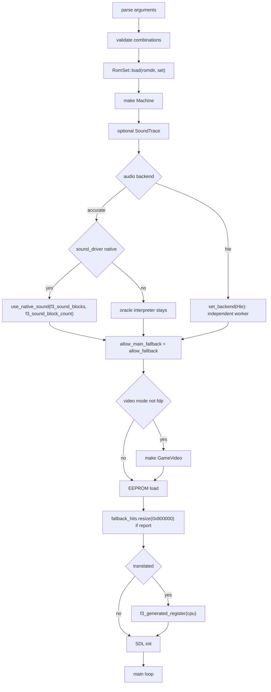
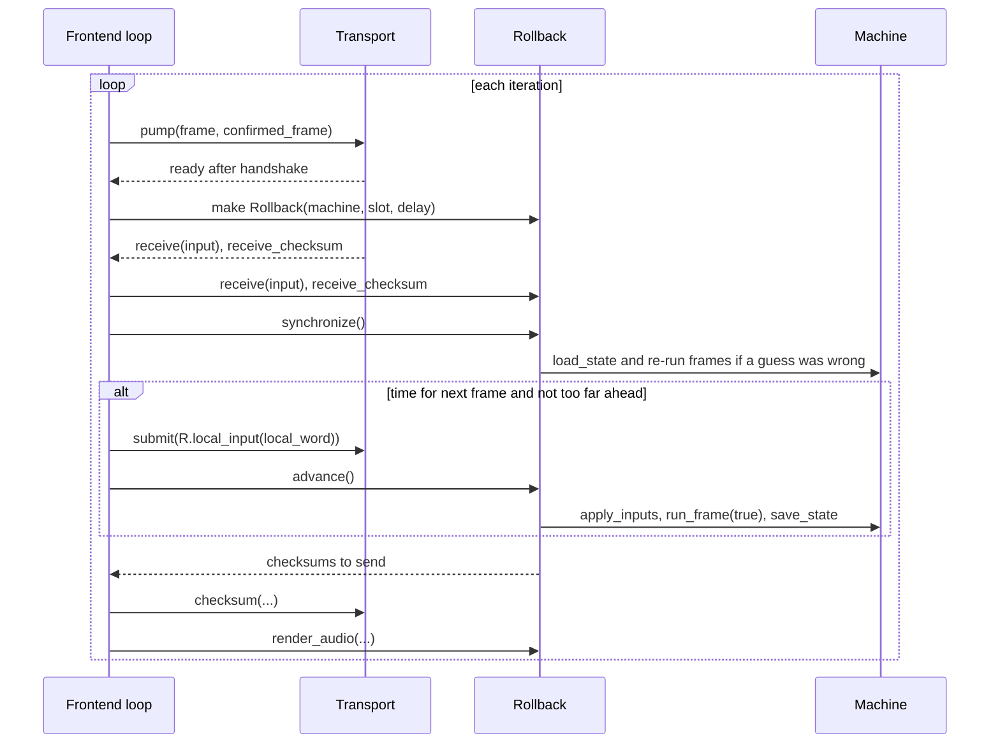

# The frontend

`runtime/frontend.cpp` connects the board runtime to SDL3.
This page covers startup, the host loop, audio output, input events, frame pacing, reports, and netplay integration.

All command-line options are in the [CLI reference](/reference/cli). This page explains how the code uses them.

## One source, two programs

`frontend.cpp` has one `main` function.
CMake always builds `f3rt-run` when `F3RT_SDL` is enabled.
It also builds `landmakr` when generated main code is available.
Compile definitions select their different defaults.

| Executable | Definitions | Defaults |
| --- | --- | --- |
| `f3rt-run` | `F3RT_GENERATED` (when `F3_GENERATED_DIR` is set) | No default ROM directory. Interpreter mode unless `--translated`. Fallback allowed. |
| `landmakr` | `F3RT_GENERATED`, `F3RT_LANDMAKR`, `F3RT_DEFAULT_ROM_DIR` | ROM directory from the build. Translated mode. Strict native (no fallback). `--set` must be `landmakrj`. Video mode `game`. |

When `F3_SOUND_GENERATED_DIR` is set, CMake adds `F3RT_SOUND_GENERATED` to both targets. The frontend then includes `sound_program.h`, and the sound driver defaults to `native` unless `--sound-driver` is given.

`--audio-backend accurate|hle` selects the audio implementation; `accurate` is always the default. `--sound-driver` selects native or interpreted sound-CPU execution only within accurate audio. HLE runs a ROM-derived sequencer and 48 kHz PCM synth on its own worker, without executing the sound CPU or ES chips.

The generated header `program.h` gives `f3_generated_register`. If the binary has no generated code and you ask for `--translated`, the program throws `This binary was built without F3_GENERATED_DIR`.

## Startup



### Validation rules

The code checks these rules after it parses the options. Each failure throws a `std::runtime_error`. `main` catches it, prints `f3rt: <message>` and returns 1.

- `--rom-dir` must be given (or built in), and `--dump-every` must not be 0.
- `--headless` needs `--frames`.
- `--audio-backend` must be `accurate` (default) or `hle`. HLE rejects explicit `--sound-driver` and `--sound-trace`. Under accurate, `--sound-driver` must be `oracle` or `native`; native needs a generated sound program.
- A `landmakr` build accepts only `--set landmakrj`.
- `--video` must be `fdp`, `game` or `compare`. `game` and `compare` need `landmakrj`, translated mode and no fallback.
- `--video-scale` must be 1 to 4, `auto` or `auto-integer`. Automatic modes require GPU; `--video-border` must be 0 to 160.
- `--video-filter` must be `nearest` or `linear`.
- FDP mode rejects expanded dimensions and linear filtering. Explicit scale 1, border 0, and nearest filtering remain valid.
- `--video-interp` must be `off`, `linear` or `fit`; non-off requires GPU. `--video-interp-fields` must be `none`, `geometry`, `palette` or `geometry,palette` (default `geometry`); alpha remains discrete.
- `--netplay-player` must be 1 or 2. `--netplay-delay` must be 0 to 8.
- Any `--netplay-*` option turns netplay on. Netplay needs `--netplay-server` and `--netplay-room`.
- Netplay also needs translated mode, no fallback, `--video game` at fixed scale 1 and border 0 (auto modes rejected), either accurate/native audio or HLE, and no `--eeprom`, `--sound-trace` or `--fallback-report`. Both peers must select the same backend; native main execution still requires zero fallback.
- With netplay, `--frames` must be below `UINT32_MAX - 1024`.

Unknown options throw `Unknown argument`. `--help` prints a usage text and returns 0.

::: info
The `--help` text says the native sound driver is the default only in `landmakr`. The code makes it the default in any build that has a generated sound program, so `f3rt-run` also defaults to native in that case.
:::

## SDL3 setup

The struct `Sdl` holds the window, the renderer, the texture and the audio stream. Its destructor releases all of them and calls `SDL_Quit`. So an exception cannot leak SDL objects.

In windowed mode (no `--headless`) the code:

1. Calls `SDL_Init` with `SDL_INIT_VIDEO`, and `SDL_INIT_AUDIO` unless `--no-audio`.
2. Creates a resizable window initially `(320 + 2 * border) * 3` by 696 **points**. Automatic GPU windows request high pixel density and use `SDL_GetWindowSizeInPixels` to choose their startup scale.
3. CPU: sets `SDL_LOGICAL_PRESENTATION_LETTERBOX` and creates a streaming `ARGB8888` texture, with the selected nearest/linear filter. GPU: creates the SDL3 GPU compositor and selects fixed, auto or auto-integer blit policy.
4. Opens an audio stream: signed 16-bit, 2 channels, at `machine.audio->sample_rate()`. It resumes the stream at once.
5. Prints `window_open video_driver=... backend=... video=... internal=WxH pixels=WxH scale=N filter=... interp=...`.

The `check` helper throws an exception with `SDL_GetError()` when an SDL call fails.

In headless mode the code does not initialize SDL. It still runs the audio generator, so `--wav` works.

For automatic GPU scaling, physical pixel dimensions are checked after native
audio enqueue and before presentation. Resize/fullscreen/display-density changes
settle after 100ms quiet or 250ms maximum drag delay. A changed scale recreates
only host reference geometry and GPU render targets/readback, not the machine,
assets or pipelines. `video_scale` logs pixels, previous/new scale, change count,
change milliseconds and debounce milliseconds. F11/Alt+Enter toggles fullscreen.
The existing pre-enqueue 50ms FIFO cap and long-stall pacing resync remain active.

## The main loop

The loop runs until the user quits or until the frame limit is reached:

```cpp
while (!quit && ((!frames || m.frame < frames) || (transport && !transport->finished()))) { ... }
```

One iteration has these parts:

1. **Events.** In windowed mode, `SDL_PollEvent` reads all events. See [Input events](#input-events).
2. **Advance one frame.** Without netplay: `m.run_frame(translated)`. If it returns false, the loop throws `CPU halted at <pc>`. With netplay: the rollback code. See [Where netplay connects](#where-netplay-connects).
3. **Frame dump.** If the frame advances and matches the dump selection, call `dump_machine`.
   Read [capture files](/developer/runtime/support#capture-files) for the format.
4. **Audio.** Take samples from the audio object in chunks of up to 4096 stereo frames. Count them, find the peak, append them to the WAV file, and give them to SDL with `SDL_PutAudioStreamData`.
5. **Video.** In windowed mode and when a frame advanced, upload the pixels to the texture, clear, draw and present. The pixels come from `game_video->presentation()` if it exists, otherwise from `m.pixels`.
6. **Pacing.** See below.

### Pacing

The code uses one absolute clock. After each presented frame it sleeps until:

```cpp
start + frame * 1e9 * frame_pixels / pixel_clock   // nanoseconds
```

`frame_pixels / pixel_clock` gives a frame time of about 16.97 ms.
The target comes from the frame number, so rounded interval errors do not accumulate.
`--unthrottled` removes local frame pacing.
Local headless execution also skips this sleep.
A late host continues immediately because the sleep target is already in the past.
Netplay has separate pacing and idle sleeps, including in headless mode.

The audio does not control the speed. The frontend gives samples to SDL and the window pacing keeps the long-term rate right.

With netplay, the code does not use this sleep. It uses `next_net_step` instead, because the rollback code decides when to advance. See below.

### Screenshot

If `--surface FILE` and `--frames N` are set, the loop reads the renderer pixels with `SDL_RenderReadPixels` when `m.frame == N`. It saves them as BMP with `SDL_SaveBMP`. This is a capture of the real window output, not of `m.pixels`.

## Input events

`SDL_EVENT_QUIT` and the Escape key stop the loop. Key repeat is ignored. Other keys go to one of two functions.

### Local play: key()

`key()` maps local keys to board input bits.
It uses `set_input` for player ports.
It changes `system_inputs` directly for test and coin keys.

| Key | Effect |
| --- | --- |
| Arrow Up, Down, Left, Right | Port 1, masks `1`, `2`, `4`, `8` |
| Z, X, C | Port 0, masks `1`, `2`, `4` |
| 1, 2 | Port 0, masks `0x1000`, `0x2000` (start) |
| F1 | Port 0, mask `0x200` (service) |
| F2 | `system_inputs` bit `0x02` (test) |
| 5, 6 | `system_inputs` bits `0x10`, `0x20` (coin 1, coin 2) |

When the window loses focus (`SDL_EVENT_WINDOW_FOCUS_LOST`), the code sets all inputs back to `0xffffffff` and `system_inputs` to `0xff`. So no key stays stuck.

### Netplay play: netplay_key()

With netplay on, keys do not touch the machine. `netplay_key` sets bits in the 16-bit word `local_word` (type `netplay::InputWord`):

| Bit | Keys |
| --- | --- |
| 0 to 3 | Up, Down, Left, Right |
| 4, 5, 6 | Z, X, C |
| 7 | 1 or 2 (start) |
| 8 | 5 or 6 (coin) |
| 9 | F1 (service) |
| 10 | F2 (test) |

Focus loss clears `local_word` to 0. The word goes through the network delay like any other input. No key can skip it. `netplay::apply_inputs` turns the words of both players into port bits. See [Input and EEPROM](/developer/runtime/input-and-eeprom).

## Where netplay connects

Netplay replaces the single call `m.run_frame(translated)` with a larger block of code. The frontend creates two objects:

- `netplay::Transport`: the UDP client. It needs `net_options` and `machine_identity(m, delay)`.
- `netplay::Rollback`: the rollback engine. It is created when `transport->ready()` becomes true. Parameters: the machine, `transport->slot()` and the delay.



Key facts about the code:

- `rollback->advance()` runs one frame through `Machine::run_frame(true)`. It also saves a snapshot.
- `rollback->synchronize()` corrects wrong input guesses. It can load an old snapshot and run frames again.
- Frame advance always requires `frame_advantage() <= lead_limit`.
  With throttle, the limit is `2 + int(rtt_ms * pixel_clock / (2000 * frame_pixels) + 0.999)`.
  This allows the estimated transit age plus two frames.
  Without throttle, the lead limit is 16 frames.
  `--unthrottled` bypasses the `next_net_step` time gate, not the frame-lead limit.
- The time for the next frame is `next_net_step`. After each step it moves by one frame time.
- The audio comes from `rollback->render_audio`, not directly from `Machine::audio->render`. Accurate publishes only confirmed PCM. HLE drains its independent speculative stream and reconciles rollback commands without restoring the worker. Main-side command state is deterministic and serialized, but worker state and intentionally history-dependent PCM are excluded from snapshots and peer checksums. See the [HLE worker policy](https://github.com/ansxor/f3-recomp/blob/main/docs/developer/HLE-AUDIO.md#runtime-and-rollback-contract). Optional `--wav FILE` records the selected backend's output, not a cross-peer PCM parity guarantee for HLE.
- After both peers' inputs confirm the requested frame count, the frontend sends `finish(frames, m.state_crc())`.
  The loop continues until the transport reports completion.
  The transport compares the final CRCs.
- Every 250 ms the loop sets the window title to the transport status, the ping and the last rollback depth.
- If a transport exists and no frame advanced, the loop sleeps for 1 ms.
- A netplay error shows an SDL message box (`Netplay stopped`) and then rethrows.

For the protocol, the rollback algorithm and the relay server, read the [netplay pages](/developer/netplay/).

## End of the run

After the loop ends, the code does this:

1. Saves the EEPROM if `--eeprom` was given.
2. Writes the fallback report: a tab-separated file with the header columns `pc` and `count`, and one row for each nonzero entry of `fallback_hits`. The PC is `index * 2`, printed in hex.
3. If `game_video` exists, calls `game_video->report(std::cout)`.
4. With netplay, prints `netplay_confirmed=... state_crc=... rollbacks=... max_rollback_depth=...`.
5. Calls `sound_trace->finish(m)` if tracing is enabled.
6. Prints one summary line.

The summary line has these `key=value` fields: `set`, `frames`, `pc`, `sound_pc`, `audio_backend`, `sound_driver`, `frame_crc`, `cycles`, `native_blocks`, `fallback_instructions`, `audio_frames`, `audio_peak`, `nonzero_samples`. HLE reports `sound_driver=none` and a separate worker-statistics line. The `frame_crc` is the CRC32 of `m.pixels`. Scripts and tests use this line to check a run. See [Testing](/developer/testing/).

## Key points

- `frontend.cpp` is a thin shell. It owns SDL, timing and the command line. The emulation is in `Machine`.
- Pacing uses the board frame time and an absolute start time.
- Local play and netplay use two different input paths.
- Netplay changes frame stepping, input delivery, audio draining, pacing, and completion handling.

## Sources

- [Frontend startup, event loop, and reports](https://github.com/ansxor/f3-recomp/blob/main/runtime/frontend.cpp)
- [Executable build definitions](https://github.com/ansxor/f3-recomp/blob/main/CMakeLists.txt)
- [Game presentation options](https://github.com/ansxor/f3-recomp/blob/main/include/f3rt/game_video.hpp)
- [Rollback interface](https://github.com/ansxor/f3-recomp/blob/main/include/f3rt/netplay.hpp)
