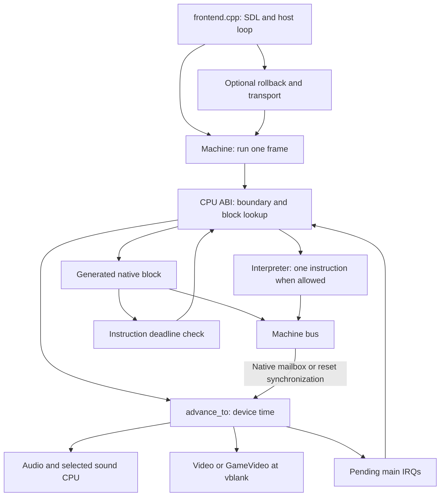

# Runtime

The runtime executes the generated program and models the Taito F3 board.
It owns CPU state, memory, input ports, devices, and frame timing.
The frontend adds a window, audio output, command-line options, and netplay integration.

The main library is `f3rt`.
It links the patched Musashi interpreter for reset, diagnostics, fallback, and reference execution.
Strict native play rejects main-CPU fallback.
A separate native sound driver can replace the interpreted sound CPU.

## Reading order

1. Read [Machine](/developer/runtime/machine) for ownership and every public method.
2. Read [CPU ABI](/developer/runtime/cpu-abi) for generated-code callbacks and lazy condition codes.
3. Read the [memory map](/developer/runtime/memory-map) for bus regions, mirrors, and byte lanes.
4. Read [scheduling](/developer/runtime/scheduling) for deadlines, device time, IRQs, STOP, and reset.
5. Read [input and EEPROM](/developer/runtime/input-and-eeprom) for controls, coins, serial commands, and persistence.
6. Read [interpreter](/developer/runtime/interpreter) and [Musashi](/developer/runtime/musashi) for context switching and local patches.
7. Read [frontend](/developer/runtime/frontend) for startup, SDL, frame pacing, and output handling.
8. Read [support files](/developer/runtime/support) for ROM loading, captures, trace records, and state helpers.
9. Read [replay and check](/developer/runtime/replay-and-check) for isolated device validation.

Then follow the subsystem entry pages:

- [Video](/developer/runtime/video/) covers FDP rendering and the game-data renderer.
- [Audio](/developer/runtime/audio/) covers the sound CPU, mailbox, clocks, DSP, and chip models.
- [Netplay](/developer/netplay/) covers rollback, snapshots, transport, and the relay protocol.

## Execution structure

The CPU and devices have separate clocks.
Native instructions update `cpu.cycles`.
`advance_to` moves device time to the requested target.
A boundary delivers eligible main interrupts and publishes the next instruction deadline.
Mailbox synchronization advances devices without delivering a main interrupt inside a block.

## Runtime-core file inventory

The paths below are relative to the repository root.
Every direct runtime-core file appears here.
The video, audio, and netplay rows identify files covered by their own subsystem pages.

| File | Responsibility | Main explanation |
| --- | --- | --- |
| `include/f3rt/machine.hpp` | Board ownership, public memory, inputs, clocks, bus, and snapshot API. | [Machine](/developer/runtime/machine) |
| `runtime/machine.cpp` | Construction, reset, bus map, scheduler, frame execution, and board snapshots. | [Machine](/developer/runtime/machine), [scheduling](/developer/runtime/scheduling) |
| `include/f3rt/cpu_abi.h` | C ABI, CPU context, block records, callbacks, and ABI version. | [CPU ABI](/developer/runtime/cpu-abi) |
| `runtime/cpu_abi.cpp` | Native bus synchronization, SR changes, exceptions, block registration, and dispatch. | [CPU ABI](/developer/runtime/cpu-abi) |
| `runtime/interpreter.hpp`, `runtime/interpreter.cpp` | Two Musashi contexts, bus callbacks, sound IRQ updates, and fallback. | [Interpreter](/developer/runtime/interpreter) |
| `runtime/core_state.c` | Main register transfer and pointer-free sound-core state transfer. | [Musashi](/developer/runtime/musashi) |
| `runtime/state_oracle.h` | Packed sound-interpreter snapshot record and bridge declarations. | [Musashi](/developer/runtime/musashi) |
| `runtime/state_io.hpp` | Bounded state readers and writers; packed board and device records. | [Support files](/developer/runtime/support#state-serialization), [snapshots](/developer/netplay/snapshots) |
| `runtime/eeprom.hpp` | Header-only 93C46 protocol, busy timing, word persistence, and serial snapshots. | [Input and EEPROM](/developer/runtime/input-and-eeprom) |
| `include/f3rt/rom.hpp`, `runtime/rom.cpp` | Validated ROM regions, chip interleaving, supported sets, and CRC32. | [Support files](/developer/runtime/support#rom-loading) |
| `runtime/capture_io.hpp` | Exact-size reads, frame dumps, raw ARGB, BMP, JSON, and stereo WAV output. | [Support files](/developer/runtime/support#capture-files) |
| `runtime/sound_trace.hpp`, `runtime/sound_trace.cpp` | `F3SND2` bus records and sound-RAM context probes. | [Support files](/developer/runtime/support#sound-trace) |
| `runtime/frontend.cpp` | CLI, SDL resource ownership, local input, frame pacing, reporting, and netplay integration. | [Frontend](/developer/runtime/frontend) |
| `runtime/replay.cpp` | Video capture replay and `F3AUD2` device-write replay without CPU execution. | [Replay and check](/developer/runtime/replay-and-check) |
| `runtime/tests/*.cpp` | Per-area synthetic-ROM checks for video, input, EEPROM, CPU, sprites and audio. | [Replay and check](/developer/runtime/replay-and-check) |
| `runtime/LICENSES.txt` | Adapted hardware sources, pinned revisions, and retained license notices. | [Support files](/developer/runtime/support#licenses-and-source-boundaries) |

`recomp/cpu_ops.h` is outside the runtime directory.
Generated code includes it for lazy flags, conditions, arithmetic helpers, shifts, and divides.
Its callback contract is described on the [CPU ABI page](/developer/runtime/cpu-abi).

### Video files

| Files | Responsibility |
| --- | --- |
| `include/f3rt/video.hpp`, `runtime/renderer/fdp/video.cpp` | Standalone FDP renderer, decoded assets, inspection, sprite buffering, and snapshots. |
| `include/f3rt/game_video.hpp`, `runtime/renderer/game/video.cpp` | Game renderer options, VRAM decode at VBSTART, frame assembly, comparison, and presentation. |
| `runtime/renderer/game/tiles.hpp`, `runtime/renderer/game/tiles.cpp` | Game playfield descriptors and tile rendering. |
| `runtime/renderer/game/text.hpp`, `runtime/renderer/game/text.cpp` | Game text descriptors and RAM character rendering. |
| `runtime/renderer/game/sprites.hpp`, `runtime/renderer/game/sprites.cpp` | Game sprite descriptors, chains, placement, scaling, and rasterization. |
| `runtime/renderer/game/lines.hpp`, `runtime/renderer/game/lines.cpp` | Game line effects, row controls, clipping, and scene-row state. |
| `runtime/renderer/game/scene.hpp` | Shared scene cells, sprites, rows, and layer data. |
| `runtime/renderer/game/compositor.hpp`, `runtime/renderer/game/compositor.cpp` | Final game-layer composition and expanded presentation. |

Read the [video entry page](/developer/runtime/video/) before these implementation pages.
The FDP renderer remains present when `GameVideo` exists.
Snapshots include both objects in that configuration.

### Audio files

| Files | Responsibility |
| --- | --- |
| `include/f3rt/audio.hpp`, `runtime/audio.cpp` | Sound board bus, device scheduling, reset, shared RAM, PCM queues, and snapshots. |
| `runtime/sound_native.hpp`, `runtime/sound_native.cpp` | Native 68000 dispatch, sound ABI callbacks, interrupts, reset latency, and snapshots. |
| `runtime/sound_native_ops.h` | Generated sound instruction helpers and sound-specific timing rules. |
| `runtime/third_party/audio/` | Adapted ES5505, ES5510, MC68681, and MB87078 hardware models. |

The [audio entry page](/developer/runtime/audio/) gives the complete chip-file inventory.
The runtime sound trace is documented here because both CPU drivers use it.

### Netplay files

| Files | Responsibility |
| --- | --- |
| `include/f3rt/netplay.hpp`, `runtime/netplay.cpp` | Input mapping, machine identity, bounded rollback, checksums, and confirmed audio. |
| `include/f3rt/netplay_transport.hpp`, `runtime/netplay_transport.cpp` | UDP handshake, room identity, input transport, status, and final-state exchange. |

Read the [netplay entry page](/developer/netplay/) for the protocol and failure rules.
The frontend owns the transport and rollback objects.
The machine provides the deterministic state API that rollback uses.

### Vendored CPU files

`runtime/third_party/musashi/` contains the single vendored Musashi copy.
Its core, instruction generator, local patches, and SoftFloat files are listed on the [Musashi page](/developer/runtime/musashi).
Generated `m68kops.c` and `m68kops.h` belong to the build directory, not this source inventory.

## API boundaries

| Boundary | Contract |
| --- | --- |
| Generated main code to runtime | Use `f3_cpu` and the C callbacks. Flush lazy flags before non-memory callbacks. |
| CPU to board devices | Preserve instruction-boundary IRQ delivery. Synchronize native mailbox and reset-line accesses first. |
| Main bus to sound bus | Shared RAM maps one main byte to the sound CPU's even byte lane. |
| Machine to frontend | `run_frame` advances board state. The frontend drains audio and presents the selected pixel buffer. |
| Machine to rollback | Use exact-size snapshots with matching ROMs, builds, sound drivers, and video configuration. |
| Runtime to capture tools | Keep runtime dumps, MAME captures, `F3SND2`, and `F3AUD2` distinct. |

Direct `Machine::read*` and `write*` calls do not apply the ABI synchronization helper.
Tooling that changes CPU time must account for this difference.
The interpreter callbacks deliberately use the direct methods to avoid nested Musashi execution.

## Sources

- [Runtime build targets](https://github.com/ansxor/f3-recomp/blob/main/CMakeLists.txt)
- [Machine public API](https://github.com/ansxor/f3-recomp/blob/main/include/f3rt/machine.hpp)
- [Machine implementation](https://github.com/ansxor/f3-recomp/blob/main/runtime/machine.cpp)
- [CPU ABI](https://github.com/ansxor/f3-recomp/blob/main/include/f3rt/cpu_abi.h)
- [Source and license boundaries](https://github.com/ansxor/f3-recomp/blob/main/runtime/LICENSES.txt)
