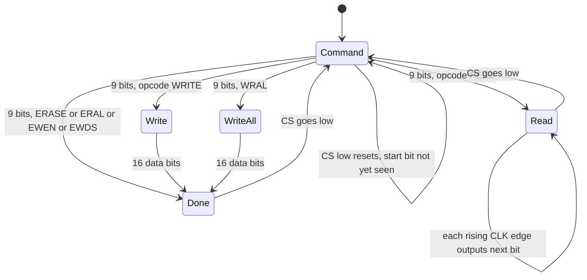

# Input ports, coins and EEPROM

The runtime models active-low controls, coin outputs, and a 93C46 EEPROM.
This page explains port bits, serial commands, busy timing, reset, and persistent settings.

The input code is in `Machine::input_word`, `Machine::set_input` and `Machine::coin_write` in `runtime/machine.cpp`. The EEPROM class is in `runtime/eeprom.hpp`.

## Input state in Machine

`Machine` has these public members for input:

| Member | Type | Meaning |
| --- | --- | --- |
| `inputs` | `std::array<uint32_t, 6>` | One word for each input port 0 to 5. Default `0xffffffff` (no key down). |
| `system_inputs` | `uint8_t` | Service, test and coin switches. Default `0xff`. The code comment names this byte EEPROMIN. |
| `coin_count` | `std::array<uint64_t, 4>` | Number of coin pulses for each of the four counters. |
| `coin_locked` | `std::array<bool, 4>` | True when the game locks out the coin slot. |
| `coin_word` | `std::array<uint16_t, 2>` | The last values that the game wrote for the two coin banks. |
| `timer_control` | `uint16_t` | Value of the register at `0x4c0000`. |

All input bits are **active low**. A bit is 0 while the key is down and 1 when it is up. `set_input` follows this rule:

```cpp
void Machine::set_input(unsigned port, uint32_t mask, bool pressed) {
    if (port >= inputs.size()) throw std::out_of_range("Input port index");
    if (pressed) inputs[port] &= ~mask; else inputs[port] |= mask;
}
```

## Port layout

The CPU reads each port at `0x4a0000 + 4 * port`.
Read the [input block](/developer/runtime/memory-map#input-block-at-0x4a0000) for byte positions and `coin_word` readback.

The frontend and the test harness use these masks. They are the facts that the code shows. The code does not name the buttons, so the names come from the help text of `f3rt-run` and from the netplay header.

| Port | Mask | Frontend key | Meaning |
| --- | --- | --- | --- |
| 1 | `0x01` | Up | Player 1 up |
| 1 | `0x02` | Down | Player 1 down |
| 1 | `0x04` | Left | Player 1 left |
| 1 | `0x08` | Right | Player 1 right |
| 0 | `0x01` | Z | Player 1 button 1 |
| 0 | `0x02` | X | Player 1 button 2 |
| 0 | `0x04` | C | Player 1 button 3 |
| 0 | `0x1000` | 1 | Player 1 start |
| 0 | `0x2000` | 2 | Player 2 start |
| 0 | `0x0200` | F3 | Service switch (default P1 profile; F1 opens frontend menu) |

The netplay code uses the same ports for two players. `netplay::apply_inputs` in `runtime/netplay.cpp` shifts the player 2 bits:

- Directions: `(word & 0xf) << (slot * 4)` on port 1. So player 2 directions use bits 4 to 7.
- Buttons: `((word >> 4) & 7) << (slot * 4)` on port 0. Player 2 buttons use bits 4 to 6.
- Start: `0x1000 << slot` on port 0.
- Service: `0x200 << slot` on port 0.
- Coin: `system_inputs &= ~(0x10 << slot)`.
- Test: `system_inputs &= ~2`.

It first sets all ports to `0xffffffff` and `system_inputs` to `0xff`. It then applies both players. See [Rollback](/developer/netplay/rollback).

## System inputs and the EEPROM line

`system_inputs` is one byte. Bit 0 is not used by the switches. `input_word(0)` builds the high 16 bits of port 0 like this:

```cpp
const uint32_t io = (system_inputs & 0xfe) | unsigned(eeprom->output(cpu.cycles));
value = (value & 0xffff) | (io << 16) | (io << 24);
```

The byte appears twice in the word: at bits 16 to 23 and at bits 24 to 31. Bit 0 of the byte is the EEPROM data-out line. The other seven bits come from `system_inputs`.

The frontend and the test harness set these bits:

| `system_inputs` mask | Key | Meaning |
| --- | --- | --- |
| `0x02` | F2 | Test switch |
| `0x10` | 5 | Coin 1 |
| `0x20` | 6 | Coin 2 |

The header comment says the byte holds "service/test, four coins". The frontend uses only the bits in the table. The netplay documentation states that the byte holds test at bit 1 and coins at bits 4 and 5. The meaning of other bits is not tested in this repository.

## Coins and lockouts

Coin outputs go through the write side of the block at `0x4a0000`.

- A write to `0x4a0004` calls `coin_write(0, v)`. A write to `0x4a0014` calls `coin_write(1, v)`.
- `coin_write` stores `v` in the high byte of `coin_word[bank]`.
- For `i = 0` and `i = 1`: `coin_locked[bank * 2 + i] = !(v & (1 << i))`. A 0 bit means locked.
- For `i = 0` and `i = 1`: if `v & (4 << i)` is set and the old value did not have the bit, `coin_count[bank * 2 + i]` goes up by 1.
- A write to `0x4a0005` or `0x4a0015` stores `v` in the low byte of `coin_word[bank]`.

On reads, `coin_word[0]` appears in the high half of port 1 and `coin_word[1]` in the high half of port 5. So the game can read back what it wrote.

## The EEPROM

The game stores its settings and high scores in a 93C46 serial EEPROM. The chip has 64 words of 16 bits. The class `f3rt::Eeprom` models it. It has one public array, `words`. The array starts as `0xffff` in all words.

### Pins

The CPU controls the EEPROM through one byte at `0x4a0013`. `Machine::write8` calls `eeprom->pins(v, cpu.cycles)`.

| Bit | Mask | Pin |
| --- | --- | --- |
| 4 | `0x10` | CS (chip select) |
| 3 | `0x08` | CLK (clock) |
| 2 | `0x04` | DI (data in) |

The data-out pin (DO) is read through `input_word(0)` as bit 0 of the system byte. The value comes from `Eeprom::output(now)`.

### Time is absolute

EEPROM time uses absolute 16 MHz main cycles.
The EEPROM receives `cpu.cycles` directly.
It does not require `advance_to`.
The model updates `words` when it receives the last data bit or decodes an erase command.
`ready_at` models the subsequent busy interval, not a deferred data commit.
Busy polling needs no further clock edges.

| Operation | Cycles | Time at 16 MHz |
| --- | --- | --- |
| Write one word | 28 000 | 1750 microseconds |
| Erase one word | 16 000 | 1000 microseconds |
| Write all, erase all | 128 000 | 8000 microseconds |

`docs/developer/DECISIONS.md` says these values match the observed baseline model. It also says that EEPROM busy timing removed a seven-frame lead in the cold boot.

### The protocol

`pins()` decodes the pin byte. A rising edge of CLK while CS is high calls `edge(bit, now)`.

- CS low: the chip is deselected. The code sets `selected = false`, remembers the clock level and resets the command state.
- CS goes from low to high: the chip is selected and the command state is reset.
- CLK rising edge: process one bit.

A command has nine bits: one start bit, two opcode bits, and six address bits.
The CPU sends the most significant bit first.
While `count == 0`, command mode ignores zero start bits.
It also ignores new start bits while `now < ready_at`.
The busy check applies to idle command mode, not to every serial edge in every mode.

After 9 bits the code decodes `shift`:

| Opcode (bits 7-6) | Name | Action |
| --- | --- | --- |
| 2 | READ | Set `address = shift & 63`. Go to read mode. DO is 0 (the dummy bit). |
| 1 | WRITE | Go to write mode. Collect 16 data bits. |
| 3 | ERASE | If write is enabled: `words[address] = 0xffff`, `ready_at = now + 16000`. Then done. |
| 0 | Misc | Decode the top two address bits, see below. |

For opcode 0, `address >> 4` selects the command:

| `address >> 4` | Name | Action |
| --- | --- | --- |
| 0 | EWDS | `writable = false`. Done. |
| 1 | WRAL | Collect 16 data bits and write them to all words. |
| 2 | ERAL | If writable: all words become `0xffff`, `ready_at = now + 128000`. Done. |
| 3 | EWEN | `writable = true`. Done. |

**Read mode.** On each next rising edge, the chip sets DO to the next bit of `words[address]`, MSB first. After 16 bits the address goes up by one and wraps from 63 to 0. So a sequential read reads the whole chip.

**Write modes.** The chip collects 16 bits. At the 16th bit, if `writable` is true, it writes the word. A single write sets `ready_at = now + 28000`. WRAL sets `words` all to the value and `ready_at = now + 128000`. If `writable` is false, nothing changes. The mode then becomes `Done`.

**Done.** The chip ignores clock edges until CS goes low.

**Power-on.** `writable` is false. A write only works after EWEN.

### Data out

`output(now)` returns:

- `now >= ready_at` when the chip is selected, in command mode, and `count == 0`. This is the ready/busy poll. A game raises CS and reads DO to check if the last write ended. DO is 0 while busy and 1 when ready.
- `data_out` in every other case.

When the chip is not selected, the `selected` flag is false and `data_out` is 1. So DO is pulled high when the chip is deselected.



### Reset and persistence

- `Eeprom::reset()` clears the serial state (`selected`, `old_clock`, `writable`, `ready_at`, the command). It keeps `words`. `Machine::reset()` calls it. `reset_devices()` calls `pins(0, ...)` which only deselects.
- `Eeprom::load(path)` reads a 128-byte file of 64 big-endian words. It does nothing if the file does not exist. It throws `Invalid EEPROM file` if the size is not 128 bytes.
- `Eeprom::save(path)` writes the 128 bytes.
- `--eeprom FILE` loads at startup and saves at normal exit. Independent EEPROM histories are allowed in netplay; the host canonical handoff supplies match state.
- `save_state` and `load_state` write the words and the serial state as one packed record (`CanonicalEeprom`). See [Snapshots](/developer/netplay/snapshots).

During the first boot the game ROM writes the whole EEPROM, including a checksum `$85ac`. The runtime does not seed the data or skip the check. `docs/developer/DECISIONS.md` records that wrong scheduling once left `$ffff` there and the game showed `PUSH TEST SWITCH`.

## Tests

`f3rt-check` has EEPROM tests with these facts:

- A write is ignored before EWEN.
- A deselected chip has DO high. Raising CS during programming shows busy.
- A new command during programming is ignored.
- Busy polling becomes ready exactly 28 000 cycles after the final write-data bit, without further clock edges.
- A sequential read crosses from word 63 to word 0.
- EWDS protects the data and does not make the chip busy.
- Erase, ERAL and WRAL finish at 16 000 and 128 000 cycles.
- Reset keeps the words and clears the timing.

Also see [Replay and check](/developer/runtime/replay-and-check).

## Sources

- [EEPROM protocol and persistence](https://github.com/ansxor/f3-recomp/blob/main/runtime/eeprom.hpp)
- [Input and coin bus mapping](https://github.com/ansxor/f3-recomp/blob/main/runtime/machine.cpp)
- [Local keyboard mapping](https://github.com/ansxor/f3-recomp/blob/main/runtime/frontend.cpp)
- [Two-player input mapping](https://github.com/ansxor/f3-recomp/blob/main/runtime/netplay.cpp)
- [EEPROM checks](https://github.com/ansxor/f3-recomp/blob/main/runtime/check.cpp)
