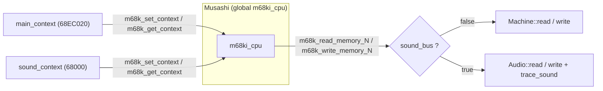
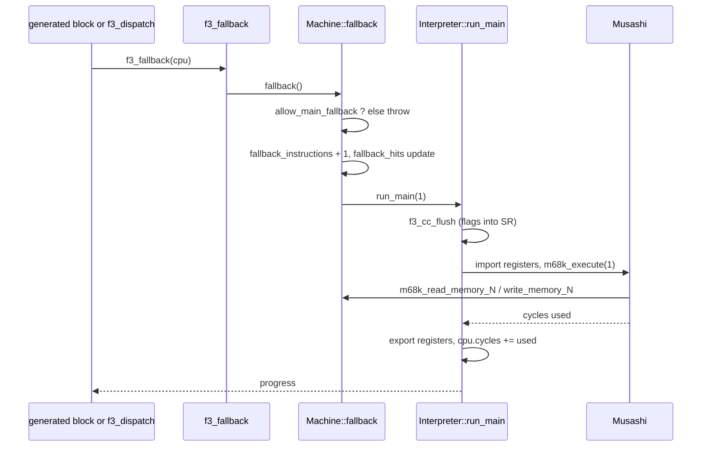

# The interpreter fallback

`Interpreter` connects Musashi to the machine and sound buses.
This page explains reference execution, fallback, reset, context switching, sound IRQ updates, and snapshots.

The files are `runtime/interpreter.hpp`, `runtime/interpreter.cpp` and `runtime/core_state.c`. The Musashi source is described in [Musashi and core_state.c](/developer/runtime/musashi).

## Why the runtime has an interpreter

The main purpose of the project is to run the game as native code, made from the ROM at build time. An interpreter is still useful:

- **Fallback.** The recompiler cannot lower every instruction. For those the generated block calls `f3_fallback`. The dispatcher also uses it for any PC without a block.
- **Reset.** `Machine::reset` and the watchdog reset run natively in `Machine::reset_main_cpu`. They load the reset vectors and charge the reset time without running Musashi.
- **Reference.** A run without `--translated` uses only the interpreter. Tests use it to compare native and interpreted results.
- **Sound oracle.** The sound 68000 can run in Musashi. The native sound driver is the alternative. See the [audio runtime pages](/developer/runtime/audio/).

The interpreter is a validation tool. The finished game runs in strict native mode and the interpreter does not execute game instructions.

## Class overview

```cpp
class Interpreter {
public:
    explicit Interpreter(Machine &machine);
    void audio_reset(bool asserted);
    void audio_irq(bool asserted);
    int run_main(int cycles);
    int run_audio(int cycles);
    uint32_t sound_pc() const;
    size_t sound_state_size() const;
    void save_sound_state(StateWriter &writer) const;
    void load_sound_state(StateReader &reader);
    void sync_main_from_cpu();
private:
    Machine &machine;
    std::vector<uint64_t> main_context, sound_context;
    bool sound_needs_reset = true;
};
```

| Member | Purpose |
| --- | --- |
| `Interpreter(Machine &)` | Calls `m68k_init()` once (a `std::call_once`). Allocates two context buffers of size `m68k_context_size()`, rounded up to 8-byte units. Sets the main context's 68EC020 type and callbacks. |
| `audio_reset(asserted)` | Reset-line callback from `Audio`. When the line is released, it sets `sound_needs_reset`. |
| `audio_irq(asserted)` | IRQ-line callback from `Audio`. Sets or clears the sound CPU interrupt at once. |
| `run_main(cycles)` | Runs the main CPU for a cycle budget. A budget of 1 runs one instruction. |
| `run_audio(cycles)` | Runs the sound 68000 for a cycle budget. |
| `sound_pc()` | Reads the PC of the sound context. |
| `sound_state_size()`, `save_sound_state`, `load_sound_state` | Snapshot of the sound core as `f3rt_sound_oracle_state`. |
| `sync_main_from_cpu()` | Loads `machine.cpu` into the main Musashi context. Used after `load_state`. |

Two things make the class special:

1. Musashi has one **global** core (`m68ki_cpu`). The class swaps between two saved contexts. A context is a raw copy of the core, stored in `std::vector<uint64_t>`.
2. Musashi calls plain C functions for bus access. Those functions need to know which bus is active.

## Two contexts, one global core



The file has two globals in an anonymous namespace:

- `active_machine`: pointer to the machine that owns the active bus.
- `sound_bus`: true while the sound context runs.

The helper `bind(machine, sound)` sets both. `run_main` calls `bind(machine, false)`. `run_audio` calls `bind(machine, true)` and, when it ends, `bind(machine, false)` again.

The six C functions `m68k_read_memory_8/16/32` and `m68k_write_memory_8/16/32` are defined in `interpreter.cpp`. Musashi calls them. If `sound_bus` is false they call `Machine::read8` and friends. If it is true they call `Audio::read8` and friends, and `trace_sound` records the access when a `SoundTrace` is set.

::: warning
The code comment says: "Musashi's global core is serialized on the emulation thread. Contexts are preallocated; audio execution never nests inside a main CPU bus callback." Do not call Machine or Audio from other threads.
:::

## Interrupt acknowledge

Musashi is built with `M68K_EMULATE_INT_ACK=1`. The function `callbacks()` installs two handlers for each context:

- `m68k_set_int_ack_callback(acknowledge)`.
- `m68k_set_reset_instr_callback(reset_devices)`.

`acknowledge(level)` returns:

- `active_machine->audio->irq_ack(level)` for the sound bus. The DUART supplies a vector.
- `M68K_INT_ACK_AUTOVECTOR` for the main bus.

Main-CPU interrupts do not enter through Musashi. `run_main` calls `m68k_set_irq(0)` before it runs. The runtime delivers IRQ2 and IRQ3 in `Machine::boundary`, so native and interpreted execution use the same code. This is the rule "main IRQs enter via the shared ABI boundary".

For the sound CPU, `run_audio` calls `m68k_set_irq(audio->irq_level())` before each slice. The IRQ callback `audio_irq` also changes the level at once, while the sound CPU runs. This matters because the DUART can lower its IRQ during `m68k_execute`. If the runtime waited for the next slice, the CPU would take a second, false interrupt after RTE. `docs/developer/DECISIONS.md` records that this caused sound ROM error `$91`.

`reset_devices()` in `interpreter.cpp` runs on the guest RESET instruction. It calls `Machine::reset_devices()` only if the main bus is active. A RESET in the sound program does nothing.

## Main CPU reset

The main CPU reset is native: `Machine::reset_main_cpu()` in `runtime/machine.cpp`. It does not run Musashi. It mirrors `m68k_pulse_reset` for the 68EC020 and then reads the vectors through `Machine::read32`:

1. Flush pending condition codes.
2. Clear the stopped and halted state.
3. Set SR to `0x2700 | (sr & 0x1f)` with `f3_set_sr`, which swaps the stack banks.
4. Set VBR to 0.
5. Load SSP and A7 from address 0, then PC from address 4.
6. Add 4 cycles, the 68EC020 reset latency.

Data and address registers, CCR, CACR, CAAR, SFC and DFC are preserved.

The constructor sets up the Musashi main context once: the 68EC020 CPU type and the interrupt-acknowledge and reset-instruction callbacks. A guest RESET instruction in the main program therefore still reaches `Machine::reset_devices`. `run_main` imports canonical state before every slice, so the saved Musashi main context does not need to follow a native reset.

`runtime/tests/cpu.cpp` tests this: a cold reset leaves `cpu.cycles == 4`, `pc == 0x100` and `d[0] == 0`. A warm reset keeps D0 and CCR and charges exactly 4 cycles.

## run_main and one-instruction fallback

```cpp
int Interpreter::run_main(int cycles) {
    bind(machine, false);
    m68k_set_context(main_context.data());
    f3rt_core_import(&machine.cpu);
    m68k_set_irq(0);
    const int used = m68k_execute(cycles);
    f3rt_core_export(&machine.cpu);
    m68k_get_context(main_context.data());
    machine.cpu.cycles += unsigned(used);
    return used;
}
```

The core always imports from `machine.cpu` and exports back. So `machine.cpu` is the single source of truth. Native code and the interpreter can alternate every instruction. `f3rt_core_export` also sets `cc_op = 0`, because the interpreter keeps real flags, and it sets `dispatch_deadline = 0` if the step lowered the interrupt mask.

For a running main CPU with no reset delay, `m68k_execute(1)` starts one instruction.
The core completes that instruction even when its cost exceeds the budget.
STOP and halt are handled separately by the machine boundary.
The function reports the cycles used by the pinned 68EC020 model.

### The fallback path



`Machine::fallback()` has four steps:

1. Return 0 if `cpu.halted`.
2. If `allow_main_fallback` is false, throw `std::runtime_error` with the text `Untranslated main CPU instruction at PC 0x...` and the PC in hex.
3. Add 1 to `fallback_instructions`. If `fallback_hits` is not empty, add 1 to `fallback_hits[(pc & 0xffffff) >> 1]`.
4. Call `interpreter->run_main(1)`. The result is true if cycles were used and the CPU is not halted.

### Strict native mode

`allow_main_fallback` is a public member of `Machine`. The code comment says: "Native game target disables this; diagnostics opt in." The default value in the class is `true`. The frontend sets it from the command line:

| Binary | `allow_fallback` default | Effect |
| --- | --- | --- |
| Selected title executable (built with `F3RT_GAME`) | `false` | Strict native. An untranslated instruction is a fatal error. |
| `f3rt-run` | `true` | Fallback is allowed. |

The option `--allow-fallback` sets it to true for any binary. The help text calls it "diagnostic only". The option `--fallback-report FILE` allocates `fallback_hits` with `0x800000` entries (one for each even address in 16 MiB). At the end of the run the frontend writes a TSV with the columns `pc` and `count`. Use it to find instructions that the recompiler did not cover.

A check in `runtime/tests/cpu.cpp` proves the rejection. With `allow_main_fallback = false`, `f3_fallback` throws a message that contains the PC, and it does not change registers or count an instruction.

Strict native mode is the acceptance criterion. `docs/developer/DECISIONS.md` records runs with "zero fallback instructions" in 3 600-frame cold boots and 8 400-frame play tests.

### The interpreter-only frame

`Machine::run_frame(false)` does not use `f3_dispatch`. Its loop calls `boundary()`, and when the result is 0 it calls `interpreter->run_main(1)`. The code comment explains: "Reference execution must hand MMIO/IRQ changes back at every instruction boundary. Coarse slices alter the ROM boot checks." A slice of 512 cycles left the EEPROM checksum at `$ffff` and the game showed `PUSH TEST SWITCH`, as `docs/developer/DECISIONS.md` records.

## run_audio

```cpp
int Interpreter::run_audio(int cycles) {
    bind(machine, true);
    m68k_set_context(sound_context.data());
    if (sound_needs_reset) {
        m68k_set_cpu_type(M68K_CPU_TYPE_68000);
        callbacks();
        m68k_pulse_reset();
        sound_needs_reset = false;
    }
    m68k_set_irq(unsigned(machine.audio->irq_level()));
    const int used = m68k_execute(cycles);
    m68k_get_context(sound_context.data());
    bind(machine, false);
    return used;
}
```

`Machine`'s constructor installs `run_audio` as the sound CPU runner of `Audio`: `audio->set_cpu_runner(...)`. `Audio::advance` calls it in small steps. The sound CPU is a plain 68000. It does not use `f3_cpu` and does not use `machine.cpu`.

When the main CPU releases the sound reset line, `audio_reset(false)` sets `sound_needs_reset`. The next `run_audio` then resets the core and reloads the vectors from sound ROM.

`Machine::use_native_sound` replaces the runner and the reset callback with `SoundNative` methods. It clears the IRQ callback, because the native core reads the DUART line directly. The `Interpreter` then no longer runs sound code. It still runs main-CPU fallback and reset. `Machine::sound_pc()` returns the PC from `SoundNative` if it exists, and from the interpreter otherwise.

## Sound tracing

`trace_sound` is a probe for the sound ROM analysis. It does nothing if `Machine::sound_trace` is null. If a trace exists it records:

- All sound-CPU accesses at addresses from `0x140000` to below `0x340004` as `SoundRead` or `SoundWrite`.
- Special events at fixed sound ROM PCs: `DirectNote` for a byte write at PC `0xc130f0` to A4+0x14; `note_context` for a word write at `0xc140e4` to A1+0x24; `voice_context` for specific writes at `0xc17e62`, `0xc17806` and `0xc17632`.

These PCs belong to the sound driver of the target game. The trace is a bus log for offline analysis. See [Support files](/developer/runtime/support#sound-trace).

## Snapshots

The interpreter state matters for save states and for tests.

- `save_sound_state` calls `f3rt_sound_core_export` to copy the sound core into the packed record `f3rt_sound_oracle_state`. It adds `sound_needs_reset`. The record has no pointers. Callbacks are not saved.
- `load_sound_state` reads the record with `f3rt_sound_core_import`. If the sound CPU was not waiting for a reset, it selects the context, calls `callbacks()` again to rebind the handlers, and stores the context.
- `sync_main_from_cpu` imports `machine.cpu` into the main context and rebinds callbacks. `Machine::load_state` calls it, so a later fallback has correct registers.

The main CPU has no separate interpreter state in a snapshot. It is always rebuilt from `machine.cpu`.

## Key points

- The interpreter exists for fallback, reset, reference runs and the sound oracle.
- Musashi has one global core. The class swaps two contexts.
- `machine.cpu` is the truth. Every `run_main` imports and exports.
- Strict native mode turns an untranslated instruction into an error.
- Main IRQs never enter through Musashi.

## Sources

- [Interpreter interface](https://github.com/ansxor/f3-recomp/blob/main/runtime/interpreter.hpp)
- [Context switching and bus callbacks](https://github.com/ansxor/f3-recomp/blob/main/runtime/interpreter.cpp)
- [Canonical register transfer](https://github.com/ansxor/f3-recomp/blob/main/runtime/core_state.c)
- [Frame loop and strict fallback](https://github.com/ansxor/f3-recomp/blob/main/runtime/machine.cpp)
