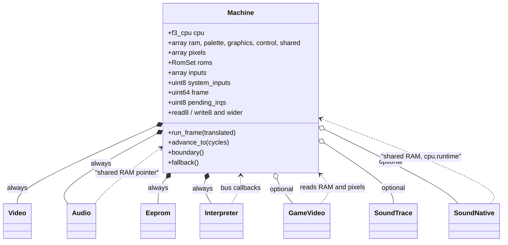
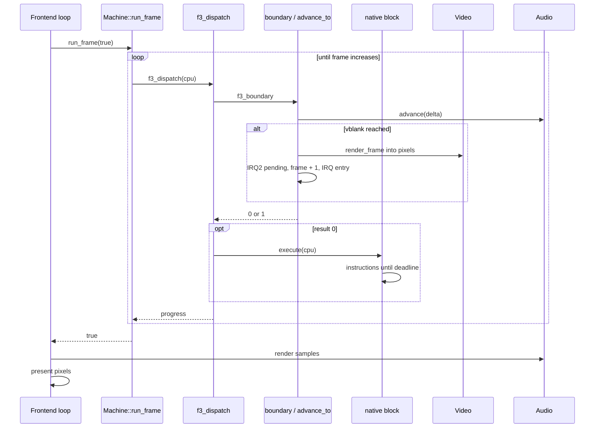

# The Machine class

`f3rt::Machine` owns one emulated board. This page explains its public API, construction, reset, frame loop, and snapshot contract.

The implementation is in [machine.cpp](https://github.com/ansxor/f3-recomp/blob/main/runtime/machine.cpp).
The public API is in [machine.hpp](https://github.com/ansxor/f3-recomp/blob/main/include/f3rt/machine.hpp).
Read the [memory map](/developer/runtime/memory-map) for bus regions.
Read [scheduling](/developer/runtime/scheduling) for event timing.

## What Machine is

`Machine` models the Taito F3 main board. It holds the main CPU state, all RAM, the input state, and pointers to the device objects. It also implements the main CPU bus. Generated code, the interpreter, the frontend and the tools all work through this class.



`Machine` cannot be copied: the copy constructor and assignment are deleted. Other objects keep references to it.

## Constants

| Name | Value | Meaning |
| --- | --- | --- |
| `main_clock` | 16 000 000 | Main CPU clock in Hz. |
| `pixel_clock` | 6 671 500 | Pixel clock in Hz. |
| `frame_pixels` | `432 * 262` | Pixels in one full frame. |

## Public data members

### CPU and memory

| Member | Type | Meaning |
| --- | --- | --- |
| `cpu` | `f3_cpu` | The CPU context. `cpu.runtime` points back to the machine. See [CPU ABI](/developer/runtime/cpu-abi). |
| `ram` | `std::array<uint8_t, 0x20000>` | Work RAM, 128 KiB. |
| `palette` | `std::array<uint8_t, 0x8000>` | Palette RAM, 32 KiB. |
| `graphics` | `std::array<uint8_t, 0x40000>` | Graphics RAM, 256 KiB. |
| `control` | `std::array<uint8_t, 0x20>` | Video control registers, 32 bytes. |
| `shared` | `std::array<uint8_t, 0x800>` | Shared dual-port RAM, 2 KiB. |
| `pixels` | `std::array<uint32_t, 320 * 232>` | The finished frame in ARGB8888. It is always the native size, even when `GameVideo` makes a larger picture. |
| `roms` | `RomSet` | All ROM data. See [ROM loading](/developer/runtime/support#rom-loading). |

### Devices

| Member | Type | Meaning |
| --- | --- | --- |
| `video` | `unique_ptr<Video>` | The FDP software renderer. Always present. |
| `game_video` | `unique_ptr<GameVideo>` | The enhanced renderer. Null by default. The frontend sets it for every renderer except `accurate`. See [Video](/developer/runtime/video/). |
| `audio` | `unique_ptr<Audio>` | ES5505, ES5510, DUART, volume chip and the sound 68000 runner. See [Audio](/developer/runtime/audio/). |
| `eeprom` | `unique_ptr<Eeprom>` | The 93C46. See [Input and EEPROM](/developer/runtime/input-and-eeprom). |
| `interpreter` | `unique_ptr<Interpreter>` | The Musashi bridge. See [Interpreter](/developer/runtime/interpreter). |
| `sound_trace` | `unique_ptr<SoundTrace>` | Optional bus logger for the sound CPU. Null by default. |
| `sound_native` | `unique_ptr<SoundNative>` | Optional native sound CPU. Null means the interpreter runs the sound program. |

### Input

| Member | Meaning |
| --- | --- |
| `inputs` | Six 32-bit port words. Active low. Default `0xffffffff`. |
| `system_inputs` | Service, test and coin byte. Default `0xff`. |
| `coin_count`, `coin_locked`, `coin_word` | Coin state. See [Input and EEPROM](/developer/runtime/input-and-eeprom). |
| `timer_control` | The stored value of the register at `0x4c0000`. |

### Scheduling and statistics

| Member | Meaning |
| --- | --- |
| `frame` | Number of completed vblanks since reset. |
| `pending_irqs` | Bit mask of waiting interrupt levels. Bit 2 is IRQ2 and bit 3 is IRQ3. |
| `blocks`, `block_count` | Pointer and size of the registered block table. `f3_register_blocks` sets them. |
| `native_blocks` | Count of native blocks that `f3_dispatch` started. |
| `fallback_instructions` | Count of instructions that the interpreter ran for the fallback. |
| `allow_main_fallback` | If false, an untranslated instruction throws. Default `true`. See [Interpreter](/developer/runtime/interpreter#strict-native-mode). |
| `fallback_hits` | Optional per-PC counters. The vector is empty until a tool resizes it. The index is `(pc & 0xffffff) >> 1`. |

### Private members

| Member | Meaning |
| --- | --- |
| `hardware_cycles` | Time up to which devices have run. |
| `next_vblank` | Cycle of the next vblank. |
| `irq3_at` | Cycle of the pending IRQ3, or `UINT64_MAX`. |
| `watchdog_at` | Cycle of the watchdog expiry. |
| `state_scratch_` | A buffer that `state_crc` fills. It grows on the first call. |

## Public methods

| Method | What it does |
| --- | --- |
| `Machine(RomSet)` | Builds the machine. See below. |
| `~Machine()` | Destroys the owned devices. Its out-of-line definition permits incomplete device types in the public header. |
| Copy constructor and copy assignment | Deleted. Device callbacks and shared-memory pointers refer to this specific machine. |
| `reset()` | Power-on reset of the whole machine. See [Scheduling](/developer/runtime/scheduling#power-on-reset). |
| `reset_devices()` | Device part of a reset. Used by the RESET instruction and the watchdog. |
| `use_native_sound(program, count, excluded, expected_crc)` | Selects the native sound driver. Call it before any execution. |
| `sound_pc()` | PC of the sound CPU. |
| `run_frame(translated)` | Runs until one more vblank has happened. Returns false if the CPU halted. |
| `advance_to(cycles)` | Brings all devices to the given time. |
| `boundary()` | The scheduling step. Takes interrupts, watchdog, STOP. |
| `fallback()` | Runs one instruction in the interpreter. |
| `read8/16/32`, `write8/16/32` | Main CPU bus. See [Memory map](/developer/runtime/memory-map). |
| `load_eeprom(path)`, `save_eeprom(path)` | Forward to `Eeprom::load` and `save`. |
| `set_input(port, mask, pressed)` | Sets or clears input bits. Throws `std::out_of_range` for port 6 or more. |
| `state_size()`, `save_state(dst)`, `load_state(src)`, `state_crc()` | Save-state snapshots. See [Snapshot API](#snapshot-api). |

## Construction

The constructor `Machine(RomSet set)` does this:

1. Moves the ROM set into `roms` and creates `video`, `audio` and `eeprom`.
2. Throws `Main ROM must be 2 MiB` if `roms.main.size()` is not `0x200000`.
3. Calls `video->load_roms(sprites, sprites_hi, tiles, tiles_hi)`. This decodes the graphics ROMs. It throws `Invalid video ROM regions` on failure.
4. Gives `audio` the pointer to `shared`, the sound ROM and the sample ROM.
5. Creates the `Interpreter`.
6. Connects the audio callbacks to the interpreter: the CPU runner calls `run_audio`, the reset callback calls `audio_reset`, and the IRQ callback calls `audio_irq`.
7. Calls `reset()`.

The optional parts (`game_video`, `sound_trace`, `sound_native`) are set by the caller after construction. `use_native_sound` throws `Select the native sound driver before machine execution` if the audio is not in reset or if `clock_ticks()` is not 0.

::: tip
The tests build a `Machine` from a fixture ROM set in `runtime/tests/support.cpp` with zero-filled ROM data and a tiny program at `0x100`. The machine does not need real game data to construct.
:::

## The step

The unit of work is one **step**. A step is one call of `f3_dispatch` in translated mode, or one boundary plus one interpreted instruction in reference mode.

The translated step (from `cpu_abi.cpp`):

1. `f3_boundary` runs `Machine::boundary()`. It advances devices, takes interrupts, and sets the deadline.
2. If the boundary did nothing, `f3_dispatch` finds the block for `cpu.pc`.
3. The block runs many instructions. It stops at a control transfer, at STOP, or when `cycles` reaches `dispatch_deadline`.

The reference step (from `run_frame`):

1. `boundary()`.
2. If the result is 0, `interpreter->run_main(1)`.

## The frame loop

`Machine::run_frame(bool translated)` is one call per frame. The code is short:

```cpp
bool Machine::run_frame(bool translated) {
    const uint64_t target = frame + 1;
    while (frame < target && !cpu.halted) {
        if (translated) { if (!f3_dispatch(&cpu)) return false; }
        else if (!boundary()) interpreter->run_main(1);
    }
    return !cpu.halted;
}
```

The counter `frame` goes up inside `advance_to`, when the vblank event fires. `advance_to` usually runs at the start of a boundary. So the loop ends in the step whose boundary crossed the vblank time. A native mailbox access can also call `advance_to` in the middle of a block. The vblank then fires there, and the loop ends after the block returns. At the end of the loop:

- The renderer has written the new native frame into `pixels`.
- IRQ2 is pending, or the CPU has already entered its handler.
- Audio has reached the vblank time. It can advance beyond that time to the current instruction boundary.



The loop returns false when the CPU halts (`f3_dispatch` returned 0 or `halted` is set). The frontend then stops with the error `CPU halted at PC`.

### Frame length

A raster frame lasts 271 444 or 271 445 main cycles.
The first vblank occurs at cycle 271 445.
The CPU reaches the event check at an instruction boundary, not necessarily at the exact raster cycle.

### Audio and the frame loop

`run_frame` does not produce samples. The sound device runs inside `advance_to`, and it queues PCM frames. The frontend takes them out with `Audio::render` after each frame. See the [audio runtime pages](/developer/runtime/audio/).

## Snapshot API

`state_size()` returns the exact byte count for the current device configuration.
The sound record depends on whether `sound_native` exists.
An optional `game_video` adds its own record.

`save_state(dst)` requires `dst.size() == state_size()`.
It writes records in this order:

1. The native CPU, including lazy condition codes, cycles, and the deadline.
2. The machine clocks, pending IRQs, inputs, and coin state.
3. Work RAM, palette RAM, graphics RAM, control registers, shared RAM, and native pixels.
4. The EEPROM words and serial state.
5. Audio devices and queued samples.
6. The selected sound CPU state.
7. The FDP renderer state.
8. The optional game renderer state.

`load_state(src)` requires the same byte count and device configuration.
It restores the same sequence.
It sets `cpu.runtime = this` and `cpu.cc_pad = 0`.
It also rebuilds the main interpreter context from `cpu`.
The sound interpreter restores its callbacks when the saved core is ready to run.

Both methods throw `std::invalid_argument` for a span-size mismatch.
They throw `std::logic_error` if the record sequence leaves unused bytes.
The state reader and writer also detect buffer overflow or underflow.

Snapshots do not contain ROMs, block-table pointers, callbacks, or host object pointers.
They also omit `native_blocks`, `fallback_instructions`, fallback coverage, and the fallback policy.
Those values describe execution or host configuration, not board state.

`state_crc()` serializes the same state and computes CRC32.
It reuses `state_scratch_` when the state size stays unchanged.
The first call, or a configuration change, can resize this buffer.
The method therefore has a mutable cache even though it is `const`.

The records copy host integer bytes.
They are not a versioned, portable save-file format.
Use them between machines with matching builds and configurations.

## Exceptions

`Machine` code throws `std::runtime_error` for fatal conditions: a wrong ROM size, a bad video ROM, a time that goes backwards, or an untranslated instruction in strict mode. The frontend catches it and prints `f3rt: <message>`. The tools do the same.

## Key points

- One `Machine` owns all state of one emulated board.
- `run_frame` is the only loop that moves time forward by whole frames.
- `cpu.runtime` is the way from C callbacks back to the `Machine`.
- Synthetic ROM regions can replace game dumps for device checks. Construction still requires valid region sizes.
