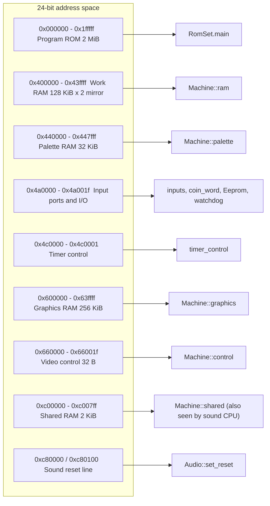

# Main CPU memory map

The main CPU uses a 24-bit bus.
This page lists mapped regions, reads, writes, mirrors, input ports, and sound reset addresses.
The implementation is in `Machine::read8` and `Machine::write8`.

## Overview

The Taito F3 main CPU has a 24-bit address bus. The runtime masks every address with `0xffffff`. So address `0x1400000` is the same as `0x400000`.

The runtime implements the bus at byte level. `read16`, `read32`, `write16` and `write32` call `read8` or `write8` in big-endian order. A 32-bit access at any address is legal. There is no alignment fault.

## Region table

| Start | End | Size | Read | Write | Backing store |
| --- | --- | --- | --- | --- | --- |
| `0x000000` | `0x1fffff` | 2 MiB | `roms.main[a]` | Ignored | `RomSet::main` |
| `0x400000` | `0x43ffff` | 256 KiB window | `ram[a & 0x1ffff]` | `ram[a & 0x1ffff] = v` | `Machine::ram`, 128 KiB, mirrored twice |
| `0x440000` | `0x447fff` | 32 KiB | `palette[a - 0x440000]` | Same index | `Machine::palette` |
| `0x4a0000` | `0x4a001f` | 32 B | Input word, see below | Special, see below | `inputs`, `system_inputs`, `coin_word`, `Eeprom` |
| `0x4c0000` | `0x4c0001` | 2 B | `0xff` | Updates `timer_control` | `timer_control` |
| `0x600000` | `0x63ffff` | 256 KiB | `graphics[a - 0x600000]` | Same index | `Machine::graphics` |
| `0x660000` | `0x66001f` | 32 B | `0xff` (write only) | `control[a - 0x660000] = v` | `Machine::control` |
| `0xc00000` | `0xc007ff` | 2 KiB | `shared[a - 0xc00000]` | Same index | `Machine::shared` |
| `0xc80000` | `0xc80003` | 4 B | `0xff` | Release sound CPU reset | `Audio::set_reset(false)` |
| `0xc80100` | `0xc80103` | 4 B | `0xff` | Hold sound CPU in reset | `Audio::set_reset(true)` |
| everything else | | | `0xff` | Ignored | none |

The value `0xff` for unmapped reads follows the MAME unmapped bus value. The code comment says it is not a guess about mirrors on the real board.

The program ROM is 2 MiB. The constructor of `Machine` throws `Main ROM must be 2 MiB` if `roms.main.size()` is not `0x200000`. The ROM is not an overlay. The CPU reads its reset vectors (SSP at `0x000000`, PC at `0x000004`) from the ROM directly.

### Mirrors

The work RAM window `0x400000` to `0x43ffff` is 256 KiB. The RAM array is 128 KiB (`0x20000`). The code uses `a & 0x1ffff`, so the second 128 KiB repeats the first. A 32-bit access that crosses `0x41ffff` to `0x420000` wraps inside the array. A check in `runtime/tests/cpu.cpp` confirms this: a write at `0x41fffe` changes both the last word and the first word.

No other region has a mirror. The graphics RAM, palette and shared RAM end at the sizes in the table.

## Work RAM

Work RAM holds the game variables. `Machine::ram` is a `std::array<uint8_t, 0x20000>`. The RAM stores bytes in big-endian order, so no byte swap is needed for 16-bit and 32-bit reads. The VBR register can point into this region, as the tests in `runtime/tests/cpu.cpp` do.

## Palette RAM

Palette RAM holds 8192 colors as 32-bit values (see the comment on `Video::render_frame`). The renderer reads it at each vblank. The CPU can read and write it at byte level.

## Graphics RAM and video control

Graphics RAM at `0x600000` holds the data that the FDP renderer reads: tile maps, text and the sprite list. The control registers at `0x660000` hold the scroll values and other FDP control words. The CPU cannot read the control registers back. A read returns `0xff`.

With `--discovery-log`, writes to both regions call `discovery->video_write(cpu.pc, a)` first (graphics stores then take the byte path). The call passes the PC and the address, not the value, so a run can find game code that writes display data from an unknown routine. See [Video write logging](/developer/runtime/video/producers). Without the flag nothing observes writes; it decodes video RAM at VBSTART instead.

## Shared RAM and the sound mailbox

The 2 KiB shared RAM at `0xc00000` is the dual-port RAM. Both the main CPU and the sound CPU can access it. The main CPU sees one byte per address. The sound CPU sees the same bytes at `0x140000` to `0x140fff` on the even byte lane only. So main address `0xc00000 + n` is sound address `0x140000 + 2n`.

The runtime links the two views with `audio->set_shared_ram(shared.data(), shared.size())` in the constructor. `Audio` keeps a pointer to `Machine::shared`. There is no copy.

A write to shared RAM records a `MainWrite` event in `SoundTrace` if tracing is on. Then it stores the byte.

::: warning
The sound CPU runs in its own time. A main CPU access to the mailbox must first bring the sound device up to the current main time. The ABI function `bus()` in `cpu_abi.cpp` does this. See [CPU ABI](/developer/runtime/cpu-abi#bus-access-path).
:::

## Sound reset line

A write to `0xc80000` to `0xc80003` releases the reset of the sound CPU. A write to `0xc80100` to `0xc80103` holds it in reset. The code is `audio->set_reset(a >= 0xc80100)`. The value written does not matter. These writes keep DUART, DSP, volume and sound RAM state. A whole-board reset uses `Audio::reset_board` instead. See [Scheduling](/developer/runtime/scheduling#watchdog-and-reset).

## Input block at 0x4a0000

The block has 8 slots of 4 bytes. Slots 0 to 5 are real input ports. Slots 6 and 7 read `0xffffffff`.

### Reads

`read8` calls `input_word(index)` with `index = (a - 0x4a0000) / 4`. It returns the byte at position `a & 3`. The word is big-endian: byte 0 is bits 31 to 24.

| Port | Address | Content |
| --- | --- | --- |
| 0 | `0x4a0000` | Low 16 bits: `inputs[0]`. Bits 16 to 23 and 24 to 31: system byte (see below). |
| 1 | `0x4a0004` | Low 16 bits: `inputs[1]`. High 16 bits: `coin_word[0]`. |
| 2 | `0x4a0008` | `inputs[2]`. |
| 3 | `0x4a000c` | `inputs[3]`. |
| 4 | `0x4a0010` | `inputs[4]`. |
| 5 | `0x4a0014` | Low 16 bits: `inputs[5]`. High 16 bits: `coin_word[1]`. |
| 6, 7 | `0x4a0018`, `0x4a001c` | `0xffffffff`. |

The system byte is `(system_inputs & 0xfe) | eeprom->output(cpu.cycles)`. The byte appears twice, at bits 16 to 23 and bits 24 to 31. Bit 0 of the byte is the EEPROM data-out line. The other bits come from `system_inputs`. See [Input and EEPROM](/developer/runtime/input-and-eeprom).

All inputs are active low. The default value of each port is `0xffffffff`.

### Writes

The write side of the block uses the same addresses for other purposes:

| Address | Effect |
| --- | --- |
| `0x4a0000` to `0x4a0003` | Watchdog strobe: `watchdog_at = cpu.cycles + 3 * main_clock`. |
| `0x4a0004`, `0x4a0014` | `coin_write(bank, v)`. Bank 0 for `0x4a0004`, bank 1 for `0x4a0014`. Sets the high byte of `coin_word[bank]`. Updates lockouts and counters. |
| `0x4a0005`, `0x4a0015` | Sets the low byte of `coin_word[bank]`. |
| `0x4a0013` | EEPROM pins: `eeprom->pins(v, cpu.cycles)`. |
| other bytes in the block | Ignored. |

`main_clock` is 16 000 000. So the watchdog time is 48 000 000 cycles, or 3 seconds.

`coin_write` treats the byte as follows. Bits 0 and 1 are lockout bits for the two coin counters of the bank. A lockout is active when the bit is 0: `coin_locked[bank * 2 + i] = !(value & (1 << i))`. Bits 2 and 3 are counter pulses. A counter goes up by 1 on a 0-to-1 edge: `++coin_count[bank * 2 + i]`. The input tests in `runtime/tests/input.cpp` confirm that a repeated write of `0x04` counts only once.

## Timer control

A write to `0x4c0000` sets the high byte of `timer_control`. A write to `0x4c0001` sets the low byte. The runtime stores the value and does nothing else. MAME records this register but does not raise timer IRQ5. The runtime copies that behavior. See [Scheduling](/developer/runtime/scheduling).

## Tracing a write

An example: the ROM writes the watchdog.

1. Generated code calls `f3_write8(cpu, 0x4a0000, v)`.
2. `bus()` does not synchronize, because the address is outside the mailbox ranges.
3. `Machine::write8` masks the address. No RAM case matches. The case `a >= 0x4a0000 && a <= 0x4a0003` matches.
4. The code sets `watchdog_at` to the current `cpu.cycles` plus 48 000 000.

## Key points

- The map has few regions. Most addresses are unmapped.
- Unmapped reads give `0xff`. Unmapped writes do nothing.
- Only work RAM mirrors.
- Shared RAM and the sound reset lines need time synchronization. The other regions do not.

## Sources

- [Bus implementation](https://github.com/ansxor/f3-recomp/blob/main/runtime/machine.cpp)
- [Native access synchronization](https://github.com/ansxor/f3-recomp/blob/main/runtime/cpu_abi.cpp)
- [Sound bus and shared byte lanes](https://github.com/ansxor/f3-recomp/blob/main/runtime/audio.cpp)
