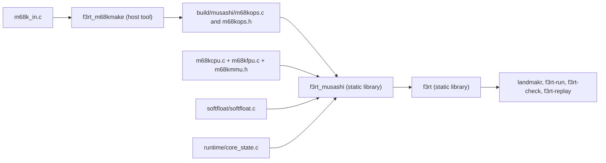

# Musashi and core_state.c

The runtime vendors one patched Musashi CPU core.
This page explains its files, build rules, local timing changes, and canonical state bridge.

The directory is `runtime/third_party/musashi`. The bridge file is `runtime/core_state.c`.

## What Musashi is

Musashi is a portable Motorola 68000 family emulator written in C by Karl Stenerud. Its `readme.txt` gives version 4.10, copyright 1998 to 2002, under an MIT-style license. MAME used it for years. The project uses it as an **interpreter**. It is not the main execution path. See [Interpreter](/developer/runtime/interpreter).

The runtime keeps exactly one copy. The README says: "The runtime owns the single vendored Musashi copy." The differential test tool also uses this copy as an independent reference. See [Differential testing](/developer/testing/differential).

## Files in the directory

| File | Role |
| --- | --- |
| `m68k.h` | Public API: `m68k_execute`, `m68k_set_irq`, `m68k_pulse_reset`, context functions, register access. |
| `m68kconf.h` | Compile-time options. Each option has an `#ifndef` guard, so CMake can override it. |
| `m68kcpu.h`, `m68kcpu.c` | Core state (`m68ki_cpu`), setup, exception handling, CPU type tables. |
| `m68k_in.c` | The instruction descriptions. It is the **input** to `m68kmake`. |
| `m68kmake.c` | A generator program. It reads `m68k_in.c` and writes `m68kops.c` and `m68kops.h`. |
| `m68kfpu.c`, `m68kmmu.h` | FPU and PMMU code. `m68kcpu.c` includes both files. |
| `softfloat/` | SoftFloat package, repackaged for MAME. The FPU code needs it. |
| `readme.txt` | The original Musashi documentation. |

### SoftFloat files

The `softfloat/` subdirectory contains these files:

| File | Role |
| --- | --- |
| `softfloat.c`, `softfloat.h` | Software floating-point implementation and API. |
| `softfloat-macros` | Shared arithmetic macros included by the implementation. |
| `softfloat-specialize` | Target-specific floating-point behavior and exception helpers. |
| `milieu.h` | Common environment header. |
| `mamesf.h` | Integer types and MAME-oriented environment definitions. |
| `README.txt` | SoftFloat Release 2b provenance and license terms. |

The main runtime selects a 68EC020 without an FPU.
The sound runtime selects a 68000.
The shared vendored source still compiles FPU support and links SoftFloat.
SoftFloat has separate license conditions.
Read [source boundaries](/developer/runtime/support#licenses-and-source-boundaries) before redistributing these files.

## How CMake builds it

The top-level `CMakeLists.txt` has this sequence:

1. Build the host program `f3rt_m68kmake` from `m68kmake.c`.
2. Run it in a custom command. Input: `m68k_in.c`. Output: `m68kops.c` and `m68kops.h` in `build/musashi`.
3. Build the static library `f3rt_musashi` from `m68kcpu.c`, `softfloat/softfloat.c`, the generated `m68kops.c`, and `runtime/core_state.c`.
4. Add a custom target `f3rt_musashi_generated` and make the library depend on it. This is needed because `m68kcpu.c` includes the generated header `m68kops.h`.
5. Link the library privately into `f3rt`.

The compile definitions of `f3rt_musashi` are:

| Definition | Value | Effect |
| --- | --- | --- |
| `M68K_EMULATE_030` | 0 | Remove 68030 support. |
| `M68K_EMULATE_040` | 0 | Remove 68040 support. |
| `M68K_EMULATE_INT_ACK` | 1 | Call the interrupt acknowledge callback. |
| `M68K_EMULATE_TRACE` | 1 | Support the trace bits. |
| `M68K_EMULATE_RESET` | 1 | Call a handler for the RESET instruction. |
| `M68K_EMULATE_ADDRESS_ERROR` | 1 | Enables the core's address-error handling. The 68000 traps unaligned word and long data access; EC020 data access permits it. |

`m68kconf.h` keeps 68010, 68EC020 and 68020 enabled by default. The runtime uses the 68EC020 for the main CPU and the 68000 for the sound CPU.

The library target has `PUBLIC` include of the Musashi directory and `PRIVATE` includes of `include` (for `f3rt/cpu_abi.h`) and the build directory (for the generated header). So `interpreter.cpp` can include `m68k.h`.

## Changes to the vendored source

Musashi changes for the MAME reference are recorded in `docs/developer/ABI-CHANGES.md` and the dated decision log. Preserve them when updating the core; canonical imports also require safe-field validation.

### Main CPU (EC020 and 020)

| Change | Where | Reason |
| --- | --- | --- |
| Word `DIVS` and `DIVU` overflow clears the C flag | Four templates in `m68k_in.c`, marked `f3rt: current MAME clears C even on word division overflow` | Current MAME clears C. Upstream Musashi does not. Long division overflow keeps C, N and Z. |
| `MOVEM` store costs 3 cycles per register | New fields `cyc_movem_store_w` and `cyc_movem_store_l` in `m68kcpu.h` | MAME costs stores at 3 and loads at 4. Upstream uses 4 for both. Other CPU types keep their old values. |
| Rotates have no count-dependent cost | `cyc_shift` stores "extra cycles per count, not a shift exponent" | Zero must mean zero extra cycles. 68000, 68010 and 68070 keep 2 cycles per count. |
| `TRAP #n` costs 24 cycles | `m68ki_exception_trapN` in `m68kcpu.h` | MAME charges the exception entry plus the 4-cycle opcode. Upstream refunds the opcode. The 020 variants now keep it. |

### Sound CPU (68000)

The sound 68000 timing is calibrated against executed reference microprograms, not against the main CPU table. The changes are scoped to the 68000 type:

| Change | Detail |
| --- | --- |
| Address-register quick arithmetic | `ADDQ.W` to An takes 8 cycles and preserves CCR. |
| Long register arithmetic | Long arithmetic and logical register forms use the corrected 8-cycle costs. |
| Immediate effective addresses | Byte and word arithmetic distinguishes its costs from long arithmetic. Immediate word address arithmetic does not add a long-width surcharge. |
| `TAS` | Corrects register and memory effective-address costs without charging the read-modify-write path twice. |
| Register bit mutation | Applies modulo-32 selection, then adds 2 cycles for bits 16 through 31. Immediate forms add their fetch cost. |
| IRQ entry | 44 cycles for every vector, with autovector or device vector. `m68kcpu.h` uses `CYC_EXCEPTION[EXCEPTION_INTERRUPT_AUTOVECTOR + int_level]` for the 68000. |
| `DIVU.W` | `m68ki_divu_000_cycles` in `m68kcpu.h`. A quotient overflow costs 10. Other cases cost 76 to 136, plus the effective address cost. |
| `MULS.W` | Counts the final 1-to-0 Booth transition for positive word sources. Source in `m68k_in.c`. |
| `STOP` with a pending IRQ | When STOP lowers the mask and exposes a pending IRQ, the core keeps the 4-cycle instruction, one 4-cycle poll and the 44-cycle entry. That is 52 cycles in total. |

These values are emulator model values from the reference, not hardware bus cycles. The notes say so for each change.

### Reset latency

`m68k_pulse_reset` stores `RESET_CYCLES` from `CYC_EXCEPTION[EXCEPTION_RESET]`. The runtime drains these four cycles in `Interpreter::reset_main` and charges `cpu.cycles`. The core field is `reset_cycles`.

## Canonical CPU state transfer

`core_state.c` is compiled into `f3rt_musashi` because it must see the private core structure `m68ki_cpu` through `m68kcpu.h`. It has four functions.

### f3rt_core_import and f3rt_core_export

These two functions copy the **main** CPU registers. They use the public `m68k_set_reg` and `m68k_get_reg` calls and the private `m68ki_cpu.stopped` field.

| Direction | Steps |
| --- | --- |
| `f3rt_core_import(const f3_cpu *)` | Sets SR, USP, ISP (from `ssp`), MSP, D0 to D7, A0 to A7, PC, VBR, SFC, DFC, CACR and CAAR. Sets `m68ki_cpu.stopped` from `stopped` and `halted`. Sets `reset_cycles = 0`. |
| `f3rt_core_export(f3_cpu *)` | Reads the same registers back. Sets `stopped` and `halted` from `m68ki_cpu.stopped`. Sets `cc_op = 0`. If the new interrupt mask is lower than the old one, sets `dispatch_deadline = 0`. |

Two details matter:

- The import sets `reset_cycles` to 0 with this comment: "A fallback is one instruction, not an outstanding power-on reset delay." Without it, an old reset latency would be charged to a normal instruction.
- The export sets `cc_op = 0` because Musashi holds real flags. Pending lazy flags must have been flushed before the call.

The `stopped` field uses Musashi's bit flags `STOP_LEVEL_STOP` and `STOP_LEVEL_HALT`.

The export of the mask is the interpreter half of a rule in the ABI: lowering the SR mask must invalidate the cached deadline. `f3_set_sr` handles the native half.

### f3rt_sound_core_export and f3rt_sound_core_import

These functions transfer the state used by the sound 68000 through `f3rt_sound_oracle_state`.
They read or write a saved context buffer, not the active global core.
They do not copy callbacks or host pointers.
They are not a general FPU-capable Musashi snapshot interface.

The struct has the registers (`dar`, `dar_save`, `sp[7]`, `pc`, `ppc`, `vbr`, `sfc`, `dfc`, `cacr`, `caar`, `ir`), the flags (`x_flag`, `n_flag`, `not_z_flag`, `v_flag`, `c_flag`, `s_flag`, `m_flag`, `t0_flag`, `t1_flag`), the interrupt state (`int_mask`, `int_level`, `virq_state`, `nmi_pending`), run state (`stopped`, `run_mode`, `instr_mode`, `reset_cycles`), prefetch (`pref_addr`, `pref_data`), CPU variables (`cpu_type`, `address_mask`, `sr_mask`), the cycle tables (`cyc_*`), the PMMU registers and one extra byte `sound_needs_reset`. The struct uses `#pragma pack(1)`. It has no pointers.

On import the code restores the cycle table pointers by looking them up again: `core->cyc_instruction = m68ki_cycles[0]` and `core->cyc_exception = m68ki_exception_cycle_table[0]`. It does this when the CPU type is not 0, or when the saved state was not waiting for a reset. Pointers must never be saved in a snapshot, because they differ between processes. See [Snapshots](/developer/netplay/snapshots).

## When to touch this code

- If you add a field to `m68ki_cpu` that affects execution, add it to `f3rt_sound_oracle_state`, to both functions in `core_state.c`, and check the snapshot size.
- If you change a cycle cost, update the reference tables and rerun the differential test. See [Differential testing](/developer/testing/differential).
- If you update Musashi, apply the changes in the tables above again.

## Key points

- Musashi is vendored once, built with its own code generator, and linked into `f3rt`.
- The project changed Musashi for MAME parity in cycle counts and one flag rule.
- `core_state.c` isolates the runtime bridge's access to private Musashi fields.
- Import and export keep `machine.cpp` and Musashi in agreement about CPU state.

## Sources

- [Musashi build definitions](https://github.com/ansxor/f3-recomp/blob/main/CMakeLists.txt)
- [CPU type timing setup](https://github.com/ansxor/f3-recomp/blob/main/runtime/third_party/musashi/m68kcpu.c)
- [Exception and operand timing helpers](https://github.com/ansxor/f3-recomp/blob/main/runtime/third_party/musashi/m68kcpu.h)
- [Instruction templates and cycle declarations](https://github.com/ansxor/f3-recomp/blob/main/runtime/third_party/musashi/m68k_in.c)
- [Instruction generator](https://github.com/ansxor/f3-recomp/blob/main/runtime/third_party/musashi/m68kmake.c)
- [Canonical state bridge](https://github.com/ansxor/f3-recomp/blob/main/runtime/core_state.c)
- [Sound-core state record](https://github.com/ansxor/f3-recomp/blob/main/runtime/state_oracle.h)
- [Sound timing regression cases](https://github.com/ansxor/f3-recomp/blob/main/runtime/check.cpp)
