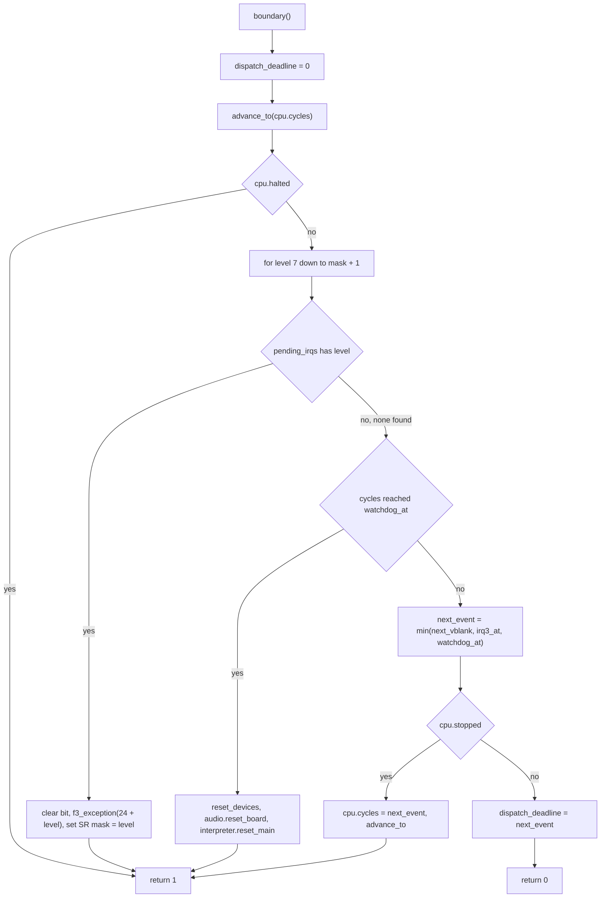
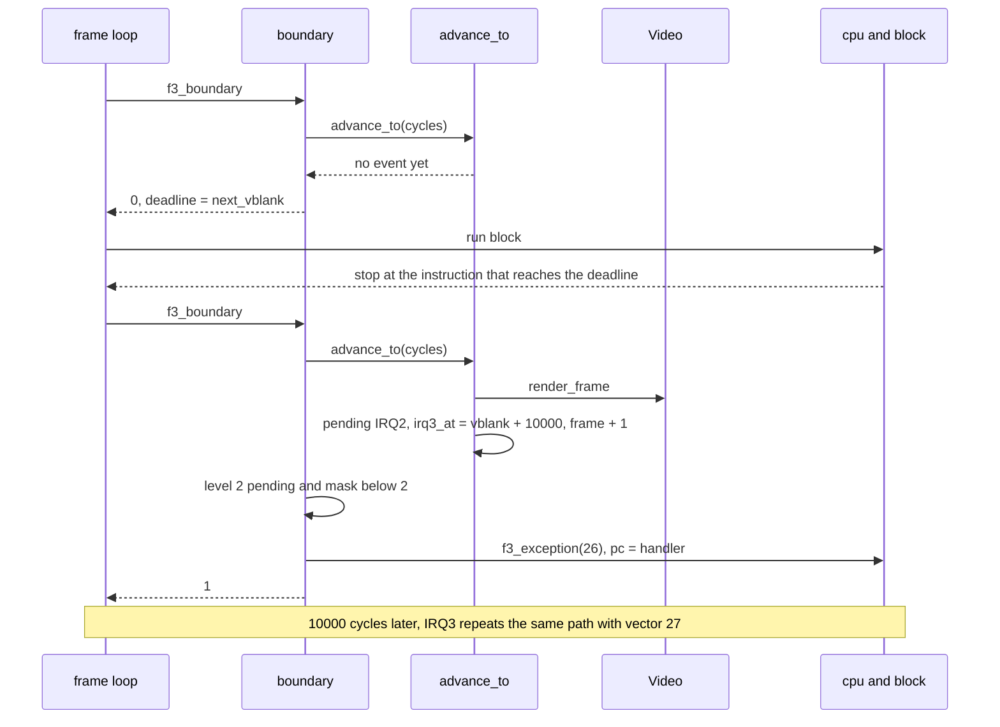
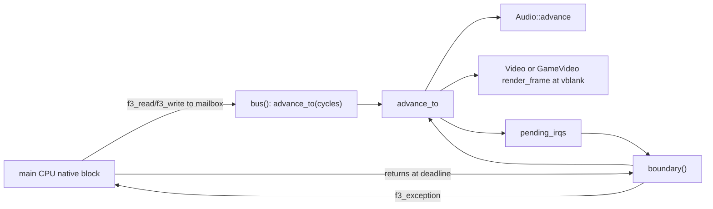

# Scheduling, interrupts and device time

The runtime tracks CPU time and device time separately.
This page explains raster events, interrupts, instruction deadlines, STOP, the watchdog, and sound synchronization.

The code is in `Machine::advance_to`, `Machine::boundary` and `Machine::reset_devices` in `runtime/machine.cpp`.

## The big idea

The main CPU runs native blocks or interpreted instructions. It does not stop for hardware events. Instead the CPU only updates its own clock `cpu.cycles`. The devices catch up at **boundaries**. A boundary is a place between two instructions where the runtime can look at the hardware. Native code reaches a boundary:

- when it returns to `f3_dispatch`, or
- when it touches the sound mailbox or reset line (a partial boundary that only advances devices).

Generated blocks also stop at the first instruction that reaches `dispatch_deadline`. So a vblank cannot arrive late by more than one instruction.

## Two clocks

| Name | Where | Meaning |
| --- | --- | --- |
| `cpu.cycles` | `f3_cpu` | Main CPU clock. Native blocks add the cost of each instruction. The interpreter adds the cycles that Musashi reports. |
| `hardware_cycles` | `Machine` (private) | The time up to which the devices have run. `advance_to` moves it forward. |

Both clocks count 16 MHz main cycles.
Normal execution keeps `hardware_cycles <= cpu.cycles`.
`advance_to` rejects targets below `hardware_cycles`.
It does not check the target against `cpu.cycles`; callers must maintain the CPU clock contract.

The constants are in `include/f3rt/machine.hpp`:

These constants and instruction-boundary events describe the MAME-derived
reference schedule, not a physical board's measured bus cycles or oscillator rates.

| Constant | Value | Meaning |
| --- | --- | --- |
| `main_clock` | 16 000 000 | Main CPU clock in Hz. |
| `pixel_clock` | 6 671 500 | Pixel clock in Hz. This is 26 686 000 / 4, as in MAME. |
| `frame_pixels` | 432 * 262 = 113 184 | Pixels in a full frame, including blanking. |

The visible image is 320 by 232 pixels. The raster is 432 by 262 in total.

## Raster time

`Machine::raster_cycle(pixels)` converts a pixel count into main cycles. It rounds up:

```cpp
(pixels * main_clock + pixel_clock - 1) / pixel_clock
```

The n-th vblank occurs at `raster_cycle(n * frame_pixels)`.
The first vblank occurs at cycle 271 445.
Later frame intervals contain 271 444 or 271 445 cycles.
The frame rate is about 58.94 Hz.
The scheduler calculates each event from the frame number.
It does not accumulate a rounded fixed interval.

::: info
Raster time zero is the VBSTART beam epoch of the MAME reference screen. It is not scanline zero. So the first vblank interrupt comes one full frame (262 lines) after reset. An earlier version started at line 256 and the interrupt came about 6 216 cycles too early. The note is in `docs/developer/DECISIONS.md` under "Runtime decisions".
:::

## advance_to: running the devices

`Machine::advance_to(cycles)` brings every device up to the given time. It runs in a loop:

1. Find the next event: `event = min(next_vblank, irq3_at)`.
2. Set `end = min(cycles, event)`.
3. Call `audio->advance(end - hardware_cycles)`. The sound device runs for that many main cycles.
4. Set `hardware_cycles = end`.
5. If `hardware_cycles == next_vblank`:
   - Render the frame. If `game_video` exists, call `game_video->render_frame()`. Otherwise call `video->render_frame(palette, graphics, control, pixels)`.
   - Set bit 2 in `pending_irqs` (IRQ2).
   - Set `irq3_at = next_vblank + 10000`.
   - Add 1 to `frame`.
   - Set `next_vblank = raster_cycle((frame + 1) * frame_pixels)`.
6. If `hardware_cycles == irq3_at`, set bit 3 in `pending_irqs` and set `irq3_at = UINT64_MAX`.

The sound device always runs before an event fires. So the main CPU sees the sound state that matches the event time.

The delay of 10 000 cycles between IRQ2 and IRQ3 is 625 microseconds. It matches MAME.

The scheduler renders when it processes the vblank event.
It uses the current RAM contents.
It does not save a separate history of writes within an instruction.
The renderer runs on the emulation thread.

## Pending interrupts

`pending_irqs` is a bit mask. Bit n means "a request for interrupt level n is waiting". Only two bits are ever set: bit 2 and bit 3. The vblank sets bit 2. The delayed IRQ3 sets bit 3. The runtime does not model any other source.

The F3 timer IRQ5 does not exist in the runtime. The game writes `timer_control` at `0x4c0000`, and the runtime stores it. MAME also does not raise IRQ5. The runtime keeps this behavior on purpose, because the target is parity with MAME.

An interrupt request is edge-like. The code clears the bit when it takes the interrupt. There is no acknowledge cycle for the main CPU. If the SR mask blocks the request, the bit stays set until the mask goes down.

## boundary: taking interrupts

`Machine::boundary()` is the central function. The dispatcher calls it through `f3_boundary`. The interpreter path in `run_frame` calls it too.



### Interrupt entry

The loop checks levels from 7 down to one above the current mask (SR bits 8 to 10). For the first pending level it does this:

1. Clear the pending bit.
2. Remember the old SR and PC.
3. Call `f3_exception(&cpu, 24 + level, old_pc)`. The autovector for level n is vector 24 + n. So IRQ2 uses vector 26 and IRQ3 uses vector 27. The cost is 30 cycles.
4. If the old SR had the M bit (`0x1000`), build the extra throwaway frame. This is a 68020 rule for interrupts from master mode. The code clears M with `f3_set_sr`, pushes 8 more bytes on the interrupt stack, and writes the old SR with S set (`old_sr | 0x2000`), the old PC and the format word `0x1000 | ((24 + level) * 4)`.
5. Set the SR mask to the level: `f3_set_sr(&cpu, (sr & ~0x0700) | (level << 8))`.
6. If `cpu.pc` is 0, read the uninitialized interrupt vector: `cpu.pc = read32(vbr + 15 * 4)`.
7. Return 1.

The return value 1 tells the dispatcher to look up the new `pc` before it runs a block. `dispatch_deadline` is still 0 at this point, so the next step goes through a fresh boundary.

Interrupt entry occurs at a boundary, never inside a native block.
An unmasked interrupt is normally recognized after the instruction that reaches the event deadline.
Masked requests remain pending, so the deadline does not guarantee their delivery.

### STOP

When a program runs STOP, the CPU sets `stopped`. At the next boundary the code jumps time ahead. It sets `cpu.cycles = next_event` and calls `advance_to`. The loop above then finds the new IRQ on the next call. STOP stops at the watchdog time too, so the watchdog can still expire.

### The deadline

If the CPU can run, `boundary()` publishes `dispatch_deadline = min(next_vblank, irq3_at, watchdog_at)`. `irq3_at` is `UINT64_MAX` when no IRQ3 is waiting. See [CPU ABI](/developer/runtime/cpu-abi#the-deadline-contract) for the rules.



## Watchdog and reset

### The watchdog

The F3 has a watchdog. The game must write to `0x4a0000` regularly. Each write sets `watchdog_at = cpu.cycles + 3 * main_clock`. That is 3 seconds of main-CPU time.

When `cpu.cycles >= watchdog_at` at a boundary, the runtime does a whole-board reset:

1. `reset_devices()`
2. `audio->reset_board()`
3. A `SoundTrace::Reset` record, if tracing is on.
4. `interpreter->reset_main()`. This pulses the reset of the Musashi core. The CPU reloads SSP and PC from the ROM vectors. The reset costs 4 cycles. The core first receives the current canonical registers, so general registers and CCR stay as native code left them.
5. Return 1.

The raster clock does not restart. `hardware_cycles`, `next_vblank` and `frame` keep going.

The boundary checks eligible interrupts before it checks the watchdog.
An eligible IRQ therefore takes priority when both conditions apply at the same boundary.
The following boundary checks the watchdog again.

### reset_devices

`Machine::reset_devices()` is the "device reset" part. It:

- sets `dispatch_deadline = 0`,
- holds the sound CPU in reset (`audio->set_reset(true)`),
- resets the EEPROM pins with `eeprom->pins(0, cpu.cycles)`,
- clears `pending_irqs`,
- sets `irq3_at = UINT64_MAX`,
- restarts the watchdog: `watchdog_at = cpu.cycles + 3 * main_clock`.

Construction and `Machine::reset()` call `reset_devices()`.
The watchdog also calls it as shown above.
The native RESET instruction calls `f3_reset_devices`, which catches device time up first.
The Musashi RESET callback calls `reset_devices()` directly when the main bus is active.
It does not enter another CPU runner from a main-CPU bus callback.

### Power-on reset

`Machine::reset()` runs from the constructor. It:

1. Sets `cpu = {}` and `cpu.runtime = this`.
2. Resets the EEPROM serial state. The words stay.
3. Sets `frame = hardware_cycles = 0`.
4. Sets `next_vblank = raster_cycle(frame_pixels)`.
5. Calls `reset_devices()`.
6. Calls `audio->reset_board()`.
7. Records a sound trace reset.
8. Resets `video` and `game_video`.
9. Calls `interpreter->reset_main()`. The CPU gets its first PC and SP from the ROM, and `cpu.cycles` becomes 4.

`reset()` does not clear the RAM arrays. The constructor zero-fills them. It does not clear inputs or coin counters either.

`runtime/tests/cpu.cpp` tests the result: "Cold reset charges four cycles without executing the first opcode".

## Sound device synchronization

The sound CPU, the OTIS sound chip, the DSP and the DUART all live in `Audio`. They run in their own time. `Audio::advance(main_cycles)` runs them for a number of main cycles. The details are on the [audio runtime pages](/developer/runtime/audio/).

There are three sync points:

1. **At boundaries.** `boundary()` calls `advance_to`, which calls `audio->advance`.
2. **At the mailbox and reset line.** The `bus()` function in `cpu_abi.cpp` calls `advance_to(cpu->cycles)` before a native access to `0xc00000` to `0xc00800` or the reset addresses. A native block can be well ahead of `hardware_cycles`. Without the call, the sound CPU would see a new command in the block's past. Accesses that start below `0xc00000` and reach into the range count too.
3. **At RESET.** `f3_reset_devices` also catches up first.

The sync call does not deliver main-CPU interrupts. It does not charge cycles. It does not flush lazy flags. The interrupt entry still waits for the next boundary.

The interpreter path has a different rule. Its Musashi callbacks call `Machine::read*` and `write*` directly. It syncs only at instruction boundaries, because `run_frame` calls `boundary()` before every instruction. So audio never runs inside a Musashi main-CPU callback.

Tests in `check_main_sound_ordering` prove this. A reset release at cycle 2048 does not let the sound CPU run during the earlier 2048 cycles. A mailbox write at cycle 1024 reaches the sound CPU only after the sound CPU has run to that point. Reads of 1, 2 and 4 bytes, including a read at `0xbfffff`, see the replies that the sound CPU made before the read.

## How the audio, video and CPU interlock



## Key points

- `cpu.cycles` is the CPU clock. `hardware_cycles` is the device clock.
- `advance_to` is the only function that moves device time.
- Vblank sets IRQ2. IRQ3 follows 10 000 cycles later.
- The CPU takes an interrupt only at a boundary.
- The deadline makes sure a boundary happens in time.
- The watchdog expires after 3 seconds without a write to `0x4a0000`.

## Sources

- [Machine API](https://github.com/ansxor/f3-recomp/blob/main/include/f3rt/machine.hpp)
- [Event scheduler and reset paths](https://github.com/ansxor/f3-recomp/blob/main/runtime/machine.cpp)
- [ABI bus synchronization](https://github.com/ansxor/f3-recomp/blob/main/runtime/cpu_abi.cpp)
- [Interpreter callbacks](https://github.com/ansxor/f3-recomp/blob/main/runtime/interpreter.cpp)
