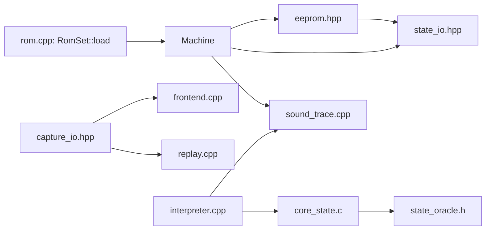

# Support files

Support files load ROMs, store snapshots, write captures, and record sound-bus activity.
This page lists their interfaces, formats, consumers, and source boundaries.

| File | Section on this page |
| --- | --- |
| `include/f3rt/rom.hpp`, `runtime/rom.cpp` | [ROM loading](#rom-loading) |
| `runtime/eeprom.hpp` | [EEPROM](#eeprom) |
| `runtime/capture_io.hpp` | [Capture files](#capture-files) |
| `runtime/core_state.c`, `runtime/state_oracle.h` | [Core state](#core-state) |
| `runtime/sound_trace.hpp`, `runtime/sound_trace.cpp` | [Sound trace](#sound-trace) |
| `runtime/state_io.hpp` | [State serialization](#state-serialization) |
| `runtime/replay.cpp`, `runtime/check.cpp` | [Replay and check](/developer/runtime/replay-and-check) |
| `runtime/LICENSES.txt` | [Licenses and source boundaries](#licenses-and-source-boundaries) |



## ROM loading

`RomSet` is a plain struct of byte vectors. It is the only input that `Machine` needs.

```cpp
struct RomSet {
    std::string name;
    std::vector<uint8_t> main, sprites, sprites_hi, tiles, tiles_hi, sound, samples;
    static RomSet load(const std::filesystem::path &directory,
                       const std::string &set = "landmakrj");
};
uint32_t crc32(const uint8_t *data, size_t size);
```

`RomSet::load` reads extracted MAME file names from one directory. It checks the CRC32 of every chip. The repository never contains ROM data.

### Set names

The loader supports two sets. Any other name throws `Unsupported ROM set`.

- `landmakrj`: Land Maker, Japan. This is the target game.
- `landmakr`: Land Maker, World. The loader is present. The notes say it is untested.

Only the four main program chips differ between the sets.

### Chips and layout

The local function `chip(dir, name, size, crc, short_crc)` opens a file. It throws if the file is missing, has the wrong length, or has a wrong CRC. The function `lane(region, bytes, offset, stride, group)` copies chip bytes into a region. The byte `i` goes to `offset + (i / group) * stride + i % group`. This interleaves chips the way the board wires them.

| Region | Chip files (CRC32) | Layout |
| --- | --- | --- |
| `main` (2 MiB) | `landmakrj`: `e61-13.20` (`0af756a2`), `e61-12.19` (`636b3df9`), `e61-11.18` (`279a0ee4`), `e61-10.17` (`daabf2b2`). `landmakr`: `e61-19.20` (`f92eccd0`), `e61-18.19` (`5a26c9e0`), `e61-17.18` (`710776a8`), `e61-16.17` (`b073cda9`) | Each chip is 0x80000 bytes. Chip `i` fills every fourth byte, starting at byte `i`. |
| `sprites` (4 MiB) | `e61-03.12` (`e8abfc46`), `e61-02.08` (`1dc4a164`) | Each chip is 2 MiB. They alternate bytes: offset 0 and offset 1, stride 2. |
| `sprites_hi` (2 MiB) | `e61-01.04` (`6cdd8311`) | Copied as is. |
| `tiles` (4 MiB) | `e61-09.47` (`6ba29987`), `e61-08.45` (`76c98e14`) | Groups of 2 bytes, stride 4. The first chip starts at offset 0, the second at offset 2. |
| `tiles_hi` (2 MiB) | `e61-07.43` (`4a57965d`) | Copied as is. |
| `sound` (512 KiB) | `e61-14.32` (`18961bbb`), `e61-15.33` (`2c64557a`) | Each chip is 0x40000 bytes. They alternate: even bytes and odd bytes. The region starts as `0xff`. |
| `samples` (16 MiB) | `e61-04.38` (`c27aec0c`), `e61-05.39` (`83920d9d`), `e61-06.40` (`2e717bfe`) | Each chip is 2 MiB. Chip data goes to every second byte from `0x400000`, `0x800000` and `0xc00000`. The region starts as zero. |

### Short sound chips

The two sound program chips can be half size (0x20000 bytes). Then the loader checks a second CRC: `b905f4a7` for `e61-14.32` and `87909869` for `e61-15.33`. It pads the data with `0xff` to the full size. It checks the full CRC again. Otherwise it throws `Padded sound ROM CRC mismatch`. Both forms load to identical data. `docs/developer/DECISIONS.md` says that the padded chips equal the current MAME dumps.

### crc32

`f3rt::crc32` is a bitwise CRC-32 with polynomial `0xedb88320`. It is not fast, but it is simple. Other code uses it too: the ROM checks, `frame_crc` in the frontend output, and `Machine::state_crc`.

## EEPROM

`Eeprom` is a header-only class for the 93C46 serial EEPROM. The pages [Input and EEPROM](/developer/runtime/input-and-eeprom) cover the protocol. Facts for the file:

- It includes `state_io.hpp` so that `save_state` and `load_state` use `CanonicalEeprom`.
- `load` and `save` use a 128-byte file with 64 big-endian words.
- `words` is public. Tests and the netplay identity code read it directly.

## Capture files

`capture_io.hpp` has helper functions in namespace `f3rt`. All are inline. The frontend and `f3rt-replay` include it.

| Function | Purpose |
| --- | --- |
| `read_exact(path, span)` | Reads a whole file into a buffer. Throws `Wrong capture size` if the file size is not exactly the buffer size. |
| `write_bytes(path, span)` | Writes a buffer to a file. |
| `le16`, `le32` | Write little-endian integers to a stream. |
| `write_argb(path, pixels)` | Writes raw 32-bit pixels, little-endian. |
| `write_bmp(path, pixels)` | Writes a 320 by 232, 32-bit BMP. The height field is negative, so the image is top-down. |
| `frame_name(frame)` | Returns `frame_` plus a number padded to at least four digits. Larger numbers are not truncated. |
| `dump_machine(machine, root)` | Writes one frame directory. See below. |
| `WavWriter` | Writes a 16-bit stereo PCM WAV file. The constructor writes a header. `append` adds samples. The destructor writes the header again with the final sizes. |

Raw ARGB output stores each `0xAARRGGBB` integer least-significant byte first.
The byte order is B, G, R, A.
`write_argb` writes the supplied pixel count.
`write_bmp` writes a fixed 320-by-232 header without checking the supplied span length.
Its callers must supply the native frame size.

`WavWriter::append` accepts interleaved signed 16-bit samples.
Callers supply complete left/right pairs.
The writer records two channels and four bytes per stereo frame.
Its byte counter and RIFF size fields use 32 bits.
It does not provide RF64 output for large recordings.
`header()` rewrites the RIFF and data lengths.
The constructor and destructor call it.

### dump_machine

The frontend calls `dump_machine` for `--dump-dir`. It creates `root/frame_NNNN/` where `NNNN` is `Machine::frame`. The directory contains:

| File | Content |
| --- | --- |
| `palette.bin` | `Machine::palette`, 32 KiB. |
| `graphics.bin` | `Machine::graphics`, 256 KiB. |
| `control.bin` | `Machine::control`, 32 bytes. |
| `mainram.bin` | `Machine::ram`, 128 KiB. |
| `shared.bin` | `Machine::shared`, 2 KiB. |
| `rendered.argb` | `Machine::pixels` as raw ARGB. |
| `rendered.bmp` | The same image as BMP. |
| `cpu.json` | One JSON object: `frame`, `cycles`, `pc`, `sr`, `d` (8 values), `a` (8 values). |

The same file names for `palette.bin`, `graphics.bin` and `control.bin` appear in the captures from the MAME scripts. `f3rt-replay` reads such captures. See [Replay and check](/developer/runtime/replay-and-check) and [MAME comparison](/developer/testing/mame).

`cpu.json` is a diagnostic register summary, not a restorable machine snapshot.
The dump omits device internals, active sprite-buffer history, and most CPU control state.
Use the [snapshot API](/developer/runtime/machine#snapshot-api) when a consumer must restore execution.
Runtime dumps alone cannot satisfy video replay's MAME reference-file requirements.

## Core state

`core_state.c` moves CPU state between `f3_cpu` and Musashi.
`state_oracle.h` defines the packed sound-core record.
Read [canonical CPU state transfer](/developer/runtime/musashi#canonical-cpu-state-transfer) for the field mapping.

## Sound trace

`SoundTrace` writes a binary log of the traffic between the main CPU and the sound CPU. The tool `f3rt-sound-extract` (`tools/sound_extract.cpp`) and the script `tools/decode_sound.py` read the file offline. The header comment says: "Lossless bus observation; decoding is offline and never reads device registers."

You turn it on with `--sound-trace FILE`. The frontend creates the object and sets `Machine::sound_trace`. If the pointer is null, every hook is skipped.

### File format F3SND2

The file starts with 8 bytes: `F3SND2` and two zero bytes. After that, each record has 32 bytes. All numbers are little-endian.

| Offset | Size | Field |
| --- | --- | --- |
| 0 | 8 | Time. For `MainWrite` it is `cpu.cycles` (main cycles). For all other kinds it is `audio->clock_ticks()`. |
| 8 | 8 | `audio->generated_frames()`. |
| 16 | 4 | PC. |
| 20 | 4 | Address. |
| 24 | 4 | Value. |
| 28 | 1 | Kind (see below). |
| 29 | 1 | Width in bytes. |
| 30 | 2 | Zero. |

| Kind | Value | Meaning |
| --- | --- | --- |
| `MainWrite` | 1 | The main CPU wrote the shared RAM (`0xc00000` region) or the sound reset line. |
| `SoundRead` | 2 | The sound CPU read a device address. |
| `SoundWrite` | 3 | The sound CPU wrote a device address. |
| `Reset` | 4 | A machine or watchdog reset. Value is 2. |
| `End` | 5 | End of the trace. `finish` writes it and flushes the file. |
| `VoiceContext` | 6 | A voice context marker. |
| `RamSnapshot` | 7 | A 32-bit word of sound work RAM. |
| `NoteContext` | 8 | A note context marker. |
| `DirectNote` | 9 | A direct note write. |
| `NoteEvent` | 10 | A note event marker. |

### Where the hooks are

- `Machine::write8` records `MainWrite` for writes in `0xc00000` to `0xc007ff` and for the two reset-line ranges.
- `Machine::reset` and the watchdog record `Reset` with value 2.
- `trace_sound` in `interpreter.cpp` records interpreted sound-bus accesses and special context events.
  Read [sound tracing](/developer/runtime/interpreter#sound-tracing) for the hook conditions.
- `SoundNative::trace_sound` serves the native sound CPU.
- `SoundTrace::finish` runs at the end of the frontend.

`voice_context` and `note_context` call the private `ram_snapshot`. It reads work RAM through `audio->read32(0xff0000 | address)`. The code comment says only work-RAM mirrors are read, so the reads have no side effects. `voice_context` records 0xac bytes at the voice, 0x40 and 0x20 bytes at two pointers stored in the voice, 0x28 bytes at `0xd81a`, and then a `VoiceContext` record. The snapshots come before the marker, so a decoder sees the data first.

`note_context` snapshots 0x38 bytes at the channel, 0x10 at the track, and 0x18 at the event.
It also snapshots four bytes at `0xd40e`.
It then writes `NoteEvent` with the low 16-bit event address.
`NoteContext` stores the low 16-bit note address.
Its value packs the track address in the high half and the channel address in the low half.
Marker widths are zero because these records describe contexts, not bus transfers.

These probes use fixed addresses from the target game's sound driver. They help to document and test the driver. See [Sound compiler](/developer/recompiler/sound-compiler).

### The other trace: F3AUD2

`f3rt-replay --audio-trace` reads a different file, `F3AUD2`. A MAME script writes it (`tools/mame/audio_trace.lua`). It records the device writes that MAME makes. It is not the same as `F3SND2`. See [Replay and check](/developer/runtime/replay-and-check).

## State serialization

`state_io.hpp` defines the tools for snapshots:

- `StateWriter` and `StateReader` wrap a `std::span`. They throw `StateWriter buffer overflow` or `StateReader buffer underflow` on a size error. They allow only trivially copyable types.
- Packed records describe the native CPU, machine clocks, EEPROM, audio devices, selected sound CPU, FDP renderer, and game renderer.
  `#pragma pack(push, 1)` removes structure padding.
  The records contain no host pointers.
  The code copies scalar bytes in host byte order; it does not encode a portable wire format.

`Machine::save_state` uses these types. Details are on the [snapshot page](/developer/netplay/snapshots).

### State helper API

`StateWriter::write` copies one trivially copyable value.
`write_array` and `write_span` copy typed buffers.
`write_bytes` copies an untyped byte range.
`advance` reserves bytes written by a device serializer.
`current` returns the next destination pointer.
`remaining` returns the unused byte count.

`StateReader` provides the corresponding `read`, `read_array`, `read_span`, and `read_bytes` methods.
`advance` and its alias `skip` consume a byte range.
`current` exposes the next source pointer.
`remaining` returns the unread byte count.
Typed methods require trivially copyable values.
Every consuming operation checks the remaining byte count.

The audio records include `CanonicalAudioCore` and `CanonicalSoundNative`.
`CanonicalSoundOracle` aliases `f3rt_sound_oracle_state`.
Chip records cover MC68681 transmit state, MB87078 gains, ES5505 voices, and ES5510 pipelines.
Video records cover FDP sprites, game tile and text cells, scene sprites, and row data.
Each device serializer defines the order of its records and variable data.
The record declarations do not provide independent file headers or schema negotiation.

## Licenses and source boundaries

[`runtime/LICENSES.txt`](https://github.com/ansxor/f3-recomp/blob/main/runtime/LICENSES.txt) records the adapted sources and pinned revisions.
The FDP renderer and audio chip models retain BSD-3-Clause notices from individually licensed MAME files.
The runtime does not link the MAME framework, executable, or GPL-only source.

Musashi retains its MIT-style permission grant and source notices.
Its included SoftFloat derivative has a different license.
That license includes responsibility and indemnification conditions.
Do not describe the complete vendored dependency tree as MIT or BSD.
The SoftFloat source files and `softfloat/README.txt` retain its notices.

SDL3 is a linked system dependency under the zlib license.
Committed runtime sources do not include ROMs, generated game code, decoded assets, or captured game media.

## Key points

- `RomSet` is the only input to `Machine`. CRCs protect against wrong dumps.
- A null `sound_trace` skips record writing and context snapshots. The bus hooks still check the pointer.
- `capture_io.hpp` defines the files that MAME captures and runtime dumps share.

## Sources

- [ROM loader](https://github.com/ansxor/f3-recomp/blob/main/runtime/rom.cpp)
- [Capture and WAV helpers](https://github.com/ansxor/f3-recomp/blob/main/runtime/capture_io.hpp)
- [Sound trace writer](https://github.com/ansxor/f3-recomp/blob/main/runtime/sound_trace.cpp)
- [Sound trace interface](https://github.com/ansxor/f3-recomp/blob/main/runtime/sound_trace.hpp)
- [State helpers and packed records](https://github.com/ansxor/f3-recomp/blob/main/runtime/state_io.hpp)
- [Core state bridge](https://github.com/ansxor/f3-recomp/blob/main/runtime/core_state.c)
