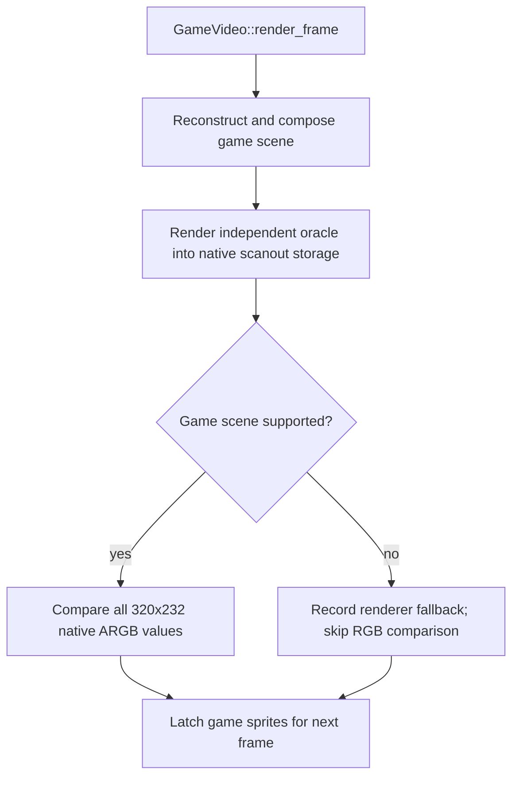

# Compare mode and layer diagnostics

The runtime has two different comparison paths. Frontend `--renderer compare-cpu` / `compare-gpu` checks final native RGB every supported frame. `compare_layers` checks source layers at selected frames.

Sources: [video.cpp](https://github.com/ansxor/f3-recomp/blob/main/runtime/renderer/game/video.cpp), [gameplay_regression.cpp](https://github.com/ansxor/f3-recomp/blob/main/tools/gameplay_regression.cpp), and [frontend.cpp](https://github.com/ansxor/f3-recomp/blob/main/runtime/frontend/frontend.cpp).

## Modes are not interchangeable

| Path | `GameVideoMode` | Native output | Automatic checks |
| --- | --- | --- | --- |
| Frontend `--renderer enhanced` / `game-cpu` | `Game` | Game RGB on supported frames, oracle otherwise | None |
| Frontend `--renderer compare-cpu` / `compare-gpu` | `Compare` | Oracle on every frame | Native composite RGB on every supported frame |
| Gameplay `--video-diff` | `Diagnostic` | Oracle on every frame | `compare_layers` at the harness sample schedule |

`Diagnostic` is the constructor default. It reconstructs scenes but does not automatically compare them.

`Compare` enables oracle scene inspection, but its frame loop calls only `compare_composite`. Enabling inspection does not imply automatic source-layer or row comparison.

All game-data modes require `F3RT_GAME_VIDEO` (a `games/<game>/video/` folder) and strict native execution. Frontend compare rejects fallback-enabled execution and programs without the folder.

## Frontend compare sequence



The first mismatching supported frame throws. The message gives its frame number, mismatch count, first visible coordinate, and both colors.

An unsupported frame is not an error in frontend compare. It uses the oracle and records the reason. This allows startup and explicitly unsupported scenes.

The comparison does not validate expanded presentation. With enhancements, supported display output can use the game presentation buffer while native output remains the oracle.

## compare_layers API

```cpp
void GameVideo::compare_layers(uint64_t frame, unsigned layer_mask);
```

The mask must be nonzero and contain only bits 0–8. Other values throw `std::runtime_error`.

| Bit | Decimal value | Layer |
| --- | --- | --- |
| 0–3 | 1, 2, 4, 8 | PF0, PF1, PF2, PF3 |
| 4–7 | 16, 32, 64, 128 | SP0, SP1, SP2, SP3 |
| 8 | 256 | Text |
| All | 511 | All source layers, normalized rows, and final native RGB |

Examples: mask 15 selects all PF maps. Mask 240 selects all sprite groups. Mask 256 selects text only.

Only mask 511 invokes `GameLines::compare_rows` and `compare_composite`. A subset does not prove scrolling, mixing, or final RGB.

The caller must first advance a frame with the oracle in `Diagnostic` or `Compare` mode. In `Game` mode, `Machine::native_pixels()` is game output on supported frames. It is not an independent composite reference.

## Comparison domains

| Layer | Dimensions | What it proves |
| --- | --- | --- |
| PF0–PF3 | 1024x512 each | Complete indexed source textures, including off-screen cells |
| SP0–SP3 | 320x232 each | Visible crop of the indexed plane prepared for the next frame |
| Text | 512x512 | Complete indexed glyph texture |
| Normalized rows | Scanout rows 24–255 | Clipping, weights, layer modes/priorities, source transforms, mosaic, background, and bitmap state |
| Composite | 320x232 | Current native final RGB |

PF diagnostics sample semantic maps and oracle hardware maps independently. Text diagnostics first refresh the oracle's decoded character RAM.

Both source texture samplers use the oracle's current global flip flag. This diagnostic ability does not make flipped-screen game composition supported.

Sprite diagnostics use scanout offset `(x + 46, y + 24)`. They filter the packed indexed value by group bits 10–11.

`Video::render_frame` and `GameVideo::latch_sprites` have already prepared both planes for the next frame. This is deliberate. Current-frame RGB remains a separate check.

## Indexed equality

A texture comparison first checks visible coverage through flag bit `0x10`.

- If both pixels are transparent, unused palette and flag differences are ignored.
- If only one pixel is visible, the pixels differ.
- If both are visible, palette indices and the complete flag bytes must match.

A visible playfield check therefore includes the blend selector. Equal final RGB alone would not prove this when two palette entries have the same color.

## Failures

A layer mask with bits outside 0–8 throws immediately. A layer mismatch reports the layer, frame, first differing coordinate and indexed palette/flag pairs; it does not skip the selected layer.

A layer mismatch scans the complete domain and counts all differing pixels. The error reports the first coordinate and indexed palette/flag pairs.

Sprite errors also list nearby current descriptors. Their tile, palette, fixed-point position, scale, and flip fields help identify a quantization error.

Row comparison throws on the first field difference. It always compares layer state. It compares coordinates only for enabled text and PF layers.

Composite comparison requires `rendered` to be true. Otherwise it throws `Game composite fallback at frame N`; the fallback reason is recorded separately by `report()`.

The harness prints the report and optionally dumps machine state before propagating a comparison exception.

## Harness schedule

`f3rt-tool gameplay --video-diff` creates a diagnostic `GameVideo`. The program still enforces zero CPU fallback instructions.

Comparison starts at frame 600. The sample condition is `(frame - 600) % interval == 0`.

The default interval is 120 and the default mask is 511. A positive interval is required. `--video-diff-every 1` samples every frame from 600 onward.

```sh
./build/f3rt-tool gameplay --seed 5 --frames 6000 \
  --video-diff --video-layer-mask 511
./build/f3rt-tool gameplay --seed 5 --frames 4000 \
  --video-diff --video-layer-mask 511 --video-diff-every 1
./build/f3rt-tool gameplay --seed 5 --frames 6000 \
  --video-diff --video-layer-mask 256
```

The runner `uv run f3 gameplay-seeds` forwards the same video options.

## Report fields

The report gives one line per sampled layer:

```text
VIDEO layer=pf0 domain=1024x512-indexed-texture sampled_frames=N compared_pixels=N*524288 pixel_mismatches=0
VIDEO layer=composite domain=320x232-RGB sampled_frames=N compared_pixels=N*74240 pixel_mismatches=0
VIDEO game_frames=N oracle_fallback_frames=M
VIDEO fallback=<reason> frames=N first=... last=...
```

The symbolic counts above explain the format. Actual output uses integer values.

`game_frames` counts successful reconstruction, even when `Diagnostic` or `Compare` displays the oracle. `oracle_fallback_frames` counts unsupported game scenes.

Fallback records group one reason. Each record includes count and first/last frame. Only the first failing reason is counted for a frame.

## Limits of a passing run

A passing subset proves only the selected source domain. A passing sampled full mask proves the complete scene at those sampled frames.

A passing frontend compare establishes native RGB equality with the internal MAME-derived FDP oracle on supported frames in that input sequence. It does not prove every producer, ending, orientation, or physical-chip clipping combination.

Use the fallback report with the parity result. A run that silently relies on many oracle frames is not evidence of full game reconstruction.

Read [Parity evidence and limits](/developer/runtime/video/parity) for retained results and unsupported cases.
