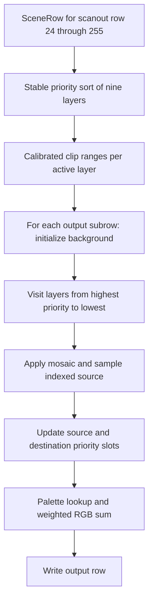

# Game scene compositor

`compose_game_scene` combines semantic layers into ARGB8888 pixels. Its inputs contain no FDP RAM and no oracle inspection state.

Sources: [compositor.hpp](https://github.com/ansxor/f3-recomp/blob/main/runtime/renderer/game/compositor.hpp) and [compositor.cpp](https://github.com/ansxor/f3-recomp/blob/main/runtime/renderer/game/compositor.cpp).

## Function contract

```cpp
struct FrameScene {
    const GameTiles &tiles;
    const GameText &text;
    std::span<const SceneRow, 256> rows;
    std::span<const uint8_t> tile_pixels;
    std::span<const uint32_t> colors;
    uint32_t layer_mask = all_layers;
    bool flipped = false;
};

struct SceneTarget {
    std::span<const uint16_t> sprites;
    std::span<uint32_t> output;
    GameVideoOptions geometry{};
};

enum class ComposeMode { Parallel, Serial };

void compose_game_scene(
    const FrameScene &scene,
    const SceneTarget &target,
    ComposeMode mode = ComposeMode::Parallel);
```

The scene says what to draw; the target says where. `FrameScene` holds only views, which must outlive the call and stay immutable until it returns. With GPU presentation enabled the views come from the one `CapturedFrame` (`CapturedFrame::scene()`, `runtime/renderer/game/captured_frame.hpp`) that `GameVideo` overwrites at VBSTART; reference-scale sprite planes are rastered from its sprite list with `raster_sprites()`. The tile and text objects supply indexed source pixels. `rows` supplies prepared `SceneRow` values, normally from `GameLines::rows()`. `flipped` is the global screen orientation used by tile and text sampling.

`tile_pixels` contains shared decoded playfield ROM assets. `colors` contains at least 8192 RGB palette entries. The compositor sets output alpha to `0xff`.

`layer_mask` selects layers by `layer_bit`. A layer outside the mask is treated as disabled, exactly as if its row had `enabled` cleared. The rows are never modified, so one scene can be composed repeatedly with different masks.

`SceneTarget::sprites` supplies the already latched indexed plane. It belongs to the target because it is rasterized at the target geometry: the native plane is 432x256, and an expanded plane is `width() * height()`. `output` receives the pixels. Default `geometry` is the native frame.

`ComposeMode::Parallel` runs native frames on the caller and expanded frames on the persistent row workers. `ComposeMode::Serial` runs the same row kernel on the caller without worker dispatch, for measurement and reference use. Neither mode changes emulated state, and concurrent calls need disjoint output storage.

Scale must be 1–4, and border must be 0–160. Invalid geometry throws `std::runtime_error`.

Native sprite input requires at least `432 * 256` entries. Expanded sprite input requires at least `width() * height()` entries. Output also requires that expanded size.

Incomplete buffers throw. The function also throws if a row selects bitmap pivot. `GameVideo` normally detects that unsupported frame before calling the compositor.

## Per-row pipeline



The compositor owns no persistent state. It uses fixed arrays for nine-layer order, clip ranges, and a pixel-mix row.

The maximum row capacity is 2560 pixels: `(320 + 2 * 160) * 4`. The per-row sort and mixing need no heap allocation.

## Priority order

Layer numbers 0–3 identify PF0–PF3. Numbers 4–7 identify SP0–SP3. Number 8 identifies text.

The initial order is:

```text
text, SP0, PF0, SP3, PF3, SP2, PF2, SP1, PF1
```

A stable insertion sort moves higher priorities first. Equal priorities retain this order. This matches the oracle's independent layer list.

Priority is not ordinary painter's order. The mixer has separate source and destination slots. Equal destination priorities can clear the destination color to palette index zero.

## Clipping

The initial horizontal interval is `[46 - border, 366 + border)`. `SceneClip` endpoints already include native left-minus-one and right-minus-two calibration.

For each layer:

```text
normal = clip_enabled & ~clip_inverted
inverted = clip_enabled & clip_inverted
if clip_inverse is false: swap(normal, inverted)
```

Normal planes intersect existing ranges. An invalid normal window leaves no ranges.

An inverted plane with ordered endpoints creates left and right candidates. The implementation folds the current ranges into them with `max(range.left, endpoint)`.

This is the retained oracle compatibility rule. It is not a claim that arbitrary inverted windows use a mathematically simple union or subtraction.

Each of four planes can split a range. The fixed range array has 16 entries. Pixel loops use half-open output intervals.

The hardware-evidence conflict remains explicit in [Parity evidence](/developer/runtime/video/parity). Do not change this combiner merely to make it resemble conventional rectangle clipping.

## Source sampling

### Playfields

At output scale `s`, sampling combines source phase and output position before division:

```text
source_x = floor((pf.source_x * s
                 + (sample_x - 46 * s) * pf.x_step) / (s * 256))
vertical_phase = (pf.y_fraction * s + sub_y * pf.y_step) / s
source_y = pf.source_y + (vertical_phase >> 8)
```

`sample_x` is a scaled scanout coordinate. `sub_y` ranges from zero through `s - 1`.

`floor_divide` preserves mathematical floor for negative horizontal coordinates. Truncation toward zero would move samples in the left border.

`GameTiles::playfield_pixel` applies map wrapping, global orientation, cell flips, and the pen mask. Its flag bit 0 supplies the blend selector.

The compositor rejects a transparent flag or zero palette index before adding `palette_add`. It then passes the adjusted index to the mixer.

### Sprites

The native path reads `sprites[y * 432 + sample_x]`. The expanded path reads the corresponding output-resolution plane.

A zero entry is transparent. Bits 10–11 must match the active sprite group. All groups share one indexed plane; they are not four independently overlapping rasters.

Sprite geometry is rerasterized by `GameSprites`, before composition. The compositor does not resize native sprite RGB pixels.

### Text

Text X sampling uses mathematical floor after combining `row.text_x`, scale, and the scanout offset. Text Y stays at `row.text_y` for each subrow.

`GameText::pixel` wraps its 512x512 source texture and applies glyph flips. Text therefore repeats native glyph rows vertically at expanded scale.

The original 8x8 glyph artwork does not gain new detail. The row's `blend_select` supplies the text blend selector.

## Mosaic sampling

Mosaic changes the source sample, not the destination clip interval. A layer with mosaic enabled repeats the sample at the start of a native-width block.

The counter is `(hardware_x + 68) mod 432`. The source X moves backward by `counter mod mosaic_period`.

The expanded path repeats the same native block grid at scale `s`. It does not make the mosaic period smaller in scene units.

State decoding and parity include mosaic. The evidence log does not claim an exercised nontrivial mosaic animation.

## PixelMix state

Each output pixel holds:

| Field | Role |
| --- | --- |
| `source`, `destination` | Palette indices |
| `source_weight`, `destination_weight` | Weights from 0–8 |
| `source_priority`, `destination_priority` | Priority of the two slots |
| `source_mode` | Blend mode of the source slot |

Initialization sets source index and weight to zero. Destination starts at the row background with weight 8. Both priorities start at zero. Source mode starts at 255.

## Mixing transitions

A zero color or a mode equal to the current source mode makes no change.

When the layer priority exceeds the source priority, it can become the new source:

| Mode | Source selection |
| --- | --- |
| 1: normal | Weight `blend[2 + selector]`; skip if that weight is zero |
| 2: reverse | Weight `blend[selector]`; skip if that weight is zero |
| 0 or 3: opaque | Source weight `blend[2 + selector]`; destination weight `blend[selector]`; both indices become this layer's color |

Opaque selection skips if both selected weights are zero. It also sets the destination priority to the layer priority.

Every accepted new source updates source color, priority, and mode. Playfield/text mode 3 and sprite mode 0 are normally disabled by `GameLines`.

A layer below or equal to the source can still become the destination if its priority is at least the destination priority.

- A strictly higher destination priority stores the layer color.
- An equal destination priority stores palette index zero.
- The destination weight uses `blend[selector]` when the source mode is 1.
- Other source modes use `blend[2 + selector]`.

The equality rule applies even when the destination still has its initial priority. Palette index zero is a real palette lookup in the final blend.

## RGB output

Both indices wrap with `& 8191` at lookup. For each RGB channel:

```text
result = min(255,
             (source_channel * source_weight
              + destination_channel * destination_weight) >> 3)
```

Weights need not sum to eight. The result can brighten, dim, or saturate. The compositor does not use floating-point alpha or SDL blending.

Each result is written as `0xff000000 | R << 16 | G << 8 | B`.

## Native parity and expanded output

`GameVideo` first composes the scene into a 320x232 buffer with the default target geometry. Supported expanded frames compose the same `FrameScene` again with a second target that carries the presentation geometry and its own sprite plane.

The native buffer remains the comparison, capture, and CRC contract. The expanded buffer samples scene geometry at different positions. It is not nearest enlargement of that buffer.

See [Presentation](/developer/runtime/video/presentation) for dimensions and unsupported-frame behavior. See [Compare mode](/developer/runtime/video/compare-mode) for the native oracle checks.
