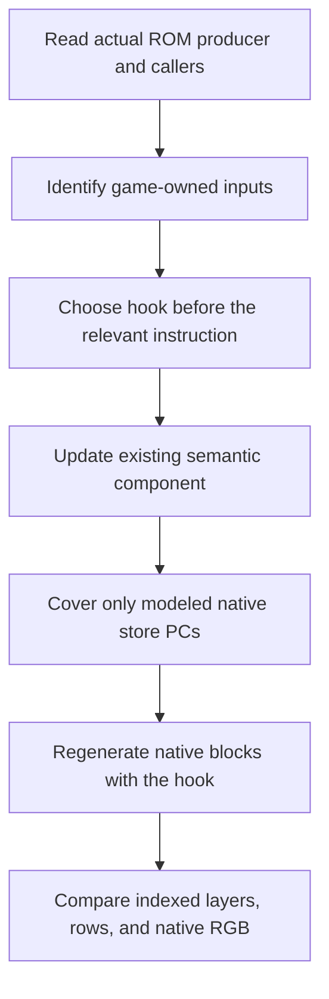

# Extending the game renderer

Add video support by reconstructing the game's producer operation. Keep the FDP oracle independent. Reject unsupported geometry instead of copying hardware output into the scene.

This procedure follows the existing producers, write guards, and comparison APIs. It does not authorize changes to the game's behavior.

## Locate the missing contract

Start with a reported unsupported component or a reproducible indexed, row, or composite difference.

1. Read the producer PC and destination range from the failure report.
2. Find the native routine that contains the writing instruction.
3. Read its ROM instruction stream and callers.
4. Identify its ROM descriptors, work-RAM variables, and register arguments.
5. Determine when the task updates those values.

The hook PC and the store PC usually differ. A helper-entry hook observes inputs before `LINK A6`. A store guard recognizes instructions inside the helper body.

Check raw extension words when indexed addressing is ambiguous. The mirrored tile helper's omitted `*4` disassembly scale caused a real alignment error.

Do not infer a producer from a screenshot alone. Equal colors can hide different palette indices, blend selectors, or transparent coverage.

## Choose the semantic owner

| Operation | Existing owner |
| --- | --- |
| PF tile copy, erase, or fill | `GameTiles` |
| Text cells, numeric output, or programmable glyphs | `GameText` |
| Descriptor expansion, sprite command, or batch lifecycle | `GameSprites` |
| Scroll, priority, blend, clip, palette-add, or line effects | `GameLines` |
| Sampling and integer mixing | `compose_game_scene` |

Use the existing representation when it expresses the producer. Do not create a second hardware-RAM mirror.

A producer can affect more than one owner. PF clear hooks update both maps and line effects.

## Capture the correct moment



The board column-scroll hook at `0x9d7b6` runs after a task wake. Observing before its yield captured the old phase.

A hook must not change guest registers, memory, PC, or time. Native instructions still execute and perform their original hardware writes.

The generator flushes lazy condition codes before the hook. It returns from the block if the hook changes PC or stops the CPU.

## Update hook configuration

Add a `[[hooks]]` entry to [games/landmakrj/config.toml](https://github.com/ansxor/f3-recomp/blob/main/games/landmakrj/config.toml):

```toml
[[hooks]]
address = 0x123456
symbol = "f3_landmakr_video_hook"
```

The address above is illustrative, not an existing producer. Use a verified instruction address in the supplied Japan program.

[recomp/generate.py](https://github.com/ansxor/f3-recomp/blob/main/recomp/generate.py) rejects an invalid C identifier, undiscovered hook address, or duplicate address.

Regenerate native code through the existing [build pipeline](/developer/build-pipeline). A new switch case does not run unless generated code contains the hook call.

## Preserve native arithmetic

Producer reconstruction must preserve:

- big-endian reads;
- signed versus unsigned word operations;
- source layout and argument offsets;
- pre-test versus do/while count behavior;
- tile-origin quantization;
- raster step separately from tile placement;
- phase at the task wake;
- hardware-sized map wrapping;
- native row ranges, including blanking-row writes.

Examples include zero-count decimal text, scaled sprite X placement versus X width, and PF3-to-PF1 Y-step mapping.

Use `GameMemory` for source reads. A descriptor outside program ROM or mirrored work RAM must invalidate its component.

Destination pointers may identify logical map cells. Never dereference an FDP destination to recover geometry.

## Keep write guards conservative

Add store PCs or tight store ranges only after the semantic hook models their effect. The guard receives PC and address, never the written value.

Do not whitelist a whole unrelated routine family merely to remove a fallback report. Unmodeled writes must continue to invalidate ownership.

Define a known recovery point. Partial updates cannot generally restore a component after an unknown write.

For text, complete glyph uploads can restore glyph knowledge. An invalid whole map still requires the known full clear.

For sprites, a submit with a recorded unsupported PC does not restore ownership. The known initialization hook clears that record.

## Validate the consumer-visible behavior

The existing focused checks are in [runtime/check.cpp](https://github.com/ansxor/f3-recomp/blob/main/runtime/check.cpp).

| Check | Behavior protected |
| --- | --- |
| `check_game_tile_descriptors` | Mirrored cells and texels, palette XOR, blend selector, rectangle edge, invalidation, and clear recovery |
| `check_game_sprite_descriptors` | Integer tile origins, separate X raster step, lag before latch, and unsupported descriptor source |
| `check_game_sprite_top_edge` | Nominal cull before rounded row sampling, plus adjacent partial visibility |

No dedicated text or line unit check currently exists. The complete source and row diagnostics provide their retained parity evidence.

Use a small fixture for uncertain arithmetic or boundary behavior. Keep a permanent regression for a plausible visible bug, not merely hook wiring.

Then run the real native scenario that exposed the failure. Use the appropriate source mask first. Use mask 511 for the complete scene.

```sh
./build/f3rt-gameplay-regression --seed 5 --frames 6000 \
  --video-diff --video-layer-mask 511
```

Use every-frame sampling around a transient failure. A 120-frame interval can miss a one-pixel sprite-edge defect.

Frontend `--video compare` checks supported native RGB continuously, but it does not call source-layer diagnostics. Read [Compare mode](/developer/runtime/video/compare-mode).

## Verify fallback and presentation

Check unsupported-to-supported recovery at the intended initialization point. Check supported-to-unsupported transition after normal game rendering.

The oracle must retain its sprite lag while the game renderer is active. Do not remove `Video::vblank` from supported `Game` frames.

Keep `Machine::native_pixels()` at 320x232. Expanded output must sample scene geometry separately. Unsupported expanded frames must use centered oracle pixels with black side columns.

Check scale and border at native and expanded settings. Inspect the actual SDL surface when changing frontend sampling or display behavior.

## Update persistence

A new persistent field needs matching size, save, and load changes. Use the existing `Canonical*` representation in `runtime/state_io.hpp`.

Do not save temporary compositor rows as a new parallel format. Existing component state already includes semantic producer and latch state.

Restore counts and command fields consistently. Diagnostic counters are not part of the game scene snapshot contract.

## Record the measured scope

Document the ROM producer contract and its source addresses. Record the executed input sequence, sample domain, mismatch count, and renderer fallback count.

Separate retained evidence from newly executed results. Do not promote an unsupported ending, orientation, or hardware effect to supported status without proof.

Read [Parity evidence](/developer/runtime/video/parity) for the current measured scope and unresolved clipping evidence.
