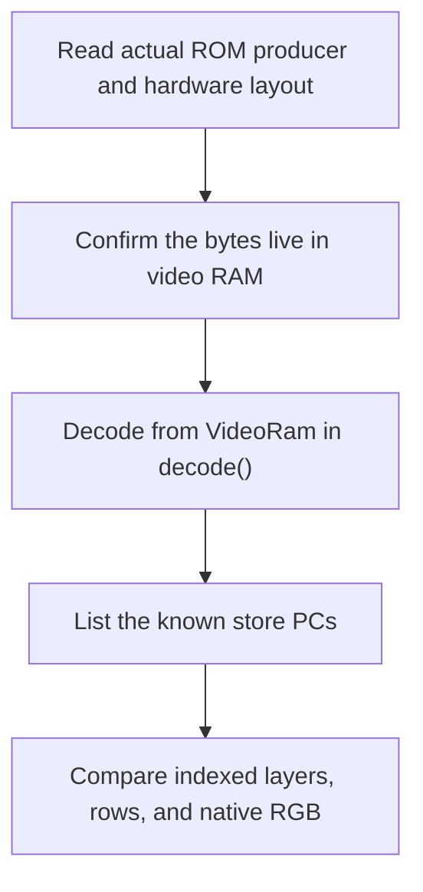

# Extending the game renderer

Add video support by extending the VRAM decoders or the write-log lists. Keep the
FDP oracle independent. Never copy hardware output into the scene. This procedure
follows the existing per-game decoders, debug write log and comparison APIs. It does
not authorize changes to the game's behavior.

## Locate what is missing

Start from an unknown store PC (`log_unknown_video_write` in a
`F3RT_VIDEO_WRITE_LOG` build), a missing fallback, or a reproducible
indexed/row/composite difference.

1. Read the producer PC and destination range from the stderr log line.
2. Find the native routine that contains the writing instruction.
3. Decide whether the write targets video RAM that the decoder already reads.

If the store targets decoded video RAM (playfield map, text map/glyph RAM, sprite
RAM, line RAM, control registers), no per-component logic is needed: the next
VBSTART already decodes it. Add the store PC to the component's covered list so
the run no longer reports it. If the store targets a region no decoder reads
(for example a pivot feature), it is a fallback candidate, not a decode task.

Do not infer a producer from a screenshot alone. Equal colors can hide different
palette indices, blend selectors, or transparent coverage.

## Choose the owner

| Operation | Owner |
| --- | --- |
| PF cells, text cells/glyphs | shared `GameTiles::decode` / `GameText::decode` in `runtime/renderer/game/tiles.cpp` / `runtime/renderer/game/text.cpp` |
| Sprite display list | shared `GameSprites::decode` in `runtime/renderer/game/sprites.cpp` |
| Line parameters | shared `GameLines::decode` in `runtime/renderer/game/lines.cpp` |
| Generic char-RAM unpack, sprite display-list walk | `runtime/renderer/decode.{hpp,cpp}` |
| Sampling / mixing | `GameTiles::RowSampler`, `GameText::pixel`, `GameSprites::raster`, `GameLines::prepare`, `compose_game_scene` |

The decoders read the same video RAM through shared helpers:
`Video::get_sprite_info` and `Video::decode_charram` call `decode_sprite_list`
and `decode_charram_tile`. The shared line-RAM walk in `runtime/renderer/game/lines.cpp`
is the exception: `GameLines::decode` holds a separate copy of
`Video::read_line_ram`. Keep both paths in step: when `Video` changes a decode
rule, update the shared helper, the per-game decoder, or the shared line-RAM copy.

## Add a store PC

Add the instruction address (or a tight range) to the component's known list
(`tiles_covered_write`, `text_covered_write`, `sprites_covered_write` or
`lines_covered_write`) in `games/<game>/video/video.cpp`. These lists are used only by the opt-in
`F3RT_VIDEO_WRITE_LOG` path; the log receives only the PC and address. Do not
list a whole unrelated routine family to silence a report.

## Add or fix a decode rule



Rules:

- Read only `VideoRam` (big-endian `graphics`/`control`). Never read the scene
  from work RAM or the FDP output.
- Preserve hardware bit layouts and the shared decode order.
- A new persistent field needs matching size, save and load changes using the
  existing `Canonical*` representation in `runtime/state_io.hpp`. Do not save
  temporary compositor rows as a parallel format.
- No fallback may be added without a concrete feature. The current set is
  `flipped-screen`, `sprite-trails` and `bitmap-pivot`; each logs once.

## Validate the consumer-visible behavior

Focused checks live in [runtime/check.cpp](https://github.com/ansxor/f3-recomp/blob/main/runtime/check.cpp).

| Check | Behavior protected |
| --- | --- |
| `check_game_tile_observation`, `check_game_tile_row_sampling` | Raw cell palette/mask/flips/blend and wrapped row sampling |
| `check_game_sprite_vram_block_chaining` | Display-list block chaining on both axes |
| `check_game_line_vram_carry_forward` | Line-RAM subsection carry-forward between scanlines |
| `check_game_text_vram_decode` | Text map + glyph RAM palette/pen decode |

Keep a permanent regression for a plausible visible bug, not merely wiring.

Then run the real native scenario that exposed the failure, using mask 511 for
the complete scene:

```sh
./build/f3rt-gameplay-regression --seed 5 --frames 6000 \
  --video-diff --video-layer-mask 511
```

Use every-frame sampling around a transient failure.

## Verify fallback and presentation

Check unsupported-to-supported and supported-to-unsupported transitions. The
oracle must retain its sprite lag while the game renderer is active: do not
remove `Video::vblank` from supported `Game` frames. Keep
`Machine::native_pixels()` at 320x232; expanded output samples scene geometry
separately and fallback expanded frames use centered oracle pixels with black
side columns.

## Record the measured scope

Document the hardware/producer contract and its source addresses. Record the
executed input sequence, sample domain, mismatch count and renderer fallback
count. Separate retained evidence from newly executed results. Read
[Parity evidence](/developer/runtime/video/parity) for the current measured scope.
