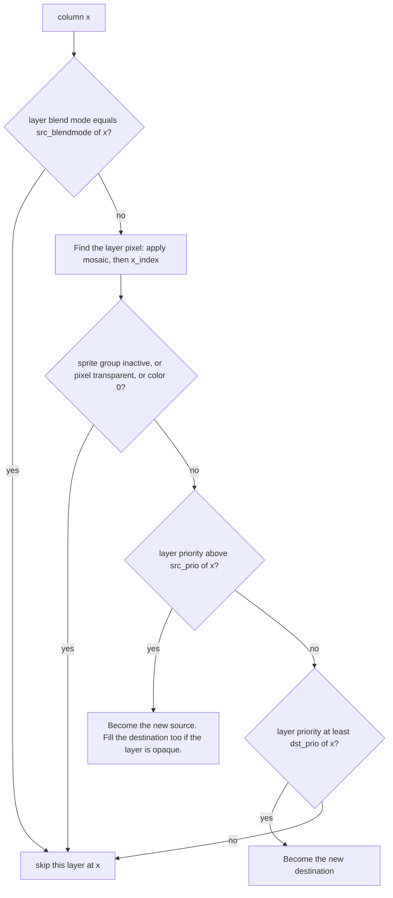

# FDP mixing: clip planes, priority and blending

**What you will learn:** how `calc_clip` builds the column ranges of a layer, how `mix_line_layer` decides which layer owns a pixel, and how `render_line` blends the result. The game compositor repeats this logic, so this page is also the specification for `compose_game_scene`.

The code is in `runtime/renderer/fdp/video.cpp`. Hardware background is in [F3 video hardware](/developer/runtime/video/hardware).

The mixing rules describe the MAME-derived model. Captured-reference agreement
does not verify every physical-chip priority, clipping, or blending combination.

## Per-pixel state

For each line the renderer keeps two small tables with one entry for each of the 432 columns.

| Table | Fields | Meaning |
| --- | --- | --- |
| `mix_pix` | `src_pal`, `dst_pal`, `src_blend`, `dst_blend` | The **source** color and **destination** color as palette indexes, with a weight for each |
| `pri_mode` | `src_prio`, `dst_prio`, `src_blendmode`, `dst_blendmode` | The priority of each slot, and the blend mode of the source |

At the start of each line: `dst_pal` is the background palette index, `dst_blend` is 8, `src_blendmode` and `dst_blendmode` are 0xff, and all other fields are 0. The result of an empty line is the background color at full weight.

## Clip ranges (`calc_clip`)

Input: the four `clip_plane_inf` values of the line and one layer. Output: a `clip_ranges` object with up to 16 ranges. Each range is a pair of columns.

1. The layer mix word gives `clip_enable` (bits 8 to 11) and `clip_inv` (bits 4 to 7). The code makes two sets of planes: `normal_planes = enable & ~inv` and `invert_planes = enable & inv`.
2. If bit 12 of the mix word (`clip_inv_mode`) is clear, the code swaps the two sets.
3. The first range is `[46, 366)`, which is the whole visible width.
4. For each plane 0 to 3, the code calibrates the values: `clip_l = left - 1` and `clip_r = right - 2`.
5. A plane in `normal_planes` intersects every range with the calibrated half-open window. The range survives only when the endpoints are ordered and the overlap test passes. Pixel iteration excludes the right endpoint.
6. A plane in `invert_planes` with `clip_l <= clip_r` **cuts out** the window. For each current range the code makes two candidates: the part left of the window, `[46, clip_l]`, and the part right of it, `[clip_r, 366]`. It folds every current range into each candidate with `candidate.l = max(range.l, candidate.l)` and `candidate.r = max(range.l, candidate.r)`. The code drops the candidate if `l >= r`.

Step 6 follows the rule of the pinned MAME source. Another set of hardware notes proposes a different rule. The project has not proved either rule for all combinations of inverted planes, and the game uses only a few. Do not "improve" this code without a hardware reference; both renderers must change together. The same algorithm exists as `clip_ranges()` in `runtime/renderer/game/compositor.cpp`.

## The mixing function (`mix_line_layer`)

`mix_line_layer` is a template over the layer type (`sprite_inf`, `pivot_inf`, `playfield_inf`). The renderer calls it once for each clip range of each layer, in priority order, high to low. For each column `x` inside the range and inside the visible window, the function does the following.



Details:

- **Equal blend mode.** If the layer blend mode is the same as `src_blendmode[x]`, the layer does not touch the pixel. At the start the value is 0xff, so the first layer is never skipped.
- **Pixel lookup.** With mosaic on, `real_x = mosaic(x, line.x_sample)`, else `real_x = x`. The layer maps `real_x` to a buffer index with its own `x_index`. A playfield applies zoom. A pivot layer applies the scroll. A sprite group uses `x` as is.
- **Transparent pixel.** The pixel is skipped if `color` is 0, if the flag byte has no bit in `0xf0`, or (for sprites) if the group in the color does not match the layer.
- **New source.** When `prio > src_prio[x]`, the layer takes the source slot. The blend selector `sel` is 0 or 1. It comes from `blend_select()`: the tile flag for a playfield, the line value for a sprite group or the pivot layer.
  - Blend mode 1 (normal) uses weight slot `2 + sel`. Blend mode 2 (reverse) uses slot `sel`. If the weight is 0, the layer does not draw at this column. Otherwise the source weight is that weight.
  - Any other blend mode is **opaque**. If `blend[sel] + blend[2 + sel]` is 0, the layer does not draw. Otherwise it sets `src_blend = blend[2 + sel]`, `dst_blend = blend[sel]`, `dst_prio = prio` and `dst_pal` to its own color.
  - In all cases `src_pal`, `src_blendmode` and `src_prio` take the layer values. A playfield adds its `pal_add` to the palette index (`palette_adjust`).
- **New destination.** A layer can fill the destination when its priority is at least `dst_prio[x]` but not above the source. Equal destination priority sets the destination color to palette index zero, even for the initial slot. The weight is `blend[sel]` for source mode 1 and `blend[2 + sel]` otherwise.

## Final color (`render_line`)

For each of the 320 visible columns:

```text
channel = min(255, (src_channel * src_blend + dst_channel * dst_blend) >> 3)
```

The code uses the 32-bit palette entries at `src_pal & 0x1fff` and `dst_pal & 0x1fff`. The result is `0xff000000 | R << 16 | G << 8 | B`.

## Worked example

Take a column where PF1 is opaque with priority 3 and SP0 is a normal blend with priority 8. The line has `blend = {8, 8, 4, 4}` (just for this example).

1. The sort puts SP0 (priority 8) before PF1 (priority 3).
2. SP0 has a pixel. Its priority is above `src_prio` 0. It is normal blend, so the slot is `2 + sel`. With `sel = 0` the weight is `blend[2] = 4`. `src_pal` is the sprite color, `src_blendmode` is 1, `src_prio` is 8.
3. PF1 has a pixel. Its blend mode (0) is not equal to 1, so it does not skip. Its priority 3 is not above 8, but it is at least `dst_prio` 0. It becomes the destination. The source mode is 1, so `dst_blend = blend[sel] = 8`.
4. `render_line` computes `(sprite * 4 + playfield * 8) >> 3`.

## Invariants for a new implementation

- Process layers from high priority to low. Do not process them in list order.
- Keep the "same blend mode skip" rule. It is easy to forget and it changes pixels.
- Keep the priority-conflict rule (destination color 0).
- Use `min(8, 15 - nibble)` to get a blend weight.
- Use the same clip algorithm, including the calibration `left - 1` and `right - 2`.

Source: [runtime/renderer/fdp/video.cpp](https://github.com/ansxor/f3-recomp/blob/main/runtime/renderer/fdp/video.cpp). The independent [game compositor](/developer/runtime/video/compositor) uses the same measured rules.
